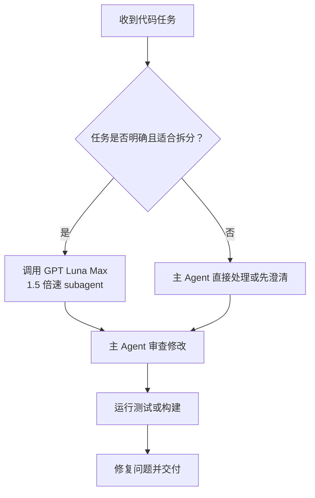

# AgentHub 项目约定

## 凭据存储决策

- 当前方案**没有必要做凭据落盘加密**，继续沿用现有存储方案。
- 不得擅自把 keyring、AES、主密码、密文迁移等加密工作列为优先事项、下一步任务或风险项。
- 文档中提到“凭据加密”或将其列为未完成项，只代表历史规划，不代表当前项目需求。
- 分析项目进展、整理待办或生成开发提示词时，应将凭据落盘加密标记为“无必要 / 项目范围外”，不能据此推导实施任务。
- 只有用户明确推翻这一决策并重新授权后，才可以讨论凭据落盘加密。

## 前端 backend 分层与 Adapter（目标结构）

完整说明见 [docs/architecture.md §4](docs/architecture.md)。摘要：

### 目标目录

```
src/
├─ app/runtime/                 # 应用组合入口
├─ lib/backend/
│  ├─ contracts/                # DTO、接口、纯映射
│  ├─ tauri/                    # 唯一允许调用 invoke 的地方
│  └─ current.ts                # 默认生产实现
├─ dev/mocks/                   # browser mock（backend / account / chat / fixtures）
├─ test/                        # factories + setup.ts
├─ lib/api/                     # 兼容 façade，页面可渐进迁移
└─ pages/
```

### 命令 ↔ Adapter

| 命令 | Adapter |
|---|---|
| `pnpm dev` / `tauri dev` | Tauri adapter |
| `pnpm dev:mock` | browser mock adapter |
| `pnpm build` | **强制** Tauri adapter |

### 硬约束

- **仅** `lib/backend/tauri/` 可调用 `invoke`。
- mock 只服务 `dev:mock`（及测试），不得打进生产 build。
- 非 Tauri 的生产页面：明确报错或显示 **unavailable**，禁止静默 mock。
- 页面层不直接 `invoke`；`lib/api/` 为过渡兼容层。

## 测试约定（摘要）

完整说明见 [docs/testing.md](docs/testing.md)。

- **测试代码不得与生产代码写在同一文件**（Rust：生产侧仅 `#[cfg(test)] mod tests;`，实现放 `*/tests.rs`；前端：并列 `*.test.ts`）。
- 前端 vitest 固定 mock backend；领域 reset 放 `dev/mocks`，不要往生产 façade 塞 `__reset*ForTests`。
- 提交前对本域跑过滤后的 `cargo test` / `pnpm test`。

## Agent 协作规则

### 代码任务

遇到明确、边界清晰的代码任务时，可以调用 GPT Luna Max subagent，并设置 1.5 倍速执行。

适合交给 subagent 的任务：新功能、局部修改、测试、类型定义和机械化重构。

Git 提交相关任务也使用 GPT Luna Max subagent，包括整理变更、生成提交信息和执行提交。

架构决策、敏感操作和最终验收由主 Agent 负责。

### 调用方式

调用 subagent 时，明确写出以下信息：

```text
请使用 GPT Luna Max，以 1.5 倍速执行。

任务：实现……
文件：……
限制：……
验收标准：……
```

如果平台支持结构化参数，可按以下形式调用（示意）：

```text
model: gpt-luna-max
speed: 1.5x
task: 实现……
files: [需要修改的文件]
acceptance: [验收标准]
```

Subagent 完成后，主 Agent 必须检查代码并运行相关测试。

### 工作流程



### 基本约束

- 只修改完成任务所需的文件。
- 保留用户已有改动。
- 不泄露密钥、令牌或其他敏感信息。
- 不未经授权执行删除、重置等破坏性操作。
