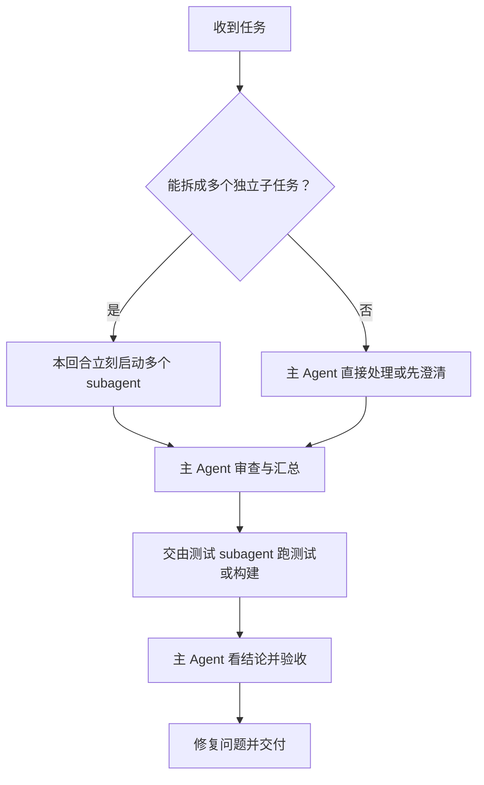

# AgentHub 项目约定

## 红线速览

- 分支：日常开发只在 **`dev`**；`release` 仅用于发版。
- 工具：本仓库编码用 **Grok Build**，不用 CloudAgent。
- 范围外（不得列为待办/风险/实施任务）：凭据落盘加密、国产 OAuth 适配或转 API。

## 工作分支与发布

- 日常开发与 PR 的工作分支是 **`dev`**，不是 `main`，也不是 `release`。每日功能 PR 合入 `dev`，不要把 `release` 当日常集成线。
- 正式发版流程：
  1. 同时修改 `package.json`、`Cargo.toml` 的 `[workspace.package]`、`src-tauri/tauri.conf.json` 三处版本号；
  2. 更新 `release` 分支；
  3. 打并推送匹配的 `vX.Y.Z` tag（必须指向 `release` 上该提交）。
- GitHub Actions 只在推送 `v*` tag 时出包；tag 指向 release 提交且不可覆盖已有版本。`dev` 与 `release` 是无关历史（`dev` 于 8 月中改写过），**不要把 `dev` 合并进 `release`**。
- Agent 隐藏以 `dev` 的 store-stamp 为准，只影响界面；不是旧 `release` 线 #22 的软隐藏。
- 当前界面说「登录」，不说「票」。实现里的 Ticket / TicketPort 仍是内部名字。

## 凭据存储决策

- 决定：**没有必要做凭据落盘加密**，沿用现有存储方案。
- 分析进展、整理待办或生成提示词时，将「凭据加密」标为「无必要 / 项目范围外」，不得据此推导 keyring、AES、主密码、密文迁移等实施任务；文档中的相关表述只是历史规划。
- 只有用户明确推翻此决策并重新授权后，才可以讨论凭据落盘加密。

## 国产 OAuth：不开边、不转 API

- 决定：**产品关闭**——不为中国产 AI 的 OAuth 开 Adapter 边（含 Kimi CLI `/login` managed OAuth、Pi `kimi-coding` device 残件，以及 GLM / DeepSeek / 通义 / 豆包等后续登录态）。
- 禁止把国产 OAuth 做成 `native_endpoint`、伪装成 API Key，或走任何「OAuth → API / to-api」转换；也不得把现有 Key 边扩成 OAuth 边。
- 现有国产路由只认官方 **API Key** 登录（Kimi Code 会员、GLM Coding Plan、DeepSeek API）。分析进展、整理待办时，将「国产 OAuth 适配 / 转 API」标为「产品不做 / 项目范围外」，不得据此推导实施任务。
- 只有用户明确推翻此决策并重新授权后，才可以讨论国产 OAuth 开边。

## 前端 backend 分层与 Adapter（目标结构）

完整说明见 [docs/architecture.md §4](docs/architecture.md)。摘要：

### 目标目录

```
src/
├─ app/runtime/                 # 应用组合入口
├─ lib/backend/
│  ├─ contracts/                # DTO、接口、纯映射
│  ├─ tauri/                    # 唯一允许调用 invoke 的地方
│  └─ current.ts                # 默认生产实现
├─ dev/mocks/                   # browser mock（backend / account / chat / fixtures）
├─ test/                        # setup.ts
├─ lib/api/                     # 兼容 façade，页面可渐进迁移
└─ pages/
```

### 命令 ↔ Adapter

| 命令 | Adapter |
|---|---|
| `pnpm dev` / `tauri dev` | Tauri adapter |
| `pnpm dev:mock` | browser mock adapter |
| `pnpm build` | **强制** Tauri adapter |

### 硬约束

- **仅** `lib/backend/tauri/` 可调用 `invoke`；页面层不直接 `invoke`，`lib/api/` 为过渡兼容层。
- mock 只服务 `dev:mock`（及测试），不得打进生产 build。
- 非 Tauri 的生产页面：明确报错或显示 **unavailable**，禁止静默 mock。
- 产品写入走 `lib/api/tickets` 的 plan/bind/unbind；`lib/api/adapter` 只服务预览与本机路由运行时。

## 测试约定（摘要）

完整说明见 [docs/testing.md](docs/testing.md)。

- **测试代码不得与生产代码写在同一文件**（Rust：生产侧仅 `#[cfg(test)] mod tests;`，实现放 `*/tests.rs`；前端：并列 `*.test.ts`）。
- 前端 vitest 固定 mock backend；领域 reset 放 `dev/mocks`，不要往生产 façade 塞 `__reset*ForTests`。
- 提交前对本域跑过滤后的 `cargo test` / `pnpm test`（**由测试 subagent 执行**，见下方协作规则）。

## Agent 协作规则

全局约定见 `~/.grok/AGENTS.md`（所有项目适用）：每次任务开始先判断能否拆成多个独立子任务；适合则本回合立刻启动多个 subagent，不要只说不做。架构拍板、敏感操作与最终验收始终由主 Agent 负责。

### 分工原则

- **机械任务一律交给 subagent**：跑测试、typecheck、构建、测试日志汇总、按清单复跑、整理变更与提交信息等。主 Agent 只看 subagent 回报的结论（是否全绿、失败用例原文）来验收或决定返工。
- 主 Agent **不代跑完整测试套件**，也不亲自做提交前的机械核对；不要因为「只改了几行」「刚才已经跑过」而破例。
- **写测试与跑测试分开**：写测试代码可随功能实现一起分派；跑的那一步必须另起 subagent。
- 适合交给代码类 subagent 的任务：新功能、局部修改、写测试、类型定义、机械化重构。本仓库的代码类 subagent 加速执行。

### 调用方式

调用 subagent 时明确写出：任务、涉及文件、限制、验收标准。完成后主 Agent 审查代码与结论，相关测试交由测试 subagent 跑。

### 工作流程



### 基本约束

- 只修改完成任务所需的文件；保留用户已有改动。
- 不泄露密钥、令牌或其他敏感信息。
- 不未经授权执行删除、重置等破坏性操作。
