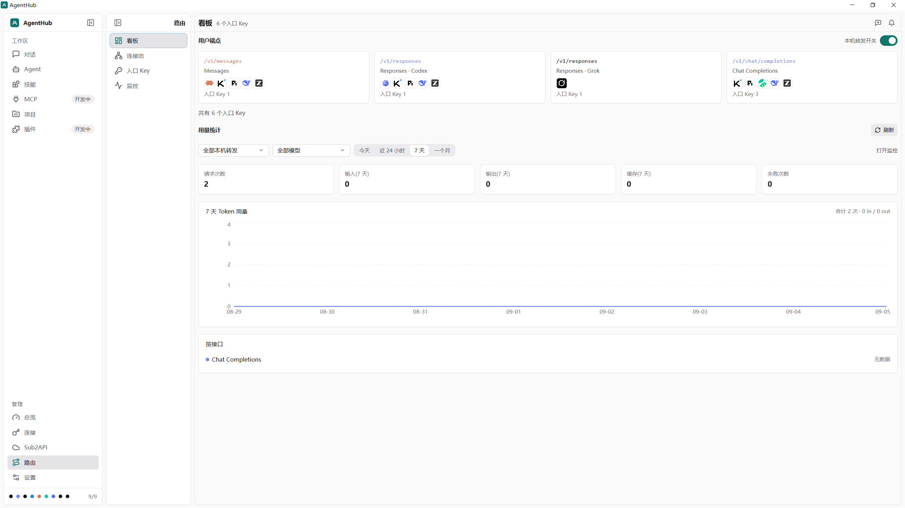
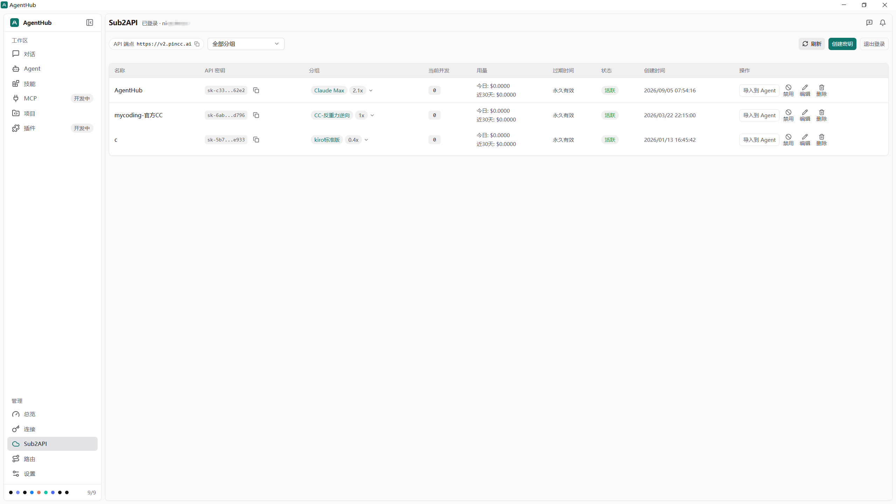

# AgentHub

[简体中文](README.md) · **English**

[](LICENSE)
[](#download)
[](https://github.com/nicechencs/AgentHub/releases)

AgentHub is a local desktop tool for multiple coding agents. One GUI and CLI manage install runtimes, logins and connections, Skills, usage, and local sessions. It is built with Tauri v2, React, and Rust, and runs on Windows, macOS, and Linux.

The desktop UI is available in English and 简体中文. Switch under **Settings → Preferences → Language**.

## What you can do

- Manage local agents such as Claude Code, Codex, Kimi, Grok, Pi, WorkBuddy, ZCode, Cursor Agent, and DeepSeek Harness. Cursor Agent is hidden from the sidebar and Connections by default; you can unhide it on Agents.
- See logins and connections across tools. Prefer writing directly into the target tool’s config. **Local forwarding** is used only when there are published rules and a tested protocol conversion; otherwise the UI shows **Not supported now**, and nothing is forwarded silently.
- Sign in to a Sub2API site, manage its API keys, and import usable keys into installed agents.
- Manage shared Skills, inspect discovered MCP, and browse projects and sessions.
- Start a local session in the desktop app and watch the streaming process. Usage and cost estimates are parsed from local session logs.
- Use the CLI for `doctor`, `env`, `agent`, `provider`, `account`, `skill`, `usage`, `backup`, `run`, and `config`.

Press <kbd>F1</kbd> or the page question mark for a short tour. Current limits: [implementation status](docs/STATUS.md) (Chinese). Product decisions: [docs index](docs/README.md) (Chinese).

## UI

Screenshots are from the real desktop app; email addresses, local paths, API keys, and other private details are redacted.

**Dashboard** — whether each agent is ready, plus usage and cost estimates parsed from local logs.


**Connections** — a cross-tool login list: import an authorization already on this computer, use official login in the browser, or add an API Key. When connecting to another tool, prefer writing directly; **local route** is used only when the two sides don’t speak the same protocol and a tested conversion exists; otherwise the UI shows **Not supported now**.


**Chat** — talk to an installed agent in the desktop app. Pick an agent and a working directory before you send.


**Agents** — install or upgrade the software the environment needs, then install or update each agent by channel. Cursor Agent can be unhidden here.


**Skills** — user skills live in the shared library and can be enabled on each tool. Project skills are managed per workspace. You can also install from the skill market.


**Projects** — browse local projects and sessions by agent. Open a folder, preview an excerpt, or continue in Chat.


**Settings** — Preferences (language and appearance, launch and close, whether the sidebar shows Routes / Plugins / Sub2API), this computer (data directory and logs), backups, and About (version and check for updates).


**Routes** — board, pools, entry keys, and monitoring. Login details stay on Connections; share a login to a pool with **Sync from Connections** when needed.



**Sub2API** — sign in to a site, manage API keys by group, and import usable keys into installed agents. The sidebar entry can be shown or hidden in Preferences.



**MCP** currently only scans and lists what was already found; it does not install anything or change each tool’s settings. **Plugins** lists packs already installed in Claude, Grok, and Pi. Claude and Grok packs can be enabled or disabled here; install still happens in each tool.

## Roadmap

Local forwarding, plugins, and similar management will keep growing. These are currently **in development**.

- **Plugins**: list of Claude / Grok / Pi plugin packs; Claude and Grok packs can be enabled or disabled. No install button.
- **MCP**: read-only scan only; write and manage are not implemented yet.
- **Routes**: some connections can already be forwarded; mixed vendors and some protocol conversions are still in progress. Do not treat this as a finished universal router.

Finer limits: [implementation status](docs/STATUS.md) (Chinese).

## Download

Get the installer for your platform from [GitHub Releases](https://github.com/nicechencs/AgentHub/releases):

| Platform | Package | Notes |
| --- | --- | --- |
| Windows | NSIS `.exe` or MSI | Installer and updater are signed |
| macOS | `.dmg` | Updater is signed; Apple notarization is not promised |
| Linux | `.deb` or AppImage | The package may be unsigned; auto-update is enabled only when the release manifest includes a signed Linux entry |

## Run from source

You need Node.js LTS, Rust, Git, and pnpm.

```powershell
pnpm install
pnpm tauri:dev
```

On Windows you can also run `.\run.ps1`; on macOS/Linux you can run `./run.sh`. These scripts check desktop dependencies and start the real Tauri backend. If Linux system libraries are missing, run `./scripts/check-linux-prereqs.sh --print-packages` for the matching distro install hints.

To browse demo data in the browser only:

```bash
pnpm install
pnpm dev:mock
```

`pnpm dev` is the ordinary Vite frontend dev server. It is not the Tauri launch command, and it does not automatically provide a mock backend. Use `pnpm tauri:dev` for the real desktop backend, and `pnpm dev:mock` for demo data.

## Common commands

| Command | Purpose |
| --- | --- |
| `pnpm dev` | Start the ordinary Vite frontend dev server |
| `pnpm dev:mock` | Start the browser mock demo |
| `pnpm tauri:dev` | Start the real Tauri desktop app |
| `pnpm typecheck` | Check frontend types |
| `pnpm test` | Run frontend tests |
| `pnpm build` | Production frontend build; forces the real desktop backend |
| `pnpm tauri:build` | Build desktop installers |
| `cargo test -p agenthub-core --locked` | Run Rust core tests |
| `cargo run -p agenthub-cli -- --help` | Show CLI help |
| `pnpm check:docs` | Check doc links, metadata, heading anchors, and stale terms |

Full verification steps: [Contributing](CONTRIBUTING.md) (Chinese).

## Data and privacy

AgentHub works with data on this computer by default. Common locations are `~/.agenthub/` (state, settings, logs, and backups), `~/.agents/skills/` (user skills), and `.agents/skills/` inside a project (project skills). Usage only reads local sessions or logs; it does not intercept requests through a proxy and does not upload to the cloud. Local forwarding does not record request or response bodies.

Logins stay in the existing local storage. The UI, CLI, and logs redact secrets. Encrypting logins on disk is out of current product scope. Screenshots, test data, and files that must not be committed: [privacy and release](docs/reference/privacy-and-release.md) (Chinese). Vulnerability reporting: [security policy](SECURITY.md) (Chinese).

## Development and docs

- [Contributing](CONTRIBUTING.md) (Chinese): branches, development environment, verification, PRs, and release flow.
- [Project conventions](AGENTS.md) (Chinese): architecture limits, product scope, and collaboration.
- [Docs index](docs/README.md) (Chinese): design, implementation, operations, and history by purpose.
- [Implementation status](docs/STATUS.md) (Chinese): current facts and unimplemented limits.

Day-to-day development and PRs use the `dev` branch. For a formal release, bump the version on `dev`, update `CHANGELOG.md`, merge into `release`, then tag `vX.Y.Z` on `dev` to trigger CI.

## License

This project is under the [MIT License](LICENSE). Usage parsing and config switching borrow from [ccusage](https://github.com/ccusage/ccusage) and [cc-switch](https://github.com/farion1231/cc-switch); local routing borrows from [CLIProxyAPI](https://github.com/router-for-me/CLIProxyAPI).
