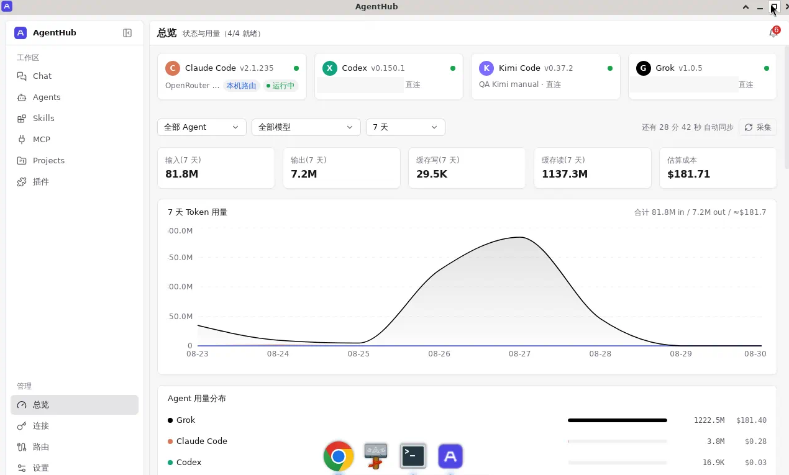
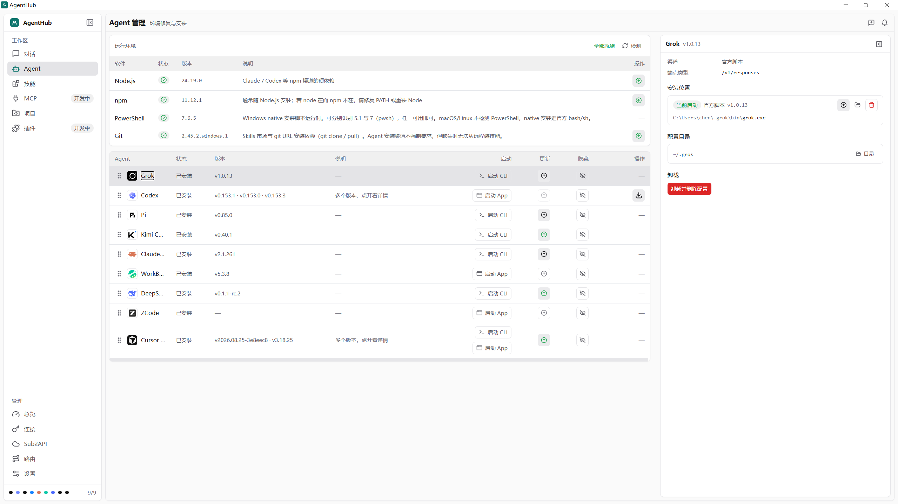
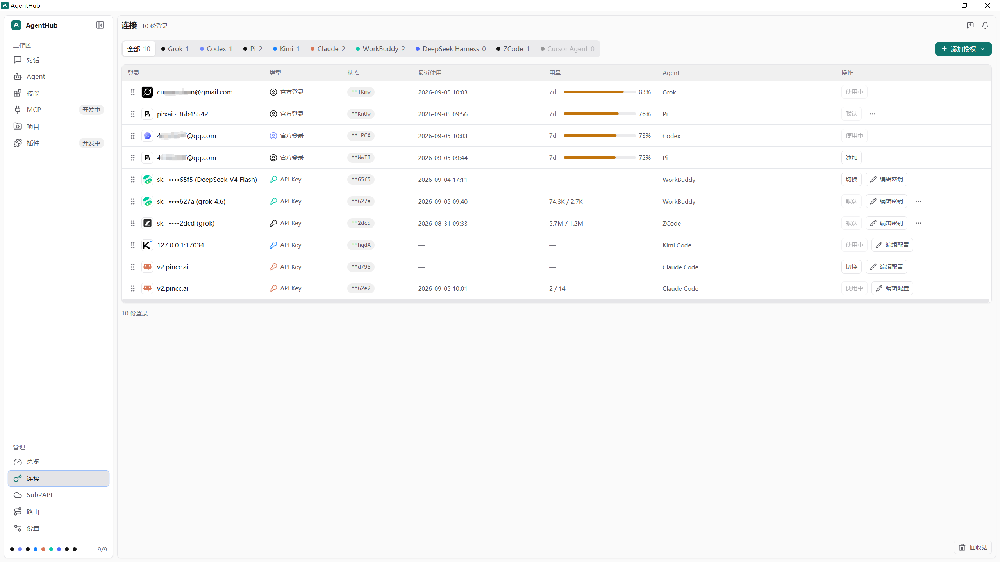
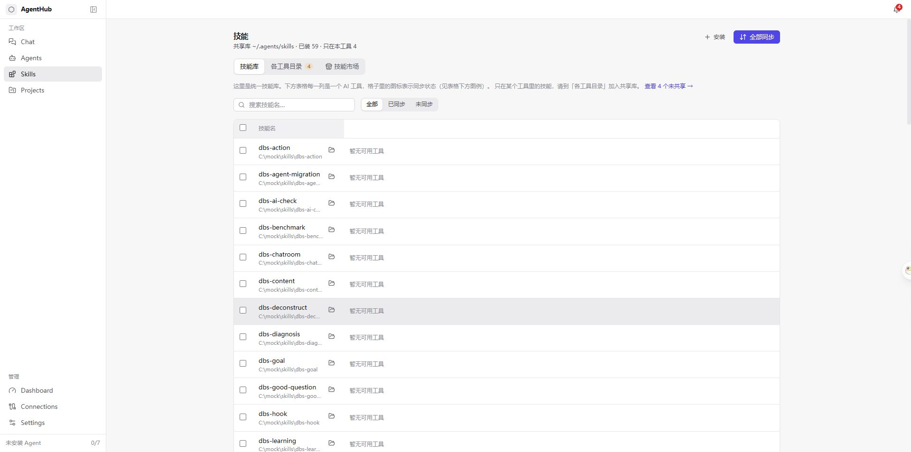
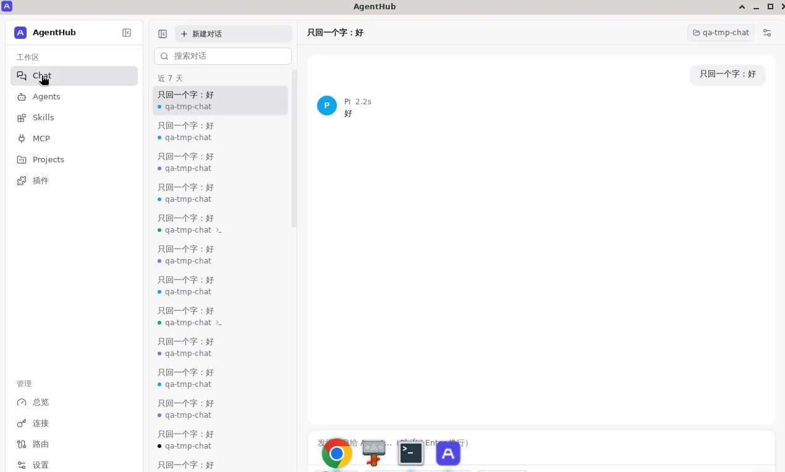
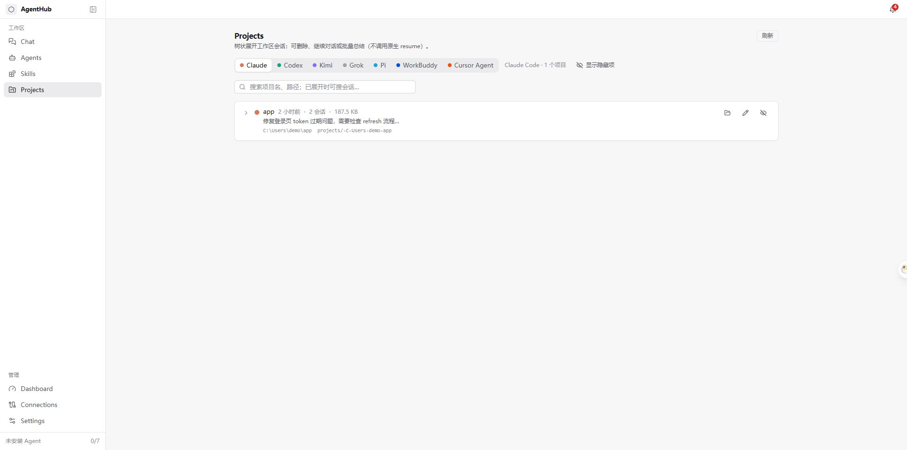
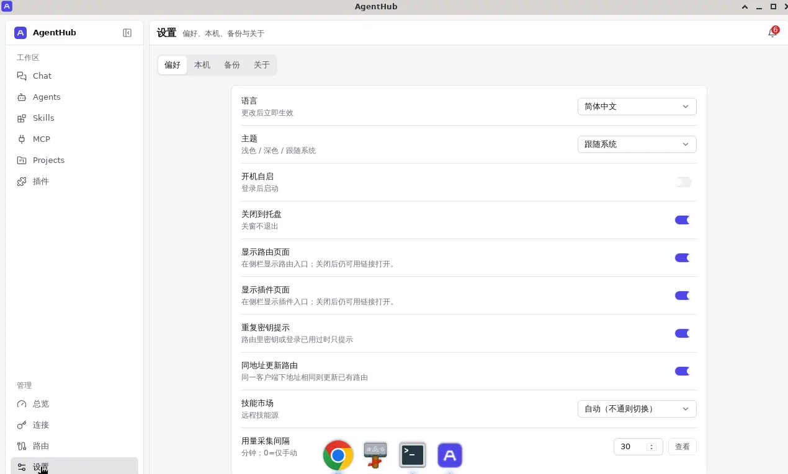

# AgentHub

[](LICENSE)
[](#系统要求)
[](https://github.com/nicechencs/AgentHub/releases)

**多 Agent 桌面管理中枢**：在一台 Windows 或 macOS 机器上统一检测与安装 AI Agent 运行时、管理 Provider / 账号池、投影 Skills、备份 live 配置、统计 Token 用量，并提供桌面 Chat 入口。

技术栈：**Tauri v2 + React + Rust core**；形态为 **GUI + CLI** 双端，业务逻辑集中在 `agenthub-core`。

| 状态 | 说明 |
|---|---|
| 版本 | `0.1.0`（活跃开发） |
| 平台 | **Windows 为主交付平台**；macOS 支持源码运行与本机 Tauri 构建，Linux 仍仅预留路径抽象 |
| 许可 | [MIT](LICENSE) |

面向本机 AI Agent：

| Agent | 说明 |
|---|---|
| **Claude Code** | 安装引导、配置切换、账号池、Skills、Usage、Chat |
| **Codex** | 同上 |
| **Kimi** | 安装 / 配置 / 账号 / Usage（Skills 因对方无独立目录受限） |
| **Grok** | 安装 / 配置 / 账号 / Skills / Usage |
| **Pi** | npm 渠道；能力以矩阵为准 |
| **WorkBuddy** | 官网 Setup 引导；能力以矩阵为准 |
| **Cursor Agent** | 公开 Agent CLI（半套）；**不**支持 Cursor IDE 私有库账号池 |

能力「能不能」以 [docs/capability-matrix.md](docs/capability-matrix.md) 与 CLI `agenthub agent capabilities` 为准。

## 目录

- [它解决什么问题](#它解决什么问题)
- [界面预览](#界面预览)
- [功能一览](#功能一览)
- [系统要求](#系统要求)
- [安装与运行](#安装与运行)
- [常用命令](#常用命令)
- [数据与隐私](#数据与隐私)
- [架构摘要](#架构摘要)
- [文档](#文档)
- [贡献](#贡献)
- [安全](#安全)
- [致谢与开源借鉴](#致谢与开源借鉴)
- [许可证](#许可证)

---

## 它解决什么问题

本机往往同时装着多家 coding agent，各自有安装方式、配置文件、OAuth / API Key 落点、技能目录与会话日志。AgentHub 把这些差异收敛到统一界面与 CLI：

1. **先环境、后 Agent** — 缺 Node / npm 时先引导安装运行时，再装对应渠道的 Agent  
2. **连接统一管理** — 官方 OAuth 账号池与 API Provider（官方 / 自定义 endpoint）同一套 Connections  
3. **Skills 真源投影** — 共享库 `~/.agents/skills/`，按需同步到各 Agent 的 skills 目录  
4. **零侵入 Usage** — 解析各 Agent 本地会话 / 日志，不做本地代理  
5. **写前备份** — 切换 Provider / 账号前自动快照 live 文件，可回滚  

**不做的事（刻意边界）**：通用包管理、本地 LLM 代理、多租户云同步、Cursor IDE 私有库账号池、反编译第三方安装包内部文件。

---

## 界面预览

截图来自 `pnpm dev:mock` 演示数据（路径为 mock 占位，非真实用户目录）。

### Dashboard — 总览与用量

Agent 安装状态、近 N 天 Token 趋势、各 Agent 用量分布、快捷切换 / 备份入口。用量合并在 Dashboard，不再单独成页。



### Agents — 运行时与安装

检测共享 Runtime（Node / npm / PowerShell 等），按渠道一键安装或引导修复；环境未就绪时主操作是「修复环境」，而不是假装可装 Agent。



### Connections — 账号与 API

按 Agent 聚合 **官方账号（OAuth）** 与 **API 配置（Provider）**。切换会 backfill → 备份 live → 原子写入。



### Skills — 技能库与同步

共享技能库、按工具矩阵查看同步状态、一键全部同步；支持从本地路径或市场安装。



### Chat — 桌面对话

选择 Agent / 模型后发送消息；支持多选 Agent 对比回答。过程流式展示步骤与工具调用（按 Agent 能力接入）。



### Projects — 工作区会话

按 Agent 浏览本机项目 / 会话树，可打开、重命名、删除或汇总；**不**调用各 CLI 原生 resume。



### Settings — 偏好与备份

语言、主题、开机启动、托盘最小化；以及安全、数据目录与备份管理。



---

## 功能一览

| 模块 | 做什么 |
|---|---|
| **Dashboard** | Agent 就绪概览 + Token 用量（趋势 / 分布 / 明细 / 解析健康度） |
| **Agents** | Runtime 检测与修复、渠道安装 / 卸载、重新检测 |
| **Connections** | OAuth 账号池、API Provider 预设与自定义、一键切换（写前备份） |
| **Skills** | 共享库扫描、投影同步、安装 / 卸载、冲突策略 |
| **Chat** | 本机 Agent 对话入口、过程流、多 Agent 对比 |
| **Projects** | 项目 / 会话树浏览与维护 |
| **Settings** | 应用偏好、备份索引、数据与关于 |
| **Router** | 规划中（占位页） |
| **CLI** | 与 GUI 同源的资源型命令（`provider` / `account` / `skill` / `usage` 等） |

---

## 系统要求

| 项 | 要求 |
|---|---|
| 操作系统 | **Windows 10 / 11**（当前主交付平台） |
| 运行 GUI 构建产物 | [WebView2](https://developer.microsoft.com/microsoft-edge/webview2/)（Windows 10/11 通常已预装） |
| macOS 源码开发 | macOS + Xcode Command Line Tools、[Node.js](https://nodejs.org/)（建议 LTS）、[Rust / Cargo](https://rustup.rs/)、pnpm；[Homebrew](https://brew.sh/) 用于 Runtime 一键修复（可选） |
| Windows 源码开发 | [Node.js](https://nodejs.org/)（建议 LTS）、[Rust / Cargo](https://rustup.rs/)、pnpm（缺失时 `run.ps1` 可自动安装） |
| 可选 | 被管理的 Agent 及其官方 Runtime（如 Node 供 npm 渠道）；AgentHub 会检测并引导 |

---

## 安装与运行

### 使用发布包（终端用户）

从 [GitHub Releases](https://github.com/nicechencs/AgentHub/releases) 下载 Windows 安装包（`.msi` / 安装程序）。  
应用内可检查更新（Tauri updater 指向仓库 `latest.json`）。

macOS 当前以源码运行和本机打包为主；仓库没有承诺签名、公证或可直接安装的 macOS 发布包。

### 从源码启动开发环境

双击根目录 **`run.bat`**（推荐），或在 PowerShell 中：

```powershell
.\run.ps1
```

等价命令：

```powershell
pnpm install
pnpm tauri:dev
```

仅浏览 UI、不连真实后端时：

```powershell
pnpm dev:mock
```

#### macOS

在仓库根目录运行（脚本会检查 Node、Cargo、Xcode Command Line Tools、pnpm，并在缺少依赖目录时执行 `pnpm install`）：

```bash
chmod +x ./run.sh   # 首次使用需要；git checkout 通常会保留可执行位
./run.sh
```

等价命令：

```bash
pnpm install
pnpm tauri:dev
```

macOS 缺少 Homebrew 时仍可开发；运行时修复面板会提供 Node.js / Git 的 Homebrew 命令和官网链接，不会展示 Windows 专用 `winget`。安装后请完全退出并重启 AgentHub，再重新检测 PATH。

打包桌面安装包：

```powershell
pnpm tauri:build
```

产物一般在仓库根目录的 `target/release/bundle/`（NSIS / MSI 等，视 `tauri.conf` 配置而定）。

macOS 本地自用构建无需 updater 签名私钥：

```bash
pnpm tauri:build:macos
```

它会按当前架构生成 `.app`：

- `target/release/bundle/macos/AgentHub.app`

正式发布仍使用 `pnpm tauri:build`；由于该命令会创建签名 updater artifact，必须配置 `TAURI_SIGNING_PRIVATE_KEY`。如需 DMG，可使用 Tauri 的 `--bundles dmg` 构建参数并完成 Apple 签名与公证配置。

这些产物目前是开发/自用构建，未配置稳定的 Apple Developer 签名、公证和发布渠道。

### 当前 macOS 限制

- Windows 仍是主要交付平台；Release 页面默认提供 Windows 安装包。
- macOS Runtime 自动修复使用 Homebrew（`brew`）；没有 Homebrew 时只能打开官网或复制命令手动安装。
- 依赖 Windows PowerShell 的 native 安装渠道在 macOS 上可能不可用，请优先选择 Agent 提供的 npm/Unix 渠道或官网安装方式。
- Linux 尚未作为交付目标；macOS 与 Linux 的路径、Agent 能力和官方安装脚本仍可能存在差异。

---

## 常用命令

| 命令 | 说明 |
|---|---|
| `pnpm tauri:dev` | 桌面端（真实 Tauri 后端） |
| `pnpm dev:macos` / `./run.sh` | macOS 依赖检查后启动桌面端 |
| `pnpm tauri:build:macos` | macOS 本地无 updater 签名的 `.app` 构建 |
| `pnpm dev:mock` | 浏览器 mock（无 Tauri） |
| `pnpm test` | 前端单测 |
| `pnpm build` | 前端生产构建（**强制** Tauri adapter） |
| `pnpm tauri:build` | 打包桌面安装包 |
| `cargo test -p agenthub-core` | Rust core 测试 |
| `cargo run -p agenthub-cli -- --help` | CLI 帮助 |

### 发布流程

正式 Release 统一由 `release` 分支的 GitHub Actions 工作流完成（包含版本、签名产物、`latest.json` 完整平台集合与重复发布门禁）。`pnpm release:update` 仅用于本地构建和检查；`pnpm release:update:publish` 已禁用，请推送 `release` 分支触发 CI。

### CLI 示例

```powershell
# 查看帮助与资源型子命令
cargo run -p agenthub-cli -- --help

# 各 Agent 能力矩阵（以代码真源为准）
cargo run -p agenthub-cli -- agent capabilities
cargo run -p agenthub-cli -- agent capabilities --markdown
```

完整命令树、退出码与配置分层见 [docs/cli-and-config.md](docs/cli-and-config.md)。

---

## 数据与隐私

| 路径 | 用途 |
|---|---|
| `~/.agenthub/` | 本应用 SQLite 状态、备份索引、设置等 |
| `~/.agenthub/backups/` | live 配置快照（切换 / 卸载前） |
| `~/.agents/skills/` | Skills **共享真源**（投影到各 Agent，非第二真源） |

- 凭据沿用现有存储方案；API、CLI、日志侧做脱敏，不明文回显密钥。  
- **零侵入**：Usage 只读解析各 Agent 本地会话 / 日志，不设本地代理、不上传云端。  
- 对外文档与截图规范见 [docs/privacy.md](docs/privacy.md)。

---

## 架构摘要

```text
┌─────────────────────────────────────────────────┐
│  Tauri GUI (React)          agenthub CLI        │
│  invoke commands            clap subcommands    │
├─────────────────────────────────────────────────┤
│              agenthub-core (Rust)               │
│  services（编排） · storage（SQLite） · adapters │
│  claude / codex / kimi / grok / pi / workbuddy  │
│  / cursor                                       │
└─────────────────────────────────────────────────┘
```

- **Service** 管跨 Agent 流程：备份、锁、backfill、技能投影、Usage 聚合、安装前 ensure_env  
- **Adapter** 管单 Agent 差异：路径、配置格式、认证落点、UsageParser 挂接  
- 前端仅 `lib/backend/tauri/` 可 `invoke`；`pnpm build` 禁止打进 mock  

更细目录与约束见 [docs/architecture.md](docs/architecture.md)、[AGENTS.md](AGENTS.md)。

### 仓库结构

```text
AgentHub/
├── run.bat / run.ps1 / run.sh # Windows / macOS 一键启动
├── LICENSE               # MIT
├── SECURITY.md           # 漏洞披露与安全范围
├── AGENTS.md             # 项目约定 + Agent 协作规则（真源）
├── Cargo.toml            # Rust workspace（license = MIT）
├── package.json          # 前端 (pnpm)
├── crates/               # agenthub-core / agenthub-cli
├── src-tauri/            # Tauri GUI 壳
├── src/                  # React 前端
├── docs/                 # 设计、规范与界面截图
│   └── assets/screenshots/
└── scripts/              # 运维与发布脚本
```

---

## 文档

完整索引：[docs/README.md](docs/README.md)。实现状态与未实现清单：[docs/agenthub-plan.md §8](docs/agenthub-plan.md)。

| 文档 | 内容 |
|---|---|
| [docs/architecture.md](docs/architecture.md) | workspace、Service / Adapter、前端 backend 分层 |
| [docs/agenthub-plan.md](docs/agenthub-plan.md) | 产品方案、适配矩阵、模块设计 |
| [docs/capability-matrix.md](docs/capability-matrix.md) | 各 Agent 能力四级状态 |
| [docs/cli-and-config.md](docs/cli-and-config.md) | CLI 命令树与配置契约 |
| [docs/ui-design.md](docs/ui-design.md) | 页面与交互 |
| [docs/privacy.md](docs/privacy.md) | 发布与隐私边界 |
| [docs/testing.md](docs/testing.md) | 测试约定 |
| [SECURITY.md](SECURITY.md) | 漏洞披露与安全范围 |
| [AGENTS.md](AGENTS.md) | 贡献与协作约定 |

---

## 贡献

欢迎 Issue / PR。动手改代码前请先阅读：

- [AGENTS.md](AGENTS.md) — 目录分层、mock 边界、测试约定、协作流程  
- [docs/testing.md](docs/testing.md) — 提交前应跑的测试  
- [docs/adding-an-agent.md](docs/adding-an-agent.md) — 新增 Agent 适配清单  

原则摘要：只改任务所需文件；测试与生产分文件；不得把 mock 打进生产 build；敏感路径与 OAuth 常量勿写入对外文档（见 [docs/privacy.md](docs/privacy.md)）。

---

## 安全

若发现可被利用的安全问题（凭据泄露、任意文件读写、命令注入、更新链篡改等），请**不要**开公开 Issue。  
披露方式、范围与响应预期见 **[SECURITY.md](SECURITY.md)**。  
文档截图与仓库禁止提交项见 [docs/privacy.md](docs/privacy.md)。

---

## 致谢与开源借鉴

AgentHub 在配置切换、用量解析等方向上借鉴了下列开源项目，感谢原作者与社区。

| 项目 | 链接 | 主要借鉴方向 |
|---|---|---|
| **ccusage** | [github.com/ccusage/ccusage](https://github.com/ccusage/ccusage) | 会话 / 日志 Usage 解析策略、成本估算思路、解析健康度呈现 |
| **cc-switch** | [github.com/farion1231/cc-switch](https://github.com/farion1231/cc-switch) | 多应用配置切换、原子写与 backfill、SQLite 自管状态 |

以及其他相关开源项目。更细的设计说明见 [docs/agenthub-plan.md](docs/agenthub-plan.md)、[docs/architecture.md](docs/architecture.md)。

---

## 许可证

本项目采用 [MIT License](LICENSE) 开源。

```text
Copyright (c) 2026 AgentHub Contributors
```
