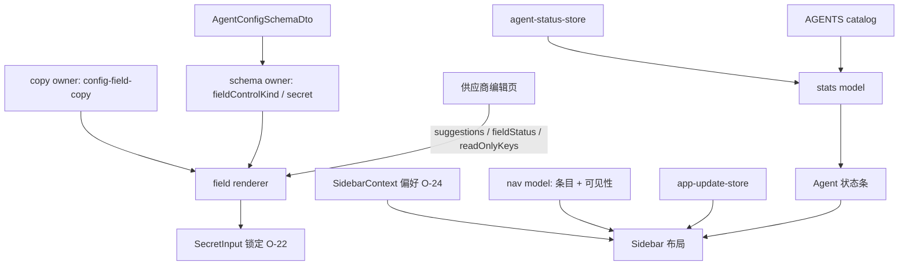

# 通用表单与侧栏 owner

> 提案，不是现行契约。针对审查 [O-23](objectization-encapsulation-audit.md)：给 `GenericConfigForm` 和 `Sidebar` 各定唯一 owner。不改 `plan` / `bind` / `unbind` / `switch` / 补偿。O-22（`SecretInput` 接收 `disabled`/`readOnly`）和 O-24（缺少 `SidebarProvider` 时 `useSidebar()` 抛错）已经落地，本系列不重做。日常合入 GitHub `dev`。

## Overview

两个组件名义通用，实际把业务规则写进共享 UI：

- `GenericConfigForm` 按 schema 画控件，却自己认得密钥标记、Connections 文案和供应商模型建议控件。
- `Sidebar` 负责壳布局，却同时拥有导航条目、路由/插件入口可见性、catalog 排序、隐藏、安装统计、更新标记和 Agent 状态条。

本提案：**不改视觉 chrome，不改写入语义，不改 wire schema。** 表单拆成「schema / 文案 / 字段渲染器」；侧栏拆成「布局 / 导航模型 / 统计」。第一刀只动表单文件。侧栏两刀顺序改同一份 `Sidebar.tsx`，不得并行写。



## Current baseline

| 对象 | 现行事实 |
| --- | --- |
| O-22 `SecretInput` | **已处理，本系列冻结。** [`SecretInput.tsx`](../../src/components/shared/SecretInput.tsx) 接收 `disabled`/`readOnly`；`locked` 时输入和显示切换都不可用。[`GenericConfigForm`](../../src/components/shared/GenericConfigForm.tsx) 把 `fieldDisabled` 传给两者。 |
| O-24 `SidebarContext` | **已处理，本系列冻结。** [`SidebarContext.tsx`](../../src/components/layout/SidebarContext.tsx) 默认值为 `undefined`；`useSidebar()` 缺 Provider 抛 `SidebarProvider is required`。[`App.tsx`](../../src/App.tsx) 根已包裹 `SidebarProvider`。偏好键：`sidebarCollapsed`、`routesNavVisible`（缺省隐藏，功能开发中）、`pluginsNavVisible`（缺省隐藏，功能开发中）。 |
| O-23 表单 | [`GenericConfigForm.tsx`](../../src/components/shared/GenericConfigForm.tsx)（约 278 行）是 schema 驱动字段列表。未知 `valueType` 显示不可用，**不**解析 JSON/TOML（那是 [`ConfigEditor`](../../src/components/shared/ConfigEditor.tsx)）。生产调用方只有 [`ProviderEditDialog.tsx`](../../src/pages/providers/ProviderEditDialog.tsx) 的 catalog schema 路径。 |
| 密钥标记 | [`fieldControlKind`](../../src/components/shared/generic-config-form-map.ts) 已抽出：`field.secret \|\| valueType.kind === 'secret'` → `'secret'`。表单仍按 kind 选择 `SecretInput`，占位文案写死 `SECRET_REDACTED` → `connections.providerDialog.secretConfigured`，否则 `connections.apiKeyDialog.key`。`isSecretUnchanged` 把空串和 `***` 当「未改」。 |
| 模型建议 | 表单不拉模型列表。调用方传入 `suggestions.model`、`fieldStatus.model`、`fieldActions.apiKey`。同文件导出的 `SuggestableInput` 把 Connections 文案写死：`connections.providerDialog.remoteModelsPick` / `remoteModelsCustom`。供应商页在 schema 不可用时**直接**再用这个控件。远端列表状态在 [`remoteModelsStatusView`](../../src/lib/provider-detect/remote-models.ts)，不在表单。 |
| Connections 文案 | 表单始终调用 [`config-field-copy.ts`](../../src/components/shared/config-field-copy.ts) 的 `configFieldLabel` / `configFieldHint` / `configFieldOptionLabel`。hint **不**读 `field.help`（[`connections-layout.test.ts`](../../src/pages/connections/connections-layout.test.ts) 锁住）。另有硬编码：`connections.providerDialog.unsupportedField`。官方模式的 `readOnlyKeys` / 只改密钥由供应商页拥有。 |
| O-23 侧栏 | [`Sidebar.tsx`](../../src/components/layout/Sidebar.tsx)（约 341 行）内联 `NAV_WORKSPACE`、`NAV_MANAGE`。工作区：Chat / Agents / Skills / MCP / Projects / Plugins。管理：总览 `/`、连接、路由 `BRIDGES_PATH`（`/routes`）、设置。可见性过滤已在 [`sidebar-nav.ts`](../../src/components/layout/sidebar-nav.ts)：`filterManageNavItems` 藏路由入口、`filterWorkspaceNavItems` 藏插件入口；**页面仍可走 URL**（[page-patterns.md](../ui/page-patterns.md)）。设置页 [`PreferencesPanel`](../../src/pages/settings/PreferencesPanel.tsx) 写这两项偏好。 |
| catalog 排序 / 隐藏 | `useStoredIdOrder(StorageKey.agentsCatalogOrder)` + [`applyStoredAgentOrder`](../../src/lib/agent-visibility.ts)。[`installedCatalogAgents`](../../src/components/layout/sidebar-agents.ts) 只留 `installed && !hidden` 的 catalog 行。侧栏自己再算一遍 `hiddenIds`、`installed`、`visibleTotal`，没有走 `hiddenAgentIdSet` / `visibleInstalledIds`。`visibleTotal` = catalog 去掉隐藏，**不是**已安装数。 |
| 安装统计 / 更新标记 / Agent 状态 | 底栏：`AgentDot` + `installed/visibleTotal`。catalog 更新：`status.installed && latestVersion && version !== latestVersion` → `ring-warning`。应用更新：`useAppUpdateAvailable()` 只给设置项 `StatusPin`。折叠宽度 `w-14` / 展开 `w-56`，外壳 `pageRhythm.shellNav`。 |

已抽出、本系列不当成「再拆一次」的对象：`generic-config-form-map.ts`、`config-field-copy.ts`、`sidebar-nav.ts` 的两个 filter、`sidebar-agents.ts` 的 `installedCatalogAgents`。缺口是：表单文件仍内嵌 Connections 文案和密钥占位；侧栏文件仍内嵌导航表、统计和状态条规则。

## Goals & Non-Goals

**目标**

- 表单：schema（含密钥标记）与字段渲染器分开；Connections 文案有唯一 copy owner。
- 侧栏：布局只组合；导航模型拥有条目和入口可见性；统计模型拥有隐藏、catalog 排序、安装计数、catalog 更新标记。
- 第一刀可独立合入 `dev`，只动表单相关文件。
- 现有 filter / mapper / `SecretInput` 锁定 / `useSidebar()` 抛错保持行为。

**非目标**

- 不改视觉 chrome：侧栏宽、`pageRhythm.shellNav`、折叠按钮、`StatusPin`、`AgentDot` 外观、表单间距和控件选型。
- 不改 `plan` / `bind` / `unbind` / `switch` / 补偿，不改 current 指针，不改 `validate` / `materialize` / `upsert`。
- 不重做 O-22、O-24；不改 `SecretInput` 的 `locked` 合同；不把 Context 默认 setter 改回 no-op。
- 不改 wire `AgentConfigSchemaDto`，不读回 `field.help` 当现行 hint。
- 不把 `ConfigEditor` 并进通用表单；不新造第二套供应商保存流。
- 不把藏入口做成藏路由：`/routes`、`/plugins` 仍可直达。
- 不把安装统计写进 `agent-status-store`，不改 `stampHidden` / catalog 写入。
- 不开国产登录，不做 OAuth 转 API，不做凭据落盘加密。
- 不把本页升格前把 O-23 标成已处理；不改 `overview.md` 的现行描述。

## Proposed Design

### 1. 表单：字段渲染器 vs schema

三个角色，不是「整个 GenericConfigForm 只许一个对象」。

| 角色 | Owner | 放什么 | 不放什么 |
| --- | --- | --- | --- |
| Schema / 密钥策略 | [`generic-config-form-map.ts`](../../src/components/shared/generic-config-form-map.ts) | `fieldControlKind`、`isSecretUnchanged`、`issuesByField`、空值/文档合并 | i18n 键、模型拉取、官方锁定集合 |
| Connections 文案 | [`config-field-copy.ts`](../../src/components/shared/config-field-copy.ts) | 字段标签/提示/枚举；以及今天写在表单里的 `unsupportedField`、密钥占位、模型选择器「自填 / 选用」 | schema `help`、远端模型 id 列表 |
| 字段渲染器 | `GenericConfigForm`（可把控件切到并列文件，**导出路径不变**） | 按 kind 画 `SecretInput` / `SuggestableInput` / number / boolean / enum；把 `disabled`/`readOnly` 传下去 | 自己判断 `field.secret`；写死 `connections.providerDialog.*` |
| 调用方 | `ProviderEditDialog` | `suggestions`、`fieldStatus`、`fieldActions`、`fieldHints`、`readOnlyKeys`、`hiddenKeys`；官方模式只改密钥 | 复制一份 kind 映射 |

规则：

- 渲染器 **只**通过 `fieldControlKind(field)` 决定控件。禁止在 JSX 里再写 `field.secret` 或 `valueType.kind === 'secret'`。
- `SuggestableInput` 继续导出给供应商页的无 schema 路径。选择器文案改为 props（默认从 copy owner 来），组件内不再直接 `t('connections.providerDialog.remoteModelsPick')`。
- 没有第二个 schema 驱动调用方之前，**不**再包一层 `ConnectionsConfigForm`。copy owner 仍是 `config-field-copy`；渲染器调用它，或接收它算出的字符串。
- `SECRET_REDACTED` / `***` 语义留在 mapper 与 contracts，不进控件。
- `ConfigEditor` 仍是 JSON/TOML 文本，本系列不动。

### 2. 侧栏：布局 vs 导航模型 vs 统计

| 角色 | Owner | 放什么 |
| --- | --- | --- |
| 布局 | `Sidebar.tsx` | 品牌、折叠、宽、`NavGroup` 排列、把设置项接到应用更新 notice。只组合，不算「已安装几台」。 |
| 导航模型 | `sidebar-nav.ts` | `NAV_WORKSPACE` / `NAV_MANAGE` 从 `Sidebar.tsx` 迁入；`workspaceNavItems(pluginsNavVisible)` / `manageNavItems(routesNavVisible)` 包现有 filter。条目顺序的真源改到这个模块。 |
| 可见性偏好 | `SidebarContext`（O-24 已定） | 折叠和两个入口开关的读写 + localStorage。设置页继续经 `useSidebar()` 写入。 |
| 统计模型 | 新 `sidebar-stats.ts`（或扩 `sidebar-agents.ts`，不要第三份 hidden 算法） | `hiddenIds`、`installedCount`、`visibleTotal`、`orderedInstalledMetas`、`agentHasCatalogUpdate(status)`。复用 `installedCatalogAgents` + `applyStoredAgentOrder`；隐藏集合优先复用 [`hiddenAgentIdSet`](../../src/lib/agent-visibility.ts)，禁止在 `Sidebar.tsx` 再 `filter(a => a.hidden)`。 |
| Agent 状态条 | 布局子组件（可与统计同 PR） | 只渲染统计模型给出的点和 `installed/visibleTotal` 文案。不读 catalog 更新规则以外的 `AgentStatus` 字段。 |
| 应用更新角标 | 布局读 `useAppUpdateAvailable` | 只挂设置项。不要塞进统计模型（那是 Agent catalog，不是应用自身更新）。 |

`visibleTotal` 继续表示「catalog 里未隐藏的 Agent 数」，分母不是已安装数。未安装但未隐藏仍计入分母。隐藏已安装不进底栏点、不计 `installed`。

catalog 排序键仍是 `StorageKey.agentsCatalogOrder`；侧栏不另存一份顺序。

### 3. 写入与运行时边界（冻结）

- 产品写入仍走 `plan` / `bind` / `unbind`。本系列不改这些 façade，也不改 `switch` / 补偿。
- Agent 安装/隐藏真源仍是 runtime catalog + `stampHidden`；侧栏只读。
- 供应商保存仍是 `runProviderSaveFlow`；表单只提交字段值。

## Key Decisions

| 决定 | 理由 |
| --- | --- |
| Owner 按角色，不按文件 XOR | 表单已有 mapper/copy；侧栏已有 filter。缺的是「谁算、谁画」。 |
| 第一刀只动表单 | 与侧栏无文件重叠；`SecretInput` 合同已冻，回归面小。 |
| 侧栏 PR2 导航、PR3 统计；都改 `Sidebar.tsx` 故串行 | 禁止两个 PR 同时改同一文件。 |
| 不新造 ConnectionsConfigForm | 只有一个 schema 调用方；再包一层是空壳。 |
| 选择器 / 密钥占位 / 不支持字段的 i18n 迁入 copy owner | 渲染器不再携带 Connections 产品句。 |
| 导航条目迁入 `sidebar-nav.ts` | [`sidebar-nav.test.ts`](../../src/components/layout/sidebar-nav.test.ts) 今天扫 `Sidebar.tsx` 源码锁顺序；迁走后测试改读模块，不再当布局文件是真源。 |
| 统计不进 `agent-status-store` | store 是读模型；侧栏计数是 chrome 投影。 |
| 藏入口 ≠ 下线路由 | 与 page-patterns 一致。 |
| 不改视觉 class / 宽度 / 控件种类 | chrome 重绘不是 O-23。 |
| O-22 / O-24 / plan·bind·switch 冻结 | 已处理或不在本审查项。 |
| 产品范围外：凭据落盘加密、国产 OAuth、OAuth 转 API | 项目红线。 |
| 测试保持并列 `*.test.ts`；不把测试写进生产文件 | 仓库约定。 |

## Alternatives Considered

**A. 再包 `ConnectionsConfigForm`，GenericConfigForm 变成无文案控件包**

只有一个调用方。拒绝。出现第二个 schema 驱动页面再议。

**B. 第一刀就改 Sidebar 视觉或合并状态条到 Dashboard**

超出 O-23，且碰 chrome。拒绝。

**C. 把 hidden / installed 计数推进 `agent-status-store` 或 `AgentStatus` 切片**

那是 [read-model-owners.md](read-model-owners.md) 的 O-15 范围；本页不碰宽行字段。拒绝。

**D. 藏侧栏入口时同时从路由表拿掉 `/routes`、`/plugins`**

改产品可达性。拒绝。

**E. 单 PR 同时拆表单和侧栏**

文件不重叠的表单刀可以独立；侧栏与表单审查项虽然同编号，但回归面不同。拒绝绑在一起。

**F.（选定）表单：mapper + copy + 渲染器；侧栏：布局 + nav model + stats；两到三刀合入 `dev`**

采用。

## Risks

| 风险 | 严重度 | 缓解 |
| --- | --- | --- |
| 搬 i18n 键时改掉现行句 | 高 | copy 测试锁中文标签；`connections-layout.test.ts` 继续禁止 `field.help`；PR1 不改 locale 字符串内容 |
| `SuggestableInput` 导出断掉无 schema 路径 | 高 | 导出路径与 props 兼容；供应商页测试仍能渲染选择器 |
| 两个 PR 同时改 `Sidebar.tsx` | 高 | PR3 依赖 PR2；禁止并行写该文件 |
| 导航顺序测试仍扫布局文件 | 中 | PR2 把顺序断言改到 `sidebar-nav.ts` |
| `visibleTotal` 被改成已安装数 | 高 | 统计测试：隐藏已安装 → 分母减一、分子减一；未安装未隐藏 → 只进分母 |
| 有人顺手改 `w-14`/`w-56` 或 `AgentDot` 样式 | 中 | 非目标；PR 描述写明禁止 class 整理 |
| 重开 O-22/O-24 | 中 | Key Decisions 冻结；PR1 不改 `SecretInput.tsx` 合同，不改 Context |
| 文档被当成现行契约 | 中 | `status: proposed`；审查表 O-23 仍暂缓 |

## PR Plan

合入目标：GitHub `dev`。每 PR 独立可回滚。禁止单 PR 拆完表单和侧栏。PR2 与 PR3 都改 `Sidebar.tsx`，必须串行。

### PR1 — 表单：字段渲染器 vs schema（第一刀）

- **标题：** `refactor(ui): separate config field renderer from schema and copy`
- **依赖：** 无（本设计合入后即可）
- **文件：** `src/components/shared/GenericConfigForm.tsx`；`src/components/shared/config-field-copy.ts`；对应 `*.test.ts`。可选并列 `generic-config-field.tsx` 只装控件，**仍从** `GenericConfigForm.tsx` 导出 `GenericConfigForm` / `SuggestableInput`。不改 `SecretInput.tsx` 的 `disabled`/`readOnly` 合同。不改 `Sidebar.tsx`。不改 `provider-save` / schema gate。
- **描述：** 渲染器只消费 `fieldControlKind`。把 `unsupportedField`、密钥占位、模型选择器文案迁入 copy owner。`SuggestableInput` 选择器文案改为 props（默认走 copy）。不改控件视觉。不读 `field.help`。
- **测试命令：**

```text
pnpm exec vitest run src/components/shared/generic-config-form-map.test.ts src/components/shared/config-field-copy.test.ts src/pages/connections/connections-layout.test.ts src/pages/providers/ProviderEditDialog.test.tsx src/pages/providers/remote-models-status.test.ts
pnpm typecheck
pnpm check:docs
```

PR1 应补：copy owner 覆盖迁入的三组键；渲染器在 `kind === 'secret'` 时把 `disabled`/`readOnly` 传给 `SecretInput`（O-22 回归）；`GenericConfigForm.tsx` 不再出现 `connections.providerDialog.remoteModelsPick` / `remoteModelsCustom` 字面量（可源码扫描）。

### PR2 — 侧栏：导航模型 vs 布局

- **标题：** `refactor(ui): move sidebar nav items into nav model`
- **依赖：** 无文件依赖。可与 PR1 并行；**不可**与 PR3 并行。
- **文件：** `src/components/layout/sidebar-nav.ts`、`sidebar-nav.test.ts`、`Sidebar.tsx`（改为消费模型，不改 class / 宽度）。
- **描述：** `NAV_WORKSPACE` / `NAV_MANAGE` 迁入 nav 模块。过滤函数签名不变。设置页仍写 `routesNavVisible` / `pluginsNavVisible`。藏入口仍不改 URL。顺序测试改读 nav 模块，不再 `readFileSync(Sidebar.tsx)`。不改 Context，不改底栏统计。
- **测试命令：**

```text
pnpm exec vitest run src/components/layout/sidebar-nav.test.ts
pnpm typecheck
```

### PR3 — 侧栏：统计 vs 状态条（最后一刀）

- **标题：** `refactor(ui): extract sidebar install stats and agent status strip`
- **依赖：** PR2（同一 `Sidebar.tsx`）。
- **文件：** 新 `src/components/layout/sidebar-stats.ts` + `sidebar-stats.test.ts`（或扩 `sidebar-agents.ts`，二选一，不要两套 hidden）；可选 `SidebarAgentStrip` 子组件；`Sidebar.tsx` 只组合。可改 `sidebar-agents.ts` 只为复用，不改 `installedCatalogAgents` 语义。
- **描述：** 抽出 `hiddenIds` / `installedCount` / `visibleTotal` / `agentHasCatalogUpdate` / 排序后的已安装 meta。底栏只渲染这些值。应用更新角标留在布局，不进统计模型。不改 `AgentDot` / `StatusPin` 视觉，不改 store。
- **测试命令：**

```text
pnpm exec vitest run src/components/layout/sidebar-agents.test.ts src/components/layout/sidebar-stats.test.ts src/components/layout/sidebar-nav.test.ts src/lib/agent-visibility.test.ts
pnpm typecheck
```

统计测试至少锁：隐藏已安装不计分子也不进点列；未安装未隐藏只进 `visibleTotal`；无 `latestVersion` 或版本相等 → 无更新标记。

本系列 **没有** 「重绘侧栏 / 改 SecretInput 锁定 / 改 plan·bind·switch」PR。

## Open Questions

无产品阻塞。实现选择已写入 Key Decisions：第一刀表单；copy 进 `config-field-copy` 而非新包装组件；侧栏导航与统计分两刀且串行；统计不进 runtime store。

## References

- [对象化与封装审查](objectization-encapsulation-audit.md) — O-22、O-23、O-24
- [读模型 owner 与兼容策略](read-model-owners.md) — O-15 宽行切片；本页不改 `AgentStatus` 字段
- [Service 内部 owner 拆分](service-internal-owners.md) — 内部 owner、不改 switch/补偿 的同一约束
- [前端与 Backend Adapter 边界](frontend-backend.md)
- [UI 页面模式](../ui/page-patterns.md) — 导航分组、路由/插件入口可藏仍可达
- [UI 设计系统](../ui/design-system.md) — 不在本系列重画 chrome
- [测试参考](../reference/testing.md)
- [产品边界](../decisions/product-boundaries.md)
- 源码：`src/components/shared/GenericConfigForm.tsx`、`SecretInput.tsx`、`generic-config-form-map.ts`、`config-field-copy.ts`、`src/components/layout/Sidebar.tsx`、`SidebarContext.tsx`、`sidebar-nav.ts`、`sidebar-agents.ts`、`src/pages/providers/ProviderEditDialog.tsx`、`src/lib/agent-visibility.ts`
