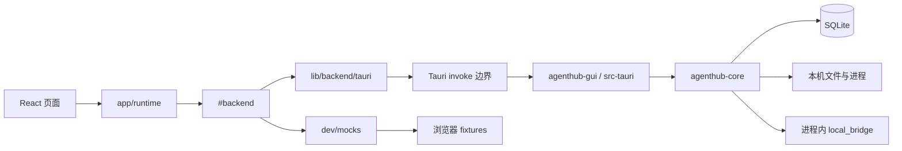

# AgentHub 架构总览

## 目的

AgentHub 是一个桌面应用形态的模块化单体：React 页面负责交互，Tauri 负责桌面边界，`agenthub-core` 负责领域、存储、进程和协议能力，CLI 与 GUI 共享 core。文档把当前实现和未来迁移分开；目录名可以演进，下面的责任边界不能被悄悄绕过。

## 当前系统图

`#backend` 是构建时选择点，不是运行时静默降级点：默认开发和生产构建使用 Tauri adapter；`pnpm dev:mock` 和 Vitest 使用浏览器 mock。页面通过 `app/runtime` 拿到 backend，再经 `lib/api` 兼容 façade 或 backend port 访问能力。页面不直接调用 Tauri `invoke`。

## 责任分层

| 层 | 拥有的职责 | 不应拥有 |
| --- | --- | --- |
| 页面与组件 | 展示、输入、局部视图状态、调用 use case façade | Tauri 调用、协议判断、凭据文件解析 |
| `app/runtime` | backend 单例、catalog/connection/chat 等运行时 store、依赖装配 | 领域写入规则 |
| `lib/backend/contracts` | DTO、port、错误和纯映射 | Tauri、SQLite、React |
| `lib/backend/tauri` | 把 port 映射到 Tauri command；唯一 `invoke` 边界 | 业务策略和页面状态 |
| `dev/mocks` | 浏览器开发与 Vitest 的 backend、fixtures、可重置状态 | 生产构建实现 |
| `agenthub-core` | 服务、领域规则、适配器、存储、文件/进程、协议转换 | React 与 Tauri 细节 |
| `src-tauri` / CLI | 薄壳、参数校验、事件/IPC 映射、组合 core | 复制 core 业务规则 |

## Core 的稳定分区

`agenthub-core` 仍是一个 crate。其稳定职责可以按以下边界理解：

- `models` / `domain`：DTO、领域值和协议图；不做 I/O。
- `services`：Account、Provider、Connection、Ticket、Chat、Run、Usage 等业务编排。
- `storage`：SQLite schema、迁移、repository。
- `adapters` / `integrations`：Agent 特有路径、配置、账号、运行和流解析贡献。
- `platform`：catalog、capability、configuration、lifecycle、skills、usage 等平台能力。
- `bridge`：loopback listener 与 Messages/Responses/Chat 转换；当前是进程内运行时。
- `runtime` / `utils`：共享运行时检测、进程、路径、脱敏与流解析工具。

平台能力按依赖方向调用端口和基础设施；Agent 集成不得反向调用页面、Tauri command 或其他 Agent 集成。当前仍保留 `AgentId`/legacy adapter façade；`AgentKey` 是新平台 registry 和跨端契约的开放标识。

## 当前与方向

当前 `local_bridge` 的 listener、控制协调和退出 drain 都由 Tauri `AppState` 进程内托管。`agenthub-adapterd` sidecar、跨进程 IPC、schema lease 和迁移 saga 是未来方向，不是当前运行前提。未来若迁移，只改变 runtime 进程边界，不改变 Connection/Account/Provider 的领域 owner。

当前生产没有凭据落盘加密，也不为国产 OAuth 开 adapter 边或转 API；这两个边界是产品决定，不是待办。

## 相关页面

- [Frontend and backend boundary](frontend-backend.md)：页面到 `#backend`、Tauri/mock 的调用契约。
- [Core and runtime](core-runtime.md)：core 业务分区、运行时和 local bridge 进程边界。
- [Adapter 路线内核](adapter-route-kernel.md)：`plan()` 是唯一决策者；golden 是只读投影；mock 只查表。
- [Connections and routing](../concepts/connections-and-routing.md)：登录、绑定和路线的领域模型。
- [Product boundaries](../decisions/product-boundaries.md)：不做什么以及术语约束。
