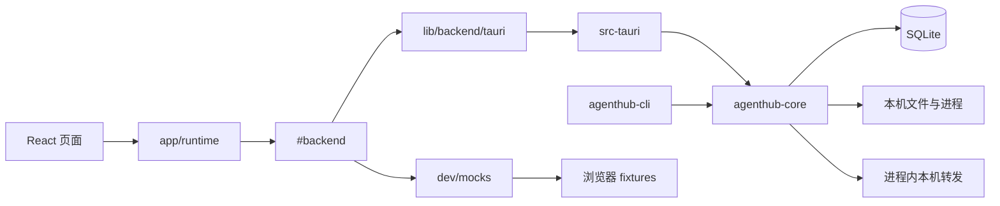

# AgentHub 架构总览

本页说明 AgentHub 由哪几层组成、每层管什么、不许越过哪些边界。细节见文末各专题页。

## 系统图

AgentHub 是一个桌面应用，代码是「模块化单体」：一个仓库、一个进程，按目录分职责。

- React 页面负责交互。
- Tauri 壳（`src-tauri`，crate 名 `agenthub-gui`）负责桌面边界。
- `crates/agenthub-core` 负责领域规则、存储、进程和协议转换。
- 命令行 `crates/agenthub-cli` 与桌面壳共用同一个 core。

```mermaid
flowchart LR
  Page[React 页面] --> Runtime[app/runtime]
  Runtime --> Backend[#backend]
  Backend --> Tauri[lib/backend/tauri]
  Backend --> Mock[dev/mocks]
  Tauri --> Shell[src-tauri]
  Shell --> Core[agenthub-core]
  CLI[agenthub-cli] --> Core
  Mock --> Fixtures[浏览器 fixtures]
  Core --> DB[(SQLite)]
  Core --> FS[本机文件与进程]
  Core --> Bridge[进程内本机转发]
```

`#backend` 是构建时的 import 别名，决定前端接 Tauri 还是浏览器 mock；它不是运行时的降级开关。命令与实现的对应关系见 [前端与 Backend 边界](frontend-backend.md#构建与测试选择)。

## 责任分层

| 层 | 负责 | 不应负责 |
| --- | --- | --- |
| 页面与组件 | 展示、输入、局部视图状态，调用 `lib/api` 或 backend port | Tauri 调用、协议判断、解析登录文件 |
| `src/app/runtime` | 持有 backend 实例和共享读模型（Agent 目录、Agent 状态、登录与供应商列表、票夹、应用更新） | 领域写入规则 |
| `src/lib/backend/contracts` | DTO、port 接口、错误和纯映射 | Tauri、SQLite、React |
| `src/lib/backend/tauri` | 把 port 接到 Tauri command；唯一调用 `invoke` 的目录 | 业务策略和页面状态 |
| `src/dev/mocks` | `pnpm dev:mock` 与 Vitest 用的 backend、fixtures 和可重置状态 | 生产构建 |
| `agenthub-core` | 服务、领域规则、Agent 适配、存储、文件/进程、协议转换 | React 与 Tauri 细节 |
| `src-tauri` / CLI | 薄壳：参数校验、事件映射、组合 core | 复制 core 业务规则 |

port 指按领域拆开的 backend 接口（如 `account`、`ticket`、`chat`），定义在 `contracts/ports.ts`。

## Core 分区

`agenthub-core` 是单一 crate，主要目录如下：

- `models` / `domain`：DTO、领域值和路线规划表（`domain/protocol_graph`），不做 I/O。
- `services`：Account、Provider、Connection、Ticket、Chat、Run、Usage 等业务编排。
- `storage`：SQLite schema、迁移和 repository。
- `adapters` / `integrations`：每个 Agent 特有的路径、配置、账号、运行和流解析。新 Agent 在 `integrations/agents/<key>/` 注册。
- `platform`：可复用的平台能力，如 Agent 目录、配置、安装与生命周期、会话标题、技能、用量。
- `bridge`：本机转发（`local_bridge`）的 loopback 监听、授权池和协议转换。
- `adapter_control`：本机转发写入时的进程内串行门（saga 锁）。
- `oauth`：官方登录流程（浏览器回调、设备码）。
- `usage`：读各 Agent 会话日志算用量。
- `runtime`：Node/npm 等共享运行时的检测与引导。
- `catalog`、`utils`：跨 GUI/CLI 共用的常量（超时、市场地址等）和进程/路径/脱敏工具。

依赖方向：平台能力调用端口和基础设施；Agent 集成不得反向调用页面、Tauri command 或其他 Agent 集成。旧的 `AgentId` 枚举与 `AgentAdapter` trait 仍在用；`AgentKey`（小写 kebab-case 字符串）是新 registry 与跨端契约的标识。

插件、MCP 与技能各自支持到哪一步，见 [插件、MCP 与技能](../concepts/plugins-and-mcp.md)。

## 当前边界与方向

- 本机转发的监听、写入串行和退出收尾都在 Tauri 进程内。把它拆成独立 sidecar 进程只是[提案](../proposals/adapter-sidecar.md)，不是现状。
- 不做凭据落盘加密，不为国产 OAuth 开路由或转 API。这是产品决定，不是待办；原文见 [产品边界](../decisions/product-boundaries.md)。

## 相关页面

- [前端与 Backend 边界](frontend-backend.md)：页面到 `#backend`、Tauri/mock 的调用契约。
- [Core 与 Runtime](core-runtime.md)：core 组合、写路径和本机转发的进程边界。
- [Adapter 路线内核](adapter-route-kernel.md)：`plan()` 是唯一路线决策者，mock 只查表。
- [Connections、Routes 与绑定](../concepts/connections-and-routing.md)：登录、绑定和路线的领域模型。
- [产品边界](../decisions/product-boundaries.md)：不做什么以及术语约束。

本目录下的 `*-owners.md` 是已完成的拆分设计记录，不是现行说明。
