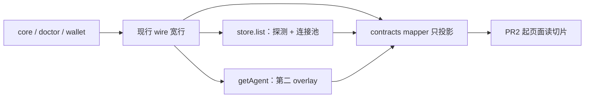

# 读模型 owner 与兼容策略

> 提案，不是现行契约。本系列不改 wire DTO、不拆公开类型、不改 `plan` / `bind` / `unbind` / `switch` / `activate_*`。日常合入 GitHub `dev`。

针对审查 [O-15–O-19](objectization-encapsulation-audit.md)：宽对象继续承载旧 wire；每个**角色**一个 owner。第一刀只加 mapper 和锁步测试，不删字段、不迁页面。

## Overview

五个概念各自有多角色。core 继续发出今天的宽行；contract mapper 只投影切片，不合并、不写回。`AgentStatus` / `Account` / `Provider` / `TicketWallet` 的 TypeScript 与 Rust 公开 DTO **本系列不拆分**。



## Current baseline

| 概念 | 现行事实 |
| --- | --- |
| O-15 `AgentStatus` | 宽行在 [`src/lib/types.ts`](../../src/lib/types.ts)。[`mapDoctorDetectResult`](../../src/lib/backend/contracts/doctor-map.ts) 填安装/环境，并写占位 `authStatus: 'none'`、`authLabel`（已安装「未检测登录态」）、`running: false`、可选 `capabilities`。[`listAgents`](../../src/lib/backend/tauri/agent.ts) 经 `mergeAgentListWithCatalog` 可能补 catalog capabilities，再 `stampHidden`；**不**合并连接池。`list_hidden_agents` 失败时 `loadHiddenAgentIds` 返回空 Set，`stampHidden` 写出 `hidden: false`。[`loadAgentStatuses`](../../src/app/runtime/agent-status-store.ts) 三阶段：detect → [`enrichStatusesWithConnections`](../../src/lib/backend/contracts/agent-connection.ts) → [`mergeLiveAuthIntoAgentStatus`](../../src/app/runtime/agent-status-store.ts)。Tauri 与 mock 的 `getAgent`（`installAgent` / `upgradeAgent` 返回值、[`lib/api/agent.ts`](../../src/lib/api/agent.ts) `getAgent`）另走 `withConnectionEnrichment`，绕过 store；空池仍调用 `applyEffectiveConnection`，给已安装行写上 `effectiveKind: 'none'`、`authHealth: 'missing'`。`hidden` / `authHealth` / `authHealthLabel` / `authSource` / `authRevision` / `effectiveKind` / `effectiveLabel` / `currentProvider` / `envReady` / `envMissing` / `capabilities` 均为 optional。 |
| O-16 `Account` / `Provider` | Core 池行是 [`Account`](../../crates/agenthub-core/src/models/account.rs) / [`Provider`](../../crates/agenthub-core/src/models/provider.rs)（`Value` JSON）。[`mapCoreAccount`](../../src/lib/backend/contracts/account-map.ts) / [`mapCoreProvider`](../../src/lib/backend/contracts/provider-map.ts) 摊到宽 DTO。`mapCoreAccount` 在池健康缺失时把 live 填进 `Account.authHealth`（`poolAuthHealth ?? liveAuthHealth`）。本机探测是独立 [`LiveAuthProbe`](../../src/lib/backend/contracts/account-port.ts)；[`attachLiveAgentAuth`](../../src/lib/backend/contracts/auth-state.ts) 只叠到 `isCurrent` 行的 `liveAuthHealth*`。[`authDisplayForAccount`](../../src/lib/backend/contracts/auth-state.ts) 优先 `liveAuthHealth`。 |
| O-17 两套路线 | 绑定读模型：`BindingRoute` = `native\|reshape\|bridge`。计划内核：`AdapterRoute` = `native_endpoint\|config_sync\|local_bridge\|unsupported`。Core [`binding_from_profile`](../../crates/agenthub-core/src/services/ticket_read_service.rs)：`native_endpoint` **和** `config_sync` → `reshape`，`local_bridge` → `bridge`，`unsupported` → `None`。`native` 只来自无 profile 的当前登录/供应商行。Mock 私有 `adapterRouteToBinding` 在穷尽分支后仍 `return 'native'`（profile 类型已排除 `unsupported`，该回退不可达）。标签已有 `bindingRouteUsageLabel` / `bindingRouteDashboardLabel`；页面 [`bindingRouteLabel`](../../src/pages/connections/ticket-wallet-model.ts) 仍平行一份。`bindRouteMatchesPurpose` 走 plan 枚举。 |
| O-18 `surfaceGroups` | Core wallet 发出分组。[`mapTicketWallet`](../../src/lib/backend/contracts/ticket.ts) **仅当 `surfaceGroups` 不是数组** 才 [`groupTicketSurfaceMembers`](../../src/lib/backend/contracts/ticket.ts)；`[]` 原样保留、不重算。Mock 已调用同一函数，只叠 `attachSurfaceMemberHealth`。页面按 ticket id 过滤，不分组。 |
| O-19 JSON | 落盘与 wire 保持 `Value`。解释靠散落键（`extra.source`、`identityLabel`、`credentials.format`、`meta.official`）。无 core 访问器。 |

## Goals & Non-Goals

**目标**

- 每个概念内 **按角色** 唯一 owner（不是「整个概念只许一个对象」）。
- 标明哪些字段留在现有对象、哪些只作派生切片。
- 旧 wire（缺 optional、省略或非数组的 `surfaceGroups`、不透明 JSON）可解码。
- 第一刀：mapper + 锁步测试；**不删字段、不迁页面**。

**非目标**

- 改 wire 字段、拆公开 DTO。
- 改绑定/切换语义；开国产登录；凭据落盘加密。
- 合并 `BindingRoute` 与 `AdapterRoute`。
- 用 typed value object 替换 `Value`。
- PR1 改 `stampHidden` / `getAgent` overlay / doctor-map / store 合并。

## Proposed Design

### O-15 AgentStatus

| 角色 | Owner |
| --- | --- |
| 宽 wire 行（detect + 占位 auth + 可选 capabilities） | Core doctor + `mapDoctorDetectResult`；`listAgents` 可补 catalog capabilities 并 `stampHidden` |
| list 路径的 live 探测 + 连接池写入 | [`agent-status-store.ts`](../../src/app/runtime/agent-status-store.ts) |
| `getAgent` 路径的连接池写入 | Tauri/mock `getAgent` → `withConnectionEnrichment`（**第二 overlay**；本系列不并入 store） |
| 视图切片 | 新 `src/lib/backend/contracts/agent-status-view.ts`：只读已在宽行上的字段 |

切片函数 **只接收 `AgentStatus`**。禁止调用 `resolveEffectiveConnection`（那是池合并，签名是 account+provider）。`authDisplayForAgentStatus` **仅当 `authHealth` 已存在** 时用于标签；缺 `authHealth` 返回 `unset`，不得读取 doctor 占位 `authStatus: 'none'` /「未检测登录态」。PR2 若要展示文案，另加一层：无 health 则 fail-closed，不回落到「未登录」。

**留在对象上：** 今日全部字段。`running` 与 `update` **本系列不做切片**；PR2 仍从宽行读进程/更新。

**派生（不删源字段）：** `installation` / `liveAuth` / `effectiveConnection` / `capabilities` / `hidden`。

| 缺字段 | 禁止推断为 | 切片 |
| --- | --- | --- |
| `hidden` 省略 | 未安装；也不得当「已隐藏」 | `unknown`。`false` → 可见；`true` → 隐藏。生产 `listAgents` 总会打布尔；mapper 测试用**缺字段的部分对象**，不模拟 `list_hidden_agents` 失败 |
| `authHealth` 省略 | 未登录 / `missing` | `unset`。忽略占位 `authStatus`。行上已有 `authHealth`（含 `getAgent` 空池写下的 `'missing'`）按字面投影 |
| `effectiveKind` / `effectiveLabel` 省略 | 没有连接 | 各为 `unset`。行上 `'none'` 是已写入的事实，不是省略 |
| `envReady` 省略 | 环境已就绪或未安装 | `unknown`。生产 detect / `missingAgentStatus` 常已写 `true`；`unknown` 是旧 wire 合成用例 |
| `capabilities` 省略 | 无能力 / 去 catalog 补 | `unknown`。切片不读 catalog。空对象是「已知为空」，不是 `unknown` |
| `authHealthLabel` / `authSource` / `authRevision` / `envMissing` / `currentProvider` 省略 | 否定事实 | 切片对应项 `unset` |

本刀不改 `stampHidden`：命令失败仍写出 `hidden: false`，mapper 看不到「传输失败」。

### O-16 Account / Provider

| 角色 | Owner |
| --- | --- |
| 持久化池行 | Core `Account` / `Provider` |
| 本机文件探测 | 已有 `LiveAuthProbe` |
| 宽 DTO 摊平（含 coalescing） | 现有 `mapCoreAccount` / `mapCoreProvider`（**冻结**，不改 `authHealth: pool ?? live`） |
| 来源切片 + 携带 | PR1 加在 `account-map.ts` **旁**的 wrapper；不把 provenance 写进 `Account`（避免看起来像拆 DTO） |

`listAccounts` 在 [`tauri/account.ts`](../../src/lib/backend/tauri/account.ts) `mapCoreAccount` 之后丢掉 `CoreAccount`。连接池、mock、页面只持有 `Account`。禁止让 PR2 页面把池里的 `Account` 传给只吃 `CoreAccount` 的函数。

**签名（PR1）：**

```ts
savedAuthFromCore(core: CoreAccount): AuthHealth | 'unset'
  // CoreAccount.health ?? extra.health；都缺 → unset。不读塌缩 authHealth

liveAuthFromCore(core: CoreAccount, probe?: LiveAuthProbe): AuthHealth | 'unset'
  // 优先级：probe.health → extra.authHealth → unset
  // CoreAccount 没有 liveAuthHealth*；那是摊平后的 Account 字段

type AccountAuthView = {
  account: Account;              // = mapCoreAccount(core)，公式不变
  savedAuth: AuthHealth | 'unset';
  liveAuthFromExtra: AuthHealth | 'unset';  // extra.authHealth，未叠 probe
}

mapCoreAccountView(core: CoreAccount): AccountAuthView

savedAuthOf(row: AccountAuthView | Account): AuthHealth | 'unset'
  // View → savedAuth；裸 Account（mock / 未携带）→ unset。永不读 account.authHealth

liveAuthOf(row: AccountAuthView | Account, probe?: LiveAuthProbe): AuthHealth | 'unset'
  // 优先级：probe.health → account.liveAuthHealth* → view.liveAuthFromExtra → unset
```

`AccountAuthView` 是前端 mapper 输出，**不是** wire DTO，也不是拆 `Account`。不往 `Account` 加 `poolAuthHealth`。

**携带（PR2 port/store，非 PR1）：** Tauri `listAccounts` 等仍有 `CoreAccount` 的入口改调 `mapCoreAccountView`；连接池存 `AccountAuthView[]`。Mock 无 `CoreAccount`：`{ account, savedAuth: 'unset', liveAuthFromExtra: account.liveAuthHealth ?? 'unset' }`。页面只调 `savedAuthOf` / `liveAuthOf`。

**留在 `Account` 上：** 配额、`authHealth`、`liveAuthHealth*`、`official`、`secretTail`、`identityLabel` 等现有字段（含冻结的 coalescing）。

旧 wire 只有池 `health`：`savedAuth` 有值，`liveAuthFromExtra` = unset。只有 `extra.authHealth`：`savedAuth` = unset，live 有值；`Account.authHealth` 仍可能被填成 live。

### O-17 两套路线枚举

两套域，不合并。

| 枚举 | Owner | 值 |
| --- | --- | --- |
| `BindingRoute` | 绑定读模型 | `native` / `reshape` / `bridge` |
| `AdapterRoute` | `AdapterRouteService::plan()` | `native_endpoint` / `config_sync` / `local_bridge` / `unsupported` |

**唯一转换 owner：** 提升到 [`contracts/ticket.ts`](../../src/lib/backend/contracts/ticket.ts)：

```ts
adapterRouteToBinding(route: AdapterRoute): BindingRoute | null
```

| 输入 | 输出 |
| --- | --- |
| `native_endpoint` | `'reshape'` |
| `config_sync` | `'reshape'` |
| `local_bridge` | `'bridge'` |
| `unsupported` | `null`（调用方 skip；与 `binding_from_profile` 的 `None` 锁步） |
| 任何输入 | **永不** `'native'` |

禁止复制 mock 的 `return 'native'`。`native` 只由无 profile 的当前登录/供应商行合成。不改 [`ticket_binding_from_apply`](../../crates/agenthub-core/src/services/ticket_bind_service.rs)（`Unsupported` → `Reshape` 是 bind 回写，不是读模型）。Mock `bindingFromProfile` 遇 `null` 跳过。

**展示标签 owner：** `bindingRouteUsageLabel` / `bindingRouteDashboardLabel`。删除页面平行 map 是 **PR2**。`bindRouteMatchesPurpose` 继续按 plan 枚举分流「分享 / 路由」。

### O-18 surfaceGroups

| 角色 | Owner |
| --- | --- |
| 生产分组 | Core：`surfaceGroups` 为数组则用之（含 `[]`） |
| 旧 wire 回退 + 锁步孪生 | `groupTicketSurfaceMembers`（`surfaceGroups` **不是数组** 时） |
| Mock | 同一函数；禁止第三套。`attachSurfaceMemberHealth` 只叠 health |

不删 wire 字段。页面只过滤，不重算桶。规则不变：跳过 unknown surface/class；混 account+provider；成员按 ticket id；桶键字典序。已有 TS/Rust 用例，PR1 补对照/fixture，不是从零写。

### O-19 配置 JSON

磁盘与 Tauri DTO 保持 `Value`。解释 owner = core 已知键只读访问器（**PR3**）。未知键原样保留。Typed value object 不在本系列。

## Compatibility strategy

| Concept | Old wire | Keep on object | Derived by | First knife |
| --- | --- | --- | --- | --- |
| O-15 AgentStatus | 省略 `hidden` / `authHealth` / `authHealthLabel` / `authSource` / `authRevision` / `effectiveKind` / `effectiveLabel` / `currentProvider` / `envReady` / `envMissing` / `capabilities`。生产 detect+`stampHidden` 通常已填满；测试必须喂**部分对象**，不是 live `listAgents` 输出 | 宽行全部字段（含 `running`/`update`） | `agent-status-view`：省略 → unknown/unset；`effectiveKind` 省略 → unset；`capabilities` 省略 → unknown（不读 catalog） | 切片 + 测试。不改 store / doctor-map / `stampHidden` / `getAgent` |
| O-16 Account/Provider | 缺 `liveAuthHealth*`；配额/official 在 `extra`/`meta` | `Account` 字段与 coalescing 冻结。`AccountAuthView` 只在前端 mapper/池里，不是 wire | `savedAuthFromCore` / `liveAuthFromCore`（仅 CoreAccount）；页面用 `savedAuthOf` / `liveAuthOf` | **PR1** 函数+测试。携带进 port/池是 **PR2**。不删 quota/auth，不加 Account 字段 |
| O-17 路线 | 两套枚举都在 | `bindings[].route` 与 `analysis.route` | `adapterRouteToBinding`: `BindingRoute \| null`，永不 `native` | 导出 + mock 改调 + 锁步测试 |
| O-18 surfaceGroups | **省略或非数组** 才回退。`surfaceGroups: []` **不是**省略，不重算 | `tickets` + `surfaceGroups` | 数组（含空）→ map；非数组 → `groupTicketSurfaceMembers` | 锁步/fixture；mock 禁止第三套 |
| O-19 JSON | 不透明 `Value` | 仍是 JSON | core 访问器（PR3） | 本刀不加访问器 |

`list_hidden_agents` 失败 → 全员 `hidden: false`。本刀不把传输失败做成 `hidden: unknown`。省略/`false` 不得表示未安装；其他页不得把省略当成已隐藏（`isAgentHidden` = `Boolean(hidden)`）。

## Key Decisions

1. **不改 wire、不拆公开 DTO、不删字段。** 宽对象是兼容载体。
2. **Owner 按角色，不按概念 XOR。** detect = doctor；list 合并 = store；`getAgent` 仍是第二 overlay；视图 = contract mapper；池行 = core；探测 = `LiveAuthProbe`；摊平 = `mapCore*`；saved/live 在 map 时打进 `AccountAuthView` 再入池；`BindingRoute` ≠ `AdapterRoute`；`surfaceGroups` 生产 = core，非数组才回退；JSON 解释 = core 访问器。
3. **省略 optional → `unknown`/`unset`，永不推断为未安装 / 未登录 / 没有连接 / 环境已就绪。** 切片不把 doctor 占位 `authStatus: 'none'` 当成未登录。
4. **`adapterRouteToBinding(route): BindingRoute \| null`。** `native_endpoint` 与 `config_sync` → `reshape`；`unsupported` → `null`；**任何输入都不返回 `native`**。不改 `ticket_binding_from_apply`。
5. **O-16：PR1 出函数，PR2 才携带。** `mapCoreAccount` coalescing 冻结。`savedAuthFromCore` 只吃 `CoreAccount`。页面/池只调 `savedAuthOf` / `liveAuthOf`。裸 `Account` 的 `savedAuth` = unset（含 mock）。不往 `Account` 加字段。
6. **第一刀只加 mapper/测试。** 禁止改 `src/pages/**`、删除 `bindingRouteLabel`、改 doctor-map/store/`listAgents` 合并。页面迁移 = **PR2 only**。
7. **绑定/切换/计划语义冻结。**
8. **国产 OAuth 与凭据落盘加密不在范围。**
9. **空 `surfaceGroups: []` 与省略不同**；空数组不触发前端分组。
10. **`running` / `update` 留在宽行，本系列无切片。**

## Alternatives

| 方案 | 结论 |
| --- | --- |
| A. 拆公开 DTO | 拒绝。旧后端立刻不兼容。 |
| B. 删除 `surfaceGroups` | 拒绝。改 wire。 |
| C. 合并两套路线枚举 | 拒绝。`native` 不是 `native_endpoint`。 |
| D. 替换 `Value` | 推迟到本系列之后。 |
| E. PR1 改 `stampHidden`/`getAgent` 以区分传输失败 | 拒绝。超出 mapper-only。 |
| F. （选定）宽对象 + 按角色 mapper + 旧 wire 回退 | 采用。 |

## Risks

| 风险 | 缓解 |
| --- | --- |
| 页面继续读宽字段 | PR2 起走切片；PR1 不迁页面 |
| `getAgent` 空池把 `authHealth: 'missing'` 写进宽行，切片当明示 | 记录为第二 overlay；并入 store 是后续 PR，非本刀 |
| 复制 mock `return 'native'` | 类型 `BindingRoute \| null` + 测试：无输入得到 `native` |
| 用塌缩 `Account.authHealth` 当 saved；或对池 `Account` 调 `savedAuthFromCore` | wrapper 在仍有 `CoreAccount` 时携带；页面只用 `savedAuthOf`；裸 Account → unset |
| TS/Rust 分组排序漂移 | 共享 fixture；ASCII 键 |
| 空数组被当成缺分组 | 测试锁住 `[]` 不回退 |
| doctor 占位被显示成未登录 | 无 `authHealth` → `unset`；不调用无 health 的 `authDisplayForAgentStatus` |

## PR Plan

合入目标：`dev`。每 PR 不改 wire、不删字段、不拆 DTO。

**PR1 — mapper + 测试 only**

允许：

- 新增 `src/lib/backend/contracts/agent-status-view.ts` + `agent-status-view.test.ts`（只读 `AgentStatus`）。
- O-16：`savedAuthFromCore` / `liveAuthFromCore` / `mapCoreAccountView` / `savedAuthOf` / `liveAuthOf` + `account-map.test.ts` / `auth-state.test.ts`。不改 `tauri/account.ts`、mock 池、连接池类型。
- 导出 `adapterRouteToBinding`；mock `ticket.ts` 改调它；`unsupported` → skip。
- 分组/路线锁步（补 fixture/对照，不是从零）。

禁止：

- 改 `src/pages/**`。
- 删除 `bindingRouteLabel`。
- 删字段、拆 DTO。
- 改 doctor-map、store 合并、`listAgents`/`getAgent`/`stampHidden`。
- core JSON 访问器。

`ticket-wallet-model.test.ts` 仅作回归，本刀不改该生产文件。

```text
pnpm exec vitest run src/lib/backend/contracts/agent-status-view.test.ts src/lib/backend/contracts/ticket.test.ts src/lib/backend/contracts/account-map.test.ts src/lib/backend/contracts/provider-map.test.ts src/lib/backend/contracts/auth-state.test.ts src/lib/backend/contracts/auth-page-contract.test.ts src/lib/api/agent-connection.test.ts src/app/runtime/agent-status-store.test.ts src/dev/mocks/ticket.test.ts src/pages/connections/ticket-wallet-model.test.ts
pnpm typecheck
cargo test -p agenthub-core --locked same_surface_two_accounts_form_one_group_in_ticket_id_order
cargo test -p agenthub-core --locked different_surfaces_do_not_share_a_group
cargo test -p agenthub-core --locked account_and_provider_of_same_surface_mix_in_one_group
cargo test -p agenthub-core --locked unknown_surface_and_unknown_credential_class_are_not_grouped
pnpm check:docs
```

测试与生产分文件（`*.test.ts` / `*/tests.rs`）。

**PR2 — port 携带 + 页面改走 mapper（仍不删字段、不改 wire）**

- Port/池：所有仍有 `CoreAccount` 的入口（`tauri/account.ts`、`tauri/trash.ts`）改调 `mapCoreAccountView`；连接池存 `AccountAuthView[]`。这是前端 port/runtime 类型，不是 Tauri wire，也不拆 `Account`。Mock 包装裸 `Account`：`savedAuth: 'unset'`，live 用 `liveAuthHealth*`。
- Connections：AgentStatus 切片；登录行 `savedAuthOf(view)`，当前生效 `liveAuthOf(view, probe)`。**禁止**对池 `Account` 调用 `savedAuthFromCore`。删除 `bindingRouteLabel`。
- Dashboard / Chat：AgentStatus 切片。进程/更新仍读宽行 `running`/`update`。

```text
pnpm exec vitest run src/pages/connections/ticket-wallet-model.test.ts src/pages/connections/connection-model.test.ts src/pages/dashboard/agentOverviewModel.test.ts src/pages/chat/chat-model.test.ts src/pages/chat/use-chat-page.test.ts
pnpm typecheck
```

**PR3 — core JSON 已知键访问器**

- 先把 [`account.rs`](../../crates/agenthub-core/src/models/account.rs) 内联 `mod tests` 抽到 `models/account/tests.rs`（仓库约定）。
- 只读访问器覆盖已用键；`oauth_owner` 走 `source()`。持久化仍是 `Value`。

```text
cargo test -p agenthub-core --locked models::account::
pnpm exec vitest run src/lib/backend/contracts/account-map.test.ts src/lib/backend/contracts/provider-map.test.ts
```

本系列 **没有** 「删除字段 / 拆 DTO」PR。

## References

- [对象化与封装审查 O-15–O-19](objectization-encapsulation-audit.md)
- [Core 与 Runtime](core-runtime.md)
- [前端与 Backend Adapter 边界](frontend-backend.md)
- [Connections、Routes 与绑定](../concepts/connections-and-routing.md)
- [模块化与边界收紧](../proposals/modularity.md)（D2 稳定 wire 是另一项；本提案 **不** 改 wire）
- [产品边界](../decisions/product-boundaries.md)
