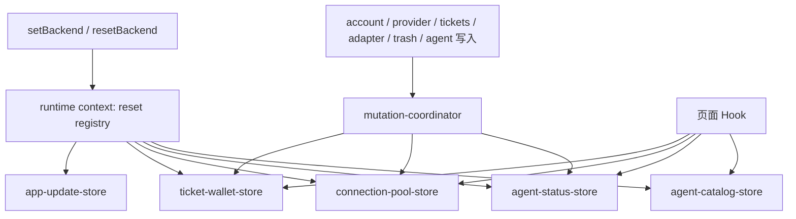

# 运行时 context owner 与 store 重置

> 提案，不是现行契约。本系列不改 `plan` / `bind` / `unbind` / `switch` / `activate_*` / 补偿 / current / 锁。日常合入 GitHub `dev`。

针对审查 [O-07](objectization-encapsulation-audit.md)：运行时 store 是多个模块级可变单例；`setBackend` / `resetBackend` 手工依次 reset；没有统一 context 承载生命周期和失效。O-08 / O-09（`refreshRuntimeReadModels`、刷新失败留在 snapshot）和 O-51 / O-52（epoch 丢弃过期写回、catalog 随 backend 一起 reset）**已经落地，本系列冻结，不重做**。

## Overview

`src/app/runtime` 今天有五份模块级读模型（catalog、Agent 状态、连接池、票夹、应用更新），外加 Backend 单例和写入后刷新协调器。共享 store 作为应用级读模型是对的：页面订阅同一份 snapshot，而不是各自 `listAccounts`。缺的是 **reset / 失效的唯一 owner**——新增一份 store 时，调用方要记得改 `resetRuntimeStores()`，还可能自己 `notify*` 或 `.catch(() => {})`。

本提案：**不把 store 改成 class 实例，不合成一个 React Context 当真源，不改写入语义**。给 reset 一个声明式 registry；剩下仍直接 `notify*` 的 façade 改走已有 coordinator；生产 barrel 不再导出各 store 的 `reset*`。



## Current baseline

| 对象 | 现状 | 本系列怎么对待 |
| --- | --- | --- |
| O-07 Backend 单例 | [`backend-runtime.ts`](../../src/app/runtime/backend-runtime.ts)：`instance` 模块级；`getBackend` 惰性 `createBackend()`；`setBackend` / `resetBackend` 改实例后调用私有 `resetRuntimeStores()`。 | **保留**单例。reset 列表迁到 context registry。 |
| Catalog store | [`agent-catalog-store.ts`](../../src/app/runtime/agent-catalog-store.ts)：`snapshot` / `epoch` / `listeners` 模块级。reset 会 `epoch += 1`、`applyAgentCatalog([])`。过期写回丢弃。[`setBackend` / `resetBackend` 已调用 catalog reset](../../src/app/runtime/agent-catalog-store.test.ts)。 | **O-52 已处理，冻结 epoch 与 catalog 随 backend reset。** |
| Agent 状态 store | [`agent-status-store.ts`](../../src/app/runtime/agent-status-store.ts)：`snapshot` / `epoch` / `inflight` / `pendingHidden`。三阶段 detect → 连接池 → live-auth；continuation 写回前校验 epoch。reset 清 probe cache。 | **O-51 已处理，冻结。** |
| 连接池 store | [`connection-pool-store.ts`](../../src/app/runtime/connection-pool-store.ts)：`snapshot` / `inflight` / `epoch` / `mutationDepth` / `notifyPending`。全量 `listAccounts` + `listProviders`。`markConnectionCurrent` 只改本地 `isCurrent` 展示。`begin/endConnectionPoolMutation` 把批量删除收成一次刷新。 | 快照与 batch notify **仍归本文件**。reset 必须进 registry。 |
| 票夹 store | [`ticket-wallet-store.ts`](../../src/app/runtime/ticket-wallet-store.ts)：同样的 snapshot / inflight / epoch。Chat 已订阅共享 store（O-10）。 | 快照仍归本文件。reset 进 registry。 |
| 应用更新 store | [`app-update-store.ts`](../../src/app/runtime/app-update-store.ts)：模块级 `available` + listeners。**不在** `resetRuntimeStores()` 里。 | 必须加入 reset 列表。无 epoch（同步写）。 |
| 写入后刷新 | [`mutation-coordinator.ts`](../../src/app/runtime/mutation-coordinator.ts)：`refreshRuntimeReadModels`；`RuntimeReadModel` = `agentStatus` \| `connectionPool` \| `ticketWallet`；`Promise.allSettled`；失败留在各 snapshot 的 `error`。account / provider / tickets façade 已走这里。 | **O-08 / O-09 已处理，冻结合同。** |
| 仍旁路 coordinator 的 façade | [`adapter.ts`](../../src/lib/api/adapter.ts) 自己 `try/catch` 调 `notifyConnectionPoolChanged`；[`trash.ts`](../../src/lib/api/trash.ts) restore 用 `.catch(() => {})`；[`agent.ts`](../../src/lib/api/agent.ts) 安装/升级/卸载自己 `loadAgentStatuses` 并吞错。 | **O-07 残留：失效仍由调用方拼接。** PR2 收口，不改 coordinator 语义。 |
| Catalog React | [`AgentCatalogProvider.tsx`](../../src/app/runtime/AgentCatalogProvider.tsx)：`useSyncExternalStore` 包 store；`useAgentCatalog` 不在 Provider 内抛错。 | **O-53 冻结。** 不把全部 store 塞进同一个 Context。 |
| 连接池 / 票夹 React | `useConnectionPool` / `useTicketWallet` 直接订 store，无空 Context。 | **O-53 冻结。** |
| Agent 状态 React | `AgentStatusProvider` 有 Context；`useAgentStatuses` 必须在内；Optional Hook 直接订 store。焦点时 reconcile + 强制刷新。 | 不改 Provider 边界。 |
| 生产 barrel | [`index.ts`](../../src/app/runtime/index.ts) 再导出全部 `reset*Store`、`notify*`、`begin/endConnectionPoolMutation`。测试 setup 实际走 `resetBackend()`。 | PR3 收窄生产导出。 |

current 指针仍只由 Core `ConnectionService` 写入。连接池上的 `isCurrent` 是读模型投影 + 乐观 stamp，不是第二套 current owner。

## Goals & Non-Goals

**目标**

- 每个运行时角色一个 owner：Backend 实例、store 生命周期（reset）、写入后刷新、epoch 隔离、各 snapshot、Catalog Provider。
- 新增 `*-store.ts` 若不登记 reset，测试失败。
- 生产路径只通过 `setBackend` / `resetBackend` 重置共享读模型；页面不调用 `reset*Store`。
- 写入成功后的读模型刷新只走 `refreshRuntimeReadModels`（含 adapter / trash / agent 安装）。
- 第一刀只加 registry 和锁步测试，不搬 store 内部、不改 façade 写入。

**非目标**

- 不改 `plan` / `bind` / `unbind` / `switch` / `activate_*` / 补偿顺序 / current 指针 / 锁。
- 不把模块级 store 改成 class 实例或多例 RuntimeContext 对象。
- 不把五份 snapshot 合成一个 React Context；不回退 O-53。
- 不重做 O-08 / O-09 coordinator，不改 `RuntimeReadModel` 默认集合语义（失败仍 `allSettled`、错误仍在 snapshot）。
- 不重做 O-51 / O-52 epoch；各 store 继续自己 bump epoch。
- 不开国产登录，不做 OAuth 转 API，不做凭据落盘加密。
- 不改 wire DTO、不拆公开类型、不改 `overview.md` 现行描述。
- 不把 `useProjects` / `useSkills` 的页面缓存并进本系列（O-50 已收窄 setter）。
- 本页升格前不把审查表 O-07 标成已处理。

## Proposed Design

### 1. 唯一 owner

| 角色 | Owner | 不拥有 |
| --- | --- | --- |
| Backend 实例 | [`backend-runtime.ts`](../../src/app/runtime/backend-runtime.ts) `getBackend` / `setBackend` / `resetBackend` | 各 snapshot 字段 |
| Store 生命周期 / reset 名单 | 新 `src/app/runtime/runtime-context.ts`（本系列落地后才存在）：声明 `RUNTIME_STORE_RESETS`，导出 `resetRuntimeContext()` | 领域写入、`plan`/`bind`、epoch 算法 |
| 写入后刷新 | 已有 `refreshRuntimeReadModels` | 不 bump epoch；不代替 `mutationDepth` |
| Epoch / 过期写回 | **各 store 内部** `epoch`（已有） | coordinator 不得改 epoch |
| Catalog snapshot + `AGENTS` hydrate | `agent-catalog-store` | 连接池 / 票夹 |
| Catalog React 强制入口 | `AgentCatalogProvider` / `useAgentCatalog` | 不拥有 reset |
| Agent 状态 + live-auth 合并 | `agent-status-store` | catalog 产品集合 |
| 连接池 snapshot + 批量 notify | `connection-pool-store`（含 `mutationDepth`） | Core current 指针 |
| 票夹 snapshot | `ticket-wallet-store` | `bind`/`unbind` 语义 |
| 应用更新 badge | `app-update-store` | 检测逻辑（仍在 UpdatePrompt） |
| 乐观 `isCurrent` stamp | `markConnectionCurrent` | 不得发 `UPDATE … is_current` |
| 乐观隐藏 | `applyAgentHidden` / `revertAgentHidden` | 持久化仍走 Agent port |

`setBackend` / `resetBackend` **只**调用 `resetRuntimeContext()`，不再手写四五个 reset。顺序保持现状：先换 `instance`，再 reset（各 store `epoch += 1`，旧 backend 的 in-flight 写回被丢弃）。

### 2. Reset registry（PR1）

```ts
// src/app/runtime/runtime-context.ts — 示意，不是现行代码
export const RUNTIME_STORE_RESETS = [
  resetAgentCatalogStore,
  resetAgentStatusStore,
  resetConnectionPoolStore,
  resetTicketWalletStore,
  resetAppUpdateStore,
] as const;

export function resetRuntimeContext(): void {
  for (const reset of RUNTIME_STORE_RESETS) reset();
}
```

锁步测试（新 `runtime-context.test.ts`）：

1. `setBackend` / `resetBackend` 之后：catalog `idle` 且 `AGENTS` 空、状态/池/票夹 `idle`、app-update 为 `null`。
2. 扫描 `src/app/runtime/*-store.ts` 里所有 `export function reset…Store`，必须出现在 `RUNTIME_STORE_RESETS`。漏登记即失败。
3. 现有 epoch 用例不动：catalog / agent-status 在 reset 后丢弃过期写回。

`src/test/setup.ts` 继续 `resetBackend()` 再 `seedAgentCatalog`。不要让测试去调五份 `reset*Store` 代替 `resetBackend`。

### 3. 失效只走 coordinator（PR2）

`refreshRuntimeReadModels` 的合同冻结：

- 写入成功仍返回给调用方。
- 刷新用 `allSettled`；失败写在对应 snapshot 的 `error` / `errors`。
- `models` 缺省仍是三件套；可子集。

要改的调用方（**不改 bind/unbind/switch 本身**）：

| 今日 | 改为 |
| --- | --- |
| `adapter.ts` `refreshConnectionPoolAfterAdapterMutation` → `notifyConnectionPoolChanged` + 本地 try/catch | `await refreshRuntimeReadModels(getBackend(), { models: ['connectionPool'] })` |
| `trash.ts` restore → `notifyConnectionPoolChanged(…).catch(() => {})` | 同上；**禁止**空 `.catch` |
| `agent.ts` `refreshAgentStatusStore` → `loadAgentStatuses` + 吞错 | `{ models: ['agentStatus'] }` |

[`adapter.test.ts`](../../src/lib/api/adapter.test.ts) 今日 mock 的是 `notifyConnectionPoolChanged`。PR2 改 mock `refreshRuntimeReadModels`，仍锁：apply/remove 等到刷新结束才 resolve；刷新失败仍返回写入结果。account / provider / tickets 已走 coordinator，本刀不改那些函数体。

`beginConnectionPoolMutation` / `endConnectionPoolMutation` 留在连接池 store：`deleteProviders` 的 N 次删除收成一次池刷新。coordinator 不复制 `mutationDepth`。`endConnectionPoolMutation` 之后对 `agentStatus` / `ticketWallet` 的那次 `refreshRuntimeReadModels` 保持。

### 4. 生产 barrel 收窄（PR3）

[`index.ts`](../../src/app/runtime/index.ts) **停止再导出** `resetAgentCatalogStore` / `resetAgentStatusStore` / `resetConnectionPoolStore` / `resetTicketWalletStore` / `resetAppUpdateStore`。

生产生命周期入口只剩 `setBackend` / `resetBackend`。各 store 文件仍导出 `reset*` 给单元测试（测试从 `./agent-status-store` 等导入，与今日 store 测试一致）。`seedAgentCatalog` 留给 `src/test/setup.ts`。

仍从 barrel 导出（领域级，不是底层 reset）：`get/load/subscribe`、`refreshRuntimeReadModels`、`notifyConnectionPoolChanged` / `notifyTicketWalletChanged`（供 coordinator 与 `endConnectionPoolMutation`）、`begin/endConnectionPoolMutation`、`markConnectionCurrent`、`applyAgentHidden` / `revertAgentHidden`、Provider/Hook。

### 5. 第一刀可落地的文件范围

只加 registry + 把 `resetAppUpdateStore` 列入 + 锁步测试。

- 新增 `src/app/runtime/runtime-context.ts` + `runtime-context.test.ts`
- `backend-runtime.ts`：`resetRuntimeStores` 改为调用 `resetRuntimeContext()`
- 不改五个 store 的 snapshot / inflight / epoch 实现
- 不改 `mutation-coordinator.ts`
- 不改 `src/pages/**`、`plan`/`bind`/`unbind`

## Key Decisions

| 决定 | 理由 |
| --- | --- |
| 共享 store 继续是模块级单例 | O-07 要修的是生命周期 owner，不是「模块级」本身。epoch 与 `useSyncExternalStore` 已在单例上工作。 |
| 新 `runtime-context.ts` 只拥有 reset 名单 | Backend 实例仍归 `backend-runtime.ts`；刷新仍归 coordinator。三个角色不要并进一个大对象。 |
| `app-update-store` 必须进 registry | 它已有 `resetAppUpdateStore`，却被 `resetRuntimeStores` 漏掉——正是 O-07 的风险。 |
| 不改 `setBackend` 先换 instance 再 reset 的顺序 | 各 store reset 才 bump epoch；旧 in-flight 必须看到新 epoch。 |
| O-08 / O-09 coordinator 合同冻结 | 再写一套 notify 就是倒退。PR2 只把漏网 façade 接进来。 |
| O-51 / O-52 epoch 留在各 store | context 不实现第二套代数。 |
| 不合成 React Context 真源 | O-53：Catalog 强制 Provider；池/票夹直接订 store。 |
| `markConnectionCurrent` 不是 current owner | 只是列表乐观投影；落盘仍经 `activate_*`。 |
| 生产 barrel 不导出 `reset*Store` | 页面若直接 reset 会绕过 registry。 |
| 产品范围外：凭据落盘加密、国产 OAuth 开边、OAuth 转 API | 项目红线。 |

## Alternatives Considered

**A. 把五份 store 收成 `class RuntimeContext` 实例，测试各 new 一份**

要改全部 subscribe / Hook / setup。epoch 已经隔离旧写回。拒绝作为本系列；单例 + registry 足够。

**B. 一个 React Context 持有全部 snapshot**

与 O-53 相反，也解决不了非 React 的 `setBackend`。拒绝。

**C. 第一刀就改 adapter / trash / agent façade**

与 registry 无文件依赖，但审查噪音大。reset 漏网是 O-07 的核心；先锁名单。

**D. 让 coordinator 在刷新时 bump 全局 epoch**

各 store 已有 epoch；全局代数会让「只刷新票夹」误伤连接池 in-flight。拒绝。

## Risks

| 风险 | 严重度 | 缓解 |
| --- | --- | --- |
| 新 store 只写文件、不登记 | 高 | PR1 锁步扫描 `export function reset…Store` |
| PR2 把 adapter 刷新改成默认三件套，安装路径变成全量刷新 | 高 | 显式 `models: ['connectionPool']` / `['agentStatus']` |
| 有人给 `snapshot()` 式路径或 `bind` 加行为 | 高 | 本系列禁止改 `plan`/`bind`/`unbind`/`switch`/`activate_*` |
| 把 `reset*Store` 从 barrel 拿掉后，外部测试从 `@/app/runtime` 导入失败 | 中 | 仓库内今日只有 store 测试与 `backend-runtime` 引用；PR3 先 grep 再删导出 |
| 文档被当成现行契约 | 中 | `status: proposed`；不改审查核实表 |

## PR Plan

合入目标：GitHub `dev`。每 PR 独立可回滚。禁止单 PR 把 registry、façade 收口、barrel 收窄一次做完。

### PR1 — Reset registry（第一刀）

- **标题：** `refactor(runtime): register store resets in one runtime context`
- **依赖：** 无（本设计合入后即可）
- **文件：** 新增 `src/app/runtime/runtime-context.ts`、`runtime-context.test.ts`；改 `backend-runtime.ts`（只替换私有 `resetRuntimeStores` 调用）。可选极短 `backend-runtime.test.ts` 只断言 `setBackend`/`resetBackend` 走 registry。
- **描述：** `RUNTIME_STORE_RESETS` 含 catalog / agent-status / connection-pool / ticket-wallet / **app-update**。`setBackend` / `resetBackend` 只调 `resetRuntimeContext()`。不改编排、不改 epoch、不改 coordinator、不改页面。
- **测试命令：**

```text
pnpm exec vitest run src/app/runtime/runtime-context.test.ts src/app/runtime/agent-catalog-store.test.ts src/app/runtime/agent-status-store.test.ts src/app/runtime/connection-pool-store.test.ts src/app/runtime/ticket-wallet-store.test.ts src/app/runtime/app-update-store.test.ts src/app/runtime/mutation-coordinator.test.ts
pnpm typecheck
pnpm check:docs
```

点名锁：`resetBackend clears the catalog with other runtime stores`；agent-status / catalog 的「pre-reset response 不得覆盖新 store」。

### PR2 — 剩余 façade 走 coordinator

- **标题：** `refactor(runtime): refresh leftover façades through mutation coordinator`
- **依赖：** 无技术依赖。建议 PR1 之后，避免和 registry 测试抢 `backend-runtime.ts`。
- **文件：** `src/lib/api/adapter.ts`、`adapter.test.ts`；`src/lib/api/trash.ts`（可补 `trash.test.ts`）；`src/lib/api/agent.ts`（安装/升级/卸载刷新）。**不改** `tickets.ts` `bind`/`unbind` 函数体、`account.ts` / `provider.ts` 已有 coordinator 调用、`mutation-coordinator.ts` 实现。
- **描述：** adapter apply/remove/enroll 等今日 `notifyConnectionPoolChanged` 的路径改为 `refreshRuntimeReadModels({ models: ['connectionPool'] })`。trash restore 去掉空 `.catch`。agent 安装路径 `{ models: ['agentStatus'] }`。写入成功仍返回；刷新失败仍留在 snapshot。
- **测试命令：**

```text
pnpm exec vitest run src/lib/api/adapter.test.ts src/lib/api/tickets.test.ts src/app/runtime/mutation-coordinator.test.ts src/lib/api/agent.hidden.test.ts
pnpm typecheck
```

adapter 三条语义保持：apply/remove 等待刷新；刷新失败仍返回 mutation 结果。

### PR3 — 生产 barrel 不再导出 `reset*Store`

- **标题：** `refactor(runtime): keep per-store reset off the production barrel`
- **依赖：** PR1（reset 已由 `resetBackend` 覆盖 app-update）。
- **文件：** `src/app/runtime/index.ts` 删除五份 `reset*Store` 再导出。若有测试从 `@/app/runtime` 取 `reset*Store`，改为从 store 文件导入。
- **描述：** 生产代码重置共享读模型只许 `setBackend` / `resetBackend`。store 单测继续从本文件 import `reset*`。不改 Hook、不改 Provider。
- **测试命令：**

```text
pnpm exec vitest run src/app/runtime src/test/setup.ts src/lib/api/backend-features.test.ts
pnpm typecheck
```

（`src/test/setup.ts` 不是用例文件；跑 `src/app/runtime` 与依赖 `resetBackend` 的 façade 测试即可。setup 仍是 `resetBackend` + `seedAgentCatalog`。）

## What must not change

- `ticket.plan` / `bind` / `unbind` 的 Core 与产品写入口语义。
- `switch` / `undo_switch` / `activate_*` / 补偿 / `LiveWriteGuard` / `AgentWriteLock`。
- `ConnectionService` 作为 current / active binding 的唯一落盘 owner。
- `refreshRuntimeReadModels` 的 allSettled + snapshot error 合同（O-08 / O-09）。
- 各 store 的 epoch 丢弃过期写回（O-51 / O-52）。
- `AgentCatalogProvider` 强制 Context；连接池不恢复空 Context（O-53）。
- `markConnectionCurrent` 不得变成 DB current 写入。
- `snapshot()` 无 guard 行为、Backup / Provider 内部拆分（另一提案）。
- 凭据落盘加密、国产 OAuth 开边、OAuth 转 API。

## Open Questions

无产品阻塞。实现选择已写入 Key Decisions：registry 独立文件而不是把 reset 继续堆在 `backend-runtime.ts`；app-update 纳入第一刀；adapter/trash/agent 的 notify 旁路放 PR2；class 实例化与 mega Context 拒绝。

## References

- [对象化与封装审查 O-07、O-08、O-09](objectization-encapsulation-audit.md)
- [对象化与封装审查：前端与运行时 O-51、O-52、O-53](objectization-encapsulation-audit-frontend.md)
- [读模型 owner 与兼容策略](read-model-owners.md)（宽 DTO 切片；本提案不改 wire）
- [Service 内部 owner 拆分](service-internal-owners.md)（Core 门面内部拆分；本提案不改 switch / current / 锁）
- [前端与 Backend Adapter 边界](frontend-backend.md)
- [架构总览](overview.md)（本提案不改其当前态表述）
- [产品边界](../decisions/product-boundaries.md)
- 源码：`src/app/runtime/{backend-runtime,agent-catalog-store,agent-status-store,connection-pool-store,ticket-wallet-store,app-update-store,mutation-coordinator,AgentCatalogProvider,index}.ts`；`src/lib/api/{account,provider,tickets,adapter,trash,agent}.ts`；`src/test/setup.ts`
