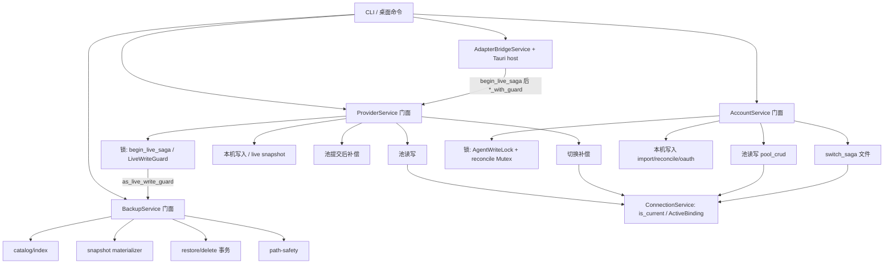

# Service 内部 owner 拆分

> 状态：提案（Draft）。作者：maintainers。日期：2026-08-26。
>
> 本文是 [模块化与边界收紧](../proposals/modularity.md) D3 的落地设计：只拆 O-11 `ProviderService`、O-12 `AccountService`、O-13 `BackupService`、O-14/O-66 本机转发事务的**内部 owner**。不是现行契约，不得按已实施理解。日常 PR 合入 GitHub `dev`。

## Overview

四个对象现在都是「对外一门面、对内多件事」。调用方（CLI `crates/agenthub-cli`、桌面端 `src-tauri`）已经走 `hub.providers()` / `hub.accounts()` / `hub.backups()` / `hub.adapter_bridge()`，方法名稳定。缺的是门面背后的职责边界：池读写、本机写入、切换补偿、锁，互相缠在同一文件里，改一处容易碰到 current / 锁 / 补偿。

本提案：**不改公开类型和方法名，不改切换/撤销/补偿，不改 `snapshot_with_guard` 语义，不改 current 指针归属**。内部按 Account 的方式用 **private `mod`** 切开 owner（不是新的 crate 可见类型）。第一刀只拆 `BackupService` 文件，四个对象不得一次拆完。

## Current baseline

| 对象 | 现状 | 必须保持的门面 |
| --- | --- | --- |
| O-11 `ProviderService` | 单文件 `crates/agenthub-core/src/services/provider_service.rs`（约 2073 行）。字段：`db`、`repo`、`registry`、`backup`、`authority: LiveWriteAuthority`、`connections: ConnectionService`、`secret_resolver`。测试已在 `provider_service/tests.rs`。 | **`pub`（CLI/桌面用）：** `new` / `with_registry` / `with_live`；`list` `get` `get_by_id` `get_current` `create` `create_with_guard` `update` `update_with_guard` `upsert` `upsert_with_guard` `delete` `delete_with_guard`；`import_live` `capture_live_config_snapshot` `capture_live_config_snapshot_with_guard` `restore_live_config_snapshot` `restore_live_config_snapshot_with_guard` `restore_named_backup_with_guard` `restore_named_backup_or_clean_codex` `persist_first_bind_restore_meta_with_guard`；`switch` `switch_with_guard` `undo_switch`；`begin_live_saga`；`ProviderLiveSagaGuard::agent` / `as_live_write_guard`；`test_latency`；`repo()`（普通 `pub fn`，不是 `#[cfg(test)]`）。 **`pub(crate)`（crate 内 freeze，不是 CLI/Tauri 命令）：** `update_pool_with_guard`（`adapter_apply_service/saga.rs`）。 |
| O-12 `AccountService` | **已经按模块拆过**，公开路径仍是 `AccountService`。`account_service/mod.rs` 声明 private：`pool_crud`、`import_live`、`live_reconcile`、`oauth_file_sync`、`oauth_owner`、`switch_saga`、`surface`；`mod.rs` 有 `pub(super) use surface::*;` 给 `tests.rs`。不要重做这一刀。 | `new` / `with_registry` / `with_live`；`list_pool` `list` `get` `create` `delete` `add_api_key` `add_api_key_with_env` `add_api_key_with_env_and_marker` `update_api_key` `refresh_token` `refresh_quota`；`import_live` `probe_live_auth` `live_is_adapter_projection` `follow_cli_owned_access` `reload_oauth_upstream_access`；`switch` `undo_switch`；`persist_pi_oauth_live` `persist_pi_oauth_account_update`（**实现落在 `switch_saga.rs`，本系列不搬**）；`acquire_live_lock`（`pub(super)`）；`oauth_bridge_reload_callback`。 |
| O-13 `BackupService` | 单文件 `backup_service.rs`（约 1681 行）+ 已有 `backup_service/tests.rs`。字段：`repo: BackupRepo`、`registry`、`backups_root`、`authority: LiveWriteAuthority`。`#[cfg(test)] mod tests;` 使测试能看到全部 private 项。 | `new` `backups_root` `list` `get_by_id` `snapshot` `snapshot_with_guard` `restore` `restore_with_guard` `delete`；`RestoreResult`；`repo()` 是 `#[cfg(test)] pub(crate)`。 |
| O-14/O-66 本机转发 | Core：`adapter_bridge_service/{mod,prepare,finalize,removal,rules}.rs`。桌面：`src-tauri/src/adapter_bridge_controller.rs`（约 1436 行）在 listener 起来之后编排 `begin_live_saga` → 投影写入 → 可选 `switch_with_guard` → `persist_first_bind_restore_meta_with_guard` → `finalize`。进程内 profile/target 门是 Core 的 `adapter_control::AdapterSagaCoordinator`（别名 `AdapterBridgeSagaCoordinator`），不是 Tauri 类型。`adapter_apply_service/saga.rs` 已在 Core 内用 `*_with_guard`。 | `AdapterBridgeService` 方法名不改。CLI/桌面不改 invoke / 子命令名。 |

CLI（不改名）：`crates/agenthub-cli/src/commands/{provider,account,backup}.rs` → `hub.providers().list/get/import_live/switch/undo_switch/test_latency`、`hub.accounts().list/import_live/add_api_key/switch/undo_switch/refresh_token/delete`、`hub.backups().list/snapshot/restore/delete`。

桌面（不改名）：`src-tauri/src/commands/{provider,account,backup}.rs` 的 `list_providers` / `upsert_provider` / `switch_provider` / `undo_switch_provider`、`list_accounts`（内层 `list_pool`）/ `import_account_live` / `switch_account` / `undo_switch_account` / `probe_live_auth`、`list_backups` / `create_backup`（`snapshot`）/ `restore_backup` / `delete_backup`。本机转发事务在 `adapter_bridge_controller.rs`。

current 指针：`is_current` + `agent_active_bindings` 的 **DB 写入**全部走 `ConnectionService`（含 `activate_*`、`create_and_activate_*`、`update_and_activate_*`、`*_conn`、`*_if_revision`、`clear`、trash 删除）。Account/Provider 可以在内存里设 `row.is_current`，但落盘只经这些方法。切换在本机写入成功后才 `activate_*`。

锁：`AgentWriteLock` 是**进程内互斥**（`agent_lock.rs`：单进程应用；锁文件 `provider-{agent}.lock` 是诊断/路径身份，不是跨进程 flock）。嵌套再获取失败是因为进程内 `held_lock_paths`，不是两个进程抢同一文件。`LiveWriteAuthority` / `LiveWriteGuard` 是这把锁的薄封装。跨服务复用 `ProviderLiveSagaGuard::as_live_write_guard()`。`BackupService::snapshot_with_guard` = `authority.validate_guard(guard, agent)` 然后 `snapshot_inner`，不再 `acquire`。

## Goals & Non-Goals

**目标**

- 每个门面内部有明确 owner：池读写 / 本机写入 / 切换补偿 / 锁（Provider 另有「池提交后补偿」，与切换补偿分开）。
- 公开类型仍是 `ProviderService`、`AccountService`、`BackupService`；CLI/桌面调用点不改名。
- `ConnectionService` 继续唯一拥有 current / active 连接指针。
- 锁顺序、失败回滚、`snapshot_with_guard` 与现网一致。
- 第一刀可独立合入 `dev`，且只动一个对象的内部文件。

**非目标**

- 不改 `switch` / `switch_with_guard` / `undo_switch` / 补偿顺序或错误码。
- 不把 current 写入下放到 Account/Provider 内部「尽力而为」。
- 不开国产登录，不做 OAuth 转 API，不做凭据落盘加密。
- 不把四个对象一次拆完；不把 O-14/O-66 放进第一刀。
- 不把测试搬进生产文件；不重做 Account 已有模块拆分；不把 `persist_pi_oauth_*` 挪出 `switch_saga.rs`。
- 不改 `overview.md` 的现行描述；本页升格前不把 O-11–O-14/O-66 标成已处理。
- 不为 `snapshot()` / `AgentWriteLock` 引入跨进程 flock。

## Proposed Design



### 1. 每个对象内部的 owner

子模块一律 private（`mod catalog;`，与 Account 相同）。公开方法仍挂在门面 `impl` 上。需要给兄弟模块或 `tests.rs` 看见的项用 `pub(super)`，由 `mod.rs` **显式 re-export**（Account：`pub(super) use surface::*;`）。不要新造 crate 可见的 owner 类型。

#### `ProviderService`（O-11；风险上建议 Backup 之后，**无文件依赖**）

| Owner | 职责 | 现有落点 | PR2 文件 |
| --- | --- | --- | --- |
| 锁 | `begin_live_saga`、`ProviderLiveSagaGuard`、`acquire_live_lock`、`validate_live_saga_guard`。普通写路径自己 `acquire`；已持有走 `*_with_guard`。 | 555–562、127–137、1524–1539 | `lock.rs` |
| 池读写 | CRUD、身份合并、`stamp_secret_hash`、`commit_provider_mutation`、`ProviderMutationFootprint`。current 行落盘只调 `ConnectionService`（含 `activate_provider_if_revision_conn` / `store_provider_non_current_if_revision_conn` / `create_and_activate_provider` / `delete_provider`）。 | `list`…`delete_inner`；`commit_provider_mutation` | `pool.rs` |
| 本机写入 | `import_live`；`capture_*` / `restore_*` live config；`prepare_current_provider_live` / `apply_current_provider_live_committed`；`persist_first_bind_restore_meta_with_guard`（调用 `update_with_guard`，给本机转发 persist 用，**不是** `switch_locked_inner`）。命名备份恢复：`restore_with_guard(guard.as_live_write_guard(), …)`。 | 566–708、714+、1201+、649–697 | `live.rs` |
| 池提交后补偿 | `restore_committed_provider_mutation` / `restore_provider_rows_with_footprint`：create/update/upsert **current 行之后** live apply 失败，把 footprint（含当时的 `is_current`）拨回。由 `apply_current_provider_live_committed` 调用，**不在** `switch_locked_inner`。 | 1238–1395 | `compensate.rs`（对齐 Account `pool_crud/compensate.rs`） |
| 切换补偿 | `switch` / `switch_with_guard` / `switch_locked_inner` / `undo_switch`。顺序：校验/锁 → 读本机 → `repo.backfill_current` → `backup.snapshot`（无 guard）→ `adapter.write_config` → `connections.activate_provider` → undo slot。失败：`write_config(&live_before)` + `repo.restore_backfill`。无 raw `is_current` SQL。 | 1007–1173 | `switch_saga.rs` |

池 footprint SQL 是 ConnectionService 写入的逆操作，不是第二套 current owner。本系列不把它搬进 `ConnectionService`，也不塞进 `switch_saga.rs`。

#### `AccountService`（O-12，已拆；按**现有文件**贴标签，不按愿望搬家）

| 现有文件 | 标签 | 说明 |
| --- | --- | --- |
| `pool_crud/{mod,types,query,create,api_key,merge,refresh,compensate}.rs` | 池读写 + 池提交后补偿 | `list_pool` / `get` / `create` / `delete` / API Key / token；`types.rs` 的 `AccountCommittedMutation`；`compensate.rs` 的 footprint restore。`pool_crud/mod.rs` 已 `pub(super) use types::…`。 |
| `import_live.rs`、`live_reconcile.rs`、`oauth_file_sync.rs`、`oauth_owner.rs` | 本机写入 | 导入本机登录、list reconcile、OAuth 文件。不写 current 指针。 |
| `switch_saga.rs` | 切换补偿 **以及** 两条本机写方法 | `switch` / `undo_switch`。同文件还有 `persist_pi_oauth_live` / `persist_pi_oauth_account_update`（拿 `live_reconcile_lock` + `acquire_live_lock`，写 Pi `auth.json` 再写池）。**本系列不把这两条挪走。** |
| `mod.rs::acquire_live_lock`；`surface.rs::live_reconcile_lock` | 锁 | 仍用 `AgentWriteLock`，不迁 `LiveWriteAuthority`。锁文件名仍是 `provider-{agent}.lock`。 |

PR3 只按上表写文件头注释，不改 impl 所在文件。

#### `BackupService`（O-13，第一刀）

| Owner | 文件 | 放什么 |
| --- | --- | --- |
| 门面 / re-export | `mod.rs` | `BackupService` 字段、`new`、`backups_root`、`authority`。`#[cfg(test)] mod tests;`。**必须** `pub(super) use` 下表测试可见符号（照抄 Account `pub(super) use surface::*;`）。 |
| catalog/index | `catalog.rs` | `list` `get_by_id`；`find_identical_snapshot` `content_index_for_agent`。调用 path-safety 的 `validate_snapshot_dir`。 |
| snapshot materializer | `snapshot.rs` | `MANIFEST_FILE`、`MANIFEST_VERSION`、`PlannedEntry`、`BackupManifest`、`ManifestEntry`、`snapshot` / `snapshot_with_guard` / `snapshot_inner`、`materialize_sources`、`write_manifest` / `read_manifest`、`best_effort_remove_snapshot`。`BackupManifest` / `ManifestEntry` 字段 `pub(super)`（测试用结构体字面量读 `version` / `stored` / `sha256`）。 |
| restore/delete 事务 | `restore.rs` | `RestoreItem`、`AppliedOp`、`restore` / `restore_with_guard`、`apply_restore_plan`、`delete`。`RestoreItem` 字段 `pub(super)`（`apply_restore_plan_rolls_back_partial_live_writes` 写 `stored_path` / `dest` / `expected_sha256`）。 |
| path-safety | `path_safety.rs` | `PathClass`、`sanitize_basename`、`allocate_dest_name`、`is_path_inside`、`validate_snapshot_identity` / `validate_snapshot_dir` / `ensure_snapshot_safe_for_mutation` / `ensure_existing_path_strictly_inside`、`classify_path`。catalog / snapshot / restore / delete 共用，不复制。 |
| 锁 | `BackupService.authority` | 见下。 |

**`mod.rs` 至少 re-export（否则 `tests.rs` 的 `use super::*;` 编不过）：** `sanitize_basename`、`allocate_dest_name`、`is_path_inside`、`ensure_existing_path_strictly_inside`、`MANIFEST_FILE`、`MANIFEST_VERSION`、`BackupManifest`、`ManifestEntry`、`write_manifest`、`RestoreItem`、`apply_restore_plan`。只 re-export 类型不够：`BackupManifest` / `ManifestEntry` / `RestoreItem` 被测的字段必须是 `pub(super)`，否则结构体字面量和 `m.entries[0].stored` 仍编不过。点名测试：`sanitize_and_allocate_helpers`、`is_path_inside_guard`、`canonical_containment_rejects_ancestor_symlink_when_creatable`、`apply_restore_plan_rolls_back_partial_live_writes`、`manifest_parses_without_sha256_field`，以及其它构造 manifest / 读 `MANIFEST_FILE` 的测试。

语义不变：

- catalog：索引行只在物化成功后插入；相同内容 `touch_created_at` 复用。
- snapshot：只拷 adapter `live_backup_paths` 上现存普通文件；零文件 → `NotFound`、无行；硬链已有哈希，失败再 `copy`，永不 symlink；失败无行 + 仅当目录恰好在 `backups_root` 下才 best-effort 删除。
- restore：先 `snapshot_with_guard(…, PreRestore)`，再分阶段替换；部分失败回滚已写入 live；`backup.rollback` 时用 PreRestore。
- delete：精确路径身份 → tombstone → 删行 → 删 tombstone；后期失败补回目录/行，报 `backup.rollback`。
- **`snapshot()` 自己不拿锁**（就是 `snapshot_inner`）。`snapshot_with_guard` 只 `validate_guard`。`restore()` 自己 `authority.acquire`。`restore_with_guard` 只校验。`delete` 不动这把锁。禁止在已持有的 saga 里再 `acquire`。

切换已持锁后调用的是无 guard 的 `snapshot`（Provider `switch_locked_inner` ~1105、Account `switch_inner` ~135）。给 `snapshot()` 加锁会撞上 `held_lock_paths`。本系列不改这条调用。

#### 本机转发事务（O-14 / O-66，最后一刀；不依赖 Provider 文件拆分）

| Owner | 放哪 | 不放哪 |
| --- | --- | --- |
| 准备 | 已有 `AdapterBridgeService::prepare` | Tauri 不复制准备逻辑 |
| 启动后持久化 | 新 Core 模块 `adapter_bridge_service/persist_saga.rs`，**同一调用图**搬入 `persist_bridge_projection_inner` + `capture_provider_snapshot` | 不改 `create_with_guard` / `update_with_guard` / `switch_with_guard` / `persist_first_bind_restore_meta_with_guard` / `finalize` 语义 |
| 恢复端口 | 同一模块接收 `realign_restored_bridge_port` | listener bind/pick port 留在 Tauri |
| 失败补偿 | `rollback_bridge_projection`（参数 `created` + `switched_live`）与 `rollback_restored_bridge_port`（参数 `was_current`）分开搬，顺序与参数元组不变 | 非 current 的 restore-port **不得**走完整 live snapshot restore |
| listener / 调度 | Tauri：Core `AdapterSagaCoordinator::lock_profile` → 启动/探测 listener → `lock_target` → blocking 调 Core；线程、DTO、端口 | Core 不拥有 `BridgeRuntimeHost` |

`AdapterApplyService::apply_generated` 已在 Core 内完成同类 saga；本机转发应对齐它。`*_with_guard` 今天就存在，PR4 不需要等 PR2 产出新 API。

### 2. 对外门面方法列表不变

- 类型名：`ProviderService`、`AccountService`、`BackupService`、`ProviderLiveSagaGuard`、`ProviderLiveConfigSnapshot`、`RestoreResult`、`LiveWriteGuard`、`LiveWriteAuthority`。
- `AgentHub::providers/accounts/backups/adapter_bridge` 不改。
- CLI 子命令与 Tauri invoke 不改名。
- `pub(crate)` 的 `update_pool_with_guard` 对 CLI/桌面不可见，但对 `AdapterApplyService` freeze。
- 内部 owner 不是新的公开 API。

### 3. current 指针仍只由 `ConnectionService` 拥有

- 所有 `is_current` + `agent_active_bindings` 的 DB 写入走 `ConnectionService` 方法（包括 `*_conn` / `*_if_revision`）。Account/Provider 禁止另写 `UPDATE … is_current` 做 best-effort 对齐。列表修复走 `reconcile_known_agents`。
- 切换：本机写入成功 → 再 `activate_*`。失败：先回本机，再 `restore_backfill`；不要在切换补偿里新开 current 写入。
- 已有例外：Provider/Account 的 **池 footprint restore**（current 行 CRUD 之后 live apply 失败）。本系列不搬进 `ConnectionService`，也不并进 switch 文件。

### 4. 锁顺序、失败回滚、`snapshot_with_guard`

**锁顺序（保持）**

1. 进程内 profile/target 门：Core `AdapterSagaCoordinator`（`lock_profile` → 需要改本机配置时 `lock_target(agent)`）。Tauri host 使用它，类型不在 `src-tauri`。
2. Account 切换额外：进程内 `live_reconcile_lock(agent)` → `AgentWriteLock`。
3. 本机写互斥：`LiveWriteAuthority::acquire` / Account 的 `AgentWriteLock::acquire`。同一叶子 `locks/provider-{agent}.lock`（诊断 + `held_lock_paths` 身份）。互斥是进程内的；嵌套失败来自 `held_lock_paths`。
4. 已持有：只传 `&LiveWriteGuard` / `&ProviderLiveSagaGuard`。Backup restore 套在 Provider saga 里必须 `restore_with_guard(guard.as_live_write_guard(), id)`。`restore_is_excluded_by_a_provider_live_saga` 锁住「持有 saga 时不能再无 guard 的 `restore()`」。它**不**覆盖 `snapshot()` 加锁。

**`snapshot_with_guard` 合同（逐字保持）**

```text
authority.validate_guard(guard, agent)?;
snapshot_inner(agent, kind, note)
```

- 校验失败：不建目录、不写行。
- `snapshot_inner`：拷贝/硬链接全部成功后才 `repo.insert`；失败无行 + best-effort 删未完成目录（仅当恰好在 `backups_root` 下）。
- 相同内容复用；硬链接失败才 copy；永不 symlink。
- 无 backupable 文件 → `NotFound`，无行。

**失败回滚（不改行为）**

| 路径 | 成功顺序 | 失败补偿（现网） |
| --- | --- | --- |
| Provider `switch_locked_inner` | backfill → `backup.snapshot` → `write_config` → `connections.activate_provider` → undo slot | snapshot 失败：`restore_backfill`。write/activate 失败：写回 `live_before` + `restore_backfill`。`compensated_switch_error` 只报 code。 |
| Provider current 行 CRUD live apply | `commit_provider_mutation` → `apply_current_provider_live_committed` | live 失败：`write_config(live_before)` + `restore_provider_rows_with_footprint`。 |
| Account `switch_inner` | 同 switch；live 是 `apply_account`，current 是 `activate_account` | 同结构；revision 冲突时回滚 backfill。 |
| Backup restore | 校验 guard → PreRestore `snapshot_with_guard` → `apply_restore_plan` | 回滚部分 live；`backup.rollback` 时再套 PreRestore。 |
| Backup delete | 身份校验 → tombstone → 删行 → 删 tombstone | 补回目录/行，报 `backup.rollback`。 |
| 本机转发 **apply persist** | `capture_provider_snapshot` → `create_with_guard` / `update_with_guard` → 可选 `switch_with_guard` → **`persist_first_bind_restore_meta_with_guard`** → `finalize` | `rollback_bridge_projection(..., created, switched_live)`：还原生成行（旧行 `update_with_guard` / 新建则 `delete_with_guard`）→ 若 `switched_live` 则 `switch_with_guard` 回旧 current → **最后** `restore_live_config_snapshot_with_guard`。 |
| 本机转发 **restore-port** | `capture_provider_snapshot` → `update_with_guard` → 仅当 `was_current` 才 `switch_with_guard` → `persist_restored_port` | `rollback_restored_bridge_port(..., was_current)`：`was_current == true` 复用 apply 逆操作（含 live restore）；**`was_current == false` 只还原生成行，不得 rewrite live。** |

### 5. 第一刀可落地的文件范围

只拆 `BackupService` 内部。不动 `switch` / `undo_switch` / `import_live`；不动 `ConnectionService`；不动 Bridge/Tauri。

- `backup_service.rs` → `backup_service/{mod,catalog,snapshot,restore,path_safety}.rs`
- 保留 `backup_service/tests.rs`；禁止把测试写进生产模块
- `services/mod.rs` 的 `pub use backup_service::{BackupService, RestoreResult}` 不改名
- `mod.rs` 按 §1 表 re-export（含 `MANIFEST_FILE` / `MANIFEST_VERSION`）；字面量类型字段 `pub(super)`；缺一项就按 PR1 失败处理

不抽第五个 `types.rs`：共享类型按上表进 `snapshot.rs` / `restore.rs` / `path_safety.rs`。也不做「只抽 `path_safety.rs`」的 PR0——re-export 成本一样，却拿不到 catalog / snapshot / restore 边界。

## Key Decisions

| 决定 | 理由 |
| --- | --- |
| 公开门面类型和方法名冻结；`pub` 与 `pub(crate)` 分开记 | CLI/桌面按 `pub` 接线；`update_pool_with_guard` 仍要留给 apply saga。 |
| `ConnectionService` 唯一拥有 current（含 `*_conn` / `*_if_revision`） | 与 [core-runtime.md](core-runtime.md)、modularity D3 一致。 |
| 不改 switch / undo / 补偿顺序 / 锁获取顺序 | 本系列是文件边界，不是行为迁移。 |
| 本机写锁是进程内 `held_lock_paths`，不是跨进程协议 | 以 `agent_lock.rs` 为准；锁文件只做诊断与同路径身份。 |
| `snapshot_with_guard` = validate + `snapshot_inner` | 现网合同；嵌套 saga 靠 `as_live_write_guard()`。 |
| `snapshot()` 继续不拿锁 | 切换已持锁时调用无 guard 的 `snapshot`。 |
| Account 已有拆分视为完成；`persist_pi_oauth_*` 留在 `switch_saga.rs` | 再拆或搬家是重做 O-12。 |
| Provider 子模块 private，另加 `compensate.rs`；`persist_first_bind_*` 进 `live.rs` | 池 footprint restore ≠ switch 补偿；第一 bind meta 不是 `switch_locked_inner`。 |
| 第一刀只拆 Backup 内部；PR2 不是 PR4 的技术依赖 | 无文件重叠；`*_with_guard` 已存在。Backup 只是风险顺序建议。 |
| 产品范围外：凭据落盘加密、国产 OAuth 开边、OAuth 转 API | 项目红线。 |
| 测试保持 `*/tests.rs`；Backup `mod.rs` 必须 re-export 测试可见符号（含 manifest 常量）；字面量类型字段 `pub(super)` | 拆目录后 `use super::*` 看不见子模块 private 项；只 re-export 类型看不到 private 字段。 |

## Alternatives Considered

**A. 按公开 API 拆成四个 crate / 四个公开类型（`ProviderPool`、`ProviderLiveSwitch` 等）**

调用方全部要改名。拒绝。

**B. 第一刀就拆 `ProviderService` 或 Bridge persist saga**

Provider 同时含 switch 补偿和池 footprint restore；Bridge 跨 Core + Tauri + listener。Backup 合同局部、测试独立。选 Backup。

**C. 让 Account 立即改用 `LiveWriteAuthority` / `ProviderLiveSagaGuard`**

等于重写切换（还套着 `live_reconcile_lock`）。推迟。

**D. PR0 只抽 `path_safety.rs`，或 PR3 那种注释-only 当第一刀**

path-safety 仍要做同一套 `pub(super)` re-export，却不切开 catalog / snapshot / restore。注释-only 解决不了 O-13 单文件。拒绝。第一刀就是 Backup 四模块 + `mod.rs` re-export。

## Risks

| 风险 | 严重度 | 缓解 |
| --- | --- | --- |
| 拆目录后 `tests.rs` 看不见 private 类型/helper | 高 | `mod.rs` 强制 re-export；PR1 点名测试必须编过并跑过 |
| 有人顺手让 `snapshot()` 加锁 | 高 | 禁止写入 PR1；`restore_is_excluded_by_a_provider_live_saga` 只覆盖 restore。`snapshot()` 持锁回归靠 `switch_backfills_snapshots_writes_and_selects_transactionally`（已持 saga 时走无 guard `snapshot`） |
| PR2 把 footprint SQL 放进 `switch_saga.rs` 或 `ConnectionService` | 高 | `compensate.rs` 对齐 Account；switch 只保留 `restore_backfill` |
| PR4 改 rollback 参数或把非 current restore-port 写成完整 live restore | 高 | 验收：同一函数、同一 `(created, switched_live)` / `was_current` 元组 |
| 文档被当成现行契约 | 中 | `status: proposed`；审查核实表不改成已处理 |

## PR Plan

合入目标：GitHub `dev`。每 PR 独立可回滚。禁止单 PR 拆完四个对象。

风险顺序建议 Backup → Provider →（可选）Account 注释 → Bridge。**PR2 不依赖 PR1 的文件或 API**；**PR4 不依赖 PR2**，只依赖现已存在且本系列不得改动的 `*_with_guard` 合同。

### PR1 — BackupService 内部模块（第一刀）

- **标题：** `refactor(core): split BackupService internals into catalog/snapshot/restore/path-safety`
- **依赖：** 无（本设计合入后即可）
- **文件：** `crates/agenthub-core/src/services/backup_service.rs` → `backup_service/{mod,catalog,snapshot,restore,path_safety}.rs`；保留 `backup_service/tests.rs`
- **描述：** 公开方法仍在 `BackupService`。类型/helper 按 §1 表放置。`mod.rs` re-export 测试可见符号（含 `MANIFEST_FILE` / `MANIFEST_VERSION`）。`BackupManifest` / `ManifestEntry` / `RestoreItem` 字段 `pub(super)`。`snapshot()` 不拿锁。不改 Provider/Account/Connection/Tauri。
- **测试命令：**

```text
cargo test -p agenthub-core --locked backup_service
cargo test -p agenthub-core --locked restore_is_excluded_by_a_provider_live_saga
cargo test -p agenthub-core --locked switch_backfills_snapshots_writes_and_selects_transactionally
```

`backup_service` 按模块路径过滤 Backup 内部测试（Cargo 过滤是测试名子串，裸 `backup` 会误伤 `switch_without_live_file_has_no_backup_or_backfill`、skills `finalize_backup_*` 等）。第三条是 `snapshot()` 在已持 `ProviderLiveSagaGuard` 下仍走无 guard 快照的回归网。

### PR2 — ProviderService 内部模块（镜像 Account，行为不变）

- **标题：** `refactor(core): split ProviderService internals behind existing façade`
- **依赖：** 无技术依赖。建议 PR1 之后只为降低并行审查噪音。
- **文件：** `provider_service.rs` → `provider_service/{mod,pool,live,switch_saga,lock,compensate}.rs`；留下 `provider_service/tests.rs`。`mod.rs` 按需 `pub(super) use`（测试会碰到 `ProviderMutationFootprint` / restore helpers）。
- **描述：** 方法名全部保留。`switch_locked_inner` 逐步不改。footprint SQL 只进 `compensate.rs`。`persist_first_bind_restore_meta_with_guard` 进 `live.rs`。current 仍经 `ConnectionService`。不改 CLI/Tauri。
- **测试命令：**

```text
cargo test -p agenthub-core --locked provider_service
cargo test -p agenthub-core --locked switch_backfills_snapshots_writes_and_selects_transactionally
cargo test -p agenthub-core --locked switch_fails_closed_when_live_dependencies_or_lock_are_unavailable
```

### PR3 — AccountService owner 注释（可选，无行为）

- **标题：** `docs(core): label AccountService internal owners without moving files`
- **依赖：** 无
- **文件：** 现有 `account_service/**` 文件头 only
- **描述：** 按「现有文件」表标注。写明 `persist_pi_oauth_*` 住在 `switch_saga.rs` 且不搬。不改 `switch` / `import_live`。
- **测试命令：**

```text
cargo test -p agenthub-core --locked account_service
```

### PR4 — 本机转发 persist use-case（O-14/O-66，最后）

- **标题：** `refactor(bridge): move post-listen persist/rollback into core use-case`
- **依赖：** `*_with_guard` 合同保持稳定（PR1/PR2 的非目标，不是 PR2 的产出）。可与 PR2 并行，但不要和 PR2 同时改 `provider_service.rs` 同一批方法的调用习惯文件。
- **必须搬家的 controller 函数（同一调用图、同一参数）：**
  - `persist_bridge_projection_inner`
  - `capture_provider_snapshot`
  - `rollback_bridge_projection(..., created, switched_live)`
  - `realign_restored_bridge_port`
  - `rollback_restored_bridge_port(..., was_current)`
- **文件：** `adapter_bridge_service/persist_saga.rs`（新）；`adapter_bridge_service/mod.rs` 转发且方法名不改；`src-tauri/src/adapter_bridge_controller.rs` 变薄（listener + 调度）；对应 `adapter_bridge_service/tests.rs`、`adapter_bridge_controller/tests.rs`
- **描述：** Tauri 仍负责参数、线程、listener。Core 拥有启动后持久化、恢复端口、失败补偿。`created` / `switched_live` / `was_current` 含义不变。非 current restore-port 不得 rewrite live。`begin_live_saga` 等不改名。
- **测试命令：**

```text
cargo test -p agenthub-core --locked adapter_bridge
cargo test -p agenthub-gui --locked adapter_bridge_controller
```

## Open Questions

无产品阻塞。实现选择已写入 Key Decisions：Backup 类型家园与 `mod.rs` re-export（含 `MANIFEST_FILE` / `MANIFEST_VERSION`，字面量字段 `pub(super)`）；PR2 用 private `compensate.rs`；`persist_first_bind_*` 进 `live.rs`；子模块 private 而非 crate 可见；拒绝 path-safety-only PR0；PR 依赖按文件/API 而不是风险故事排序。

## References

- [对象化与封装审查](objectization-encapsulation-audit.md) — O-11、O-12、O-13、O-14
- [对象化与封装审查：CLI、Tauri 与工具链](objectization-encapsulation-audit-cli-tauri.md) — O-66
- [模块化与边界收紧](../proposals/modularity.md) — D3
- [Core 与 Runtime](core-runtime.md)
- [架构总览](overview.md)（本提案不改其当前态表述）
- 源码：`provider_service.rs`、`account_service/`、`backup_service.rs`、`connection_service/`、`live_write_authority.rs`、`utils/agent_lock.rs`、`adapter_control/`、`adapter_bridge_service/`、`adapter_apply_service/saga.rs`、`src-tauri/src/adapter_bridge_controller.rs`、`src-tauri/src/commands/{provider,account,backup}.rs`、`crates/agenthub-cli/src/commands/{provider,account,backup}.rs`
