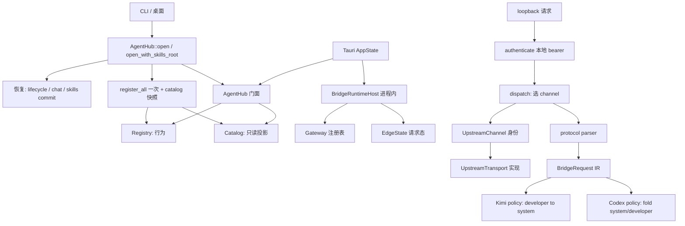

# 启动与 Gateway 内部 owner 拆分

> 状态：提案（Draft）。作者：maintainers。日期：2026-08-27。
>
> 本文是 [对象化与封装审查](objectization-encapsulation-audit.md) O-26–O-30 的落地设计：只拆 `AgentHub::open_with_skills_root` 组合根、Registry vs Catalog、`UpstreamChannel` 协议/分派/传输、Gateway/EdgeState 生命周期、以及 Responses 解析器 vs 供应商策略（Kimi `developer -> system`）。不是现行契约，不得按已实施理解。日常 PR 合入 GitHub `dev`。
>
> **冻结写入路径：** 不改 `switch` / `switch_with_guard` / `undo_switch`、票夹 `plan` / `bind` / `unbind`、`AdapterRouteService::plan`、补偿顺序、current 指针、锁。本系列是文件与角色边界。**不把 `local_bridge` 迁出进程**；[adapter-sidecar](../proposals/adapter-sidecar.md) 是另一份提案。

审查行号已部分过期。本文以当前源码为准：`lib.rs` 组合约 107–212；`UpstreamChannel` 在 `bridge/host/transport/mod.rs` 107–240；`Gateway` / `EdgeState` 在 `gateway.rs` 96–150 与 365–513；Kimi `developer -> system` 在 `protocol/responses.rs` 1716–1721。

## Overview

五个对象现在都是「一个入口叠了多件事」。调用方已经走稳定门面：CLI/桌面 `AgentHub::open` / `open_with_skills_root`，catalog 列表走 `hub.catalog()`，能力矩阵走 `hub.registry()`，本机转发 listener 走进程内 `BridgeRuntimeHost`（Tauri `AppState` 另持有，**不是** `open` 的产物）。缺的是门面背后的职责边界：启动恢复、依赖装配、Agent 行为 vs 目录投影、协议身份 vs 传输实现、socket 生命周期 vs 请求态、通用解析 vs 供应商字段改写。

本提案：**不改公开类型和方法名，不改 switch / bind / plan / 补偿 / current / 锁，不把 loopback 迁到 sidecar。** 内部按 Account / Backup 的方式用 **private `mod`** 切开 owner（不是新的 crate 可见类型）。五个对象不得一次拆完；Gateway 状态拆分放最后。



## Current baseline

| 对象 | 现状 | 必须保持的门面 |
| --- | --- | --- |
| O-26 `AgentHub` 启动 | `crates/agenthub-core/src/lib.rs`：`AgentHub` 25 个 `pub(crate)` 字段（54–94）。`open` 转调 `open_with_skills_root`（100–212）。同一函数内：解析/规范化 data-dir → `ensure_data_layout` → `Database::open` → `LifecycleCoordinator::interrupt_stale_running`（结果丢弃，从不自动重试危险步骤）→ `ChatRepo::interrupt_stale_running`（失败不当硬错误；`n>0` 才打 warn）→ **一次** `register_all()` → `AgentCatalogService::from_registry` → 构造 lifecycle / configuration / connections / agents / run / chat / providers / accounts / adapter_* / tickets / ticket_bind / backups / skills → `skills.recover_pending_commit()`（窄于 `bootstrap_assignments()`：启动不得隐式导入投影或改 assignment）→ settings / projects / visibility / usage / route_pools。Skills 默认 `~/.agents/skills`，与 data-dir 无关；测试走 `open_with_skills_root(..., Some(isolated))`。桌面 `src-tauri/src/state.rs` 调 `AgentHub::open(None)`，**另建** `BridgeRuntimeHost`；启动组合根不拥有 listener。 | **`pub`：** `open` / `open_with_skills_root`；`data_dir` / `registry` / `db` / `catalog` / 各 Service 访问器；`set_providers` / `set_accounts`（隔离测试）；`account_switch_preview` / `provider_switch_preview`（只读，不 snapshot/锁/切换）；`adapter_secret_resolver`；`run_agents`；skill market 搜索/安装；`install_runtime` / `install_agent*` / `upgrade_agent*` / `uninstall_agent*` / `repair_agent_detect*`；`with_install_log_hook`；`check_agent_updates`；`version`。字段保持 `pub(crate)`（O-01 已收口，本系列不改可见性）。 |
| O-27 Registry vs Catalog | 同一 `open` 持有 `registry: AdapterRegistry` 与 `catalog: AgentCatalogService`（127–128）。Registry：`adapters/registry.rs` 的 `HashMap<AgentId, Arc<dyn AgentAdapter>>` + `registration_order`；`register_all` 注册 8 个内置 adapter；`all()` 仍过滤 `AgentId::ALL`；catalog 用 `registered_agents()`。Catalog：`platform/agent_catalog/service.rs`，`from_registry` 把注册顺序转成 `AgentKey` 再 `from_keys`；只读描述符（key / 能力 DTO / 安装渠道 / schema 版本）。第三条路径：`shared_registry()` `OnceLock`（`supports_structured_stream` 热路径），与 `register_all` 同一集合，不是第二份产品表。CLI `hub.registry().matrix()`；桌面 `hub.catalog().list_owned()`（`src-tauri/src/commands/agent_catalog.rs`）。Doctor 能力矩阵来自 registry，不是 catalog。 | `AdapterRegistry` / `register_all` / `AgentCatalogService::{from_registry,from_keys,list,get}` / `hub.registry()` / `hub.catalog()` 不改名。catalog 继续按注册顺序，不走 `AgentId::ALL`。 |
| O-28 `UpstreamChannel` | `bridge/host/transport/mod.rs`：先 `from_protocol(BridgeUpstreamProtocol)` 映成枚举（107–123），再 `impl UpstreamTransport for UpstreamChannel` 把 `path` / `apply_auth` / `prepare` / `decode_kind` / `recovery` 转发到 `OpenAiChatTransport` / `AnthropicTransport` / `CodexTransport` / `GrokTransport`（186–240）。固有 `protocol()` / `path()` 生产路径 `#[allow(dead_code)]`，测试会用（`prepare_selects_upstream_path_by_channel`、bijection）。`passthrough_for` 是表面身份匹配，不是传输。`send_upstream`（252–418）与 `failover.rs` 的 `send_upstream_v2` 是 401/Grok 400 恢复，不是协议映射。调用：`dispatch.rs` `from_protocol` 后 `channel.prepare`；`stream.rs` `decode_kind`；`pair_policy.rs` 用枚举当身份。 | `UpstreamChannel` 变体与 `from_protocol` 1:1 表。`UpstreamTransport` 四实现的 path/auth/prepare/decode/recovery。`passthrough_for` 与 pair `identity_relay`。v1 `send_upstream` 无 index 时字节合同；v2 仅 `route_index` 存在时。 |
| O-29 Gateway / EdgeState | 生命周期已在 `lifecycle.rs`：`BridgeRuntimeHost::{start,stop,shutdown,status,record_upstream_outcome}`。共享表在 `gateway.rs`：`Gateway` = `Arc<Mutex<GatewayRegistry>>` + `AuthReloadCoordinator`（96–99）；`GatewayRegistry` = sockets / runtimes / `primary_port`（101–105）。`authenticate`（179–201）对每个 live local bearer 做恒时比较，未命中 401、命中但 draining 503。`switch_edge_for_model`（226–285）是**本次请求**跨 edge 挑选，调 `decide_model_switch`（审查 O-34，本系列不搬家）。`EdgeState`（125–150）同时有：URL/token/mapping/listed_models/route_index（配置）、`reqwest::Client` / `stopping` / `admission` / `force_shutdown`（运行）、`account_picker` / `continuations` / `grok_replay` / `observed_upstream` / `auth_reload`（请求与健康）。`from_spec`（365–404）在 start 时构造；`pick_v2`（417–464）做 indexed 选号。`authenticate` 返回 `EdgeState` clone（内部已是 `Arc`）。 | `BridgeRuntimeHost` 方法名不改。start 幂等、冲突 `ConflictingStart`、stop drain、host `shutdown` latch、跨 profile 互不阻塞。本地 bearer 仍是请求路径唯一身份。listener 仍在 Tauri 进程内 loopback。 |
| O-30 Protocol 解析 vs 供应商策略 | `bridge/protocol/responses.rs`（约 2158 行）。`parse_responses_request`（15–67）：校验 JSON、`input`、tools、stream；未知键进 `passthrough`；**解析阶段**调用 `grok_reasoning_effort` 把 xAI effort 写进 passthrough。`parse_input_items`（1741–1789）：function_call 相邻项收成一条 assistant；image / `item_reference` / 未知 type fail-closed `unsupported_*`。`parse_message_item` 把 `"developer"` 收成 `MessageRole::Developer`（1805），**解析器不折叠角色**。Kimi：`to_kimi_chat_request`（69–144）+ `append_kimi_messages`（1669–1739）把 `MessageRole::Developer` 渲成 Chat `"system"`（1716–1721）；`instructions` 也变成 system 消息。Grok Chat：`to_grok_chat_request` 复用 Kimi 形再加 `reasoning_effort`。Codex：`to_responses_request` / `fold_official_codex_system_items` 把 system+developer **折进 `instructions`**，线上拒绝 `role=system`。`translate_responses_request` 名仍是 parse + **Kimi** 渲染。 | `parse_responses_request` / `to_kimi_chat_request` / `to_grok_chat_request` / `to_responses_request` / `translate_responses_request` 不改名。IR 仍区分 `Developer` 与 `System`。Kimi Chat 仍 `developer -> system`。官方 Codex 仍不得发出 system/developer input item。 |

CLI 打开：`crates/agenthub-cli` → `AgentHub::open` / `open_with_skills_root`。桌面：`AppState::new` → `AgentHub::open(None)` + 独立 `BridgeRuntimeHost::new()`。测试：`crates/agenthub-core/src/tests.rs` `open_isolated_hub`。

## Goals & Non-Goals

**目标**

- 每个对象内部有明确 owner：启动恢复 / 依赖装配；Registry 行为 / Catalog 投影；协议身份 / 传输实现 / 分派 / 发送恢复；socket 注册表 / 请求态 Edge；外部协议 parser / IR / 供应商 policy。
- 公开类型仍是 `AgentHub`、`AdapterRegistry`、`AgentCatalogService`、`UpstreamChannel`、`BridgeRuntimeHost`、`parse_responses_request` / `to_kimi_chat_request`。CLI/桌面调用点不改名。
- `local_bridge` 仍在桌面进程内；本系列不引入 sidecar、跨进程 IPC 或 schema lease。
- 第一刀可独立合入 `dev`，且只动一个对象的内部文件。

**非目标**

- 不改 `switch` / `switch_with_guard` / `undo_switch` / 补偿顺序 / 错误码。
- 不改票夹 `plan` / `bind` / `unbind`、`AdapterRouteService::plan`、`activate_*`、current 指针、锁顺序（含 `AdapterSagaCoordinator` / `LiveWriteAuthority` / `AgentWriteLock`）。
- 不把 `local_bridge` 迁出进程；不实施 [adapter-sidecar](../proposals/adapter-sidecar.md)；不把 `BridgeRuntimeHost` 塞进 `AgentHub::open`。
- 不把五个对象一次拆完；不把 O-29 放进第一刀。
- 不重做 O-11–O-14 Service 拆分、O-15–O-19 读模型、O-31–O-34 Usage / `decide_model_switch`。本系列 **不搬** `decide_model_switch`。
- 不开国产登录，不做 OAuth 转 API，不做凭据落盘加密。
- 不改 `overview.md` / `core-runtime.md` 的现行进程内描述；本页升格前不把审查表 O-26–O-30 标成已处理。
- 不把测试搬进生产文件；不新造 crate 可见的 owner 类型。
- 不改 `audit.md`、`proposals/README.md`。

## Proposed Design

### 1. 每个对象内部的 owner

子模块一律 private。公开方法仍挂在现有门面上。需要给兄弟模块或 `tests.rs` 看见的项用 `pub(super)`，由 `mod.rs` **显式 re-export**。不要新造 crate 可见的 owner 类型。

#### `AgentHub` 启动组合（O-26；PR4，无文件依赖）

| Owner | 职责 | 现有落点 | PR4 文件 |
| --- | --- | --- | --- |
| 门面 | `AgentHub` 字段、访问器、install/upgrade/uninstall/repair、只读 switch preview、doctor、`set_providers` / `set_accounts` | `lib.rs` 结构体 + `impl` 其余方法 | **仍在** `lib.rs`。禁止把 install 生命周期搬进 startup |
| 路径与布局 | `resolve_data_dir` / `normalize_data_dir` / `ensure_data_layout`；相对路径在 lifecycle 使用前冻结为绝对 | 107–112；测试 `agent_hub_open_freezes_relative_data_dir_before_lifecycle_use` | `startup.rs` 开头 |
| 存储打开 | `Database::open`；migrate 日志归 STORAGE | 113–114 | `startup.rs` |
| 崩溃恢复 | lifecycle stale running（不自动重试）；chat placeholder → cancelled（失败不硬失败）；**skills** `recover_pending_commit` 在 `SkillService::new` 之后、对外暴露之前 | 115–126、168–171 | `startup.rs` 内 private `recover_*`。顺序不得重排 |
| Agent 来源装配 | **一次** `register_all` + `from_registry`。禁止第二次 `register_all`（agents/run 只 clone） | 127–128、133–135 | 同文件一步；O-27 不改这条调用 |
| 服务装配 | 其余 `*Service::new` / `from_parts` / `with_live` | 129–177 | `startup.rs`。字段写入顺序与现 `Ok(Self {…})` 一致 |

`open` 继续只转调 `open_with_skills_root`。Skills 默认根与 data-dir 解耦的合同不变。启动 **不** 创建 `BridgeRuntimeHost`。

#### Registry vs Catalog（O-27；PR2，注释-only）

按**现有文件**贴标签，不按愿望搬家。不要重做 catalog 的 `from_registry` / 注册顺序测试。

| 现有文件 | 标签 | 说明 |
| --- | --- | --- |
| `adapters/registry.rs` | 行为 owner | detect / install / run / `capability` / `require`。`register_all` 是内置集合真源。`shared_registry()` 只给能力热路径，必须与 `register_all()` 同集。 |
| `platform/agent_catalog/service.rs` | 只读投影 | 描述符列表、`AgentKey`、安装渠道、schema 版本。`from_registry` 是 **唯一** 从 live registry 生成 catalog 的入口。打开后 catalog 是快照，不是可变双写。 |
| `lib.rs` / `startup.rs` 里那一次 `from_registry` | 单一装配 | PR2 **不改** 此文件。O-26 抽出后仍是同一步。 |
| CLI `registry().matrix()` / Tauri `catalog().list_owned()` | 各自合法 | 矩阵与执行走 registry；产品目录走 catalog。禁止让 catalog 执行 detect/install，禁止让 registry 成为 UI 目录真源。 |

PR2 只写文件头注释，不改 impl 所在文件。

#### `UpstreamChannel`（O-28；PR3）

| Owner | 职责 | 现有落点 | PR3 |
| --- | --- | --- | --- |
| 协议身份 | `BridgeUpstreamProtocol` ↔ `UpstreamChannel` 1:1；`passthrough_for` 表面匹配 | `from_protocol`、`passthrough_for`、测试用 `protocol()` | 枚举留下。`from_protocol` 是唯一映射。`protocol()` 可留作逆映射给测试 |
| 传输实现 | path / auth / prepare / decode / recovery | 四个 `*Transport` struct + `UpstreamTransport` trait | **唯一** 实现 owner。删除 `impl UpstreamTransport for UpstreamChannel` |
| 解析一次 | host 拿到已解析 transport，不再每方法 match 转发 | 不存在；今天每次 `channel.prepare` 都再 match | `UpstreamChannel::transport(self) -> &'static dyn UpstreamTransport`（一个 match） |
| 分派 | 鉴权后选 surface、选 channel、prepare、forward | `dispatch.rs` | 调用改为 `channel.transport()` 一次，把 trait 对象传给 send。不改选边/选号 |
| 发送恢复 | 401 reload、Grok reasoning 400 strip、v2 indexed failover | `send_upstream`、`failover.rs` | 仍按 `recovery()` 策略。不改 FSM |

`pair_policy.rs` 继续吃 `UpstreamChannel` 身份，不吃 transport trait。`stream.rs` decode 走 `channel.transport().decode_kind()`。

#### Gateway / EdgeState（O-29；PR5，最后）

| Owner | 放哪 | 不放哪 |
| --- | --- | --- |
| Listener / start-stop | 已有 `lifecycle.rs` `BridgeRuntimeHost` | 不把 start/stop 搬回 `gateway.rs`；不迁出进程 |
| Socket + runtime 表 | `gateway.rs` → private `gateway/{mod,registry}.rs`：`GatewayRegistry` / `SocketInstance` / `EdgeRuntime` 的 spec/port/lifecycle/`stop_completion` | 请求体解析、供应商 Chat 渲染 |
| 本地身份 | `authenticate` + `presented_local_token` + 恒时比较 | 不改 401/503 分流；不泄露 path 是否会 404 |
| Edge 配置 | `EdgeState` 里 start 后只读：profile / local_token / url / mapping / listed_models / protocol flags / route_index | 不在请求路径改 spec |
| 请求态 | stopping / admission / picker / continuations / grok_replay / observed_upstream / auth_reload | 不与 socket HashMap 放进同一个「什么都有」的新类型 |
| 请求级切边 | `Gateway::switch_edge_for_model` 仍组装 candidate 后调现网 `decide_model_switch` | **不搬** `decide_model_switch`（O-34）；不是 `ProviderService::switch` |

`authenticate` 仍返回可 clone 的 `EdgeState`（内部 `Arc`）。禁止为了「干净」改成持锁跨越整个请求。

#### Protocol 解析 vs 供应商策略（O-30；PR1 第一刀）

| Owner | 文件 | 放什么 |
| --- | --- | --- |
| 门面 / re-export | `protocol/responses.rs` 或 `responses/mod.rs` | 现有 `pub fn` 名。`#[cfg(test)]` 不进生产文件 |
| 外部协议 parser | `parse.rs`（private） | `parse_responses_request`、`parse_input_items`、`parse_message_item`、tools/choice、unsupported 拒绝。`"developer"` → `MessageRole::Developer`，**禁止**在 parser 里改成 `System` |
| IR | 已有 `bridge/types.rs` `BridgeRequest` / `MessageRole` | 不把 Kimi/Codex 字段改写写进 IR |
| Kimi transport policy | `kimi.rs`（private） | `to_kimi_chat_request`、`append_kimi_messages`。**锁定：** `MessageRole::Developer` 渲 `"system"`；`instructions` → 一条 system；stream 时 `stream_options.include_usage` |
| Grok policy | 同 `kimi.rs` 或 `grok.rs` | `to_grok_chat_request` 复用 Kimi Chat 形 + `reasoning_effort`。`grok_reasoning_effort` 若挪出 parser，必须仍让 Kimi 渲染不含该键（`reasoning_is_dropped_on_kimi_chat_and_mapped_for_grok`） |
| Codex policy | `codex.rs`（private） | `to_responses_request`、`fold_official_codex_system_items`、`prepare_official_codex_request`。system/developer **折进 instructions**，不得出现在 input items |

`translate_responses_request` 保持签名：内部 = parser + Kimi policy。OpenAiChat transport 继续调 `to_kimi_chat_request`，本刀不改 `openai_chat.rs`。

**`mod.rs` 至少 re-export（否则 `protocol/tests.rs` 编不过）：** 今日 `responses::{…}` 已 re-export 的全部 `pub` / `pub(crate)` 符号，含 `to_kimi_chat_request`、`to_grok_chat_request`、`to_responses_request`、`prepare_official_codex_request`、`apply_official_codex_model`、`is_leftover_bridge_model`。缺一项按 PR1 失败处理。

语义不变：

- parser：无 `input` → `invalid_request`；image → `unsupported_image_input`；并行 function_call 在 IR 里合成一条 assistant。
- Kimi：developer → system；未知 Chat 选项不盲转发。
- Codex：官方 Responses 400 「System messages are not allowed」——测试 `assert_no_system_or_developer_items`。
- 不得把 Kimi 的 developer→system 抄进 parser，也不得把 Codex 折叠抄进 Kimi。

### 2. 对外门面方法列表不变

- 类型名：`AgentHub`、`AdapterRegistry`、`AgentCatalogService`、`UpstreamChannel`、`BridgeRuntimeHost`、`BridgeHostError`、`BridgeRequest`。
- `AgentHub::open` / `open_with_skills_root` / `catalog` / `registry` 不改。
- CLI 子命令与 Tauri invoke 不改名。`AppState` 仍自己持有 `BridgeRuntimeHost`。
- `parse_responses_request` / `to_kimi_chat_request` / `translate_responses_request` 不改名。
- 内部 owner 不是新的公开 API。`UpstreamChannel::transport` 为 `pub(super)`。

### 3. 写入路径、current、锁、进程边界

- 产品写入仍只经 `plan` / `bind` / `unbind`。本系列零 diff。
- current / `agent_active_bindings` 仍只由 `ConnectionService` 落盘。
- 锁顺序、`snapshot_with_guard`、补偿顺序本系列零 diff。
- `local_bridge` listener、admission、drain 仍在 Tauri 进程内。本系列不改 socket bind 策略，不引入 sidecar。
- `Gateway::switch_edge_for_model` 不是 Provider `switch`，也不走票夹 bind。

### 4. 第一刀可落地的文件范围

只拆 Responses 解析 vs 供应商策略。不动 `lib.rs`、不动 `transport/mod.rs` 转发层、不动 Gateway 字段、不动 `openai_chat.rs`。

- `bridge/protocol/responses.rs` → `responses/{mod,parse,kimi,codex}.rs`（Grok 可与 kimi 同文件）
- 保留 `protocol/tests.rs`；禁止把测试写进生产模块
- `protocol/mod.rs` 的 `pub use responses::…` 不改名
- `mod.rs` 按 §1 表 re-export；缺一项就按 PR1 失败处理

不抽「只加注释」的 PR0 来代替 O-30 文件边界。O-27 的注释-only 是 **O-27 的完整工作**，不是 O-30 的替身。

## Key Decisions

| 决定 | 理由 |
| --- | --- |
| 公开门面类型和方法名冻结 | CLI/桌面按 `open` / `catalog()` / `registry()` / `BridgeRuntimeHost` 接线。 |
| 不改 switch / bind / plan / 补偿 / current / 锁 | 本系列是文件边界，不是行为迁移。 |
| `local_bridge` 留在进程内 | sidecar 是另一提案；当前 listener 由 Tauri `AppState` 托管。 |
| `open` 不拥有 `BridgeRuntimeHost` | 桌面可在托盘继续听；CLI 打开 hub 不必起 socket。 |
| Registry = 行为，Catalog = 打开时只读快照 | 两个入口合法；禁止双写。`from_registry` 是唯一装配。 |
| `shared_registry()` 不是第二份产品表 | 与 `register_all` 同集的能力热路径。 |
| 删除 `impl UpstreamTransport for UpstreamChannel` | 协议身份与传输实现各一个 owner；只留一次 `transport()` match。 |
| `authenticate` 仍 clone `EdgeState` | 请求路径不持 registry 锁。 |
| 不搬 `decide_model_switch` | O-34 不在本系列；Gateway 只继续调用。 |
| Parser 保留 `MessageRole::Developer`；Kimi 渲染才 `developer -> system`；Codex 才折进 instructions | 改解析器会同时打中三条供应商路径。 |
| 第一刀只拆 O-30；O-29 最后 | parser/policy 合同局部、测试独立；Gateway 跨 start/stop/鉴权/选号。 |
| 产品范围外：凭据落盘加密、国产 OAuth 开边、OAuth 转 API | 项目红线。 |
| 测试保持 `*/tests.rs`；拆目录必须 re-export | 与 Backup 系列相同。 |

## Alternatives Considered

**A. 把启动恢复做成独立 crate / 公开 `HubBootstrap` 类型**

调用方要改名。拒绝。private `startup.rs` 足够。

**B. 第一刀就拆 Gateway 或把 loopback 迁到 sidecar**

Gateway 同时含 socket 表、鉴权、请求切边；sidecar 是另一提案且改进程边界。选 Responses 文件拆分做第一刀。

**C. 把 Registry 与 Catalog 合成一个对象**

行为与目录投影的调用方不同（CLI 矩阵 vs UI 列表）。拒绝合并；标唯一装配入口。

**D. 保留 `impl UpstreamTransport for UpstreamChannel`，只删 dead `protocol()` / `path()`**

测试已用这两函数锁 1:1 表；真正重复的是每方法再 match。拒绝只删 accessor。

**E. PR0 只给 O-26–O-30 加注释**

O-27 可以是注释-only（问题就是双入口未标注）。O-26/O-28/O-30/O-29 注释解决不了单文件多角色。拒绝用注释-only 当本系列第一刀。

## Risks

| 风险 | 严重度 | 缓解 |
| --- | --- | --- |
| 拆 `responses/` 后 `protocol/tests.rs` 看不见 `pub(crate)` helper | 高 | `mod.rs` 强制 re-export；PR1 点名测试必须编过并跑过 |
| 有人在 parser 里把 developer 收成 System | 高 | 禁止写入 PR1；Kimi 测试锁渲染；Codex 测试锁 input 无该 role |
| PR3 改 `passthrough_for` / pair 身份 | 高 | 枚举身份不动；只删 trait-on-enum 转发 |
| PR4 重排 recover 顺序或启动时 `bootstrap_assignments` | 高 | 验收：与现网同一顺序；skills 仍只 `recover_pending_commit` |
| PR5 让 `authenticate` 持锁过完整请求 | 高 | clone EdgeState 合同；本系列不碰 persist saga |
| 把本页当成现行契约或当成 sidecar 开工单 | 中 | `status: proposed`；明确 adapter-sidecar 不在范围 |
| 与搬 `decide_model_switch` 的 PR 同时改 `gateway.rs` | 中 | 本系列 PR5 不搬该函数；文件重叠时串行 |

## PR Plan

合入目标：GitHub `dev`。每 PR 独立可回滚。禁止单 PR 拆完五个对象。

风险顺序建议 O-30 → O-27 → O-28 → O-26 → O-29。**编号按落地顺序。** PR2/PR3/PR4 **无文件依赖**；PR5 不依赖 PR3 的 API（dispatch 仍有 `UpstreamChannel`）。不要和搬 `decide_model_switch` 的 PR 同时改 `gateway.rs`。

### PR1 — Responses parser vs 供应商 policy（O-30，第一刀）

- **标题：** `refactor(bridge): split Responses parser from Kimi/Codex vendor policy`
- **依赖：** 无（本设计合入后即可）
- **文件：** `crates/agenthub-core/src/bridge/protocol/responses.rs` → `responses/{mod,parse,kimi,codex}.rs`；保留 `protocol/tests.rs`；`protocol/mod.rs` re-export 不改名
- **描述：** 公开函数名全部保留。parser 继续产出 `MessageRole::Developer`。Kimi `append_kimi_messages` 仍把 developer 渲成 `"system"`。Codex 仍折进 instructions。不改 `openai_chat.rs`、不改 Gateway、不改 `open`。若移动 `grok_reasoning_effort`，Kimi 渲染必须仍不含该键。
- **测试命令：**

```text
cargo test -p agenthub-core --locked responses_request_maps_text_tools_options_and_unicode
cargo test -p agenthub-core --locked reasoning_is_dropped_on_kimi_chat_and_mapped_for_grok
cargo test -p agenthub-core --locked historical_parallel_function_calls_become_one_assistant_tool_call_message
cargo test -p agenthub-core --locked to_responses_request_folds_chat_developer_after_user_into_instructions
cargo test -p agenthub-core --locked prepare_official_codex_request_strips_system_items_into_existing_instructions
cargo test -p agenthub-core --locked official_codex_chat_prepare_folds_developer_and_forces_store_false
cargo test -p agenthub-core --locked -- bridge::protocol::
```

PR1 必须补一条（或锁住已有等价断言）：解析后 IR 为 `Developer`，`to_kimi_chat_request` 对应消息 `"role": "system"`。禁止用 parser 折叠来「顺便」满足 Kimi。

### PR2 — Registry vs Catalog 注释（O-27，无行为）

- **标题：** `docs(core): label adapter registry vs catalog owners without moving files`
- **依赖：** 无
- **文件：** `adapters/registry.rs`、`platform/agent_catalog/service.rs` 文件头 only
- **描述：** 按「现有文件」表标注。写明 catalog 是 `from_registry` 快照；`shared_registry()` 与 `register_all` 同集。不改 `open`、不改 `hub.catalog()` / `hub.registry()`。
- **测试命令：**

```text
cargo test -p agenthub-core --locked from_registry_follows_registration_order_not_agent_id_all
cargo test -p agenthub-core --locked from_keys_explicit_order_ignores_agent_id_all
cargo test -p agenthub-core --locked supports_structured_stream_uses_shared_registry
cargo test -p agenthub-core --locked agent_hub_open_doctor_has_all_runtimes_and_agents
```

### PR3 — UpstreamChannel 去掉传输转发层（O-28）

- **标题：** `refactor(bridge): resolve UpstreamTransport once instead of enum forwarding`
- **依赖：** 无技术依赖。勿与 PR5 同时改 `dispatch.rs` 调用习惯。
- **文件：** `bridge/host/transport/mod.rs`；`dispatch.rs` / `failover.rs` / `stream.rs` 的 prepare/decode/send 调用点；`transport/tests.rs`
- **描述：** 增加 `UpstreamChannel::transport()`。删除 `impl UpstreamTransport for UpstreamChannel`。`from_protocol` / `passthrough_for` / pair 身份不动。v1 `send_upstream` 无 index 字节合同。测试改为经 `transport()` 读 path/recovery。
- **测试命令：**

```text
cargo test -p agenthub-core --locked prepare_selects_upstream_path_by_channel
cargo test -p agenthub-core --locked passthrough_is_declared_only_for_matching_wire_surfaces
cargo test -p agenthub-core --locked flag_off_keeps_responses_identity_relay_for_codex_and_grok
cargo test -p agenthub-core --locked -- bridge::host::transport::
cargo test -p agenthub-core --locked chat_surface_relays_openai_chat_without_protocol_conversion
cargo test -p agenthub-core --locked anthropic_protocol_uses_messages_and_x_api_key
```

### PR4 — AgentHub 启动组合（O-26）

- **标题：** `refactor(core): extract AgentHub startup composition behind open()`
- **依赖：** 无。建议不要和 PR2 抢 `lib.rs` 注释；PR2 已避开 `lib.rs`。
- **文件：** 新 `crates/agenthub-core/src/startup.rs`（或 `startup/{mod,recover}.rs`）；`lib.rs` 的 `open` / `open_with_skills_root` 改为调用它；`AgentHub` 类型与其余 impl **留在** `lib.rs`
- **描述：** 恢复顺序与服务构造顺序逐字保持。`register_all` 仍一次。skills 仍只 `recover_pending_commit`。不创建 `BridgeRuntimeHost`。不改访问器、不改 install/upgrade。
- **测试命令：**

```text
cargo test -p agenthub-core --locked agent_hub_open
cargo test -p agenthub-core --locked interrupt_stale_running
cargo test -p agenthub-core --locked recover_pending_commit
cargo test -p agenthub-core --locked legacy_repair_facade_keeps_detect_result_in_outcome
```

`agent_hub_open` 覆盖 doctor 与相对 data-dir 冻结。`interrupt_stale_running` 同时覆盖 lifecycle 与 chat（Cargo 过滤是子串）。不要用裸 `open`（误伤大量 `Database::open` / `AdapterRegistry` 测试）。

### PR5 — Gateway / EdgeState 内部模块（O-29，最后）

- **标题：** `refactor(bridge): split Gateway registry from edge request state`
- **依赖：** 无 API 依赖。不要与搬 `decide_model_switch` 的 PR 同时改 `gateway.rs`。
- **文件：** `bridge/host/gateway.rs` → `gateway/{mod,registry,edge}.rs`（名称可调）；`lifecycle.rs` 继续拥有 start/stop；`authenticate` 仍返回 `EdgeState` clone
- **描述：** 公开 `BridgeRuntimeHost` 方法名不改。start 幂等、drain、shutdown latch、跨 profile 不阻塞保持。不改 local bearer 语义。不把 host 移出进程。不搬 `decide_model_switch`。
- **测试命令：**

```text
cargo test -p agenthub-core --locked health_requires_the_local_bearer_token
cargo test -p agenthub-core --locked duplicate_start_is_idempotent_and_stop_releases_port
cargo test -p agenthub-core --locked stop_drains_an_inflight_request_before_returning
cargo test -p agenthub-core --locked stopping_one_profile_does_not_block_starting_or_stopping_another
cargo test -p agenthub-core --locked shutdown_latches_the_host_and_exposes_stopped_state
cargo test -p agenthub-core --locked profile_admission_rejects_overload_without_affecting_a_second_profile
```

## Open Questions

无产品阻塞。实现选择已写入 Key Decisions：O-30 类型家园与 re-export；Kimi `developer -> system` 只在 policy；`transport()` 一次解析；`open` 不拥有 host；O-27 注释-only；O-29 最后且不搬 O-34。

## References

- [对象化与封装审查](objectization-encapsulation-audit.md) — O-26、O-27、O-28、O-29、O-30
- [Service 内部 owner 拆分](service-internal-owners.md) — 同系列写法；本页不重做 O-11–O-14
- [模块化与边界收紧](../proposals/modularity.md) — D3
- [Adapter sidecar](../proposals/adapter-sidecar.md) — **另一提案**，本页不实施
- [Core 与 Runtime](core-runtime.md)
- [架构总览](overview.md)（本提案不改其当前态表述）
- [产品边界](../decisions/product-boundaries.md)
- 源码：`crates/agenthub-core/src/lib.rs`、`adapters/registry.rs`、`platform/agent_catalog/service.rs`、`bridge/host/transport/mod.rs`、`bridge/host/dispatch.rs`、`bridge/host/gateway.rs`、`bridge/host/lifecycle.rs`、`bridge/protocol/responses.rs`、`src-tauri/src/state.rs`
