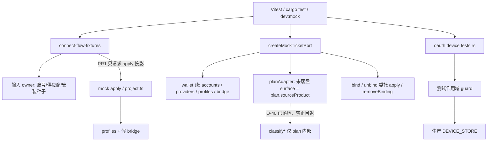

# 测试 fixture 与 OAuth store owner

> 状态：提案（Draft）。作者：maintainers。日期：2026-08-27。
>
> 本文是 [模块化与边界收紧](../proposals/modularity.md) 在测试辅助层的落地设计：只拆 O-41 连接流程 fixture、O-42 mock Ticket resolver、O-44 设备码测试 store。不是现行契约，不得按已实施理解。日常 PR 合入 GitHub `dev`。合入 dest/`dev` 后仍不改 `plan` / `bind` / `apply` 生产语义。

## Overview

三处测试辅助现在各自维护一份「绑定已经成功」或「会话已经在跑」的状态，但 owner 不在对应的生产路径上。

- O-41：`connect-flow-fixtures.ts` 的 `seedTicketWalletBindingProfiles` 手写完整 `AdapterProfile`（`ruleId` / `route` / 端口 / endpoint / `running`）和生成供应商，绕过 mock `plan`/`apply`。这是第二套绑定成功表。
- O-42：`MockTicketSourceResolver` 同时读 accounts / providers / profiles / 桥状态，并直接调 `planAdapter` / `applyAdapter` / `removeBinding`。测试 double 穿透了 Ticket port。
- O-44：`oauth/device/tests.rs` 用唯一字符串往进程级 `DEVICE_STORE` 插入会话，末尾手工 `remove`。panic、早退或并行时清理不一定发生。

O-40 **已经落地，本系列不得回退**：mock 运行时（ticket wallet、adapter source-ticket）从来源产品读 `plan` 的 `sourceProduct`；`classifyAccountSource` / `classifyProviderSource` 只给 mock `plan()` 内部和 `source-classify-contract.test.ts`。

本提案：**不改** 生产 `plan` / `bind` / `apply` / `unbind` 语义，**不改** `isBindSuccessForAgent`，**不重写** golden / 路线矩阵整表绑定成功态。内部按角色标 owner。第一刀只让 fixture 输入走 apply 投影，不得把整表成功态搬进新 JSON。

## Current baseline

| 对象 | 现状 | 必须保持 |
| --- | --- | --- |
| O-40 来源产品（已处理，冻结） | 共用 `src/lib/backend/contracts/source-classify-contract.json`。mock `plan()` 在 `adapter/source-product.ts` 调 classify，把 `sourceProduct` 挂到 plan 上。`ticket.ts` 未落盘 surface 走 `resolver.planAdapter` → `sourceProductOfPlan`。`adapter/source-ticket.ts` 用 plan 身份做 join key。`source-classify.ts` 文件头写明：runtime 不得再调 `classify*`。 | 运行时不得自跑 `classify*`。classify helper 仍只给 plan 内部和 lockstep 测试。core `classify.rs` / `AdapterRouteService::plan()` 不改。 |
| O-41 连接流程 fixture | `src/dev/mocks/connect-flow-fixtures.ts`。输入构造：`connectFlowKimiMembershipProvider` / `Anthropic` / `Unknown` / `ClaudeOauthAccount` / `KimiMembershipStaleAccount`（后者 `as Account` 写 `extra.surface`）。`seedConnectFlowAdapterFixtures` 默认写入 Kimi + Anthropic + 失效号，可选 unknown / oauth / `markPiInstalled`。`seedBindings: true` 时 `seedTicketWalletBindingProfiles`（约 103–185 行）手写：`claude-kimi-adapter-*` / `codex-kimi-bridge-*` 生成供应商、`native_endpoint` + `kimi-membership-to-claude-v1`、`local_bridge` + `kimi-membership-to-codex-v1` + `localPort: 32123`、bridge `running` + `http://127.0.0.1:32123/v1`，再 `seedMockAdapterProfiles`。`createBackend()` 仅在非 Vitest 的 `pnpm dev:mock` 里 `seedBindings: true`；Vitest 空池，测试自行 seed。`DEV_MOCK_KNOWN_SEED_IDS` 在 `golden-lookup.ts` 为避循环复制了种子 id。 | 种子仍是脱敏输入（`must-not-leak`）。Vitest `createBackend()` 空池。已知种子 plan 必须命中 golden。演示钱包仍要能看到 Kimi → Claude reshape + Codex bridge，但观察结果不得再由 fixture 手写成功表提供。 |
| O-42 mock Ticket resolver | `src/dev/mocks/ticket.ts:40-52`：`MockTicketSourceResolver` = `listAccounts` / `listProviders` / `listProfiles` / `getBridgeStatus` / `planAdapter` / 可选 `applyAdapter` / `removeBinding`。`create-backend.ts:88-96` 把 mock 账户池、供应商池、adapter profiles、bridge、`adapter.plan` / `adapter.apply` / `removeMockAdapterBinding` 一次性注入。`buildWallet` 用四套 list 派生 tickets/bindings；未落盘 surface 调 `planAdapter`（O-40）。`TicketPort.plan` / `bind` / `unbind` 再调同一 resolver 的 plan/apply/remove。`requireTicketSource` 额外直调 `getMockAccountById` / `getMockProviderById`，绕过 resolver。`ticket.test.ts` 的 `ticketResolver()` 为钱包单测手写 plan stub。 | 产品写入仍是 `TicketPort.plan` / `bind` / `unbind`（`src/lib/api/tickets`）。bind 成功仍是返回的 active binding（`isBindSuccessForAgent` 未改）。mock bind 仍委托 adapter `plan`+`apply`，不得在 ticket 里复制路线决策。 |
| O-44 设备码测试 store | 生产：`crates/agenthub-core/src/oauth/device.rs` 进程级 `DEVICE_STORE: OnceLock<Mutex<HashMap<String, DeviceSession>>>`，`store()` 私有。`poll_device_oauth_with` 持锁、`purge_locked`、`poll_claim` / `poll_generation`、Complete 的 completion TTL。测试：`device/tests.rs`。纯函数/本地 map 已隔离：`parse_device_http_response*`、`expired_and_terminal_device_sessions_are_cleaned_without_touching_active`（本地 `HashMap` + `purge_locked`）、`failed_device_completion_scrubs_tokens_and_cannot_be_replayed`。污染点：`insert_session`（31–36）写全局；`concurrent_poll_claim_does_not_issue_a_second_request`（121–167）、`superseded_poll_response_cannot_revert_complete_session_or_clear_tokens`（168–208）、`complete_session_survives_device_code_expiry_until_completion_ttl`（210–253）末尾 `store().lock().remove(state)`；`complete_session_is_purged_after_completion_ttl` 直接 `purge_locked(&mut store().lock(), None)`。 | 生产 GUI 仍是进程级 store（start 然后 poll）。`poll_claim` 互斥、supersede 不得回退 Complete、Complete 在 device expiry 后仍可读直到 completion TTL，语义不改。不把 PKCE `SessionStore` 与 `DEVICE_STORE` 合成一个生产对象（那是 O-73）。 |

审查核实表（[audit](objectization-encapsulation-audit.md)）对这三条仍是「暂缓」：O-41「整表绑定成功态重写不做」；O-42「resolver 仍可读 accounts/providers/profiles 并调 plan/apply；本刀不扩、不重写绑定」——那是 O-40 那一刀的范围，不是本系列的永久禁令。本页升格前不把 O-41/O-42/O-44 标成已处理。

## Goals & Non-Goals

**目标**

- 每个测试辅助角色一个 owner：fixture 只描述输入；绑定观察来自 mock apply 投影；wallet 读取来源池；ticket 写入委托 adapter；设备码测试会话有作用域清理。
- O-40 分类边界保持：runtime 读 plan；classify helper 仍是 plan-internal。
- 公开 `TicketPort` 方法名与 mock/Tauri 行为锁步；CLI/桌面 invoke 不改名。
- 第一刀可独立合入 `dev`，且不重写整表绑定成功态。

**非目标**

- 不改生产 `AdapterRouteService::plan()` / `AdapterApplyService` / `TicketBindService` 的 `plan` / `bind` / `apply` / `unbind` 语义、错误码或补偿。
- 不重写 `adapter-capability-contract.json`、`project.ts` 的 `BY_RULE_ID`、路线兼容表、`isBindSuccessForAgent`，也不在本系列第一刀把「所有成功绑定」收成一张新 fixture 表。
- 不回退 O-40：禁止 ticket / source-ticket 再调 `classifyAccountSource` / `classifyProviderSource`。
- 不改 `TicketPort` 公开方法；不把 mock resolver 扩成第三套分类器。
- 不做 O-59（core 测试 fixture builder）、O-68/O-73（生产 OAuth 入口/DeviceSessionStore 注入）、O-20（mock Agent 模块级状态）。
- 不开国产登录，不做 OAuth 转 API，不做凭据落盘加密。
- 不把三个对象一次拆完；不在本设计 PR 改 `audit.md` / `proposals/README.md` / 生产源码。
- 不改 `overview.md` 的现行描述；本页升格前审查表保持暂缓。
- 测试不与生产写进同一文件；O-44 的 guard 可以是 `tests.rs` 内类型，或 `device.rs` 的 `#[cfg(test)]` helper，实现仍在 `*/tests.rs`。

## Proposed Design



### 1. 每个对象内部的 owner

#### 连接流程 fixture（O-41；第一刀）

| Owner | 职责 | 现有落点 | 本系列 |
| --- | --- | --- | --- |
| 输入种子 | 脱敏 Provider/Account 行、安装标记、稳定 id（`CONNECT_FLOW_FIXTURE_IDS`） | `connectFlow*Provider` / `*Account`；`seedConnectFlowAdapterFixtures` 默认写入 | 保留。fixture 只声明「有这些来源」。 |
| 演示绑定投影 | Kimi → Claude reshape、Kimi → Codex 本机路由，供 `dev:mock` 钱包展示 | `seedTicketWalletBindingProfiles` 手写 profile / ruleId / 端口 / running | **迁走。** 改为请求 mock apply 投影（同步 `buildPlan` + `materializeApply` 写入已有 adapter state）。fixture 不得再出现 `ruleId:` / `localPort: 32123` / 手写 `AdapterBridgeRuntimeStatus`。 |
| 绑定成功表 | 路线矩阵格子、golden expect、`BY_RULE_ID` 物化、`isBindSuccessForAgent` | `adapter-capability-contract.json`、`adapter/project.ts`、`contracts/ticket.ts` | **本系列不重写、不搬表。** 钱包测试可以继续断言 reshape+bridge 是 apply 之后的观察，不是 fixture 真源。 |
| 查表种子 id | golden 已知种子必须命中 | `DEV_MOCK_KNOWN_SEED_IDS` 与 fixture id 重复 | 第一刀不合并循环；不借机改 golden。 |

`createBackend()` 仍是同步工厂。因此第一刀 **不得** 把 `seedBindings` 改成 `await adapter.apply()`（那会逼 `CreateBackend` 变 async）。同步 helper 必须复用现有 `buildPlan` + `materializeApply` / adapter state 写入，与 `adapter.apply` 同一投影，只跳过 `delay()`。

语义不变：

- Vitest 工厂空池；测试显式 `seedConnectFlowAdapterFixtures`。
- `dev:mock` 仍可在工厂里 `seedBindings: true`，但绑定行来自 apply 投影。
- 输入仍不含真实密钥；plan/apply/钱包 JSON 不得泄漏 `must-not-leak`。
- `as Account` 写 `extra.surface` 是输入上的已落盘 surface，不是绑定成功表。第一刀不强制删除。

#### mock Ticket resolver（O-42；第二刀）

按**角色**切开，不是按「整个 wallet 只许一个对象」。resolver 仍可读账户/供应商/profile 并调 plan/apply——那是委托，不是第二套 bind。本刀收窄接口，不重写绑定。

| Owner | 职责 | 现有落点 | PR2 |
| --- | --- | --- | --- |
| 钱包读模型 | list 账户/供应商/profile、bridge 快照；派生 tickets / bindings / surfaceGroups | `buildWallet` + 四个 list/get | `MockTicketWalletSources`（private 类型或等价拆分）。`createMockTicketPort` 仍组装。 |
| 来源产品（O-40） | 未落盘 surface 只来自 `plan.sourceProduct` | `surfaceFromPlan` → `planAdapter` | **保持。** 可把 `planAdapter` 留在窄的 adapter 角色上，但 runtime 仍禁止 `classify*`。 |
| 产品写入 | `TicketPort.plan` / `bind` / `unbind` | 同一 resolver 的 `planAdapter` / `applyAdapter` / `removeBinding` | `MockTicketAdapter`：`plan` 必选；`apply` / `removeBinding` 仍可选（未接线则现有 `unsupported`）。 |
| 源存在性 | bind/plan 前账户或供应商必须在池里 | `requireTicketSource` 直调模块级 `getMock*ById` | 改走 wallet sources 的 list/get。禁止再绕过注入的 double。 |

`ticket.test.ts` 的 `ticketResolver()` 只实现读模型 + 一个返回 `sourceProduct` 的 `planAdapter` stub 时，不必再塞 `applyAdapter`。`create-backend.ts` 继续把真实 mock adapter 的 plan/apply/remove 接上。

禁止：

- 在 ticket 内复制 `project.ts` / golden expect。
- 把 `adapterRouteToBinding` 改回 mock 私有 `return 'native'`（读模型提案已冻结）。
- 为了收窄而让 wallet 自己 classify。

#### 设备码测试 store（O-44；第三刀）

| Owner | 职责 | 现有落点 | PR3 |
| --- | --- | --- | --- |
| 生产会话表 | 进程级 device session、poll 互斥、purge、scrub | `DEVICE_STORE` / `store()` / `poll_device_oauth_with` / `purge_locked` / `scrub_session` | **不改语义、不改可见 API。** 不为 GUI 换成实例注入（O-73）。 |
| 测试作用域 | 插入、并发 poll、supersede、Complete TTL 用例的会话生命周期 | `insert_session` + 末尾 `remove` | `DeviceStoreGuard`（Drop 时删自己的 key）。`insert_session` 返回 guard。测试结束、panic、早退都走 Drop。 |
| 已隔离用例 | HTTP 解析、本地 map 的 purge、单会话 scrub | 已不碰全局 store | 保持；不要改成全局插入。 |

测试仍可通过 `super::store` 观察 `poll_claim`（并发用例需要），但 **清理** 不得再手写 `store().lock().remove(state)`。`superseded_poll_response_*` 在 request 回调里改 `poll_generation` 仍是在测生产 supersede，不算「测试拥有 store」；回调里的突变保留，会话仍由 guard 收回。

### 2. 对外契约与生产写入不变

- `TicketPort`：`listWallet` / `plan` / `bind` / `unbind`。
- 产品写入走 `src/lib/api/tickets` 的 `planTicket` / `bindTicket` / `unbindTicket`；`src/lib/api/adapter` 仍只服务预览与本机路由运行时。
- mock `bind` 成功条件保持：`apply` 之后 wallet 里该 ticket+agent 的 active binding；找不到则现有 `invalid_arg`（「还没有切到这份登录」）。
- `isBindSuccessForAgent`：active，或 `route === 'bridge'` 且已有 `profileId`。本系列不改。
- Adapter 路线内核仍是 `AdapterRouteService::plan()`；mock 查表 + `project.ts` 按 `ruleId` 物化。本系列不改 golden 生成命令，也不改 fail-closed miss。

### 3. O-40 边界（冻结，写入 Key Decisions）

```text
runtime mock  → plan.sourceProduct → surface / join key
mock plan()   → classify*（source-product.ts / source-classify.ts）
lockstep test → source-classify-contract.test.ts
```

PR1/PR2 若让 ticket 或 fixture 重新 `import { classifyAccountSource }`，按失败处理。

## Key Decisions

| 决定 | 理由 |
| --- | --- |
| 生产 `plan` / `bind` / `apply` / `unbind` 语义冻结 | 本系列是测试辅助 owner，不是行为迁移。 |
| 第一刀不重写整表绑定成功态 | 审查已写明暂缓；golden / `BY_RULE_ID` / `isBindSuccessForAgent` 继续当成功表。fixture 只改两条演示边的**产生方式**。 |
| 演示绑定改走同步 apply 投影，不 `await` port | `createBackend` 是同步工厂；`materializeApply` 已是 apply 的同步内核。 |
| fixture 源码不得再硬编码 `ruleId` / 端口 / running endpoint | 锁住「不再维护第二套成功表」。观察留给测试断言 apply 之后的 wallet。 |
| resolver 按读模型 / plan 来源产品 / 写入 三个角色拆，仍允许读池并调 plan/apply | 收窄的是接口宽度，不是删掉委托。O-40 那刀的「不扩、不重写绑定」在 PR2 继续遵守。 |
| `requireTicketSource` 必须走注入的 sources | 否则 double 形同虚设。 |
| 不回退 O-40 classify 边界 | 刚合入的 runtime→plan 路径。 |
| O-44 用 Drop guard，不改生产 `DEVICE_STORE` | 解决泄漏/并行污染；实例注入是 O-73。 |
| 产品范围外：凭据落盘加密、国产 OAuth 开边、OAuth 转 API | 项目红线。 |
| 本设计 PR 只新增本页；不改 audit / proposals 索引 / 生产源码 | 提案先合入，实现按三刀走。 |

## Alternatives Considered

**A. 第一刀把 golden / 路线矩阵整表收成「绑定成功 fixture」**

等于重写成功态真源。审查明确不做。拒绝。

**B. 删除 `seedBindings`，只靠钱包测试每次 `bindTicket`**

`pnpm dev:mock` 打开即要能看到 reshape+bridge。拒绝删演示种子；改产生方式。

**C. 让 ticket resolver 再调 `classify*` 以去掉对 `planAdapter` 的依赖**

回退 O-40。拒绝。

**D. PR2 把 resolver 收到只剩 `TicketPort`，测试自己 stub 整个 port**

钱包派生测试需要账户/profile 形状；现有 `buildMockTicketWallet(resolver)` 覆盖 ghost binding、current 胜负。保留读模型 sources。

**E. PR3 把 `DEVICE_STORE` 改成可注入的 `DeviceSessionStore`（生产 O-73）**

超出测试清理；会动 GUI start/poll 生命周期。推迟。

**F. 单 PR 改 fixture + resolver + device store**

文件不重叠，但审查故事混在一起。拒绝。三刀独立可回滚。

## Risks

| 风险 | 严重度 | 缓解 |
| --- | --- | --- |
| PR1 手写一套「迷你成功表」替换旧硬编码 | 高 | 源码扫描：`connect-flow-fixtures.ts` 不得匹配 `ruleId` / `32123` / 手写 `state: 'running'`。只允许调 apply helper。 |
| 同步 helper 与 `adapter.apply` 漂移 | 高 | helper 必须调用现有 `buildPlan` + `materializeApply`，禁止复制 `project.ts` 字段。 |
| PR2 为收窄让 wallet 自跑 classify | 高 | 现有 `adapter.test.ts`「source-ticket 路径不 import classify*」；补 ticket.ts 同样扫描。 |
| PR2 改 bind 找不到 active binding 的错误码 | 高 | 禁止动 `TicketPort.bind` 成功/失败分支；只拆类型。 |
| Drop 前并发 poll 仍看见别人的 key | 中 | 继续用唯一 `state` 字符串；guard 只删自己的 key。 |
| 文档被当成现行契约 | 中 | `status: proposed`；审查核实表本 PR 不改成已处理。 |

## PR Plan

合入目标：GitHub `dev`。每 PR 独立可回滚。禁止单 PR 拆完三个对象。

风险顺序：fixture 输入/投影（O-41）→ resolver 角色（O-42）→ device store guard（O-44）。**PR3 不依赖 PR1/PR2 的文件或 API**（无重叠）。**PR2 不依赖 PR1 的新 helper 形状**，但建议 PR1 之后合入，避免钱包测试同时改种子产生方式和 resolver 类型。

### PR1 — 连接流程 fixture 只保留输入；演示绑定走 apply 投影（第一刀）

- **标题：** `refactor(mocks): seed connect-flow bindings via apply projection`
- **依赖：** 本设计合入后即可
- **文件：** `src/dev/mocks/connect-flow-fixtures.ts`；`src/dev/mocks/adapter.ts` 或 `adapter/apply.ts`（新增同步 `seedAppliedBinding` / 等价 helper，内部 `buildPlan` + `materializeApply`，写入已有 adapter state）；`src/dev/mocks/connect-flow-fixtures.test.ts`；必要时 `create-backend.ts` 仍在 `createMockAdapterPort` 之后调用 `seedBindings`（工厂保持同步）
- **描述：** 删除 `seedTicketWalletBindingProfiles` 里手写的 generated provider、`AdapterProfile`、`ruleId`、`localPort`、bridge endpoint。`seedBindings: true` 只对 Kimi membership 请求两条已有可 apply 边（Claude + Codex），不枚举矩阵其余格子。不改 golden JSON、`project.ts`、`isBindSuccessForAgent`、`TicketPort.bind`。不回退 O-40。不强制去掉 stale account 的 `as Account`。
- **测试命令：**

```text
pnpm exec vitest run src/dev/mocks/connect-flow-fixtures.test.ts src/dev/mocks/ticket.test.ts src/dev/mocks/adapter.test.ts src/dev/mocks/adapter/golden-lookup.test.ts src/lib/connect-flow/default-deps.test.ts src/lib/api/tickets.test.ts
pnpm check:docs
```

`connect-flow-fixtures.test.ts` 增补：fixture 源码不含 `ruleId` / `32123`；`seedBindings: true` 之后钱包仍能看到 Kimi → Claude `reshape` 与 Codex `bridge`（观察，不是表）。`golden-lookup` 已知种子命中不得回退。

### PR2 — Mock Ticket resolver 按角色收窄（不重写绑定）

- **标题：** `refactor(mocks): split ticket resolver read/plan/bind roles`
- **依赖：** 无技术依赖。建议 PR1 之后，避免与种子产生方式同一 PR。
- **文件：** `src/dev/mocks/ticket.ts`；`src/dev/mocks/create-backend.ts`（组装，不改 plan/apply 委托对象）；`src/dev/mocks/ticket.test.ts`（`ticketResolver` 对齐新类型）
- **描述：** 拆 `MockTicketWalletSources` 与 `MockTicketAdapter`（或等价）。`createMockTicketPort` 仍对外返回 `TicketPort`。`requireTicketSource` 走 sources。`plan`/`bind`/`unbind` 方法体逐步不改：仍 `planAdapter` → 不可 apply 则 `unsupported` → `applyAdapter` → 再 `buildWallet` 取 active binding。未接线 `applyAdapter` / `removeBinding` 仍 `unsupported`。禁止 classify*。禁止改 `isBindSuccessForAgent` 与 bind 成功表。
- **测试命令：**

```text
pnpm exec vitest run src/dev/mocks/ticket.test.ts src/dev/mocks/adapter.test.ts src/lib/api/tickets.test.ts src/lib/connect-flow/default-deps.test.ts
pnpm typecheck
```

保留（或补）源码扫描：`ticket.ts` 与 `adapter/source-ticket.ts` 不含 `classify(Account|Provider)Source`。

### PR3 — 设备码测试 store 作用域 guard

- **标题：** `test(oauth): scope device store mutations with a drop guard`
- **依赖：** 无
- **文件：** `crates/agenthub-core/src/oauth/device/tests.rs`；仅当 guard 无法只靠 `super::*` 实现时，才在 `device.rs` 增加 `#[cfg(test)]` helper。保留 `#[cfg(test)] mod tests;` 在生产文件、实现在 `tests.rs`
- **描述：** `insert_session` 返回 guard，`Drop` 删除该 `state`。点名四个写全局的用例改为持有 guard，删除末尾手工 `remove`。本地 `HashMap` 的 purge/scrub 用例不动。不改 `poll_claim` / `poll_generation` / `purge_locked` keep 规则 / Complete TTL / `cancel_device_oauth`。不注入生产 `DeviceSessionStore`，不合并 PKCE `SessionStore`，不新开设备码供应商。
- **测试命令：**

```text
cargo test -p agenthub-core --locked oauth::device::
```

Cargo 过滤用模块路径，避免误伤其它 `device` 子串。并发用例仍必须证明第二请求不打 token endpoint。

## Open Questions

无产品阻塞。实现选择已写入 Key Decisions：第一刀只改两条演示边的产生方式，不搬整表成功态；同步 apply helper 复用 `buildPlan`+`materializeApply`；resolver 三角色仍允许读池并调 plan/apply；O-44 用 Drop guard 而非生产注入；O-40 分类边界冻结。

## References

- [对象化与封装审查](objectization-encapsulation-audit.md) — O-40（已处理）、O-41、O-42、O-44
- [对象化与封装审查：测试、Mock 与 Fixture](objectization-encapsulation-audit-tests-fixtures.md)
- [对象化与封装审查：OAuth](objectization-encapsulation-audit-oauth.md) — O-73 生产 store 注入不在本系列
- [Adapter 路线内核](adapter-route-kernel.md)
- [读模型 owner 与兼容策略](read-model-owners.md) — 不改 bind 回写；`adapterRouteToBinding` 永不 `native`
- [Service 内部 owner 拆分](service-internal-owners.md) — 同类提案体例
- [模块化与边界收紧](../proposals/modularity.md)
- [产品边界](../decisions/product-boundaries.md)
- [架构总览](overview.md)（本提案不改其当前态表述）
- 源码：`src/dev/mocks/connect-flow-fixtures.ts`、`src/dev/mocks/ticket.ts`、`src/dev/mocks/create-backend.ts`、`src/dev/mocks/adapter/{plan,apply,project,source-product,source-ticket}.ts`、`src/dev/mocks/source-classify.ts`、`src/lib/api/tickets.ts`、`crates/agenthub-core/src/oauth/device.rs`、`crates/agenthub-core/src/oauth/device/tests.rs`
