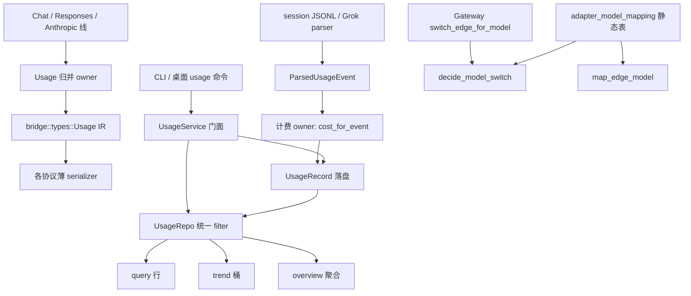

# Usage 与模型切换 owner 拆分

> 状态：提案（Draft）。作者：maintainers。日期：2026-08-27。
>
> 本文是 [对象化与封装审查](objectization-encapsulation-audit.md) O-31–O-34 的落地设计：只拆 Bridge `Usage` 协议映射、Usage 查询过滤、Usage 存储/解析/计费角色、以及 `decide_model_switch` 的内部 owner。不是现行契约，不得按已实施理解。日常 PR 合入 GitHub `dev`。
>
> **冻结写入路径：** 不改 `switch` / `switch_with_guard` / `undo_switch`、不改票夹 `plan` / `bind` / `unbind`、不改 `AdapterRouteService::plan`。本系列是文件与角色边界，不是统计口径或切换策略迁移。

## Overview

四件事现在都是「一个类型或一个模块里叠了多个角色」。调用方（CLI `crates/agenthub-cli/src/commands/usage.rs`、桌面 `src-tauri/src/commands/usage.rs`、本机转发 `Gateway::switch_edge_for_model`）已经走稳定门面：`hub.usage().query/trend/overview/collect`、invoke `usage_query` / `usage_trend` / `usage_overview`、gateway 在鉴权后按 body model 做**本次请求**的 edge 挑选。缺的是门面背后的职责边界：协议字段映射、SQL 过滤、落盘行、日志解析、计费、以及模型表 vs 运行时切边，互相缠在同一文件里。

审查行号已部分过期：O-32 的 `query` / `trend` / `overview` **不在** `usage_service.rs:130-160`（那是 `collect`），SQL 在 `usage_repo.rs`；Service 只转发。O-31 的 Chat/Responses 解析在 `types.rs:154-203`，Anthropic 解析/生成在同文件第二段 `impl Usage`（约 660–719）。本文以当前源码为准。

本提案：**不改公开类型和方法名，不改 totals / `reasoning_tokens` / 过滤口径，不改 `switch` / `bind` / `plan`，不新开计费产品。** 内部按 Account 的方式用 **private `mod` 或同文件 owner 函数** 切开（不是新的 crate 可见类型）。第一刀只收口 Usage 查询过滤，四个对象不得一次拆完。

## Current baseline

| 对象 | 现状 | 必须保持的门面与口径 |
| --- | --- | --- |
| O-31 Bridge `Usage` | `crates/agenthub-core/src/bridge/types.rs` 的 `Usage`（`u64`：`input_tokens` / `output_tokens` / `total_tokens` / `cached_input_tokens` / `reasoning_tokens`）。Chat：`from_chat_usage`（`prompt_tokens` 或 `input_tokens` **缺则 `None`**；`completion_tokens` 或 `output_tokens` 缺则 0；`total_tokens` 缺则 `input.saturating_add(output)`；cached 来自 `prompt_tokens_details.cached_tokens`）。Responses：`from_responses_usage`（`input_tokens` 缺则 `None`；cached 来自 `input_tokens_details.cached_tokens`）。Anthropic：`from_anthropic_usage`（`input_tokens` 缺则 `None`；cached 取 `cache_read_input_tokens` **否则** `cache_creation_input_tokens`，二者不求和；`total_tokens` **始终** `input.saturating_add(output)`，忽略线上一份 total；**`reasoning_tokens` 恒 0**）。`usage_reasoning_tokens`：先顶层 `reasoning_tokens`，否则 `output_tokens_details` 或 `completion_tokens_details` 里的 `reasoning_tokens`，再否则 0。生成：`to_responses_json` 同时写顶层 `reasoning_tokens` 和 `output_tokens_details.reasoning_tokens`，`cached_tokens` 用 `unwrap_or(0)`；`completed_responses_json(None)` = `Default`（全 0，含 reasoning 0）；`to_anthropic_usage_json` **只**写 `input_tokens` / `output_tokens` 和可选 `cache_read_input_tokens`，**不写** reasoning / total。调用点：`protocol/{chat,responses,anthropic_messages}.rs`。这是协议 IR，**不是**仪表盘 `UsageRecord`。 | 公开 `Usage` 字段与上述映射公式。Codex `ResponseCompleted` 必须带 `reasoning_tokens`（顶层与 details 相等）。锁定数：`from_chat_usage({prompt:3, completion:2, total:5, completion_tokens_details.reasoning_tokens:7})` → Responses JSON `input_tokens=3`、`reasoning_tokens=7`、details 同为 7。 |
| O-32 查询过滤 | `UsageService::{query,trend,overview}`（`usage_service.rs` 332–358）把参数交给 `UsageRepo`。三条 SQL 各自拼 `unixepoch(ts) >= unixepoch('now', '-N days')`，再调 `push_since_filter` / `push_agent_model_filters` / `push_exclude_agents`（`usage_repo.rs` 755–799）。`days.max(1)`。`since` 非空则 **AND** `unixepoch(ts) >= unixepoch(?)`（instant，不是词法 `T` vs 空格）。`agent_id` 精确匹配。`model` 空串和 `"all"` 忽略。`exclude_agent_ids` 为 `NOT IN`，**在 LIMIT 之前**。`query`：`ORDER BY ts DESC LIMIT`（`None` → 100_000）。`trend`：`SUM(input+cache_read+cache_write+output)`，`GROUP BY ts, agent_id`，再在 Rust 里按本地小时（`days<=1` → `YYYY-MM-DD HH:00`）或本地日（`days>1` → `YYYY-MM-DD`）分桶并填空桶。`overview`：metrics 是 `SUM(input)` / `SUM(output)` / `SUM(cache_read)` / `SUM(cache_write)` / `SUM(cost)`；distribution 无 agent 时按 `agent_id`、有 agent 时按 `model`，tokens 公式与 trend 相同；**`models` 用同一窗口 + agent + exclude，故意忽略 `model` 过滤**，好让下拉在选中某个模型时仍完整。Tauri `usage_query` / `usage_trend` / `usage_overview` 参数名不改。 | 过滤与聚合数字与现网测试逐字相同，见 §锁定口径。`UsageService` 方法名与参数列表本系列不改。 |
| O-33 Usage 模型 | `models/usage.rs`：`UsageRecord` 是落盘行 **也是** CLI/桌面 camelCase wire（`input_tokens` = 已剥过的可计费 input；`cache_read_tokens` / `cache_write_tokens` 分列因为费率不同；`cost_usd` 为定价表币种估算，无汇率；`fast` 必须落盘以便 recompute）。`cache_tokens_total()` = write+read，**不是列**。`ParsedUsageEvent` 是日志解析中间态：`cache_creation_tokens` + `cache_creation_1h_tokens` → 落盘 `cache_write_tokens`；`raw_hash` 必填；`cost_usd` 由 Service 填。`cost_for_event` / `event_missing_pricing` 在 `usage_service.rs`。Grok 解析读 `reasoning_tokens` **只用于**空行判定和 dedupe hash，**不写入** `ParsedUsageEvent.output_tokens`，也不进 `UsageRecord`。Collect：UUID、`account_id: None`、`cost_for_event`、UPSERT `(agent_id, session_id, raw_hash)`。前端 `usageTokenParts` 禁止再剥 cache。 | 公开 `UsageRecord` / `UsageQuery` / `UsageMetrics` / `UsageOverview` / `ParsedUsageEvent` 不改名、不增 `reasoning_tokens` 列、不新开计费产品。 |
| O-34 模型映射 vs 切边 | `models/adapter_model_mapping.rs` 同时有静态表（`AdapterModelMappingTable::map_model`、`map_edge_model`、`mapping_table_is_active`、OpenRouter `stealth/ox-alpha`）和运行时决策：`ModelSwitchCandidate`（`profile_id` / `source` / `target` / `custom_openai_compat` / `same_surface` / `running` / `listed_models`）、`ModelSwitchDecision::{Stay, SwitchTo, Unavailable}`、`decide_model_switch` + `lead_serves`。`Gateway::switch_edge_for_model`（`bridge/host/gateway.rs` 226–285）组 candidate 后调用它。这是**本次请求**的跨供应商 edge 挑选，**不是** `ProviderService::switch` / 票夹 bind / `AdapterRouteService::plan`。不用 `AccountPicker`（那是同 class failover）。跨 `target` 或 `same_surface == false` 永不切。`listed_model_matches` 在 `claude_client_env.rs`（忽略 `[1m]` 与 ASCII 大小写）。`models/mod.rs` `pub use adapter_model_mapping::*`。 | `map_model` / `map_edge_model` 表语义不变。`decide_model_switch` 的 Stay / SwitchTo / Unavailable 表不变。测试名见 PR4。 |

CLI（不改名）：`agenthub usage collect/stats/models/health` → `hub.usage().collect/query/list_models/parser_health`。`stats` 用 `query` 再在 CLI 聚合，不走 `overview`。

桌面（不改 invoke 名）：`usage_collect` / `usage_query` / `usage_trend` / `usage_overview` / `usage_list_models` / `usage_parser_health`。`days.max(1)`；空 `model` / `"all"` 丢掉；空 `since` 丢掉。

Bridge `Usage` 与仪表盘 `UsageRecord` 是两个域：前者 `u64` 协议 IR（含 `reasoning_tokens`），后者 `i64` 落盘行（无 reasoning 列）。本系列禁止合并。

## Goals & Non-Goals

**目标**

- 每个对象内部有明确 owner：协议归并 / 协议薄映射；查询过滤 / 三种聚合；落盘行 / 解析事件 / 计费换算；模型表 / 运行时切边。
- 公开类型仍是 `Usage`、`UsageService`、`UsageRecord`、`UsageQuery`、`UsageOverview`、`AdapterModelMappingTable`。CLI/桌面 invoke 与子命令不改名。
- totals、`reasoning_tokens`、query/trend/overview 过滤器与现网逐字一致。
- 第一刀可独立合入 `dev`，且只动查询过滤内部，不动协议、计费列、切边决策。

**非目标**

- 不改 `switch` / `switch_with_guard` / `undo_switch`、票夹 `plan` / `bind` / `unbind`、`AdapterRouteService::plan`、current 指针、锁顺序。
- 不改 `decide_model_switch` 的 Stay / SwitchTo / Unavailable 判定表（可以搬家，不能改行为）。
- 不新开计费产品：不加 `reasoning_tokens` 落盘列、不做汇率、不改 embedded 定价表、不把 Grok ticks / log `costUSD` / 表内单价合成新公式。
- 不把 Bridge `Usage` 与 `UsageRecord` 合成一个类型。
- 不把四个对象一次拆完；不把 O-31/O-33/O-34 放进第一刀。
- 不改 `overview.md` 的现行描述；本页升格前不把 O-31–O-34 标成已处理。
- 不开国产登录，不做 OAuth 转 API，不做凭据落盘加密。
- 不把测试搬进生产文件。

### 锁定口径（实现 PR 必须保持）

**过滤（三条路径同一套，overview `models` 故意少一个 model 谓词）**

| 条件 | 语义 |
| --- | --- |
| `days` | `max(1)`；`unixepoch(ts) >= unixepoch('now', '-N days')`（滚动窗口） |
| `since` | 非空则 AND `unixepoch(ts) >= unixepoch(?)`；`Z` 与 `+00:00` 同一瞬间 |
| `agent_id` | 精确匹配；缺省不过滤 |
| `model` | 空串 / `"all"` 忽略；否则 `model = ?`。**overview `models` 列表忽略此项** |
| `exclude_agent_ids` | `agent_id NOT IN (...)`，在 `LIMIT` 之前 |
| `query` limit | `None` → 100_000；`ORDER BY ts DESC` |

**totals（不得改公式）**

| 量 | 公式 |
| --- | --- |
| metrics.`billable_input` | `SUM(input_tokens)`（已是非 cache） |
| metrics.`output` / `cache_read` / `cache_write` | 各自 `SUM` |
| metrics.`cost_usd` | `SUM(COALESCE(cost_usd, 0))` |
| distribution / trend tokens | `input + cache_read + cache_write + output` |
| `UsageRecord::cache_tokens_total` | write + read |
| `ParsedUsageEvent::cache_write_tokens` | `cache_creation_tokens + cache_creation_1h_tokens` |
| 前端 `usageTokenParts` | 不再按 agent 剥 cache；`fullInput = billable + cacheRead + cacheWrite` |

现网数字（`platform/usage/tests.rs`）：三行 opus/sonnet/k2 → metrics 180 / 28 / 12 / 0 / 2.25；distribution tokens 185 / 35；models `k2, opus, sonnet`。Claude 子集 billable 150、opus tokens 130。选 `opus` 后 metrics 100，**models 仍是 `opus, sonnet`**。cache 分列 100/20/40/25 → dist tokens 185。trend 2 日全模型 187、opus 132、opus+since 110。exclude Kimi 后 billable 100、query `limit=1` 仍是 Claude。`days=1` 无 since 滚动 24h 含 20h 前那行 → 132。trend cache 行 tokens 150 与 overview dist 相同。`2026-08-20T12:00:00+00:00` 对 `since=2026-08-20T12:00:00.000Z` 命中 1 行。

前端锁定数（`usage-tokens.test.ts`）：Codex 750+250 → billable 750、full 1000（禁止剥成 500）；Grok 7180+11264 不剥；Claude 100+50 分列；三行 `sumBillableInput` = 750+100+7180；cache write 25 + read 40 → cache 65、full 165。

**`reasoning_tokens`（协议 IR，不进仪表盘列）**

| 路径 | 语义 |
| --- | --- |
| Chat / Responses 解析 | `usage_reasoning_tokens`；缺省 0 |
| Anthropic 解析 | **恒 0**（忽略线上字段） |
| Responses 生成 | 顶层与 `output_tokens_details` 都写；`None` → 0 |
| Anthropic 生成 | **不写** reasoning |
| Grok 日志 | 可出现在解析输入；**不加进** `output_tokens` / `UsageRecord` |
| Codex completed | 顶层 == details；测试 `assert_codex_completed_usage` |

## Proposed Design



### 1. 每个对象内部的 owner

子模块一律 private。公开方法仍挂在现有门面上。需要给兄弟模块或 `tests.rs` 看见的项用 `pub(super)`。不要新造 crate 可见的 owner 类型。不要把 Bridge `Usage` 重命名成仪表盘类型。

#### Bridge `Usage`（O-31；PR2）

| Owner | 职责 | 现有落点 | PR2 文件 |
| --- | --- | --- | --- |
| 归并 | 缺省、total 公式、`usage_reasoning_tokens`、`Default` 全 0。新增 usage 字段只改这里。 | `from_chat_usage` / `from_responses_usage` / `from_anthropic_usage` 的公共算术；`usage_reasoning_tokens` | 仍在 `types.rs` 的 **一个** `impl Usage` 块（或 private `usage.rs` 被 `types.rs` 拉进来）。禁止第三段分散 `impl`。 |
| Chat 薄映射 | 只负责 Chat 键名：`prompt_tokens`/`input_tokens`、`completion_tokens`/`output_tokens`、`prompt_tokens_details.cached_tokens`。input 缺 → `None`。 | `from_chat_usage` | 同文件函数，调用归并 |
| Responses 薄映射 | 只负责 Responses 键名：`input_tokens`、`input_tokens_details.cached_tokens`；`to_responses_json` / `completed_responses_json` | `from_responses_usage`、`to_responses_json` | 同文件 |
| Anthropic 薄映射 | 只负责 Anthropic 键名；cached 的 OR 回退；**强制 reasoning=0**；生成不写 reasoning/total | `from_anthropic_usage`、`to_anthropic_usage_json` | 同文件 |

语义不变：Chat input 缺字段 → `None`（不是 0）；Anthropic total 不读线上 `total_tokens`；Anthropic cached 是 OR 不是 SUM；`completed_responses_json(None)` 仍发出 reasoning 0，供 Codex 解析。

`protocol/{chat,responses,anthropic_messages}.rs` 继续调用现有方法名，不在 protocol 里复制算术。

#### Usage 查询过滤（O-32；第一刀）

| Owner | 放哪 | 不放哪 |
| --- | --- | --- |
| 过滤 | `UsageRepo` 内部：用已有 `UsageQuery` 拼 **一份** WHERE（days / since / agent / model / exclude）。`trend` / `overview` 即使公开签名仍是散参数，进入 repo 后立刻收成 `UsageQuery`。 | 不在 Service 里再拼 SQL；不改 Tauri/CLI 参数名 |
| query 行 | `SELECT` 列 + `ORDER BY ts DESC LIMIT` | 不改 limit 默认 100_000 |
| trend 聚合 | tokens `SUM`、本地分桶、填空桶 | 不改 grain：`days<=1` 小时，否则日 |
| overview 聚合 | metrics + distribution；`models` **单独**走同一窗口但 `model=None` | 禁止让选中的 model 把下拉滤空 |
| Service | 只转发；`query` 已吃 `UsageQuery`；`trend`/`overview` 签名冻结 | 本刀不改 collect / 定价 / repair |

允许 overview `models` 这条「少一个 model 谓词」的例外，必须在 `append` helper 上写成显式参数（例如 `include_model: bool`），禁止复制一整段 WHERE。

`push_since_filter` / `push_agent_model_filters` / `push_exclude_agents` 可保留或收进单一 `append_usage_filter`；行为必须与上表逐字相同。

#### Usage 模型角色（O-33；PR3）

| 角色 | Owner | 不做什么 |
| --- | --- | --- |
| 落盘 / wire 行 | 继续叫 `UsageRecord`（camelCase）。字段表冻结。 | 不改名为 `StoredUsageRecord`（那是公开 DTO 破坏）。不加 reasoning 列。 |
| 解析中间态 | 继续叫 `ParsedUsageEvent`。`cache_write_tokens()` / `cache_tokens_total()` 留在该类型上。 | 不把 `raw_hash` / 1h cache 拆进 `UsageRecord`。 |
| 计费换算 | `cost_for_event` / `event_missing_pricing` / `recompute_stored_costs` 闭包。可挪到 `usage_service/cost.rs`（private）。 | 不把单价公式写进 `UsageRecord` impl。不改 Grok ticks / log costUSD / 表内单价优先级。 |
| 展示合计 | 已有 `UsageMetrics` / `UsageOverview` / 前端 `usageTokenParts` | 不新造仪表盘 `UsageSummary` DTO 替换 `UsageMetrics` |

PR3 默认是 **文件头注释 + 可选 `usage_service/cost.rs`**，不重命名公开类型。若抽 `cost.rs`，`mod.rs` 必须 `pub(super) use` 测试可见的 `cost_for_event` / `event_missing_pricing`（现网 `usage_service/tests.rs`）。

Grok `reasoning_tokens` 继续只参与空行跳过和 hash；`does_not_add_reasoning_tokens_to_stored_output` 必须过。

#### 模型映射 vs 运行时切边（O-34；最后一刀）

| Owner | 放哪 | 不放哪 |
| --- | --- | --- |
| 静态表 | 留在 `models/adapter_model_mapping.rs`：`AdapterModelMapEntry` / `Table` / `map_model` / `map_edge_model` / `mapping_table_is_active` / OpenRouter backup / listed helpers | 不读 `running` / `same_surface` / `EdgeState` |
| 请求级切边 | 新 private 模块 `bridge/model_switch.rs`（或 `bridge/host/model_switch.rs`）：`ModelSwitchCandidate` / `ModelSwitchDecision` / `decide_model_switch` / `lead_serves`。Gateway 从这里 import。`switch_tests.rs` 跟着走。 | 不改判定表；不引入 `AccountPicker`；不改 `plan` / `bind` / Provider `switch` |
| 运行时组装 | `Gateway::switch_edge_for_model` 继续从 `EdgeState` 填 candidate（`mapping_source` 缺 → Stay；registry 锁失败 → Unavailable） | Core 模型层不 `use crate::bridge` |

`models/mod.rs` **停止** `pub use` `decide_model_switch` / `ModelSwitchCandidate` / `ModelSwitchDecision`（否则 models 仍反向依赖运行时概念）。`map_edge_model` 等表 API 继续从 models 导出。调用方今天只有 gateway + `switch_tests`。

`lead_serves` 合同（逐字保持）：

```text
Mapped | Passthrough → Stay
Missing → listed_models 命中（listed_model_matches）→ Stay
       → custom_openai_compat && listed 空 → Stay
       → custom_openai_compat && stealth/ox-alpha → Stay
       → 无表或表 inactive（无 passthrough、无 default、无 entries）且 listed 空 → Stay
       → 否则看 others：同 target、same_surface、Mapped|Passthrough、running；取第一个
       → 有则 SwitchTo { profile_id }，否则 Unavailable
跨 target / same_surface=false：跳过
```

### 2. 对外门面方法列表不变

- 类型名：`Usage`、`UsageService`、`UsageRecord`、`UsageQuery`、`UsageMetrics`、`UsageOverview`、`UsageTrendPoint`、`ParsedUsageEvent`、`AdapterModelMappingTable`、`AdapterModelMapResult`。
- `AgentHub::usage` 不改。`UsageService::{new,with_live_scope,collect,query,trend,overview,list_models,parser_health}` 不改名、不改参数表。
- CLI 子命令与 Tauri invoke 不改名。
- `from_chat_usage` / `from_responses_usage` / `from_anthropic_usage` / `to_responses_json` / `to_anthropic_usage_json` / `completed_responses_json` 不改名。
- 内部 owner 不是新的公开 API。O-34 搬家后，上述三个切边符号改为 `agenthub_core::bridge` 可见（`pub(crate)` 即可），不再从 `models::*` 导出。

### 3. 统计口径与切边判定仍只由现网公式拥有

- 仪表盘 totals 只经 `UsageRepo` 的 SQL 与 `usageTokenParts`；禁止在页面再剥 Codex/Grok cache。
- 协议 `total_tokens` / `reasoning_tokens` 只经 O-31 归并 owner。
- 请求级切边只经搬迁后的 `decide_model_switch`；Gateway 不得平行实现一份。
- 产品级 `switch` / `bind` / `plan` 本系列零 diff。

### 4. 第一刀可落地的文件范围

只收口 Usage 查询过滤。不动 `types.rs`、不动 `UsageRecord` 字段、不动 `decide_model_switch`、不动 collect/定价。

- `usage_repo.rs`：`query` / `trend` / `overview` 共用一份 filter append；`trend`/`overview` 入口收成 `UsageQuery`
- `usage_service.rs`：保持散参数签名，内部构造 `UsageQuery` 再交给 repo（若 repo 方法改签名）
- 不改 `src-tauri/src/commands/usage.rs`、CLI、前端
- 测试仍在 `platform/usage/tests.rs`；禁止把测试写进生产模块

不抽新的公开 `UsageFilter` 类型：`UsageQuery` 已经是过滤对象。也不做「只加注释」的 PR0。

## Key Decisions

| 决定 | 理由 |
| --- | --- |
| 公开门面类型和方法名冻结 | CLI/桌面按现有 invoke / `hub.usage()` 接线。 |
| Bridge `Usage` ≠ `UsageRecord` | 协议 IR 有 `reasoning_tokens` 且是 `u64`；落盘行没有该列且是 `i64` 可计费桶。合并会把 Codex 协议字段泄漏进仪表盘。 |
| totals / reasoning / 过滤器公式冻结 | 审查要求保持统计语义；现网测试已锁数字。 |
| 不改 `switch` / `bind` / `plan` | 产品写入与本机切换补偿不在本系列。O-34 的「switch」是请求级 edge 挑选。 |
| overview `models` 忽略 model 过滤 | 现网下拉合同；统一 filter 时必须保留这一显式例外。 |
| `UsageQuery` 就是 filter object，不另造公开类型 | 已存在；trend/overview 内部改用它即可。 |
| 不改名 `UsageRecord` | 改名等于拆公开 DTO；O-33 用角色标签 + 可选 `cost.rs`。 |
| 不加 reasoning 落盘列、不新开计费产品 | 项目范围外；Grok reasoning 已证明不进 output。 |
| `decide_model_switch` 搬出 models，判定表不动 | 去掉模型层对 runtime 的反向依赖；gateway 仍是唯一组装点。 |
| 停止从 `models::*` 再导出切边符号 | 否则 O-34 只是换文件仍从 models 漏出。 |
| 第一刀只收口 repo 过滤；PR2/PR4 无文件依赖 | 无重叠；Backup 系列同样按文件依赖而不是故事顺序。 |
| 产品范围外：凭据落盘加密、国产 OAuth 开边、OAuth 转 API | 项目红线。 |
| 测试保持 `*/tests.rs` | 拆目录后 `use super::*` 需要的符号才 `pub(super)` re-export。 |

## Alternatives Considered

**A. 把 Bridge `Usage` 和 `UsageRecord` 合成 `UsageSummary`**

单位、字段、生命周期都不同；Codex 需要的 `reasoning_tokens` 会污染仪表盘。拒绝。

**B. 第一刀就拆 `decide_model_switch` 或重命名 `UsageRecord`**

切边跨 models + gateway + 判定表，风险高于 SQL helper 收口。重命名破坏 CLI/桌面 wire。选过滤收口。

**C. 让 `trend`/`overview` 公开改吃 `UsageQuery`（改 Service 签名）**

Tauri/CLI 都要跟着改参数组装。收益只是签名整齐，不是口径。推迟；内部已经收成 `UsageQuery`。

**D. 新开 reasoning 计费或把 Grok reasoning 加进 output**

与 `does_not_add_reasoning_tokens_to_stored_output` 和「无新计费产品」冲突。拒绝。

**E. 切边仍从 `models::*` re-export，只把函数体挪走**

models 继续导出 runtime 决策类型，O-34 不成立。拒绝。

## Risks

| 风险 | 严重度 | 缓解 |
| --- | --- | --- |
| 统一 filter 时把 overview `models` 也套上 model 谓词 | 高 | 显式 `include_model`；PR1 点名 `usage_overview_sums_and_groups_by_agent_or_model`（选 opus 后 models 仍含 sonnet） |
| 有人改 total / reasoning 缺省 | 高 | PR2 禁止改公式；`completed_responses_usage_includes_reasoning_tokens_even_when_unknown` + `assert_codex_completed_usage` |
| PR3 把 `UsageRecord` 改名或加 reasoning 列 | 高 | 非目标；公开 DTO 冻结 |
| PR4 改 Stay/Unavailable 或允许跨 surface | 高 | `switch_tests.rs` 原样搬家；禁止改断言 |
| 文档被当成现行契约 | 中 | `status: proposed`；审查核实表不改成已处理 |
| mock `matchesUsageQuery` 与 SQL 再漂移 | 中 | 本系列不改 mock；若改 filter 语义（禁止）才会要锁步。口径不变则 mock 可不动 |

## PR Plan

合入目标：GitHub `dev`。每 PR 独立可回滚。禁止单 PR 拆完四个对象。

风险顺序：过滤收口 → 协议归并 → 模型角色标签 → 切边搬家。**PR2 不依赖 PR1 的文件或 API**；**PR4 不依赖 PR2**。PR3 若抽 `usage_service/cost.rs`，不要和 PR1 同时改 `usage_service.rs` 的同一批行。

### PR1 — Usage 查询过滤收口（第一刀）

- **标题：** `refactor(core): share UsageQuery filters across query/trend/overview`
- **依赖：** 无（本设计合入后即可）
- **文件：** `crates/agenthub-core/src/storage/usage_repo.rs`；必要时 `usage_service.rs` 仅内部构造 `UsageQuery`。不改 Tauri/CLI/前端。
- **描述：** `query` / `trend` / `overview` 共用一份 WHERE append。overview `models` 显式忽略 model。`days.max(1)`、since instant、exclude-before-limit、tokens 公式不改。不改 collect、不改 Bridge `Usage`、不改 `decide_model_switch`。
- **测试命令：**

```text
cargo test -p agenthub-core --locked usage_overview_sums_and_groups_by_agent_or_model
cargo test -p agenthub-core --locked usage_overview_splits_cache_read_and_write
cargo test -p agenthub-core --locked usage_query_honors_limit_and_since
cargo test -p agenthub-core --locked usage_trend_filters_by_model_and_since
cargo test -p agenthub-core --locked usage_overview_and_query_exclude_hidden_agents
cargo test -p agenthub-core --locked usage_trend_days1_rolling_includes_20h_unless_since_clips
cargo test -p agenthub-core --locked usage_trend_includes_cache_tokens
cargo test -p agenthub-core --locked since_filter_matches_offset_and_z_as_same_instant
```

点名断言：metrics 180/28/12/0/2.25；dist 185/35；选 opus 后 models 仍 `opus, sonnet`；trend 187/132/110；exclude 后 limit=1 仍 Claude；days=1 无 since → 132；cache 行 trend=overview dist=150。

### PR2 — Bridge `Usage` 归并 owner（O-31）

- **标题：** `refactor(bridge): give protocol Usage a single normalize owner`
- **依赖：** 无技术依赖。建议 PR1 之后只为降低并行审查噪音。
- **文件：** `crates/agenthub-core/src/bridge/types.rs`（合并两段 `impl Usage`；可选 private `bridge/usage.rs` 由 `types.rs` 再导出 `Usage`）。`protocol/{chat,responses,anthropic_messages}.rs` 只保持现有方法调用，不改算术。对应 `bridge/protocol/tests.rs`。
- **描述：** 一个归并 owner 负责 total 缺省、`reasoning_tokens` 兼容、`Default`。各协议只做键名映射。Anthropic inbound reasoning 仍恒 0；Responses completed 仍始终带 reasoning 0。不碰 `UsageRecord`。
- **测试命令：**

```text
cargo test -p agenthub-core --locked completed_responses_usage_includes_reasoning_tokens_even_when_unknown
cargo test -p agenthub-core --locked grok_codex_passthrough_completed_json_includes_reasoning_tokens
```

若抽 `bridge/usage.rs`，上述测试与 `assert_codex_completed_usage` 必须仍编过。Chat `completion_tokens_details.reasoning_tokens=7` → JSON 顶层与 details 均为 7。

### PR3 — Usage 模型角色标签（O-33，无新计费）

- **标题：** `refactor(core): label usage persist/parse/billing owners without new product`
- **依赖：** 若抽 `usage_service/cost.rs`，避开与 PR1 同时改 `usage_service.rs`。
- **文件：** `models/usage.rs` 文件头角色注释；可选 `usage_service/cost.rs` + `usage_service/mod.rs` 的 `pub(super) use`。`usage_service/tests.rs` 留下。不改 `UsageRecord` 字段、不改 wire 名。
- **描述：** 标明落盘行 / 解析事件 / 计费换算。`cost_for_event` 优先级不变（Grok ticks / 候选表 / log costUSD / $0）。Grok reasoning 不加进 output。不新开计费产品。
- **测试命令：**

```text
cargo test -p agenthub-core --locked cost_for_event
cargo test -p agenthub-core --locked event_missing_pricing
cargo test -p agenthub-core --locked does_not_add_reasoning_tokens_to_stored_output
pnpm exec vitest run src/lib/usage-tokens.test.ts src/pages/dashboard/usageOverviewModel.test.ts
```

### PR4 — `decide_model_switch` 迁出 models（O-34，最后）

- **标题：** `refactor(bridge): move decide_model_switch out of adapter model mapping`
- **依赖：** 无。不要和改 `adapter_model_mapping.rs` 表内容的其它 PR 叠在一起。
- **文件：** 新 `crates/agenthub-core/src/bridge/model_switch.rs`（或 `bridge/host/model_switch.rs`）；从 `adapter_model_mapping.rs` 移走 `ModelSwitchCandidate` / `ModelSwitchDecision` / `decide_model_switch` / `lead_serves` 及 `switch_tests.rs`；`models/mod.rs` 停止导出这三个切边符号；`bridge/host/gateway.rs` 改 import。`map_edge_model` / 表数据留在 models。
- **描述：** Gateway 组装 candidate 的方式不变（缺 mapping_source → Stay；registry 锁失败 → Unavailable）。判定表不变：跨 surface/target 不切；listed 命中 Stay；custom 空 listed Stay；非 running alternate → Unavailable。不改 `plan` / `bind` / Provider `switch`。
- **测试命令：**

```text
cargo test -p agenthub-core --locked mapped_lead_stays
cargo test -p agenthub-core --locked missing_on_lead_switches_to_running_passthrough_alternate
cargo test -p agenthub-core --locked missing_on_lead_fail_closed
cargo test -p agenthub-core --locked does_not_switch_across_target_or_surface
cargo test -p agenthub-core --locked listed_lead_model_stays_even_when_mapping_table_is_reserved
cargo test -p agenthub-core --locked kimi_unknown_model_fail_closed_without_alternate
cargo test -p agenthub-core --locked custom_empty_listed_follows_downstream_model
cargo test -p agenthub-core --locked custom_listed_models_accept_case_insensitive
cargo test -p agenthub-core --locked custom_openai_passthroughs_only_stealth_ox_alpha
```

搬家后过滤串仍是测试名子串，模块路径变化不影响 Cargo 过滤器。

## Open Questions

无产品阻塞。实现选择已写入 Key Decisions：第一刀只收口 `UsageRepo` 过滤且保留 overview `models` 例外；Bridge `Usage` 与 `UsageRecord` 分域；不改名公开 DTO；不新开计费；`decide_model_switch` 迁出且不再从 `models::*` 导出；判定表与 `switch`/`bind`/`plan` 解耦。

## References

- [对象化与封装审查](objectization-encapsulation-audit.md) — O-31、O-32、O-33、O-34
- [Service 内部 owner 拆分](service-internal-owners.md) — 同类内部 owner 拆法（门面冻结、第一刀局部）
- [模块化与边界收紧](../proposals/modularity.md)
- [Core 与 Runtime](core-runtime.md)
- [架构总览](overview.md)（本提案不改其当前态表述）
- 源码：`bridge/types.rs`、`bridge/protocol/{chat,responses,anthropic_messages}.rs`、`bridge/host/gateway.rs`、`services/usage_service.rs`、`storage/usage_repo.rs`、`models/usage.rs`、`models/adapter_model_mapping.rs`、`models/adapter_model_mapping/switch_tests.rs`、`platform/usage/tests.rs`、`usage/grok.rs`、`src-tauri/src/commands/usage.rs`、`crates/agenthub-cli/src/commands/usage.rs`、`src/lib/usage-tokens.ts`
