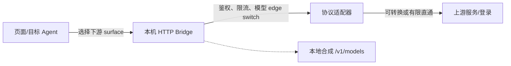
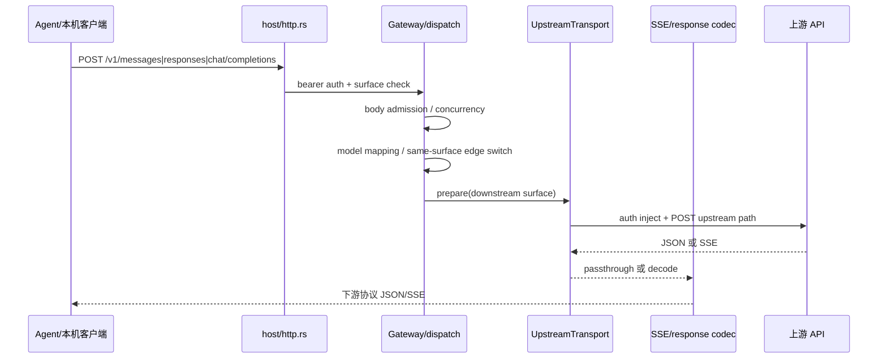
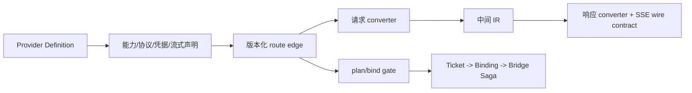

# AgentHub 路由、端点、协议转换与模型能力审计

> **Archived / 已归档**: Historical record. Do not use as current implementation contract or TODO list.
> **Status**: archived historical record
>
> 审计日期：2026-08-24　分支：`dev`　修订：2026-08-24 对齐 `db153cd`（Chat↔OpenAI Chat 同协议、Chat→Anthropic/Grok IR、surface-aware `passthrough_for`；`ee06d3e` 的 listedModels 与多客户端绑定仍有效）
>
> **归档（2026-08-24）**。带日期的审计快照；长期有效的行为说明以 [../reference/local-route-api.md](../reference/local-route-api.md) 为准。
>
> 这份文档回答：路由页面目前展示什么、后端真正支持什么、协议是否能互转、是否有不转换协议的中继、模型列表/限制/绑定做到哪一步，以及参考项目能借鉴什么。

## 结论先行

| 问题 | 结论 |
|---|---|
| 页面端点 | 页面统一展示 3 个本机下游协议面：`/v1/messages`、`/v1/responses`、`/v1/chat/completions`。后端另兼容 `/chat/completions`，并提供 `GET /v1/models`、`GET /models`。 |
| 后端上游 | 4 个固定通道：OpenAI Chat Completions、Anthropic Messages、Codex Responses、Grok/XAI Responses。 |
| 转换 | 有固定方向的请求/响应转换，核心走 `BridgeRequest`/事件 IR；不是任意 endpoint-to-endpoint 动态转换器。 |
| 互转 | Responses↔Messages、Responses↔Chat、Messages↔Chat 在 transport 上都能找到两个方向，但依赖不同上游通道；产品 bind 仍不对称。 |
| 直接中继 | 有：Responses→Codex/Grok Responses、Messages→Anthropic Messages、Chat→OpenAI Chat；均为协议级 passthrough，不是透明 TCP 代理。 |
| 模型列表 | 支持，主要是本地静态 mapping + 默认模型合成，不是实时向上游拉取。 |
| 模型限制 | 支持静态映射、未知模型 fail-closed、同 target/surface 的 edge 切换；自定义 OpenAI 兼容来源支持用户编辑的 `listedModels` 名单并在运行时强制执行。 |
| 模型绑定 | 目前绑定粒度是 `ticket → Agent → route/profile`，不是 `ticket → 具体 model`。存储层虽预留 `model_id`，产品 bind API 尚未贯通。 |
| 页面完整度 | `/routes` 是本机桥运行时管理页，不是完整的协议能力矩阵页；创建对话框只覆盖 Claude/Codex/Grok，后端还存在 Kimi/DSH 目标边。 |

## 1. 先统一三个概念



- **下游 surface**：目标 Agent 连接本机 Bridge 时说的协议，例如 Claude 的 Messages、Codex 的 Responses。
- **上游 channel**：来源登录真正能访问的协议，例如 Anthropic API 的 Messages、Kimi/OpenAI API 的 Chat Completions。
- **route edge**：某一个“来源登录 → 目标 Agent”的版本化能力边，决定能否 `bind`、目标协议、上游通道、默认模型和限制。

页面里的端点 URL是“下游 surface 的展示”，不是上游原始 URL，也不等于这个 profile 同时监听所有展示出来的路径。

## 2. 路由页面目前支持哪些端点

### 2.1 页面层明确展示的端点

定义集中在 [`src/lib/route-endpoints.ts`](../../src/lib/route-endpoints.ts)：

| endpoint id | 本机路径 | 默认目标映射 | 当前页面/运行时评价 |
|---|---|---|---|
| `messages` | `/v1/messages` | Claude | 已有完整 HTTP 入口；作为下游可转换到 OpenAI Chat、Codex Responses、Grok Responses。 |
| `responses` | `/v1/responses` | Codex、Grok | 当前最完整：支持 IR 转换，也有 Codex/Grok Responses 的有限 passthrough。 |
| `chat_completions` | `/v1/chat/completions` | Kimi、DSH，以及未知目标的 fallback | HTTP 入口存在。transport 已开放 Chat→OpenAI Chat 同协议直通，以及 Chat→Anthropic / Codex / Grok 转换。产品 bind 当前用到的 Chat 下游是 Codex→Kimi/DSH（Chat→Responses）；尚无 Chat identity 的可 apply 边。 |

后端还注册了 `/chat/completions` 作为兼容别名；它不是页面 `ROUTE_ENDPOINTS` 中的第四种协议。

### 2.2 `/routes` 页的真实职责

`src/pages/bridges/index.tsx` 的页面注释已经写明：这是 **local-bridge runtime ops page**。它主要负责：

- 查看已有 `local_bridge` profile；
- 显示端口、运行状态、上游状态；
- 启动、停止、自动启动；
- 查看详情、解除绑定、处理孤立 runtime；
- 从已有连接导入，或对已有 profile 做 Quick Apply。

协议分析、`plan`、`bind` 的日常入口在 Dashboard / Connections 的 ConnectFlow，不在 `/routes` 首屏。

规划器还会返回 `native_endpoint`、`local_bridge`、`config_sync`、`unsupported` 四类结果；只有 `local_bridge` 会产生本机 HTTP listener。`native_endpoint`/`config_sync` 是目标 Agent 的原生配置或登录槽位写入，不应被误读成 `/routes` 上可复制的本机端点。

### 2.3 页面入口与后端入口的错位

创建对话框的 `CREATE_ROUTE_TARGETS` 只有：

```text
claude, codex, grok
```

但 `routeEndpointIdForTargetAgent()` 和 Rust capability matrix 还认识 Kimi、DSH。也就是说：

- 已有 Kimi/DSH 绑定可以被后端规划和运行；
- `/routes` 详情可以按配置推导出 Chat Completions；
- 当前“创建路由” UI 不能直接把 Kimi/DSH 作为目标选择出来。

## 3. 后端实际路由链路



关键位置：

- HTTP 路由：[`crates/agenthub-core/src/bridge/host/http.rs`](../../crates/agenthub-core/src/bridge/host/http.rs)
- surface 判定：[`crates/agenthub-core/src/bridge/host/surface.rs`](../../crates/agenthub-core/src/bridge/host/surface.rs)
- 鉴权、模型切边、账号选择、转发：[`crates/agenthub-core/src/bridge/host/dispatch.rs`](../../crates/agenthub-core/src/bridge/host/dispatch.rs)
- 上游通道：[`crates/agenthub-core/src/bridge/host/transport/`](../../crates/agenthub-core/src/bridge/host/transport/mod.rs)
- 请求/响应协议 IR：[`crates/agenthub-core/src/bridge/protocol/`](../../crates/agenthub-core/src/bridge/protocol/mod.rs)
- 流式转换：[`crates/agenthub-core/src/bridge/host/stream.rs`](../../crates/agenthub-core/src/bridge/host/stream.rs)

一个 edge 只有一个 `BridgeLocalSurface`；不匹配的 conversation surface 在鉴权后返回 404。`Models` 是例外：总是由本地 mapping 合成。

## 4. 协议转换完成度

### 4.1 下游 → 上游矩阵

符号含义：`✓` 已有实现和测试；`△` 仅特定通道、存在重写/限制；`—` 该 transport 分支明确不可达。

| 下游 surface → 上游 channel | OpenAI Chat | Anthropic Messages | Codex Responses | Grok/XAI Responses |
|---|---:|---:|---:|---:|
| `/v1/responses` | ✓ IR 转 Chat | ✓ 转 Anthropic Messages | △ Responses shape passthrough + 官方字段过滤 | △ Responses shape passthrough + Grok normalization |
| `/v1/messages` | ✓ IR 转 Chat | △ 同协议直通（仅覆写 model） | ✓ 转 Responses | ✓ 转 Grok Responses |
| `/v1/chat/completions` | △ 同协议直通（仅覆写 model） | ✓ IR 转 Anthropic Messages | ✓ 转 Responses | ✓ 转 Grok Responses |

对应代码分支：

- OpenAI Chat：[`openai_chat.rs`](../../crates/agenthub-core/src/bridge/host/transport/openai_chat.rs)
- Anthropic Messages：[`anthropic.rs`](../../crates/agenthub-core/src/bridge/host/transport/anthropic.rs)
- Codex Responses：[`codex.rs`](../../crates/agenthub-core/src/bridge/host/transport/codex.rs)
- Grok Responses：[`grok.rs`](../../crates/agenthub-core/src/bridge/host/transport/grok.rs)

### 4.2 转换处理的内容

当前 IR/转换器已经覆盖：

- system/developer 归并到 Responses `instructions`；
- Chat/Anthropic 消息与 Responses `input` 互映；
- function tools、tool choice、tool call history；
- Chat 的 `max_tokens` 与 Responses 的 `max_output_tokens` 等有限参数映射；
- Grok reasoning、`prompt_cache_key`、CLI identity；
- JSON 非流式响应和 SSE 流式响应；
- usage、stop/incomplete、error、tool argument delta 等事件。

官方 Codex Responses 还有特殊清洗：关闭 `store`、折叠 system/developer item、过滤不在 allowlist 中的字段、删除会导致 400 的遗留模型名。

### 4.3 目前的边界

这不是“字段能改名就一定能接”的通用转换器。以下情况会 fail-closed 或转成协议错误：

- 不能用 IR 表达的输入块、图片/多模态块、server tools、web search 等扩展；
- 上游 SSE 非法 JSON、无效 UTF-8、超长/截断 frame、缺失终止事件；
- 工具调用顺序、reasoning 加密块、usage 语义无法保真时；
- 目标端点与 profile 的单 surface 不匹配。

总体评价：**核心聊天、工具调用、SSE 和若干 reasoning 兼容已经可用；扩展字段不是全量兼容，且能力由 route matrix 门禁，不会因为转换器存在就自动开放。**

判断某条边是否真正可用，不能只看 HTTP 路径：

```text
实际可用 = 已注册端点 ∩ 可 bind 的 edge ∩ surface 匹配
         ∩ transport 方向可达 ∩ 模型映射成功 ∩ runtime 正在运行
```

## 5. 是否支持“相互转换”

### 5.1 全局关系

| 协议对 | 是否能找到两个方向 | 实际含义 |
|---|---|---|
| Responses ↔ Messages | 是 | Responses→Messages 依赖 Anthropic 上游；Messages→Responses 依赖 Codex/Grok 上游。不是一条任意互转函数。 |
| Responses ↔ Chat | 是 | Responses→Chat 依赖 OpenAI Chat 上游；Chat→Responses 依赖 Codex/Grok Responses 上游。 |
| Messages ↔ Chat | 是（transport） | Messages→Chat 依赖 OpenAI Chat 上游；Chat→Messages 依赖 Anthropic 上游。产品 bind 尚未对称开放。 |
| Responses ↔ Responses | 有限是 | 只有 Codex/Grok 的 Responses route 进入 passthrough；仍会做鉴权、模型/字段处理。 |
| Messages ↔ Messages | 是 | Anthropic Messages 上游已开放同协议直通（请求体原样转发，仅按需覆写 model）。 |
| Chat ↔ Chat | 有限是 | OpenAI Chat 上游已开放同协议直通（请求体原样转发，仅按需覆写 model）。尚无对应可 apply 产品边。 |

因此“相互转换”的正确说法是：**存在若干固定方向的可逆覆盖，不存在任意协议两两动态协商或通用双向注册表。**

## 6. 是否支持直接中继（不转换端点协议）

支持的最窄路径是：

```text
下游 /v1/responses
  -> Codex Responses upstream
  -> 原始 Responses JSON/SSE（有限清洗）

下游 /v1/responses
  -> Grok Responses upstream
  -> 原始 Responses JSON/SSE（Grok 注入/规范化）

下游 /v1/messages
  -> Anthropic Messages upstream
  -> 原始 Messages JSON/SSE（仅覆写 model）

下游 /v1/chat/completions
  -> OpenAI Chat Completions upstream
  -> 原始 Chat JSON/SSE（仅覆写 model）
```

`passthrough_for` 按「上游通道 × 下游 surface」声明同协议直通：`OpenAiChat`+`ChatCompletions`、`Anthropic`+`Messages`、`CodexResponses|Grok`+`Responses`。匹配时非流走 `passthrough_json_response`、流式直接转发 SSE bytes；不匹配时先解码成事件 IR，再编码为下游协议。Responses 上游不得 byte-relay 到 Chat 或 Messages 客户端。

这不是透明反向代理，仍会：

- 校验本机 bearer，并用 bearer 选择 profile；
- 重写上游 URL、认证 header 和配置模型；
- Codex 过滤不支持字段、设置 `store=false`；
- Grok 注入/修复 reasoning、cache key、CLI identity；
- 受 body limit、并发上限、idle timeout、取消和错误包装约束。

所以应称为 **协议级 passthrough**，不能称为“完全不处理的 relay”。Chat→Anthropic / Chat→Grok / Chat→Codex 仍是 IR 转换，不是直通。

## 7. 当前可应用的本机路由边

下表把能力 matrix 的“来源上游”和“目标下游”展开。箭头方向是 **目标客户端下游 → 来源服务上游**，因为这是 Bridge 实际收到和发出的方向。

| 来源登录 | 目标 Agent | 目标下游 → 来源上游 | route/support | 当前判断 |
|---|---|---|---|---|
| Kimi Code 会员 Key | Codex | Responses → Chat Completions | local_bridge / Experimental | 可 apply；转换、工具和长流有实验性限制 |
| Anthropic API Key | Codex | Responses → Anthropic Messages | local_bridge / Experimental | 可 apply；需本机桥 |
| OpenAI API / OpenAI-compatible | Codex | Responses → Chat Completions | local_bridge / Experimental | 可 apply；需本机桥 |
| OpenAI API / OpenAI-compatible | Claude | Messages → Chat Completions | local_bridge / Experimental | 可 apply；需本机桥 |
| OpenAI API / OpenAI-compatible | Grok | Responses → Chat Completions | local_bridge / Experimental | 可 apply；需本机桥 |
| Grok subscription | Claude | Messages → Grok Responses | local_bridge / Experimental | 可 apply；需本机桥 |
| Grok subscription | Codex | Responses → Grok Responses | local_bridge / Experimental | 可 apply；Responses passthrough 路径 |
| Codex/ChatGPT subscription | Claude | Messages → Codex Responses | local_bridge / Experimental | 可 apply；Responses upstream |
| Codex/ChatGPT subscription | Grok | Responses → Codex Responses | local_bridge / Experimental | 可 apply；Responses passthrough 路径 |
| Codex/ChatGPT subscription | Kimi | Chat Completions → Codex Responses | local_bridge / Experimental | 可 apply；目标虽不在创建对话框 |
| Codex/ChatGPT subscription | DSH | Chat Completions → Codex Responses | local_bridge / Experimental | 可 apply；目标虽不在创建对话框 |

transport 已开放、但尚无 `can_apply` 产品边：Chat Completions → OpenAI Chat（同协议）、Chat Completions → Anthropic Messages、Chat Completions → Grok Responses。当前 Chat 下游可 apply 边只有 Codex→Kimi/DSH。

明确关闭的相关边：

- Codex App Server → Claude：记录为 candidate，`can_apply=false`；
- Claude subscription → Codex：`CLAUDE_CODEX_EDGE` 仍 `can_apply=false`，写入 gate 也未开放。文档中“已改判为可路由/待取证”的文字描述的是方向决策或过渡状态，不能当作当前可 bind 能力；代码和 `plan.canApply` 应作为当前真相。

所有这些 `local_bridge` 边目前 `multi_account=false`；虽然 runtime 已有 members/picker 和 edge switch 结构，但能力边尚未打开多账号轮询。

## 8. 模型列表、限制与绑定

### 8.1 模型列表：支持，但不是实时 discovery

Bridge 的 `GET /v1/models` / `GET /models`：

- 由 `list_local_bridge_models()` 根据 `source × target` mapping 表的 entries、default model、profile 配置模型合并；
- 对 Codex/ChatGPT Responses 会过滤 `grok-*`、`claude-*`、`kimi-*`、`deepseek-*` 和遗留 bridge 名；
- OpenRouter/custom 只有显式命中条件才允许 `stealth/ox-alpha` passthrough；
- 不会向上游实时请求 `/models`，也不会保证上游最新模型自动出现；
- 没有 mapping 时，通常只返回一个安全的非空配置模型，否则为空列表。

创建路由 UI 还允许输入逗号/换行分隔的 `models`，写入 provider 配置的 `listedModels`，详情页会展示它们。但这属于“路由声明/列表”，不是一个完整的模型策略管理器。

### 8.2 模型限制：有静态限制和 fail-closed，没有通用用户名单

当前有三类限制：

1. **静态 source→target 映射**：显式模型映射到目标模型；未知模型在 `allow_passthrough=false` 时 `Missing`。
2. **特殊 passthrough**：custom OpenAI/OpenRouter 的 `stealth/ox-alpha`；此外 OpenRouter backup 模型始终可被服务。
3. **请求级 edge switch**：当前 edge 不支持模型时，只在“同 target + 同 local surface + 正在运行”的候选 edge 中切换；不能跨 Agent 或跨 endpoint surface。
4. **用户名单（listedModels）**：创建路由填写的列表会写入 provider 配置，运行时去重、大小写不敏感地强制执行；未命中返回 400 `listed_models_reject`。名单为空时，自定义 OpenAI 兼容跟随客户端请求里的模型。

当前仍没有：

- 按 route/profile 的 denylist / 黑白名单策略 UI（仅有正向的 listedModels 名单）；
- 上游实时模型能力探测后自动更新 binding；
- 完整的“模型能力 × endpoint × 工具/推理/多模态”声明。

### 8.3 模型绑定：还没有贯通

公开 bind 命令的输入是：

```text
bind_ticket(ticket_id, target_agent_id)
```

`BindingView` 只有 ticket、agent、route、active、profileId、bridge runtime；没有 `modelId`。因此当前产品绑定是：

```text
Ticket -> Agent -> native / reshape / bridge -> profile/runtime
```

存储层 `agent_active_bindings` 已预留 `model_id`，并有低层 `set_refs(..., model_id, ...)`；但它没有贯通到 ticket bind、前端 DTO、页面选择器、bridge start spec 和请求选择。`Capability::ModelSelect` 也仍是 reserved，没有实际调用点。

**结论：** 当前可以“列模型、限制模型、按请求模型选择同类 edge”，但不能在产品层把某个 ticket 固定绑定到某个具体模型。

## 9. 页面/运行时一致性（已在 `ee06d3e` 修复）

审计时的原始风险：创建对话框允许同时勾选 Claude、Codex、Grok 并把多个 endpoint 写进一个 provider 的 `endpoints` 字段，但 `submitCreateRoute()` 只对一个 owner 执行 `planTicket` + `bindTicket`，导致“UI 展示多个 endpoint ≠ 实际可用”。

**现状：已修复。** `submitCreateRoute()` 现在调用 `applyLocalRouteToAgents()`，为每个勾选的目标客户端分别 plan + bind，同一登录应用到所有选中的客户端。剩余注意点不变：Core 仍是“一条 edge 一个 `BridgeLocalSurface`”，不匹配的 surface 会 404；provider 配置里 enabled 但未参与绑定的 endpoint 仍只是能力元数据。

## 10. 参考项目借鉴

### 10.1 路径说明

用户给出的 `D:\demo\_github\AgentHub\_Ref` 在当前环境不存在。实际核到的最相近目录是：

```text
D:\demo_github\AgentHub_Ref
```

以下参考结论均基于该候选目录，不能当作对原始路径的确认。

### 10.2 参考项目分工

| 项目 | 最值得看的部分 | 不适合直接搬入 AgentHub 的部分 |
|---|---|---|
| `grok2api` | 集中 HTTP route registry、Provider Definition、能力校验、模型 selector/candidate plan、Responses SSE 兼容修正 | 公网网关、远程账号池、配额/tier、出口节点、计费 finalize |
| `sub2api` | `apicompat` 按方向拆分 request/response converter；IR/工具/reasoning/usage/stop reason；wire-level SSE 测试 | 多租户、订阅/支付、超大兼容矩阵 |
| `Cli-Proxy-API-Management-Center` | Provider、模型别名、配额和策略管理面的信息组织 | 把桌面绑定管理器变成公共代理控制台 |

### 10.3 适合当前仓库的借鉴顺序



建议吸收：

1. 给每条 route edge 明确声明：下游协议、上游协议、模型能力、工具/推理/流式能力、凭据类型、刷新能力和验证日期。
2. 把“请求转换”“响应转换”“SSE 兼容修正”分成三层，不继续在 HTTP handler 中堆字段映射。
3. 公开模型名、内部稳定 route/model id、上游模型名分离；将来扩展模型限制时避免直接拿展示名当内部身份。
4. 为每个转换方向补独立的 request invariant、response round-trip、tool pairing、reasoning 顺序、usage/stop reason、SSE lifecycle 和严格字段测试。
5. 若未来真的打开多账号 Bridge，再参考 selector 的“先生成候选计划、claim 失败换下一个、保持排序稳定”；当前不要引入 quota/tier 复杂调度。

必须保留 AgentHub 自己的所有权边界：

- Ticket 是唯一真实登录来源；
- Binding 决定哪个 Agent 采用哪个 route；
- generated Provider 是绑定私有投影，不是新登录；
- Bridge 只监听 loopback，上游 secret 留在受控 runtime；
- `plan/bind/unbind` 是写入和回滚 owner；
- 不引入公网网关、多租户、计费或“任意模型/账号/出口由请求指定”的代理语义。

## 11. 最终缺口与建议优先级

### P0：避免用户误判

- ~~修正创建 UI 的多 endpoint 表达~~（已在 `ee06d3e` 修复：勾选的每个客户端各自 plan+bind）；
- `/routes` 详情区分“配置声明的 endpoint”和“当前 listener 实际服务的 endpoint”；
- 对 Claude subscription → Codex 的“方向开放/当前不可 bind”状态统一以 `plan.canApply` 展示，清掉文档与代码的混淆。

### P1：补齐路由能力契约

- 将 `downstream_surface`、`upstream_protocol`、`request_converter`、`response_converter`、`stream_codec`、`model_policy`、`credential_class` 纳入一个可审计的 route edge 描述；
- 用该契约生成 UI 能力摘要，减少 `CREATE_ROUTE_TARGETS` 与 Rust matrix 的双重硬编码；
- Chat 同协议 / Chat→Anthropic / Chat→Grok 的 transport 已开放；是否做成可 apply 产品边仍待产品决定。

### P2：补齐模型控制能力

- 先把 `model_id` 从 storage 贯通到 Binding DTO、bind/plan、profile 和请求模型策略；
- 再增加 per-profile allowlist/denylist，并让 `/v1/models`、模型 admission、edge switch 共用一个 model policy；
- 添加实时 discovery 作为可选增强，不要让实时 discovery 取代 fail-closed route matrix。

### P3：测试矩阵

- 每个转换方向分别覆盖非流式与流式；
- 每个 endpoint × upstream channel 组合有“可用/明确 404/明确 400”的契约测试；
- 绑定模型、模型列表、模型切 edge、同 surface 限制、多个配置 endpoint 与单 listener 的一致性测试；
- 参考 `sub2api` 的 wire-level SSE 字段测试，参考 `grok2api` 的 Provider capability contract 测试。

## 12. 主要证据索引

| 主题 | 证据 |
|---|---|
| 页面三端点、目标映射 | [`src/lib/route-endpoints.ts`](../../src/lib/route-endpoints.ts)、[`src/pages/bridges/create-route-flow.ts`](../../src/pages/bridges/create-route-flow.ts) |
| `/routes` 职责 | [`src/pages/bridges/index.tsx`](../../src/pages/bridges/index.tsx)、[`adapters-and-bridges.md`](../concepts/adapters-and-bridges.md) |
| HTTP 入口与 surface | [`crates/agenthub-core/src/bridge/host/http.rs`](../../crates/agenthub-core/src/bridge/host/http.rs)、[`surface.rs`](../../crates/agenthub-core/src/bridge/host/surface.rs) |
| 转换矩阵 | [`transport/mod.rs`](../../crates/agenthub-core/src/bridge/host/transport/mod.rs)、[`protocol/mod.rs`](../../crates/agenthub-core/src/bridge/protocol/mod.rs) |
| route edge 与 apply gate | [`local_bridge_edges.rs`](../../crates/agenthub-core/src/domain/protocol_graph/adapter_capability_matrix/local_bridge_edges.rs)、[`actions.rs`](../../crates/agenthub-core/src/services/adapter_route_service/actions.rs) |
| 模型 mapping/list/switch | [`adapter_model_mapping.rs`](../../crates/agenthub-core/src/models/adapter_model_mapping.rs)、[`bridge/tests.rs`](../../crates/agenthub-core/src/bridge/tests.rs) |
| 模型绑定断点 | [`binding_repo.rs`](../../crates/agenthub-core/src/storage/binding_repo.rs)、[`src-tauri/src/commands/adapter.rs`](../../src-tauri/src/commands/adapter.rs)、[`src/lib/backend/contracts/ticket.ts`](../../src/lib/backend/contracts/ticket.ts) |
| 参考项目 | `D:\demo_github\AgentHub_Ref\grok2api`、`D:\demo_github\AgentHub_Ref\sub2api`（候选路径） |
