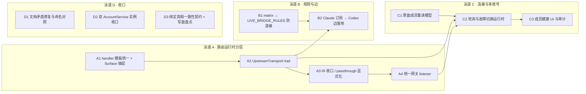

# 路由 × 连接重构：任务拆分与派工计划

> **归档（2026-08-24）**。不是现行派工单。A1–A4 / B1 / C1 等已合入；未完项见 [../provider-api-oauth-adaptation.md](../provider-api-oauth-adaptation.md) §5.4（进程内网关已落地）与 §5.5（轮询内核已有、边默认关）。索引见 [../README.md](../README.md)。
>
> 原状态：**收尾中（2026-08-22 制定；同日 A1–A4、B1、B2 kernel 腿、C1–C3、D1–D3 全部验收合入 dev；测试债修复与连接域模块化拆分亦已合入）**。未完成：B2 实机取证（等真实 Claude 订阅账号）、C2 遗留小项（健康态回写账号行、启动映射 TryOnce、实机取证后开闸）。
> 真源关系：**本文只做任务拆分，不新增决策**。产品与协议决策以 [../provider-api-oauth-adaptation.md](../provider-api-oauth-adaptation.md) 为准；领域模型以 [../connection-binding-model.md](../connection-binding-model.md) 为准；模块化债以 [../modularity-improvement.md](../modularity-improvement.md) 为准；sidecar 迁移契约以 [../adapter-sidecar-design.md](../adapter-sidecar-design.md) 为准；实现状态以 [../agenthub-plan.md §8](../agenthub-plan.md#8-当前实现状态以代码与测试为准) 为准。
> 依据：2026-08-22 对 `bridge/`、`adapter_route_service/`、`protocol_graph/`、`ticket_*` / `account_service/` / `connection_service` 及相关文档的三路深度审查（结论摘录见 §1–§2；审查为只读，未改代码）。

## 0. 范围外（先钉死，防止派工跑偏）

以下各项**不在本轮任何任务里**，subagent 提示词必须原样带上：

1. **负载均衡（按压力/余额分配）不做**；多账号只做固定顺序轮询 + 故障切换（§5.5 拍板）。
2. **国产 OAuth 不开边、不转 API**（AGENTS.md 硬规则）。
3. **凭据落盘加密范围外**，不列任务、不列风险。
4. **sidecar（`agenthub-adapterd`）本轮不迁**。先完成运行时分层（泳道 A），再按 [adapter-sidecar-design.md](../adapter-sidecar-design.md) 三阶段推进；本轮任何任务不得引入第二个 host 或 IPC 半成品。
5. `/v1/embeddings`、`/v1/images/*`、`/v1/realtime` 暂缓（§5.4.1）。
6. 不监听公网、不导出上游 token、不把生成配置当登录。
7. 表面统一 ≠ 通用转发：每条边仍走 `plan()` + capability matrix 门禁，本轮不因重构自动打开任何 `canApply`。

## 1. 现状结论（审查摘要）

### 1.1 路由（bridge / 网关）

- 现状是「**一 profile → 一 loopback listener → 一种下游 surface → 一份上游凭据**」。listener 路由表虽注册了三种对话端点 + `/v1/models`，但 `ProtocolSelector` 按 profile 的 `local_surface` 对不匹配端点直接 404（有测试显式断言该契约）。
- **`bridge/host/dispatch.rs`（~1573 行）是上帝模块**：鉴权重复调用、admission、按 `(surface × upstream protocol)` 的塑形分支、上游 POST、OAuth 401 reload、Grok 身份/encrypted-reasoning 特例、三套流编解码全部在一起。三个 handler 的 auth → overload → shutdown → read body 模板高度复制。
- 协议内核（`bridge/protocol/{responses,chat,anthropic_messages}.rs` + `types::IrEvent` / `RetryGate`）相对干净、fixtures 厚实（`protocol/tests.rs` ~57 用例），是重构安全网。但 **Responses↔Responses passthrough 绕过 IR**，Grok 特例仍嵌在 host 而非独立 Transport。
- **规则双真源**：capability matrix cell（`transport`/`protocol`）与 `adapter_bridge_service::LIVE_BRIDGE_RULES`（`local_surface`/`upstream protocol`）需要人工对齐；新边要改两处 + dispatch match 臂。
- Claude 订阅 → Codex：`refactor/edge-rules` 已登记 experimental cell（gates 全关、`canApply=false`）+ protocol fixtures；`decide_adapter_capability` 改查表。LIVE_BRIDGE_RULES 仍无 writer 行（secret-resolver 要求 live 行必须是 applyable cell）。取证前不 bind。
- 多账号轮询/故障切换**零实现**：`ListenerState` 单 `ResolvedAuth`；仅有同账号 401 换 token 首事件前重试一次（`RetryGate`）。

### 1.2 连接（票 / 绑定 / 账号池）

- Ticket 是 accounts + providers 两行的**读模型聚合**；`TicketBinding` **无独立表**，由 `adapter_profiles` + `is_current` 派生（`derive_bindings`）。`plan/bind/unbind` 产品写口已收口（`apply_adapter` 薄委托），`local_bridge` 由 `DesktopAdapterControl` 转 `apply_local_bridge`。
- 账号池去重（`authorization_key`、同人多授权并存、loopback 单槽）与文档一致、已落地；写路径有 `BEGIN IMMEDIATE` + revision CAS，前端 settings 有写队列。
- 支持 §5.5 的**模型缺口**：无「同票面成员集」（`surface` 只是标签，无聚合实体）；`bind(单票)` 无法表达挂一组账号；profile 仅单 `source_id`；无运行时选择器（有序成员、游标、健康态）、无请求边界切换 FSM、无按成员的审计字段。
- 命名三套并存易改错：`ActiveBinding`（Agent 当前行指针）≠ `TicketBinding`（票→Agent 路线）≠ 前端 `connection-pool-store`（accounts+providers 缓存）。
- `AgentHub::open` 里 `ticket_bind` 另构一份 `AccountService::with_live`（与 `hub.accounts` 分离实例，共享 DB），saga 锁共享性待收口。

### 1.3 文档与代码不一致（本轮要修的）

| # | 位置 | 问题 |
|---|---|---|
| 1 | [account-authorization-pool.md](../account-authorization-pool.md) §6/§9 vs §8 | §6/§9 仍写「按 identity 分组 UI」验收，§8 又写 Connections 已是登录列表、勿再验收分组——自相矛盾 |
| 2 | [connection-binding-model.md](../connection-binding-model.md) §4 | 「refresh single-flight 发生在票这一层」与实现不符：实际按 **account 行** single-flight（`oauth_owner` / `live_reconcile`） |
| 3 | 各文档 | `ActiveBinding` / `TicketBinding` / 前端 connection-pool 三套命名缺一张对照表（P0-5 只写了前两个） |

工作区未提交改动（admission 上限 256、429 `Retry-After`、Claude→Codex reason 改判文案，7 文件 +43/−29）已核对与拍板一致，随下一次提交入库即可，不派生任务。

## 2. 目标结构（对齐拍板，不重复决策原文）

```text
统一 loopback 网关（本轮仍进程内 BridgeRuntimeHost；sidecar 后续轮）
  → local bearer 鉴权（统一 middleware，bearer 识别边）
  → DownstreamSurface：/v1/messages | /v1/responses | /v1/chat/completions | /v1/models
  → ProtocolKernel IR（纯映射；passthrough 显式化，不再隐式绕过）
  → UpstreamTransport（按边：auth、path、body 塑形、恢复策略、流编解码）
  → AccountPicker（§5.5：同票面有序成员、健康态、请求边界/首事件前切换）
```

## 3. 任务泳道（多路并行派工用）

四条泳道，泳道间尽量文件不相交、可并行；泳道内串行。**依赖关系**：



**推荐派工波次**（每波内各任务文件不相交，可同时开多个 subagent）：

| 波次 | 并行任务 | 说明 |
|---|---|---|
| 第 1 波 | A1、B1、C1、D1 | 互不相交；A1 动 `bridge/host/`，B1 动 `adapter_bridge_service` + matrix 测试，C1 动 `ticket_read_service` + models，D1 纯文档 |
| 第 2 波 | A2、D2、D3 | A2 依赖 A1 合入（同文件 `dispatch.rs`）；D2 独立小件；D3 等 C1 合入后动 `ticket_read` 测试区 |
| 第 3 波 | A3、B2（fixtures/kernel 腿可提早并行）、C2 设计稿 | B2 的协议 fixtures 不动 dispatch，可与 A3 并行 |
| 第 4 波 | A4、C2 落地 | A4 是本轮最大改动，需主 Agent 先审设计；C2 依赖 A2 + C1，schema 决策需主 Agent 拍板 |
| 收尾 | C3、B2 实机取证、全量回归 | — |

## 4. 任务卡

每张卡按 AGENTS.md 派工约定给出：目标 / 文件 / 限制 / 验收。**跑测试一律另起测试 subagent**，过滤命令写在卡内。

### A1 统一 handler 模板 + 抽出 DownstreamSurface 层

- **状态**：已合入 dev（2026-08-22，`refactor/bridge-gateway`；`dispatch.rs` 降至 ~160 行，见 `bridge/host/surface.rs`）
- **目标**：消除 `handle_responses` / `handle_messages` / `handle_chat_completions` 三份复制的 鉴权 → shutdown → admission → 读 body → 错误映射 模板；把 path→surface 解析、404 门控、下游 parse/encode 边界从 `dispatch.rs` 挪进独立模块（建议 `bridge/host/surface.rs` 或 `bridge/surface/`）。**行为完全不变**（含错 surface 404 契约）。
- **文件**：`crates/agenthub-core/src/bridge/host/{dispatch,http,mod}.rs`、新 surface 模块、`bridge/tests.rs`（只允许搬用例，不改断言语义）。
- **限制**：不改 wire 行为、不改日志字段口径（[logging.md](../logging.md)）、不动 protocol/ 内核、不新增公共 API 暴露 token。测试与生产分文件（[testing.md](../testing.md)）。
- **验收**：`cargo test -p agenthub-core bridge` 全绿；`dispatch.rs` 主路径无三份模板复制（参考目标 ≤800 行）；鉴权只在一处实现、health/models/对话端点共用。

### A2 抽 UpstreamTransport trait

- **状态**：已合入 dev（2026-08-22，`refactor/bridge-gateway`；见 `bridge/host/transport/{anthropic,codex,grok,openai_chat}.rs`，枚举已改名 `OpenAiChatCompletions`）
- **目标**：按 `BridgeUpstreamProtocol` 建立 Transport 抽象：`prepare_request`（上游 path + body 塑形）、`apply_auth`、恢复策略（同账号 401 reload、Grok encrypted-reasoning strip 重试）、流编解码选择。`send_upstream_with_grok_recovery` 与 Grok 身份头/会话 seed 下沉为 Grok transport 内部实现；dispatch 不再出现按协议的 `match` 塑形/auth 分支。
- **文件**：新 `bridge/host/transport.rs`（或 `bridge/transport/`）、`bridge/host/dispatch.rs`、`bridge/runtime.rs`、`bridge/grok_cli*`。
- **限制**：refresh token 不进 bridge；换上游 auth 时 local bearer 不变（既有锚点测试 `ensure_listener_replaces_upstream_auth_while_keeping_local_bearer` 必须保持通过）；首事件前最多一次重试的 `RetryGate` 语义不变；`OpenAI→Codex 复用 KimiChatCompletions` 的枚举语义混淆可顺手改名，但须全仓一致且不改序列化格式。
- **验收**：`cargo test -p agenthub-core bridge` 与 `cargo test -p agenthub-core protocol` 全绿；新 transport 有独立单测（auth 注入、恢复策略、path 塑形各至少一例）。
- **依赖**：A1 合入后开工（同文件）。

### A3 IR 主路径收口，passthrough 显式化

- **状态**：已合入 dev（2026-08-22，`refactor/bridge-gateway`；passthrough 由 `UpstreamChannel::passthrough()` 单点声明）
- **目标**：Responses↔Responses（Grok→Codex、Codex→Grok）passthrough 从 handler 内 if-else 改为 transport 显式声明的能力（如 `Transport::passthrough() -> bool` 或独立 `IdentityTransport`），并记录决策：passthrough 保留为保真优化，不强制走 IR。其余边确保主路径统一经 `BridgeRequest`/`IrEvent`。
- **文件**：`bridge/host/{dispatch,transport}.rs`、`bridge/tests.rs`。
- **限制**：不改 passthrough 的 wire 保真行为（prepare 阶段的改写规则如 `apply_official_codex_model` 保留）。
- **验收**：`cargo test -p agenthub-core bridge` 全绿；代码内 passthrough 只有一个声明点。
- **依赖**：A2。

### A4 统一网关 listener（§5.4 落地主件）

- **状态**：已实施合入 dev（2026-08-22，`refactor/gateway-listener`：`Gateway`/`EdgeState` + bearer 唯一 middleware + 401 先于 404 契约改写 + 双听收敛 + per-edge admission，7 个网关契约测试）。`DESIGN.md` 可在收尾时归档删除。
- **目标**：从「一 profile 一 listener 一 surface」演进为拍板的「一个网关进程内三种对话端点 + `/v1/models`」：多 profile 共享统一 listener，local bearer → 边（profile）识别，端点 → surface 分派；错 surface 404 契约改写为「bearer 对应边不服务该端点」的等价拒绝。设计稿必须回答：端口与已写入目标配置的兼容迁移（存量 profile 写的是各自端口的 loopback URL）、`/v1/models` 按 bearer 合成、health 语义、并发 admission 从 per-listener 改 per-edge。
- **文件**：`bridge/host/{lifecycle,http,dispatch,surface}.rs`、`bridge/runtime.rs`、`adapter_bridge_service`（投影 URL）、`bridge/tests.rs`（契约整体改写）。
- **限制**：仅 loopback；有绑定才起，不默认常驻；不因表面统一打开任何边的 `canApply`；存量绑定不得因升级失联（需迁移或兼容期双听方案，设计稿里定）。
- **验收**：设计稿评审通过后：`cargo test -p agenthub-core bridge` 全绿（含改写后的分派/拒绝契约）；同进程三表面并存的集成测；`pnpm test -- bridges` 前端状态页不回归。
- **依赖**：A1–A3。

### B1 matrix ↔ LIVE_BRIDGE_RULES 防漂移收口

- **状态**：已合入 dev（2026-08-22，`refactor/edge-rules`：登记表 `LOCAL_BRIDGE_EDGES` 为重叠字段唯一声明点，`LIVE_BRIDGE_RULES` 字段改由边派生）
- **目标**：消除「新边改两处」的双真源风险：为每个 `LocalBridge` 开放 cell 与 `LIVE_BRIDGE_RULES` 建立一致性契约测试（rule_id、上游协议、local_surface、默认模型逐项对账）；评估把 `LIVE_BRIDGE_RULES` 的键改为从 matrix cell 派生（若改动过大，本轮只做契约测试）。
- **文件**：`services/adapter_bridge_service/mod.rs`、`domain/protocol_graph/adapter_capability_matrix.rs` 及两侧 tests。
- **限制**：不改任何边的开放状态；已有 `open_matrix_cells_have_bind_and_apply_arms` 防漂移测试保持通过。
- **验收**：`cargo test -p agenthub-core adapter` 全绿；故意在一侧改错 surface 时契约测试能红（在 PR 描述里演示后还原）。

### B2 Claude 订阅 → Codex 边落地（③，2026-08-21 改判）

- **状态**：kernel/fixtures 腿已合入 dev（2026-08-22：cell + 登记表行 + protocol fixtures；`canApply` 仍关，gates 全关）。剩余：实机取证后按 §7.1 逐 gate 打开。
- **目标**：按 §5.4 路由开放原则落地首个改判边：下游 Responses（Codex）→ IR → 上游 Anthropic Messages OAuth（Claude 订阅）。交付：matrix 新增 experimental cell（初始 gates 关、`canApply=false`）、上游 transport（Anthropic Messages + PKCE access token 注入，refresh 按 §5.1.2 owner 分治）、正反例 fixtures、登记表新行（live writer 行等 `canApply` 打开后再进 `LIVE_BRIDGE_RULES`）、`decide_adapter_capability` 特判改为查表。取证通过后按 §7.1 门槛逐 gate 打开。
- **文件**：`adapter_capability_matrix.rs`、`adapter_bridge_service`、`bridge/protocol/fixtures/`、`adapter_route_service` tests、`src/dev/mocks/adapter/*`（reason/contract 锁步）、`provider-api-oauth-adaptation.md` §4 矩阵行。
- **限制**：fixtures 未取证前 `canApply=false`（reason 保持「规则与 fixtures 未落地」口径）；thinking 无可验证签名时降级关闭；不写 Claude OAuth token 进 Codex 配置。
- **验收**：`cargo test -p agenthub-core adapter` + `cargo test -p agenthub-core protocol` 全绿；plan 对该边显示 experimental/preview 与正确 reason；mock 契约 JSON 同步（`pnpm test -- adapter`）。
- **依赖**：A2（transport 抽象省力）、B1（避免双真源再欠账）。

### C1 票面成员集读模型

- **状态**：已合入 dev（2026-08-22）。聚合键 `(surface, credentialClass)`；Account+Provider 混组；unknown / 投影不入组；成员序 `ticket_id`。见 `TicketSurfaceGroup` / `group_ticket_surface_members`。
- **目标**：为 §5.5 提供「同票面多账号」的成员枚举：按 `surface` + `credentialClass` 聚合同票面的多条 account/provider 行，产出读模型（如 `TicketSurfaceGroup { surface, members[] }`），**只做读模型，不改存储 schema、不改去重规则**。前端 contracts 如需暴露则同步 wire 映射与 mock。
- **文件**：`services/ticket_read_service.rs`、`models/ticket.rs`、（可选）`src/lib/backend/contracts/ticket.ts`、`src/dev/mocks/ticket.ts`。
- **限制**：投影 Provider 永不入组；`unknown` surface 不聚组；不引入新表；不动 `authorization_key` 去重语义（同人多授权仍并存）。
- **验收**：`cargo test -p agenthub-core ticket` 全绿；新聚合有单测（同 surface 两账号成一组、不同 surface 不合、投影排除）；前端如暴露则 `pnpm test -- ticket` 绿。

### C2 多账号轮询与故障切换运行时（§5.5 主件）

- **状态**：已实施合入 dev（2026-08-22，`refactor/multi-account-runtime`：`AccountPicker` + `RequestFsm` 挂 `EdgeState`，矩阵 `multi_account` 默认全关；单成员与旧行为等价）。遗留小项：隔离健康态回写账号行（`MemberHealthSink` 未接线）、启动时 account 行 Unknown/NeedsAttention 映射 `TryOnce`、实机取证后开闸。稿内选定成员存储方案 C（运行时纯读模型），矩阵加 `multi_account` 维，RetryGate 与切号闸正交。
- **目标**：`local_bridge` 运行时支持同票面多成员：`BridgeStartSpec` 从单 `ResolvedAuth` 扩展为有序成员列表；新增 AccountPicker（固定顺序轮询游标、成员健康态 `Renewable`/`NeedsLogin`、失效隔离）；请求边界 FSM——新请求在请求边界选号，**切换仅限首个有效流事件前且单请求最多一次**，与既有同账号 401 reload 正交合入；绑定语义扩展（`bind` 后 attach 成员或 profile 多 `source_id`，设计稿定）。每请求日志记**实际承接账号**（`account_id` 字段），上游身份头/会话 seed 按实际承接账号生成。
- **文件**：`bridge/runtime.rs`、`bridge/host/{dispatch,transport}.rs`、`services/adapter_bridge_service/*`、`storage/`（如需 profile 成员存储）、`src-tauri/adapter_bridge_controller.rs`（secret 解析多成员）、两侧 tests。
- **限制**：仅本人账号、仅 loopback；负载均衡不做；每成员 refresh 独立 single-flight（owner 分治不变，§5.1.2）；失效只标该成员，不向调用方暴露其余账号；每条边的轮询支持仍需随 fixtures 取证后才开（矩阵可加 multi-account 维度或按边白名单，设计稿定）。
- **验收**：FSM 单测（首事件前切号、首事件后禁切、单请求一次上限）；host 集成测（成员 A 401/NeedsLogin → 下一请求由 B 承接、A 标记隔离、B 正常流式）；日志含实际承接账号且无 token；`cargo test -p agenthub-core bridge` 全绿。
- **依赖**：C1、A2（Transport 注入点）、A4（统一 listener 后游标归属更清晰；若 A4 延期，设计稿须写明 per-profile listener 下的等价实现）。

### C3 成员健康 UI 与审计展示

- **状态**：已合入 dev（2026-08-22，`feature/member-health-ui`：contracts/mock 扩展可选 `health`，Routes 详情成员健康态、Connections 钱包多成员承接展示；vitest 145 文件 / 1246 用例全绿）
- **目标**：Routes 详情展示同票面成员及健康态；Connections 钱包「正用于」表达多成员承接；不新增页面，不做管理大盘。
- **文件**：`src/pages/bridges/*`、`src/pages/connections/*`、contracts/mock 对应扩展。
- **限制**：遵守 [ui-design.md](../ui-design.md) / [ui-component-standard.md](../ui-component-standard.md)；不显示 token 或完整凭据；孤立/失效成员置灰 + 原因，不藏行。
- **验收**：`pnpm test -- bridges connections` 全绿；mock 下可演示两成员一失效的展示态。
- **依赖**：C2。

### D1 文档矛盾修复与命名对照

- **状态**：已合入 dev（2026-08-22，`refactor/connection-cleanup`；三处均带核对日期）
- **目标**：修 §1.3 三条不一致：① [account-authorization-pool.md](../account-authorization-pool.md) §6/§9 与 §8 的分组验收矛盾（以 §8 为准改写 §6/§9，标注历史）；② [connection-binding-model.md](../connection-binding-model.md) §4 refresh single-flight 层级改为「按 account 行（授权）single-flight」，与 `oauth_owner` 实现对齐；③ 在 connection-binding-model.md §2.4 补第三行命名对照：前端 `connection-pool-store` = accounts+providers 缓存，≠ `ConnectionService`。
- **文件**：仅上述两个文档（+ 如需 [modularity-improvement.md](../modularity-improvement.md) 对照表补一行）。
- **限制**：不新增决策、不改产品口径；改动处标注核对日期。
- **验收**：主 Agent 通读复核；文档间交叉引用不断链。

### D3 绑定真相一致性契约 + 写面盘点

- **状态**：已合入 dev（2026-08-22）。契约在 `ticket_read_service/tests.rs`（`ticket_connection_*`）；写面盘点见 [multi-account-routing-rfc.md 附录 A](multi-account-routing-rfc.md#附录-a-d3-绑定真相写面盘点只盘点不改写入)。不改写入行为。
- **目标**：「谁在用」当前有三处真相：`TicketBinding`（由 `is_current` + `adapter_profiles` 派生，`derive_bindings`）、`agent_active_bindings`（ActiveBinding）、前端 `connection-pool-store` 缓存——而 `list_wallet` **不读** `agent_active_bindings`。交付两件事：① 一致性契约测试——对同一 DB 状态断言钱包派生绑定与 ActiveBinding 指针一致，故意制造漂移（只改一侧）时测试能红；② 写面盘点——列出仍绕过 `bind_ticket` 的写入口（`AccountService.switch`、import activate、`apply_adapter` 兼容口）及各自是否维持派生一致性，产出结论供主 Agent 决定是否在后续轮收口为 `bind(native)`。**本任务只加测试和盘点报告，不改写入行为。**
- **文件**：`services/ticket_read_service.rs` 测试区、`services/connection_service` tests、盘点结论回写本文本卡。
- **限制**：不改 `derive_bindings` 语义、不动 `bind`/`switch` 行为；`pool_crud.rs`（~1913 行）与 `connection_service.rs`（~1026 行）的机械拆分不在本卡（归 [modularity-improvement.md](../modularity-improvement.md) 管辖）。
- **验收**：`cargo test -p agenthub-core "ticket_ connection_"` 全绿；漂移场景契约测试在 PR 描述里演示能红后还原；盘点表交主 Agent。
- **依赖**：C1 合入后动工（同文件测试区，避免冲突）。

### D2 双 AccountService 实例收口

- **状态**：已合入 dev（2026-08-22，`refactor/connection-cleanup`；`ticket_bind` 经 `from_parts` 注入共享实例）
- **目标**：`AgentHub::open` 中 `ticket_bind` 不再另构 `AccountService::with_live`，改经 `from_parts` 注入 hub 共享实例（延续 modularity P1-5 方向），确认 switch saga 锁与缓存单实例。
- **文件**：`crates/agenthub-core/src/lib.rs`（hub 装配）、`services/ticket_bind_service.rs`。
- **限制**：公开 API 签名不变；`new()` 兼容构造保留给测试。
- **验收**：`cargo test -p agenthub-core "account_ ticket_"` 全绿；`open` 后无第二套 `AccountService::with_live`（测试除外）。

## 5. 派工与验收约定（本计划专用）

- 代码类 subagent 按仓库约定使用 grok-4.6 加速；提示词必须包含：任务卡原文、§0 范围外全文、涉及文件清单、验收标准。
- **写测试随任务走，跑测试另起测试 subagent**（AGENTS.md）；每张卡的过滤命令即测试 subagent 的输入。
- A4 与 C2 是唯二需要**先交设计稿**的任务：设计稿交主 Agent 拍板后才允许动 schema / 契约测试。
- 每张卡完成后：主 Agent 复核 → 测试 subagent 回报全绿 → 更新本文任务状态 → 涉及行为变化的同步回写稳定文档（§4 矩阵行、agenthub-plan §8、adapter-design §0 等）。
- 泳道 A 期间 `bridge/host/` 文件冲突面大：同一时刻该目录只允许一个 subagent 持有写任务。

## 6. 完成定义（本轮整体）

1. `dispatch.rs` 不再是上帝模块：鉴权/分派/塑形/传输四层各归其位（§2 结构成立）。
2. 新增一条 `local_bridge` 边只需：matrix cell + transport 实现/复用 + fixtures，一处真源、无 dispatch match 臂扩散。
3. §5.5 的轮询/故障切换在至少一条已开放订阅边上端到端可演示（fixtures + 集成测），不变量 1–6 全部有测试锚点。
4. 三条文档不一致清零；本文删除，结论回写稳定文档。
