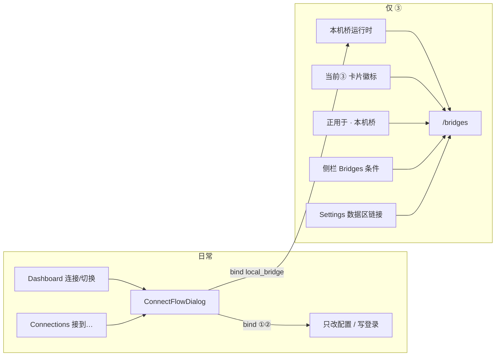
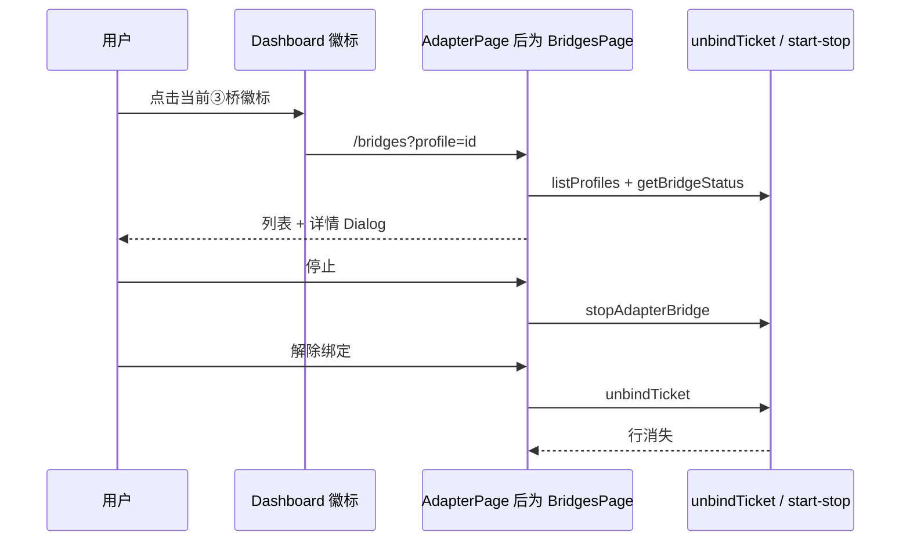

# 「桥与适配」页终态：本机桥运行时（Bridges）

> **现行状态（2026-08-19）：** 侧栏 **Routes / 本机路由**、规范路由 `/routes`；侧栏不再叫「桥与适配」。Settings **四栏** 偏好 / 本机 / 备份 / 关于（备份不并入本机）。托盘菜单 **打开 AgentHub / 打开路由 / 启动路由 / 停止路由 / 退出**。ConnectFlow 芯片 **直连 / 用这份登录 / 本机路由 / 当前不支持**（界面不再标 ①②③）。下文是历史终态设计文，不要当未完成改名任务。  
> **2026-08-16 表面更新**：用户可见名称改为 **本机路由**，侧栏英文 **Routes**，规范路由 `/routes`。`/adapter`、`/router`、`/bridges` 永久跳到 `/routes`。  
> **以下 Overview 起至文末为实施前原文 / 历史 IA**（2026-08-15）：当时规范路由写 `/bridges`、侧栏写 Bridges、页标题写「本机桥」、并按 PR 1–5 计划实施。阅读时把文中 `/bridges`、Bridges、「本机桥」理解为当时用词，不要当成现行路径或侧栏名。对象三分、单层健康、条件侧栏、`partitionLocalBridgeRuntimes` 等 IA 决策仍有效。  
> 条件侧栏已落地：`src/app/runtime/bridge-presence-store.ts` 的 `shouldShowBridgesNav`（只做侧栏可见性，不算 bound/orphan）。页目录为 `src/pages/bridges/`。

| 字段 | 值 |
|---|---|
| 作者 | — |
| 日期 | 2026-08-15 |
| 状态 | Superseded (surface) / implemented (IA) |
| 类型 | 产品 / UX / IA 重设计（无新后端能力） |
| 范围 | 命名、路由、导航位置、页面布局、入口文案、前端模块清理与文档同步 |
| 非范围 | bind 规划器、sidecar 迁移、凭据落盘加密、国产 OAuth 开边、本机桥残留强制删除后端 |

本文解除 Hub Phase 1 的过渡冻结（[hub-redesign-plan.md](hub-redesign-plan.md) §3.2「不移除 `/adapter`、不改路由结构、侧栏改名『桥与适配』、收掉创建区」）。那是过渡期护栏，不是终态 IA。当前页已被产品判定为：名字错、路由错、版式错。本文给出可实施的终态，而不是再改一次标题。

---

## Overview

Hub Phase 1 之后，把票接到 Agent 的日常动作已经离开本页：Dashboard「连接/切换」与 Connections「接到…」共用 `ConnectFlowDialog`，经 `plan()` / `bind()` 写入。绝大多数成功绑定走 ① `native_endpoint` 或 ② `config_sync`，**从不启动本机进程**。本页现在只列出已存在的 `route=local_bridge` 运行时（启停、端口、自动启动、诊断、解绑）。空列表是常态，不是待转化漏斗。

终态把这个表面重新定义为 **本机桥运行时管理**：绑定私有的 loopback 协议转换进程，不是票、不是绑定工作台、也不是 Adapter。侧栏英文专有名词 **Bridges**，仅在本机确有桥（或需要找回孤立运行时）时出现。规范路由改为 `/bridges`。页面不再用「去 Dashboard / 去 Connections」当主 CTA，行也不再画「配置已生效 + 桥接运行中」两层旧 Adapter 名片。

孤立运行时与条件侧栏必须同一套列表语义：`partitionLocalBridgeRuntimes` 在 **PR 1** 落地，PR 3 不得在旧 `filterBoundLocalBridgeRuntimes` 上开条件导航。孤立清理只走 `unbindTicket`，不发明 `removeAdapter` 强删。

---

## Background & Motivation

### 三个对象必须分开

| 对象 | 用户一句话 | 落点 | 本页？ |
|---|---|---|---|
| 票（Ticket） | 一份登录（Key 或订阅） | Connections 钱包 | 否。只引用名称，不展示 token |
| 绑定（Binding） | 这份登录此刻被哪个工具以哪条路线使用 | Dashboard 卡片 / ConnectFlow `bind` | 否。创建与切换不在本页 |
| 本机桥运行时 | 协议对不上时，在这台电脑上开的一层转发进程 | 本表面 | **是。只服务 ③** |

内部模块名 Adapter（`lib/api/adapter`、`AdapterProfile`、`analyze`/`plan`/`apply`）继续存在：ConnectFlow、规划器、capability matrix 都挂在它上面。它**不得再漏进用户可见铬**（侧栏、页标题、空态、确认框、徽标、托盘、本页/桥启动错误）。

### 当前页为什么「没用」

`src/pages/adapter/index.tsx` 的 `AdapterPage` 已经不做创建，但仍按一等 Manage 工作台排版：

- 标题「桥与适配」，把已搬走的「适配」和剩下的「桥」焊在一起。
- 侧栏 `NAV_MANAGE` 是 Manage 里唯一中文项（`Dashboard` / `Connections` / **桥与适配** / `Settings`），违反 [ui-design.md](./ui-design.md)「导航保留英文专有名词」。
- 页内文案互相打架：标题「桥与适配」、段「本机桥运行时」、空态「没有已绑定的本机桥」、删除确认「删除此适配」。
- 路由 `/adapter` 描述的是旧 source→analyze→plan→apply 工作台；`/router` 仍重定向到这里。
- `PageHeader` 主按钮「去 Dashboard 连接」、次按钮「去 Connections」——主行动是离开本页。同一句道歉在 header、`PageSection`、空态重复三遍。
- 行仍是旧 Adapter profile 卡：`adapterConfigStatusView`「配置已生效」+ `adapterServiceStatusView`「桥接运行中」、凭据 Badge、路线 Badge「本地协议转换」。本页只剩 `local_bridge` 之后，这些是冗余。
- `src/pages/adapter/` 仍留着创建流残骸：`AdapterSourceList`、`AdapterTargetGrid`、`AdapterRoutePipeline`、`use-adapter-target-analyses`、`adapter-components.tsx` 的 `AdapterPreviewResult`。ConnectFlow **生产代码并不 import 它们**（`lib/connect-flow/eligibility.ts` 已复制所需逻辑）。**本目录测试会 import**：`index.test.tsx` 从 `./index` 拉 barrel，`adapter-sources.test.ts` / `adapter-view-model.test.ts` 会渲染创建流组件。不能把「生产无 `@/pages/adapter` named import」当成「可以删 re-export」。
- 现行 `filterBoundLocalBridgeRuntimes` 会丢掉「源已删且 `binding.profileId` 未命中」的 `local_bridge`。`index.tsx` 在 `listTicketWallet` 失败时把 `bindingProfileIds` 设成空 `Set`，会把「源已删但仍有绑定」的行也藏掉。

### 量化

| 量 | 预期 |
|---|---|
| 每用户本机桥数 | **通常 0**（①② 不起进程）；偶发 1（如 Codex 订阅 → Claude、Kimi Key → Codex）；极端 2–3 |
| 状态轮询 | 已有 `ADAPTER_BRIDGE_STATUS_POLL_MS = 4_000`；仅 `running` / `degraded`（`shouldPollAdapterBridgeStatus`） |
| 监听 | 仅 `127.0.0.1`；不是钱包里的新票，不能再 bind |
| 空态占比 | 首屏主 UI。按产品三路，这是健康态，不是失败态。仅当 `bound + orphan === 0` 且 profile 列表成功 |

Phase 1 冻结已经完成它的工作：创建区收掉、bind 入口收口。继续把空页当一等导航，是在惩罚默认用户。

---

## Goals & Non-Goals

### Goals

1. 用户能用一句话说清这个表面：**管本机转发进程**。
2. 命名、路由、侧栏、页内文案、托盘与**本机桥专用**错误一致，且这些表面不再出现「适配 / Adapter」。①②③ 共用的 bind / profile-load 错误必须保持路线中性，不得改写成「本机桥」。规划器/矩阵里的规则说明不在本页 IA 里改写。
3. 零桥时不把本页做成转化漏斗；有桥时一行能看懂健康、端口、启停。
4. 从未见过侧栏项的用户，仍能从 Settings 回收入口、书签 `/adapter`、托盘文案、以及（若仍存在）侧栏 / Connections 用途找回卡住或孤立的运行时。Dashboard 徽标**只服务当前生效的 ③**，不是孤立回收通道。
5. 删掉本页创建流残骸；ConnectFlow 与 `lib/api/adapter` 行为不变。
6. 文档与代码同步到终态 IA（解除 Phase 1 冻结表述）。

### Non-Goals（硬约束）

- 不把 source→analyze→plan→apply 搬回本页；不在本页新建 bind UI。
- 不改三路产品决策；本表面只服务 ③。
- 不改 tickets `bind` / `unbind` 语义；解绑与孤立清理都走 `unbindTicket`。
- **不新增**「残留 profile 强制删除」后端；`removeAdapter` 对 `local_bridge` 本来就会再走 unbind 或被 core 拒绝，本页不拿它当逃逸舱。
- 不在本页展示或复制完整 token；日志不记请求正文。
- **不做凭据落盘加密**（项目范围外）。
- **不做国产 OAuth 适配 / OAuth→API**（产品关闭）。
- **不做 `agenthub-adapterd` sidecar 迁移**（已决策、未交付；本轮 `BridgeRuntimeHost` 仍由 Tauri `AppState` 持有）。
- 页面不 `invoke`；只走 `lib/api/*`。`lib/backend/tauri/` 仍是唯一 invoke 点。
- 测试不与生产同文件；不往生产 façade 加 `__reset*ForTests`。
- 不把 `lib/api/adapter`、`lib/backend/contracts/adapter.ts`、Rust `Adapter*` 在本轮改名（实现债，见命名节）。

---

## Key Decisions

| # | 决策 | 理由（一句话） |
|---|---|---|
| K1 | 本表面的对象是 **本机桥运行时**：绑定私有的 loopback 协议转换进程 | 票在 Connections，绑定在 Dashboard/ConnectFlow；这里只剩进程 |
| K2 | IA 采用 **方案 B′**：独立页 `/bridges` + **条件侧栏** + Settings 常驻回收链 + 徽标/用途深链 | 空是常态，不能占一等导航；进程操作又需要完整页，不能只靠 sheet |
| K3 | 侧栏英文 **Bridges**；页标题/正文中文 **本机桥** | 对齐 ui-design 导航专有名词规则，拆掉「适配」 |
| K4 | 规范路由 **`/bridges`**；`/adapter`、`/router` 永久 `replace` 过来；不嵌 Settings | `/adapter` 描述旧工作台；Settings 是偏好不是运行时 |
| K5 | 健康空态 **没有**「去 Dashboard 连接」主按钮；仅当 profile 与钱包都已结算，且 `bound+orphan===0`，且 **last-known** `walletBridgeCount===0` | 空是健康默认；钱包失败保留上次 count，不得因此掉进健康空态 |
| K6 | 行与详情的主视觉都是 **单层进程健康 + 端口**；丢掉「配置已生效 / 桥接运行中」 | 本页只剩 `local_bridge`，配置层几乎恒为已生效 |
| K7 | 列出 **全部** `route=local_bridge`：`partitionLocalBridgeRuntimes`；**PR 1 落地** | 旧 filter 会藏残留进程；PR 3 条件导航不得建立在旧 filter 上 |
| K8 | Dashboard 徽标（仅当前 ③）/ Connections「本机桥」→ `/bridges?profile=`；`profileId == null` 则 `/bridges` | 管这条绑定的 runtime；徽标不是孤立回收 |
| K9 | 本轮 **不** 重命名 `lib/api/adapter` 与 contracts；`src/pages/bridges/` **只在 PR 4** 出现 | ConnectFlow / mock / Rust 仍挂 adapter 模块 |
| K10 | `bridge-presence-store` **只做侧栏可见性**，不订阅连接池、不算 bound/orphan | 分区需要 pool，页上已有；store 重复分区会分叉 |
| K11 | **不做**侧栏 `StatusPin` | Dashboard / Bridges 的 4s poll 都是组件内状态，不存在可订阅的健康快照 |
| K12 | 孤立清理 = `unbindTicket`（优先钱包 id，否则 `ticketIdFor` + `targetAgentId`） | core unbind 已按 `(source, agent)` 停桥+删投影+profile；`removeAdapter` 不是更强锤子 |
| K13 | 钱包读取失败不得把 `bindingProfileIds` / `walletBridgeCount` 写成 0 | 现页 `catch → new Set()` 会藏源已删仍绑定的行 |
| K14 | `index.tsx` create-flow barrel **留到 PR 4**；PR 1 **不迁** `src/pages/adapter/` | `index.test.tsx` 从 `./index` 进口；生产无 `@/pages/adapter` named import ≠ 测试无消费者 |

---

## Proposed Design

### 1. 这个表面是什么（用户一句话）

> **本机桥：协议对不上时，在这台电脑上跑的一层转发。目标工具只连 127.0.0.1，真正的登录留在 Connections。**

对照：

- Connections 管 **票**。
- Dashboard / ConnectFlow 管 **绑定**（① 改配置 / ② 写进对方认的登录 / ③ 起桥）。
- 本页只在 ③ 已经发生之后，管 **进程**（端口、启停、自动启动、诊断、解绑）。

### 2. 信息架构：备选与选定

#### 备选评估

| 方案 | 做法 | 优点 | 代价 | 结论 |
|---|---|---|---|---|
| A | 仍一等 Manage 页，只改名改样式 | 路由风险最小 | 空页仍占侧栏；继续把兜底路径当日常工作台 | 否。用户已判 layout 错，不是换皮 |
| B | 有桥才显示侧栏项 | 匹配「通常 0」；有桥时仍可发现 | 从未见过该项的人要有回收路径 | **采用其可见性规则** |
| C | 降进 Settings（`/settings/bridges` 或一节） | 侧栏永远干净 | Settings 现有 tab 是偏好/备份/关于（`general/security/data/backups/about`）。启停、4s 健康、解绑不是偏好。Backup 并入 Settings 的先例是「偶尔的数据任务」，不是常驻进程 | 否。只放一条回收链接 |
| D | 折进 Dashboard 段/抽屉 | 靠近 Agent 卡片 | Dashboard 已是「卡片 + 用量」；桥是机器级进程（一张票可桥到另一工具），不是卡片附件。诊断/解绑会撑破卡片 | 否。卡片只留**当前 ③**徽标 |
| E | 折进 Connections（tab / 过滤 / 行） | 「正用于」已有本机桥字样 | 把进程焊回钱包，重新混淆票与 runtime；钱包正在按票重构，不宜再塞启停 | 否。行上只留可点芯片 |
| F | 无独立页：徽标只开 sheet | 零桥完全无页 | 2–3 桥的舰队、孤立清理、状态读取失败、书签落地都没有家。解绑确认叠在 Dashboard 上过挤 | 否 |

#### 选定：方案 B′（B 的可见性 + 独立页 + C 的回收链 + D/E 的深链）

```text
日常路径（①②，无进程）
  Dashboard / Connections → ConnectFlow → 结束。侧栏无 Bridges。

例外路径（③，当前生效）
  ConnectFlow bind 成功
    → Dashboard 卡片出现桥徽标（仅 current ③）
    → Connections「正用于：Codex（本机桥 · 运行中）」可点
    → 侧栏出现 Bridges
    → 规范页 /bridges

回收路径（从未见过侧栏，或非当前 ③ / 孤立）
  书签 /adapter|/router → /bridges
  Settings → 数据 → 「本机桥运行时」（永远在）
  直接输入 /bridges
  托盘退出对话提到本机桥
  条件侧栏（list 上有 local_bridge，含孤立）
```

Dashboard 徽标 **不能** 找回「生成投影已不是当前 Provider」的桥。那是 K7 列表 + Settings + 侧栏的工作。



**为何不是纯 B、纯 F：** 条件侧栏解决「空页占位」；独立页解决舰队、孤立、深链、确认框。Sheet-only 无法承载解绑 + 诊断 + 多桥。

### 3. 侧栏可见性（精确规则）

新增 `src/app/runtime/bridge-presence-store.ts`。**只供 Sidebar 决定显隐。** 不算 bound/orphan，不订阅连接池，不 4s 轮询健康，不写 `StatusPin`。

Bridges **页**继续用自己的 pool + `partitionLocalBridgeRuntimes`（PR 1 已有）。禁止把 presence 快照当页数据源，以免和页上分区分叉。

刷新时机：

- 应用启动后 idle 时拉一次 `listAdapterProfiles` + `listTicketWallet`。
- `notifyBridgePresenceChanged()`：**只**从 `bindTicket` / `unbindTicket` 调用（二者已有 `notifyConnectionPoolChanged`）。不要改 ConnectFlow，也不要订阅每一次 pool 变更（账号/Provider 编辑会误伤）。
- 启停、autoStart **不**改变「有没有 local_bridge profile」，不必通知。解绑后 profile 消失，走 `unbindTicket` 即可。

```ts
type BridgePresenceSnapshot = {
  /** profiles 与 wallet 各自的加载态；任一侧失败则为 error，但不得清掉另一侧上次成功值 */
  status: 'idle' | 'loading' | 'ready' | 'error';
  /** 上次成功的 listProfiles 里是否存在任一 route=local_bridge（含孤立） */
  hasLocalBridgeProfile: boolean;
  /** 上次成功的 wallet.bindings 中 route=bridge 的条数；失败不得写成 0 */
  walletBridgeCount: number;
  /** 本次会话曾经 ready 且（hasLocalBridgeProfile ∨ walletBridgeCount>0） */
  lastNonZero: boolean;
};

function shouldShowBridgesNav(s: BridgePresenceSnapshot): boolean {
  if (s.hasLocalBridgeProfile) return true;
  if (s.walletBridgeCount > 0) return true;
  if (s.status === 'error' && s.lastNonZero) return true;
  return false;
}
```

失败语义（K13）：

| 失败 | 正确 | 禁止 |
|---|---|---|
| `listProfiles` 失败 | 保留上次 `hasLocalBridgeProfile`；`status='error'` | 当成「没有 profile」 |
| `listTicketWallet` 失败 | 保留上次 `walletBridgeCount`；`status='error'` | `walletBridgeCount = 0` |
| 两侧都从未成功 | `hasLocalBridgeProfile=false`，`walletBridgeCount=0`，`status='error'`，`lastNonZero=false` → 侧栏隐藏 | 假装 ready 空 |

页上的 `bindingProfileIds` 同样：钱包失败时 **保留上次 Set**（对照 `mergeAdapterProfileLoad`）。禁止再 `catch → setBindingProfileIds(new Set())`。

| 情况 | 侧栏 | 页上 | 用户怎么找回 |
|---|---|---|---|
| 从未 bind 过 ③，列表成功且 `bound+orphan===0`，钱包无 bridge | 隐藏 | 健康空态 | 不需要。Settings 与 `/bridges` 仍在 |
| 至少 1 条已绑定桥 | 显示 | 主列表 | 侧栏 / 当前③徽标 / 用途芯片 |
| 源票已删，但 `binding.profileId` 仍命中 | 显示 | 主列表，标「来源连接已删除」 | 侧栏 / Settings |
| 源票与 binding 都没了，profile 仍在（孤立） | 显示 | **只**显示「孤立本机桥」，**不**套健康空态 | 侧栏 / Settings |
| `listProfiles` 成功且空，钱包仍有 `route=bridge` | 显示 | **非健康**说明 + 重试，不是「没有本机桥」 | 侧栏进页 |
| `listProfiles` 首次失败，钱包无 bridge 且从未非零 | 隐藏 | `ErrorState` + 重试 | Settings → `/bridges` |
| `listProfiles` 失败，钱包有 bridge 或 `lastNonZero` | 显示 | `ErrorState` + 重试 | 侧栏进页 |
| 本会话刚解绑到 0 | 隐藏 | 若仍停在 `/bridges`：健康空态；不踢走 | — |

首屏策略：**默认按空处理**（不闪一下 Bridges），`ready`/`error` 后再插入。

图标：Lucide `Cable`（替换 `Boxes`）。PR 2 与路径、英文 label 一起换。

### 4. 命名系统

#### 4.1 用户可见「适配 / Adapter」清单（本轮必改）

Goal 2 的验收是这张表，不是「页标题改了就算」。托盘进 **PR 1**（与 GUI 文案同批），不放到文档 PR。

| 位置 | 现文案 | 终态 |
|---|---|---|
| 侧栏 | 桥与适配 | **Bridges**（PR 2 与路径同时改） |
| 页标题 | 桥与适配 | **本机桥** |
| PageHeader description | 本页只管理已绑定的本机桥运行时…创建绑定请走… | **本机协议转换 · 仅 127.0.0.1** |
| descriptionTip | 凭据保存在 Connections… | **凭据在 Connections，不展示不复制。多数连接不需要本机转发。需保持托盘运行。日志不记请求正文。** |
| 段标题 | 本机桥运行时 + 道歉句 | **删除该 PageSection 外壳**。≥2 条时一行舰队摘要 |
| 健康空态标题 | 没有已绑定的本机桥 | **没有本机桥** |
| 健康空态描述 | 创建绑定不在本页。请走 Dashboard… | **多数连接不需要本机转发。只有协议对不上时才会在这台电脑上开一层转换。若刚完成需要转发的绑定，到 Dashboard 看对应工具上的桥状态。**（一段，塞进现有 `EmptyState` 的 `description`；不扩展组件） |
| 健康空态主按钮 | 去 Dashboard 连接 | **无**。不传 `actionLabel` / `onAction`，也不用 `action` 槽做第二段（描述里已含 hint） |
| 钱包有桥但列表空 | （无） | **钱包里有本机桥绑定，但找不到运行时。** + 重试。禁止用健康空态 |
| 行主状态 | 配置已生效 / 桥接运行中 | **运行中 / 启动中 / 停止中 / 已降级 / 启动失败 / 已停止 / 状态不可用** |
| 行 Badge | API Key + 本地协议转换 | 行上不放。详情里可保留凭据族 |
| 停确认 | 停止本地桥接？ / 目标 Agent 将无法访问此桥接 | **停止本机桥？** / **停止后，该工具将无法通过此转发访问上游。** |
| 解绑确认 | 删除此适配？ / 确认删除 / 无法删除此适配 | **解除本机桥绑定？** / **确认解除** / **无法解除本机桥绑定** |
| 解绑描述 | 会解除这条绑定并停桥。来源票仍留在钱包。 | **会停桥并恢复该工具上一份配置。票仍留在 Connections。**（孤立行可加一句「来源或绑定记录已不在，仍走同一解除。」） |
| 详情危险按钮 | 删除适配 | **解除绑定** |
| 详情状态区 | 配置 / 服务 两行 | **单层运行时状态**。禁止「配置已生效」块 |
| 详情分区 | 本地桥接 / 生成的连接 + 链到 Connections | **本机端点** / **目标写入**（纯文字，见 §6.7） |
| 详情恢复步骤 | 删除此适配后重新创建 | **解除绑定后，到 Dashboard 重新连接。** |
| 列表读失败 | 无法读取适配 | **无法读取本机桥** |
| 行内 / 详情 mutation fallback | 适配操作失败 | **本机桥操作失败** |
| Dashboard 徽标 tip | 管理桥与适配 | **管理本机桥** |
| Dashboard 徽标字 | 运行中 / 已停止 / 已降级 / 状态不可用 | 保持 |
| Connections 用途 | 纯文本「本机桥 · 运行中」 | 「本机桥」可点；`profileId` 空则 `/bridges` |
| 托盘标题 | 本地适配服务正在运行 | **本机桥正在运行** |
| 托盘计数 | `{n} 个本地适配服务正在运行。` | **{n} 个本机桥正在运行。** |
| 托盘读失败 | 本地适配服务状态暂时无法读取。 | **本机桥状态暂时无法读取。** |
| 托盘第二层标题 | 继续运行本地适配服务？ | **继续运行本机桥？** |
| 托盘隐藏说明（退出） | 会保留正在运行的本地适配服务和 Connections… | **会保留正在运行的本机桥和 Connections…** |
| 托盘隐藏说明（重启） | 同上 + 暂不重启 | 同步改「本机桥」 |
| 桥启动/停止后端错误 | 本地适配服务无法启动或停止 [{code}]: …（`adapter_bridge_controller.rs`） | **本机桥无法启动或停止 [{code}]: …**（仅桥控制面，进 PR 1） |
| Tauri façade fallback | 适配操作失败（`lib/backend/tauri/adapter.ts`） | **操作失败**（analyze/plan/apply/bridge **共用**；禁止改成「本机桥操作失败」） |
| ConnectFlow 原生切换说明 | 不会创建跨服务适配。（`ConnectFlowDialog.tsx` 原生切换预览） | **不会创建跨服务绑定。**（可改：不暗示 ③） |
| ConnectFlow 确认失败 | 绑定已生效，但未找到适配配置（`default-deps.ts` `bindViaTicket`） | **绑定已生效，但未找到对应的绑定配置**（①②③ 共用；**禁止**「未找到本机桥配置」） |
| ConnectFlow 加载碎片 | 适配档案（`connect-flow-state.ts`，`listAdapterProfiles` 失败、用来排除生成投影） | **绑定档案**（全量 profile，不是 Bridges 页；**禁止**「本机桥档案」） |
| README 模块行 | Adapter / 侧栏「桥与适配」 | **Bridges** / 本机桥运行时（PR 5） |

**本轮不改 / 另开任务**（不是本页铬，或改了等于重写规划器文案）：

- 能力矩阵 / `plan.reason` / mock 里的「适配规则」「不会创建适配、启动 Bridge」等——ConnectFlow 预览仍可能带出，属规划器文案，另开任务。
- 文档标题「厂商、API 与 OAuth 适配规则」、代码注释、测试夹具、Rust 模块名。
- Skills / provider-detect 里与本页无关的「适配器」。

**PR 1 硬约束：** ConnectFlow 字符串改动必须对 ①②③ 仍然成立。只把「适配」换成「本机桥」不等于完成 Goal 2。

#### 4.2 内部标识

| 标识 | 何时 | 说明 |
|---|---|---|
| `src/pages/adapter/` → `src/pages/bridges/` | **仅 PR 4** | PR 1–3 继续用现目录与 `AdapterPage` default export |
| `AdapterPage` → `BridgesPage` | **仅 PR 4** | |
| `filterBoundLocalBridgeRuntimes` → `partitionLocalBridgeRuntimes` | **PR 1** | 改语义；旧测试「源没了就丢掉」必须翻案 |
| `adapterServiceStatusView` → `bridgeRuntimeStatusView` | **PR 1** | 可先留旧名再包一层，避免 PR 1 大搬 |
| `adapterProfilePrimaryAction` | **PR 1 改签名** | 增加 `statusUnavailable` + last-known，见 §6.3 |
| `unavailableBridgeStatusForPoll` | **PR 1 改语义** | 保留 last-known `state` 与 port；`state:'error'` 不得再当启动失败 |
| `index.tsx` create-flow re-export barrel | **PR 4 才删** | `index.test.tsx` 从 `./index` 进口；谁拆 barrel 谁改测试 |
| `lib/api/adapter` / contracts / tauri port / mocks / Rust `Adapter*` | **不改名** | |

`lib/connect-flow/eligibility.ts` 顶部「Copied from adapter-sources」在 PR 4 删文件后改为「canonical in this module」。

### 5. 路由

| 路径 | 行为 |
|---|---|
| `/bridges` | 规范页。PR 2–3 仍渲染 `@/pages/adapter` 的 default export（`AdapterPage`）。PR 4 才改成 `BridgesPage` |
| `/bridges?profile=<profileId>` | 打开对应详情；找不到或 `profileId` 缺失则留在列表，不 toast |
| `/adapter`、`/adapter?…` | `<Navigate replace>` 到 `/bridges`，保留非 `tab` 查询，丢弃遗留 `?tab=api\|oauth` |
| `/router`、`/router?…` | 同样 `replace` 到 `/bridges` |
| `/settings/bridges` | **不建** |

PR 2 的 `App.tsx`（注意：**不要**提前引入 `BridgesPage` / `src/pages/bridges`）：

```tsx
import AdapterPage from '@/pages/adapter';

<Route path="/bridges" element={<AdapterPage />} />
<Route path="/adapter" element={<LegacyBridgesRedirect />} />
<Route path="/router" element={<LegacyBridgesRedirect />} />
```

`LegacyBridgesRedirect` 与现有 `LegacyConnectionsRedirect` / `LegacyBackupsRedirect` 同模式。

Dashboard：`adapterBadgeHits` 只在 **当前** Provider id === `generatedProviderId` 时有 `hit`。徽标 = 当前 ③。`navigate(hit.profile.id ? `/bridges?profile=${hit.profile.id}` : '/bridges')`。`view.bridge` 需带上 `profileId`。无 hit 的孤立 / 非当前桥 **没有徽标**。

Connections：把用途从单字符串改成 parts。`route==='bridge'` 且 `profileId` 有值 → `Link` 到 `/bridges?profile=`；`profileId == null` → `Link` 到 `/bridges`（无 query）。搜索仍匹配「本机桥」（钱包模型测试覆盖）。点击芯片不打开 ConnectFlow（行上本来就只有「接到…」才开会话）。

### 6. 布局与交互（每一态）

`App.tsx` 已对非 Chat/Skills 包了 `pageRhythm.pageShell`。本页 **不要**再包一层 `pageShell`。页内 = `PageHeader` + `pageRhythm.stackDense` 列表。不要再套标题「本机桥运行时」的 `PageSection`。

页状态用 **last-known** 钱包计数（与 `bindingProfileIds` / presence 同一套「失败保留上次」）。**不要** `AND`「本次钱包 fetch 成功」之类的 `walletReady`：失败但上次 `walletBridgeCount > 0` 时仍应进 `wallet_without_runtime`，不能掉进健康空态。

```ts
type WalletView = {
  /** 至少完成过一次 fetch（成功，或失败且已有/已确定为空的 last） */
  settled: boolean;
  /** 上次成功读到的 route=bridge 条数；失败不得写成 0 */
  lastWalletBridgeCount: number;
};

function pageViewState(input: {
  profileState: 'loading' | 'ready' | 'error';
  bound: AdapterProfile[];
  orphan: AdapterProfile[];
  wallet: WalletView;
}): 'loading' | 'list_error' | 'list' | 'wallet_without_runtime' | 'healthy_empty' {
  if (input.profileState === 'loading' || !input.wallet.settled) return 'loading';
  if (input.profileState === 'error') return 'list_error';
  if (input.bound.length + input.orphan.length > 0) return 'list'; // 含 only-orphan
  if (input.wallet.lastWalletBridgeCount > 0) return 'wallet_without_runtime';
  return 'healthy_empty';
}
```

`wallet.settled === false`（从未完成过一次钱包请求、也没有 last 快照）→ **保持 loading**，即使 profile 列表已经空。两边都结算后（成功，或失败且 last 为空）才允许 `healthy_empty`。

#### 6.1 健康空态（profile 与钱包均已结算，且 `bound+orphan===0`，且 last-known `walletBridgeCount===0`）

```
┌─ 本机桥 ──────────────────────────────────────────────────┐
│ 本机协议转换 · 仅 127.0.0.1                                 │
│                                                            │
│        ⌇                                                   │
│        没有本机桥                                          │
│        多数连接不需要本机转发。只有协议对不上时             │
│        才会在这台电脑上开一层转换。                         │
│        若刚完成需要转发的绑定，到 Dashboard                │
│        看对应工具上的桥状态。                               │
└────────────────────────────────────────────────────────────┘
```

`EmptyState`：`title` + **一段** `description`（含 hint）。不传按钮。不扩展 `EmptyState`。

这是对 [ui-design.md](./ui-design.md) §1.4 的**显式例外**。

禁止：header「去 Dashboard 连接」；段描述再道歉；嵌 ConnectFlow。

#### 6.1b 仅孤立（`bound===0 && orphan>0`）

**跳过** `EmptyState`。直接「孤立本机桥」分区 + 行。不得上下叠「没有本机桥」。

#### 6.1c 钱包 last-known 有 bridge、profile 列表成功且 `bound+orphan===0`

判定只看 `lastWalletBridgeCount > 0`（含「本次钱包 fetch 失败、但上次 count > 0」）。**不是**「本次钱包成功」。

```
钱包里有本机桥绑定，但找不到运行时。
可重试读取。不是「没有本机桥」。
[重试]
```

用 `ErrorState` 或 `Notice` + 重试，不是健康空态。钱包仍未结算时走 skeleton，不闪健康空态。

#### 6.2 一桥 · 运行中

```
┌─ 本机桥 ──────────────────────────────────────────────────┐
│ 本机协议转换 · 仅 127.0.0.1                                 │
│                                                            │
│ ● 运行中    Kimi 会员  →  Codex     127.0.0.1:43121⧉  [停止] [详情] │
└────────────────────────────────────────────────────────────┘
```

一条桥不显示舰队数字。托盘依赖放在 header tip。

#### 6.3 降级 / 启动失败 / 状态不可用

**读失败 ≠ 桥故障。** 现实现做不到本文矩阵，必须改 helper / 主按钮，不能写「继续用现函数」。

今日缺口：

- `unavailableBridgeStatusForPoll` 保留 port，但把 `state` 写成 `'error'`。
- `adapterProfilePrimaryAction` 不看 `statusUnavailable`，见到 `error` 就返回「重试启动」。
- 于是「运行中的桥 + 状态读取失败」会变成启动失败语义，可能对仍活着的 listener 再 start。

PR 1 必须同时做：

1. **`unavailableBridgeStatusForPoll`**：保留 `previous.state`（无 previous 才用占位 `error`）以及 port / endpoint / startedAt。注释写明：`error` 只是「从未观测过」的占位，不是启动失败。
2. **`adapterProfilePrimaryAction`** 增加参数：

```ts
export function adapterProfilePrimaryAction(input: {
  route: AdapterProfile['route'];
  bridgeState?: AdapterBridgeRuntimeState;
  lastErrorCode?: string | null;
  statusUnavailable?: boolean;
}): AdapterProfilePrimaryAction | null {
  if (input.route !== 'local_bridge') return null;
  const ownsListener = input.bridgeState === 'running' || input.bridgeState === 'degraded';
  if (input.statusUnavailable) {
    return ownsListener
      ? { kind: 'stop', label: '停止' }
      : { kind: 'start', label: '启动' }; // 不是「重试启动」
  }
  if (ownsListener) return { kind: 'stop', label: '停止' };
  const retry = input.bridgeState === 'error' || Boolean(input.lastErrorCode?.trim());
  return { kind: 'start', label: retry ? '重试启动' : '启动' };
}
```

3. **标签**仍由 `bridgeRuntimeStatusView`：`statusUnavailable` 优先 →「状态不可用」，即使 `bridgeState` 仍是 last-known `running`。
4. **测试**：last-known `running` + 读失败 → 标签「状态不可用」+ 主按钮「停止」；不得出现「启动失败」/「重试启动」。`degraded` 同理。从未有过状态的读失败 →「状态不可用」+「启动」。

| 观测 | 主状态 | tone | 主按钮 |
|---|---|---|---|
| `running` | 运行中 | success | 停止 |
| `starting` / `stopping` | 启动中 / 停止中 | info + pulse | 禁用 |
| `degraded` | 已降级 | warning | **停止** |
| `error` 且非读失败 | 启动失败 | danger | 重试启动 |
| 读失败 + last-known running/degraded | 状态不可用 | muted | **停止** |
| 读失败 + 其余 | 状态不可用 | muted | 启动 |
| `stopped` / 无状态 | 已停止 | muted | 启动 |
| `needs_attention` | 不占主状态列 | 行下 warning | 详情 |

#### 6.4 多桥 + 舰队 + 托盘

`bound.length + orphan.length >= 2` 时列表上方一行：

```
2 个本机桥 · 1 个运行中 · 需保持托盘运行
```

`running` 与 `degraded` 都算运行中。①② 不计。

#### 6.5 停止确认

沿用 `busy-confirmation`。

```
停止本机桥？
停止后，该工具将无法通过此转发访问上游。

Kimi 会员 → Codex

[取消]  [确认停止]
```

#### 6.6 解绑确认

日常与孤立 **同一条命令**：`unbindTicket`。

```
解除本机桥绑定？
会停桥并恢复该工具上一份配置。票仍留在 Connections。

Kimi 会员 → Codex

[取消]  [确认解除]
```

孤立行描述可多一句「来源或绑定记录已不在，仍走同一解除。」按钮仍是「确认解除」，不是另一套删除。

解析 id（与今日页一致，只是不再有 B 计划）：

```ts
const ticketId = binding?.ticketId ?? ticketIdFor(profile.sourceKind, profile.sourceId);
const agentId = binding?.agentId ?? profile.targetAgentId;
await unbindTicket(ticketId, agentId);
```

`TicketBindService::unbind` 按 `(source_kind, source_id, agent_id)` 找 profile，停 listener、恢复上一份 live、删投影与 profile。`remove_adapter_with_bridge_cleanup` 对 `LocalBridge` 也是再调 unbind。core `AdapterApplyService::remove` **拒绝** `local_bridge`。因此本页 **禁止** 再提供 `removeAdapter` 按钮或「unbind 失败就 force-delete」。unbind 失败 → 展示错误 +「重试解除」。

#### 6.7 详情：行上 vs Dialog

**留在行上**

- 单层健康
- `来源票名 → 目标 Agent`
- 端口（复制 `http://127.0.0.1:port`）
- 「来源连接已删除」
- 一个主按钮 + 详情
- 行内 mutation 错误

**进详情 Dialog**

- **单层**运行时状态（与行同一套 `bridgeRuntimeStatusView`）。**删除**「配置 / 服务」两行和「配置已生效」块。
- 自动启动 Switch（「仅在 AgentHub 运行时恢复，不是开机自启」）
- 上游状态
- 目标写入：若有 `generatedProviderId`，纯文字「已写入 {Agent} 的本机地址；这不是 Connections 里的票。」**禁止**链到 `/connections?agent=`（生成投影不得出现在钱包）。需要看当前绑定去 **Dashboard** 对应卡片，或关掉详情看本页行。
- 凭据族 Badge 可留在 header 次行
- `needs_attention` 恢复步骤（文案见 §4.1）
- 折叠诊断：profile id、ruleId/version、时间戳、lastErrorCode、打开日志目录
- 页脚：解除绑定 / 关闭

不进详情：analyze/plan、路线管道、能力矩阵、完整 token。

深链 `?profile=` 在列表 ready 后打开该 Dialog；关闭时 `navigate(BRIDGES_PATH, { replace: true })` 清 query（PR 2 之前 path 仍是 `/adapter`，用当时的规范 path）。



### 7. 行设计

丢掉行上与详情里的 `adapterConfigStatusView`。

```
┌ ListRow p-3 ─────────────────────────────────────────────┐
│ [● 运行中]   来源名 → 目标名     127.0.0.1:port⧉   [停止] [详情] │
│              （可选）来源连接已删除 / 上次未完成（CODE）          │
└──────────────────────────────────────────────────────────┘
```

- 行上不放凭据/路线 Badge。
- `StatusLine` 只渲染 `bridgeRuntimeStatusView`。
- 主按钮走改过签名的 `adapterProfilePrimaryAction`。
- `EndpointCopy` 保留。

### 8. 入口与文案

| 入口 | 现行为 | 终态 |
|---|---|---|
| 侧栏 | 永远「桥与适配」→ `/adapter` | PR 2：**常驻** `Bridges` → `/bridges`（路径+英文一次改）。PR 3：改条件显隐 |
| Dashboard 徽标 | `navigate('/adapter')` | 仅当前 ③；`/bridges?profile=`；tip「管理本机桥」；`stopPropagation` |
| Connections「正用于」 | 纯文本 | parts；有 `profileId` 带 query，否则 `/bridges` |
| ConnectFlow | 唯一创建路径 | **行为不变**。可选成功句「本机桥已启动」放 PR 2（路径已在） |
| Settings → 数据 | 无 | 常驻一行，**不**看 presence |
| 托盘 | 「本地适配服务」全套 | PR 1 改完 §4.1 托盘六条 |
| TopBar 通知 | 无 | 本轮不加。健康只在徽标与行上 |
| 书签 `/adapter` | 旧工作台 | PR 2 起 replace |

本页 header **无 actions**。

### 9. 孤立运行时与回收

现行 `isBoundLocalBridgeRuntime` 在「源没了且 wallet 未命中」时丢行。`listTicketWallet` 失败时再清空 `bindingProfileIds`，连「源没了但 binding 仍在」也丢。

PR 1 起：

```ts
type BridgePartition = {
  bound: AdapterProfile[];   // 来源仍在 ∨ last-known bindingProfileIds 命中
  orphan: AdapterProfile[];  // 其余 route=local_bridge 且 sourceId 非空
};

function partitionLocalBridgeRuntimes(...): BridgePartition { /* */ }
```

- `sourceId` 空的脏行丢弃。
- 钱包失败：用上次 `bindingProfileIds`，不要空 Set。
- `bound` 主列表；`orphan` 用 `PageSection`「孤立本机桥」：「来源票或绑定记录已不在。停止或解除仍走同一套命令。」
- 仅孤立：§6.1b，无健康空态。
- 启停 / 解除与 bound 行同一套。解除 = `unbindTicket`（K12）。

回收通道（从未见过侧栏）：

1. Settings「本机桥运行时」（永远）
2. `/bridges` 与 `/adapter` 书签
3. PR 3 之后：侧栏（`hasLocalBridgeProfile` 含孤立）
4. Connections 用途芯片（若钱包仍有 `route=bridge`）
5. **不是** Dashboard 徽标（只覆盖当前 ③）

### 10. 组件与文件

**PR 1–3 仍在 `src/pages/adapter/`。** 目标树是 PR 4 才长出来的：

```
src/pages/bridges/                 # 仅 PR 4
  index.tsx                      # BridgesPage；此时才删 create-flow barrel
  index.test.tsx                 # 先改写再删 preview 测试
  ...

src/app/runtime/bridge-presence-store.ts   # PR 3
src-tauri/src/tray.rs                      # PR 1
```

PR 1 在现文件上改：`index.tsx`（去 CTA、确认框、partition、钱包失败保留 Set）、`adapter-view-model.ts`、`adapter-model.ts`（poll helper）、`AdapterProfilesList.tsx`、`AdapterProfileDetailDialog.tsx`、对应测试。**不拆 barrel，不迁目录。** 新断言可以继续 `from './index'` 或改从 model 文件进口；不得为了「清理 unused export」拆掉测试还在用的符号。

PR 4 删除创建流文件之前，必须先改写 `index.test.tsx` / `adapter-sources.test.ts` / `adapter-view-model.test.ts` 里对 `AdapterPreviewResult`、`AdapterSourceList`、`AdapterTargetGrid`、`AdapterRoutePipeline` 的渲染。ConnectFlow 生产不引用这些文件，但测试引用。

Dashboard 与本页双份 4s poll 本轮不合并。

### 11. 文档同步（PR 5）

| 文档 | 改什么 |
|---|---|
| `docs/ui-design.md` | §1 导航；§3 线框；§1.4 空态例外；§4.1 徽标=当前③；重写 §4.3.3 |
| `docs/adapter-design.md` | §1 / §4 按本页终态；用户表面 Bridges，模块仍叫 Adapter |
| `docs/connection-binding-model.md` | §5.3 徽标范围；§5.5 `/bridges`、条件侧栏、单层行、禁止链到钱包投影 |
| `docs/hub-redesign-plan.md` | 文首：§3.2 冻结已解除。**§4 实施锚点**改指向仍存在的文件：`use-adapter-target-analyses.ts` → `src/lib/connect-flow/`（fan-out / eligibility）；`adapter-sources.ts` → `src/lib/connect-flow/eligibility.ts`；桥轮询 → `src/pages/bridges/use-bridge-resources.ts`。标「历史 Phase 1 文件名」以免 404 |
| `docs/agenthub-plan.md` / `architecture.md` / `adapter-kimi-codex-dogfood.md` / `docs/README.md` / `README.md` | `/adapter`→`/bridges`；模块行 Bridges |

不改 `product-decisions.md` 产品决策；sidecar 文只改「Adapter 页面」称呼。

### 12. 风险

| 风险 | 严重度 | 缓解 |
|---|---|---|
| 书签 `/adapter` | 中 | PR 2 永久 replace |
| 条件侧栏找不到页 | 中 | Settings 常驻；K7 使孤立也亮侧栏 |
| PR 3 先于 partition | 高 | partition 锁在 PR 1；PR 3 依赖 PR 1 |
| 拆 barrel 弄坏 `index.test.tsx` | 高 | PR 1 不拆；PR 4 先改测试 |
| `removeAdapter` 当强删 | 高 | 不提供该按钮；只 unbind |
| 读失败去 start | 高 | PR 1 改 helper + primaryAction + 测试 |
| 钱包失败藏行 | 高 | 保留 last Set |
| 双份 4s poll | 低 | 1–3 条；不合并 |
| GUI/托盘文案分叉 | 中 | 托盘在 PR 1 |
| 规划器 reason 仍含「适配」 | 低 | 本轮不改矩阵文案，已知残留 |

---

## API / Interface Changes

无后端命令、无 DTO、无残留删除 API。

```ts
// PR 3：src/app/runtime/bridge-presence-store.ts（可见性 only）
export function loadBridgePresence(): Promise<void>;
export function subscribeBridgePresence(fn: () => void): () => void;
export function getBridgePresenceSnapshot(): BridgePresenceSnapshot;
export function notifyBridgePresenceChanged(): void;
export function resetBridgePresenceStore(): void; // 仅 *.test.ts

// bindTicket / unbindTicket 在现有 notifyConnectionPoolChanged 之后
// 再调 notifyBridgePresenceChanged()。不改 ConnectFlow。

// 页面 query（PR 2）
// /bridges?profile=<AdapterProfile.id>  — 缺省或未知 id → 无 query 行为

// 本页继续
startAdapterBridge / stopAdapterBridge / setAdapterBridgeAutoStart
getAdapterBridgeStatus / listAdapterProfiles
unbindTicket(ticketId, agentId)

// 本页禁止
removeAdapter(profileId)
analyzeAdapter / planAdapter / applyAdapter
```

presence **只**打 `listAdapterProfiles` + `listTicketWallet`。分区与「来源仍在」只在页上用连接池算。

---

## Data Model Changes

无 schema、无迁移。

读模型：

- 页：`partitionLocalBridgeRuntimes`（PR 1）。
- 钱包 `route=bridge`：侧栏可见性 **以及**「钱包有桥、列表空」的非健康页态。不替代 profile 列表。
- presence：`hasLocalBridgeProfile` + `walletBridgeCount`，不是 bound/orphan。

---

## Alternatives Considered

### 1. 一等 Manage 页只改名（方案 A）

否决：空页仍占侧栏。

### 2. 整页并入 Settings（方案 C）

否决：启停不是偏好。回收链接留数据 tab。

### 3. 无独立页、徽标只开 Dialog（方案 F）

否决：舰队、孤立、书签、读失败没有家。且徽标只覆盖当前 ③。

### 4. 侧栏钉健康点

否决（K11）：没有可订阅的共享健康快照。为钉子再开 4s poll 或把 Dashboard 状态抬到 store，超出本 IA。健康留在徽标和行上。

### 5. `removeAdapter` 当孤立逃逸舱

否决（K12）：对 `local_bridge` 不是更强删除。本设计不新增后端残留删除。

（D/E 见 §2 表。）

---

## Security & Privacy Considerations

- 只引用票，不展示/复制完整 token。
- loopback 仅 `127.0.0.1`。
- 日志不记请求正文。
- 解绑恢复目标 live；票留在钱包。
- 不引入凭据落盘加密。
- 不增加国产 OAuth 边。
- 孤立与日常同一 `unbindTicket`，不增加第二条删除面。

---

## Observability

- 4s poll 仅 running/degraded；读失败 =「状态不可用」+ last-known 端口/state。
- 行内 mutation 用 `BridgeErrorLines`。
- 托盘仍用 `active_bridge_count`；文案 PR 1 改完。
- **无**侧栏钉、无 TopBar 桥通知。

---

## Rollout Plan

无 feature flag。

1. 按 PR 1 → 2 → 3 → 4 → 5。PR 3 **硬依赖** PR 1 的 partition。
2. PR 2 必须同时带 `/adapter` `/router` replace，且侧栏 path+label 一次改成 Bridges。
3. PR 4 先改测试再删创建流文件；不得改 ConnectFlow 行为。
4. 回滚：还原路由与侧栏即可。
5. Release note：侧栏「桥与适配」改为 Bridges（先常驻，随后仅有桥时出现）；`/adapter` 仍可用。

---

## 实现备忘（给前端）

### 文案常量（PR 1 可放 `adapter-model.ts`，PR 4 再改文件名）

```ts
export const BRIDGES_PAGE_TITLE = '本机桥';
export const BRIDGES_PAGE_DESCRIPTION = '本机协议转换 · 仅 127.0.0.1';
export const BRIDGES_PAGE_DESCRIPTION_TIP =
  '凭据在 Connections，不展示不复制。多数连接不需要本机转发。需保持托盘运行。日志不记请求正文。';
export const BRIDGES_EMPTY_TITLE = '没有本机桥';
export const BRIDGES_EMPTY_DESCRIPTION =
  '多数连接不需要本机转发。只有协议对不上时才会在这台电脑上开一层转换。若刚完成需要转发的绑定，到 Dashboard 看对应工具上的桥状态。';
export const BRIDGES_WALLET_WITHOUT_RUNTIME_TITLE = '钱包里有本机桥绑定，但找不到运行时';
export const BRIDGES_NAV_LABEL = 'Bridges';
export const BRIDGES_PATH = '/bridges'; // PR 2 起；PR 1 深链仍用 /adapter
```

### 单层状态 + 主按钮

见 §6.3。`bridgeRuntimeStatusView` 只负责标签；**不要**用它代替 `adapterProfilePrimaryAction`。

### 测试计划

现有模式：`renderToStaticMarkup` + 纯函数；poll helper 可注入 timer。PR 1 更新 `index.test.tsx` / `adapter-view-model.test.ts` **断言**，但不删 barrel、不删 preview 用例（那些留给 PR 4）。

| 用例 | 断言 |
|---|---|
| 健康空 | profile+钱包均 settled；`bound+orphan===0`；`lastWalletBridgeCount===0`；「没有本机桥」；**无**「去 Dashboard 连接」 |
| 仅孤立 | **无** EmptyState「没有本机桥」；有「孤立本机桥」 |
| 钱包 last count>0、列表空 | `wallet_without_runtime` + 重试；**即使本次钱包 fetch 失败**也不得变健康空态 |
| 钱包从未结算 | 保持 loading；不得 `healthy_empty` |
| 一桥 running | 单层「运行中」；有端口；「停止」；无「配置已生效」；详情也无配置块 |
| degraded | 「已降级」+「停止」 |
| 启动失败 | 「启动失败」+「重试启动」 |
| 读失败 + last running | 「状态不可用」+「停止」；无「启动失败」/「重试启动」 |
| 读失败 + last degraded | 同上，按钮「停止」 |
| 多桥 | 舰队行计 bound+orphan |
| 停止 / 解绑确认 | 「停止本机桥？」「解除本机桥绑定？」；无「删除此适配」 |
| 源已删 + binding 命中 | 主列表 |
| 源已删 + 无 binding | 孤立区；解除仍 `unbindTicket` |
| 钱包 fetch 失败 | 不把 `bindingProfileIds` / `lastWalletBridgeCount` 清空；上次命中的源已删行仍在主列表 |
| `?profile=` / 无 id | 有 id 打开详情；null/未知不崩、不 toast |
| `/adapter` `/router` | PR 2：replace `/bridges`，丢 `?tab=` |
| 侧栏 | PR 3：空 ready 隐藏；有 local_bridge 显示；wallet>0 显示；失败且从未非零隐藏 |
| poll | 4s；只 running/degraded；失败保留 last state+port |
| 钱包模型 | 用途 parts 搜索仍命中「本机桥」 |
| 回归 | ConnectFlow / `lib/api/adapter.test.ts` / `dev/mocks/adapter.test.ts`；PR 1 还要过 tray 与 `adapter_bridge_controller` 启动错误串测试 |

---

## Open Questions

无阻塞产品分叉。已拍板：

- 侧栏不永远显示；以后若改只动 `shouldShowBridgesNav`。
- 不要 Settings 子路由。
- 不要侧栏健康钉。
- 不要 `removeAdapter` 逃逸舱。
- 托盘在 PR 1，不在文档 PR。
- 图标 `Cable`。
- 规划器/矩阵 reason 里残留的「适配」另开文案任务，不阻塞本 IA。
- ①②③ 共用的 bind / profile-load 错误保持路线中性（「对应的绑定配置」/「绑定档案」），不改成本机桥。

---

## References

- 现状页：`src/pages/bridges/index.tsx`、`adapter-view-model.ts`、`AdapterProfilesList.tsx`、`AdapterProfileDetailDialog.tsx`、`use-bridge-resources.ts`
- 测试消费者：`src/pages/bridges/index.test.tsx`、`adapter-view-model.test.ts`
- 条件侧栏：`src/app/runtime/bridge-presence-store.ts`（`shouldShowBridgesNav`）
- 导航 / 路由：`src/components/layout/Sidebar.tsx`、`src/App.tsx`（`/routes`；`/adapter`、`/router`、`/bridges` 永久跳过来）
- 入口：`src/pages/dashboard/AgentOverview.tsx`、`src/pages/dashboard/index.tsx`（`adapterBadgeHits` = 当前投影）、`src/pages/connections/ticket-wallet-model.ts`、`ConnectFlowDialog.tsx`、`src-tauri/src/tray.rs`
- unbind 真源：`TicketBindService::unbind`；`remove_adapter_with_bridge_cleanup`；`AdapterApplyService::remove` 拒绝 `local_bridge`
- 产品文档：`docs/ui-design.md`、`docs/connection-binding-model.md`、`docs/adapter-design.md`、`docs/product-decisions.md`、`docs/hub-redesign-plan.md` §4 锚点
- 明确不在本轮：sidecar、凭据加密、国产 OAuth、残留强制删除后端

---

## PR Plan

每个 PR 可独立评审。**PR 3 不得先于 PR 1 的 partition 合入。**

### PR 1 — 本机桥文案、单层行、partition、主按钮、托盘

- **标题：** `fix(ui): treat adapter page as local-bridge runtime, not a bind workbench`
- **依赖：** 无
- **影响文件：**
  - `src/pages/adapter/index.tsx`（去 header CTA 与 PageSection 道歉；改确认框；`partitionLocalBridgeRuntimes`；钱包失败保留 `bindingProfileIds`；页态含 only-orphan / wallet-without-runtime）
  - `src/pages/adapter/adapter-model.ts`（空态文案、`unavailableBridgeStatusForPoll` 保留 last state）
  - `src/pages/adapter/adapter-view-model.ts`（partition、单层 status、`adapterProfilePrimaryAction` 新参数、恢复文案）
  - `AdapterProfilesList.tsx` / `AdapterProfileDetailDialog.tsx`（单层；详情无配置块、无 Connections 投影链接）
  - `index.test.tsx` / `adapter-view-model.test.ts`（**更新断言**，不删 barrel，不删 preview 用例）
  - `src-tauri/src/tray.rs` + 现有 tray 单测
  - `src-tauri/src/adapter_bridge_controller.rs` 启动错误串 + `commands/adapter/tests.rs`（桥专用，可写「本机桥」）
  - `src/lib/backend/tauri/adapter.ts` 共用 fallback 若改则用「操作失败」，**禁止**「本机桥操作失败」；同步 `adapter.test.ts`
  - ConnectFlow（只改字符串，且必须对 ①②③ 仍成立）：`ConnectFlowDialog.tsx` 原生切换句 →「不会创建跨服务绑定」；`default-deps.ts` →「未找到对应的绑定配置」（禁止「本机桥配置」）；`connect-flow-state.ts` →「绑定档案」（禁止「本机桥档案」）
  - 页态：`lastWalletBridgeCount` 失败保留；未 settled 保持 loading
- **内容：** K5–K7、K11–K14 中属于页内的部分。落实 §4.1 除侧栏英文/路径以外的用户铬。侧栏与路由不动。创建流文件与 `index.tsx` re-export **原样保留**。**不迁** `src/pages/adapter/`。**ConnectFlow 字符串改动必须对 ①②③ 仍然成立。**
- **若希望托盘/后端错误单独过审：** 可拆极小 **PR 1b**（仅 `tray.rs` + 启动错误串 + façade fallback），必须紧挨 PR 1，不得拖到 PR 5。

### PR 2 — 路由 `/bridges` + 侧栏英文 + 深链

- **标题：** `feat(ui): route local-bridge page at /bridges and rename nav to Bridges`
- **依赖：** PR 1
- **影响文件：**
  - `src/App.tsx`：`/bridges` → **现有** `AdapterPage`；`/adapter` 与 `/router` → `LegacyBridgesRedirect`
  - `src/pages/router/index.tsx` 或新 redirect 组件
  - `src/components/layout/Sidebar.tsx`：**一次**改成 `{ to: '/bridges', label: 'Bridges', icon: Cable }`，此时仍常驻
  - `AgentOverview.tsx` / `agentOverviewModel.ts` / `dashboard/index.tsx`（`profileId`；无 id 则 `/bridges`）
  - Connections 用途 parts + `ticket-wallet-model` 测试
- **内容：** 规范路径、双旧路径 replace、徽标/芯片深链。`profileId == null` → 无 query。侧栏仍常驻。**禁止**新建 `src/pages/bridges/` 或 `BridgesPage`。

### PR 3 — 条件侧栏 + 可见性 store + Settings

- **标题：** `feat(ui): show Bridges nav only when a local bridge exists`
- **依赖：** **PR 1（partition 已在页上）+ PR 2（path/label 已是 Bridges）**
- **影响文件：**
  - `src/app/runtime/bridge-presence-store.ts` + test（K10 字段，不含 bound/orphan）
  - `src/app/runtime/index.ts`
  - `src/lib/api/tickets.ts`：`bindTicket` / `unbindTicket` 在 pool notify 之后调 `notifyBridgePresenceChanged`
  - `Sidebar.tsx` 按 `shouldShowBridgesNav`
  - `src/pages/settings/index.tsx` 数据 tab 常驻链接
- **内容：** §3。默认按空。Settings 无条件。不删页面文件。页上分区继续用 PR 1 函数，store 不算分区。无 StatusPin。

### PR 4 — 迁到 `pages/bridges/` 并删除创建流残骸

- **标题：** `refactor(ui): move bridge page to pages/bridges and drop dead create-flow chrome`
- **依赖：** PR 1–2（语义与路由已稳）；建议 PR 3 已合以免再改 Sidebar import
- **影响文件：**
  - 新增 `src/pages/bridges/**`；`App.tsx` 改 import `BridgesPage`
  - **先**改写 `index.test.tsx` 等，去掉对 preview / SourceList / TargetGrid / RoutePipeline 的依赖
  - **再**删除 `src/pages/adapter/**` 与 barrel
  - `eligibility.ts` 注释
- **内容：** K9。验收：代码树 `rg pages/adapter` 为零（文档留到 PR 5）。ConnectFlow 与 mock 测试全绿。

### PR 5 — 文档

- **标题：** `docs: retire 桥与适配 IA in favor of Bridges`
- **依赖：** PR 2（路径已是 `/bridges`）；最好含 PR 3（才能写死条件侧栏）
- **影响文件：** §11 全表。`docs/hub-redesign-plan.md` **必须**改写 §4 里已删路径：`use-adapter-target-analyses.ts`、`adapter-sources.ts`、旧 `use-adapter-resources` 锚点，改为 `src/lib/connect-flow/*` 与 `src/pages/bridges/use-bridge-resources.ts`（或标明历史）。
- **内容：** 只文档。托盘不在本 PR。

**不要做的 PR：** 重命名 `lib/api/adapter` / Rust / mocks；合并 Dashboard poll；sidecar；加密；国产 OAuth；`removeAdapter` 残留删除后端。
