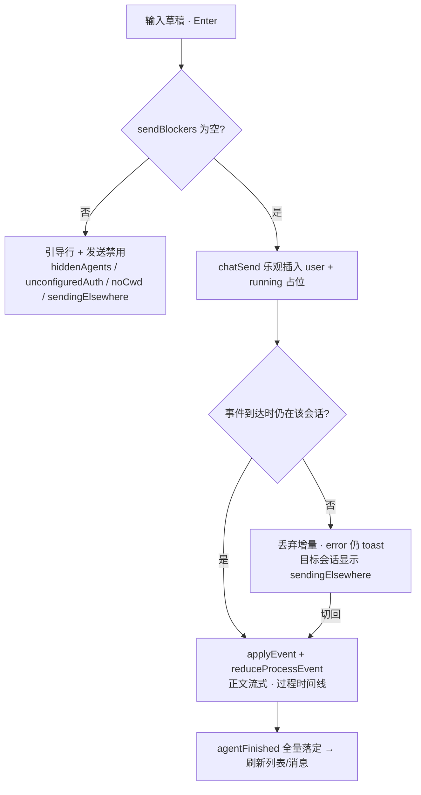

# Chat 工作台重设计（Chat Page Redesign）

| 字段 | 值 |
|---|---|
| 作者 | — |
| 日期 | 2026-08-16 |
| 状态 | Implemented（2026-08） |
| 类型 | 产品 / UX / 界面重设计（无新后端能力、无 wire 变更） |
| 范围 | Chat 页信息架构、会话 rail、会话 header、消息区（现行一会话一 Agent）、过程面板 Phase 3 表面、Composer 与发送前置校验、消息轻操作、页面文件拆分、文档回写 |
| 非范围 | Rust / Tauri 命令、`ChatEvent` wire、过程落库、CLI 原生 `--resume` 与交互式 tool 审批、Connections/Bridges 职责、凭据落盘加密（**无必要 / 项目范围外**）、国产 OAuth 开边 / OAuth→API（产品不做） |

本文是 Chat 页本期重设计的真源，风格与 [bridges-page-redesign.md](bridges-page-redesign.md) 对齐。产品契约回写至 [ui-design.md §4.4](ui-design.md)；过程协议仍以 [chat-process-streaming.md](chat-process-streaming.md) 为真源，本文拍板其 Phase 3 的**展示层**（已落地）。协议侧（过程落库、过程内 usage、Pi rpc 审批、diff 预览落库）仍未做。与 DSH Desktop 的机制对照见 [chat-ui-agent-mechanism-comparison.md](chat-ui-agent-mechanism-comparison.md)（对照笔记，不改本期 IA）。

> **现行状态**：本文 Implemented 的是 Chat 工作台表面。Chat **一会话一 Agent**（core `require_single_agent`；UI `selectConversationAgent` 单选；打开旧多选行在非发送中折叠为 `[agentIds[0]]`）。轮级对比条 / 「仅作用于首位」caption / `retryAllHint` 仍留在代码里，只对历史 ≥2 条 agent 消息的 turn 生效，**不是**现行产品能力。Chat **没有**独立模型选择器；线框里 `[官方 · sonnet ▾]` 是**连接/登录**下拉（模型只作副标题），不是模型 picker。Projects「在 Chat 继续」走 sessionStorage bootstrap（摘录）。Claude/Codex Chat 在捕获官方 session id 后，后续轮次走 print+resume。下文 Key Decisions / 线框里的「多 Agent」是 2026-08 重设计当时的表面，读现行行为以本段与代码为准。

---

## Overview

Chat 是 Workspace 的一等表面：在选定工作目录上，把同一条 prompt 发给会话当前的**一个**已安装 Agent，流式看 stdout 与 Cursor 式过程（命令 / 工具 / thinking / stderr），可取消。它**不是**各 CLI 原生 session 的续聊器，不接管交互式 tool 审批，不发明新后端协议。

实施前基线功能语义完整（会话 CRUD、多 Agent 并行、流式过程、bootstrap、取消），但表面停留在「最小 IM」：rail 只有标题和相对时间，会话上下文（cwd / 自动批准）藏在 Dialog 与 composer 下方一行 Tip，多 Agent 只有纵向堆叠没有轮级对照，过程面板像调试日志，空态与引导挤在 toast 里，`index.tsx` 当时 908 行编排渲染一体。

**2026-08 已落地**：Chat 现为桌面工作台。rail 有搜索、按日分组、agent/cwd 摘要、删除确认；header 有可编辑标题与上下文芯片；过程面板为摘要行 + 时间线 +「运行详情」；composer 内嵌 `sendBlockers` 引导；复制/重试已接。`sendBlockers` / `filterConversations` / `groupConversationsByDay` / `retryTarget` / `turnComparisonChips` 在 `chat-model.ts` + `chat-model.test.ts`。`index.tsx` 已拆完，约 147 行只编排。chrome 水平 inset 引用 `pageRhythm.chatChromeX`。所有改动只用现有 `lib/api/chat` + provider switch，不引入新依赖，不改 `ChatEvent`。轮级对比条是当时多 Agent 表面的残留，现行一会话一 Agent 下新会话不会走到。

---

## Background & Motivation

### 实施前基线线框（2026-08-16 拆分前）

```
┌──────────────────────┬──────────────────────────────────────────────┐
│ [◧][+ 新建对话]       │ 新对话                                  ⚙   │
│ 对话历史              ├──────────────────────────────────────────────┤
│ ▸ 修复登录超时        │            （消息列 max-w-3xl 居中）          │
│   2 小时前            │                     ┌──────────────────────┐ │
│ ▸ 新对话              │                     │ user prompt          │ │
│   3 天前              │                     └──────────────────────┘ │
│                      │ ◉ Claude  12.4s                              │
│                      │ ▸ 过程 · 已完成 · 6 步 · 12.4s · claude -p …  │
│                      │ 正文……                                       │
│                      ├──────────────────────────────────────────────┤
│                      │ ┌──────────────────────────────────────────┐ │
│                      │ │ textarea（自动增高）                       │ │
│                      │ │ [Claude ▾][官方 · sonnet ▾]          [➤] │ │
│                      │ └──────────────────────────────────────────┘ │
│                      │   D:\projects\demo · 需确认   ← 常驻 Tip 行   │
└──────────────────────┴──────────────────────────────────────────────┘
```

### 现状问题（对照代码真源）

| # | 问题 | 证据 |
|---|---|---|
| 1 | **信息架构薄**：rail 只有标题 + 相对时间；无搜索、无分组、无 agent/cwd 摘要、无重命名；删除直删无确认 | `index.tsx` rail 段：行内只渲染 `c.title` 与 `relativeTime(c.updatedAt)`；`handleDelete` 无确认 |
| 2 | **会话上下文藏太深**：cwd / 自动批准只在设置 Dialog 与 composer 下方一行 Tip；header 只有标题 + 齿轮 | `index.tsx` header 段；`ChatComposer.tsx` 底部 `Tip` 行 |
| 3 | **多 Agent 对比弱**：空态文案说「多选可并排对比」，实际纵向堆叠且无轮级对照；连接切换只作用于 `agentIds[0]`，只有 Hint 提示 | `index.tsx` 空态文案与 `g.agents.map` 纵向渲染；`handleSwitchProvider` 只打 `primaryAgent` |
| 4 | **过程面板像调试日志**：summary 常驻命令 mono；展开区「状态 / 命令 / 步骤 / stderr」四段并列同级；每个 tool 步骤套边框卡；成功后 summary 仍显示命令 | `ChatProcessPanel.tsx` summary 的 `view.command` Tip 与展开区四段结构 |
| 5 | **空态 / 引导弱**：无 Agent → toast；无 cwd → toast + 弹 Dialog；隐藏 Agent → placeholder + toast；从 Projects 跳入无 cwd → 自动弹 Dialog | `handleNewChat` / `handleSend` / bootstrap 分支的 `toast` 调用 |
| 6 | **上帝页（实施前）**：`index.tsx` 当时 908 行，约 16 个 useState/useRef，加载/发送/CRUD/bootstrap 编排与 rail/header/消息区/两个 Dialog 的 JSX 同文件；无 `chat-model`、无 page hook。**现已拆完**（`index.tsx` 约 147 行只编排） | 实施前：`src/pages/chat/index.tsx`；现：同目录 `chat-model` / `use-chat-page` / 组件；[modularity-improvement.md](modularity-improvement.md) §4.5 |
| 7 | **桌面密度与 token 不对齐（实施前）**：rail 选中用 `bg-hover`；header / composer 硬编码 `px-4`。**现已对齐**：选中 `bg-active`，chrome 引用 `pageRhythm.chatChromeX` | 现：`ChatSessionRail.tsx` / `ChatSessionHeader.tsx` / `index.tsx` |
| 8 | **缺少桌面轻操作**：无复制、无重试、无标题就地编辑、无 rail 搜索/分组；发送中切会话 composer 静默禁用、无状态提示；自动滚动无条件拉底 | `index.tsx` 无任何消息操作按钮；`ChatComposer` `disabled={sending}`；`bottomRef.scrollIntoView` 无阈值 |

### 量化

| 量 | 现值 | 目标 |
|---|---|---|
| `index.tsx` 行数 | 实施前 908（编排 + 渲染 + 2 个 Dialog） | 已落地：约 147 行只编排 |
| rail 每行信息 | 2 字段（标题、相对时间） | 标题 + agent 品牌点 + cwd 短名 +（发送中）状态点 |
| 会话上下文入口 | 2 处（Dialog、composer Tip 行），header 0 | header 芯片常驻 + Dialog 编辑 |
| 消息级操作 | 0 | 复制（user/agent）、重试（末轮失败） |
| 空态 / 引导通道 | toast ×3 + placeholder ×1 | 页级 EmptyState + composer 内嵌引导行；toast 只留异步结果 |
| 过程面板展开区常驻段 | 4（状态 / 命令 / 步骤 / stderr 并列） | 2（步骤时间线 + 次级「运行详情」折叠） |

### 必须保留的语义（重做表面，不动行为）

- 会话 CRUD：list / create / update / delete；字段 `title` / `agentIds` / `cwd` / `allowDangerous`。
- **一会话一 Agent**：core `require_single_agent`，create/update 拒绝 `len>1`。过程仍按 `(turn, agent)` 隔离（key = `${turn}:${agent}`）；`run_each` 仍带 Parallel 形状，jobs 长度 1。打开旧多选行，页 effect 在非 sending 时写成 `[agentIds[0]]`。
- 流式事件：`started` / `agentChunk`(stdout) / `agentProcess` / `agentFinished` / `error`；过程仅内存，切会话清空。
- 发送前必须有 cwd；含隐藏 Agent 的会话禁止发送。
- 连接切换作用于当前唯一 Agent（历史多选行才出现「仅作用于首位」caption）。
- Projects → Chat bootstrap：`sessionStorage` + `/chat?from=projects`，可预填 prompt / title / cwd / agentIds，只消费一次。
- 自动批准开启需二次确认；过程面板进行中/失败默认展开、成功/取消默认折叠。
- 隐藏 / 未配置授权 Agent：picker 置底且不可选为当前 Agent；已在会话里的仍可见并标「已隐藏」/「未配置授权」。
- 空列表自动建会话（有已安装且未隐藏 Agent 时）；删除最后一个会话自动补建。
- 发送中删除会话先 `chatCancel` 再删。

---

## Goals & Non-Goals

### Goals

1. 用户一眼看清「在哪个目录、用哪个 Agent、什么批准策略」——上下文进 header，不再藏在 Dialog 与 Tip。
2. rail 成为可用的会话导航：可搜索、按日分组、行内可辨 agent 与目录，删除有确认，选中态与全站 `bg-active` 语义一致。
3. 现行一会话一 Agent；轮级对比条仅对历史 ≥2 条 agent 消息的 turn 出现（UI 残留）。连接切换作用于当前唯一 Agent。
4. 过程面板读起来像 Cursor 步骤时间线：一行摘要，展开才见步骤；命令 / stderr / exit 降为次级，成功后不吵。
5. 发送前置条件（无 Agent / 隐藏 Agent / 无 cwd / 他处发送中）内嵌在 composer 引导行里，可点击直达修复动作。
6. 桌面轻操作补齐：复制、末轮重试、标题就地编辑、发送中切会话的状态提示、条件跟随滚动。
7. 文件按 P1-7 样板拆分：纯函数可单测（vitest node，不渲染 DOM），`index.tsx` 只编排。

### Non-Goals（硬约束，违反即失败）

- **不改** Rust / Tauri 命令 / `ChatEvent` wire / 过程落库。只用现有 `lib/api/chat` + `lib/api/provider` 的 switch。
- **不引入新 npm 依赖**；继续 Radix + Tailwind + 现有 `components/ui` + `components/shared`。
- **不换 accent 色相**；一页至多一个 accent 主 CTA（发送）。
- **凭据落盘加密：无必要 / 项目范围外**，不列待办不列风险。
- **国产 OAuth 开边 / OAuth→API：产品不做**，不列待办。
- **不接管** 交互式 tool 审批 RPC。Claude/Codex 后续轮次可走 print+resume；不打开对方 TUI。
- **不把 Chat 做成 Connections/Bridges**：连接切换可深链 `/connections`；绑定走既有 ConnectFlow；不在 Chat 重建钱包。
- 页面层不 `invoke`；mock 不进生产 build。
- 测试与生产分文件；纯函数必须可单测。
- 中文正文；导航专有名词保持英文（Chat / Agents / Connections / Projects…）。
- 浅色优先、低对比边框、明度分层；禁止魔法 `rounded-[Npx]`，只用 `rounded-btn` / `rounded-card` / `rounded-composer`。
- Chat 继续 fullBleed、无 TopBar；主区 chrome 水平 inset 统一引用 `pageRhythm.chatChromeX`。

---

## Key Decisions（本期拍板，唯一终态）

| # | 决策 | 理由（一句话） |
|---|---|---|
| K1 | **工作台三段式**：rail（240px，可收起）+ 主列（header / transcript / composer 贴底）。header 常驻可编辑标题 + Agent 芯片（只读）+ cwd 芯片 + 自动批准芯片（仅开启时显示）+ 设置按钮 | 上下文是发送安全的前提，必须一眼可见；关闭态的批准芯片不显示，保持默认安静 |
| K2 | **rail 升级**：`SearchField` 搜索（标题 + cwd）、按相对日分组（今天 / 昨天 / 近 7 天 / 更早）、行两行结构（标题；`AgentDot` 品牌点列 + cwd 末段目录名）、选中 `bg-active`、删除 hover 显示 + 二次确认、发送中行显示状态点 | 会话导航要能回答「哪个项目、哪个 Agent」；选中态与全站 `ListRow` 语义一致，不再用 `bg-hover` 冒充 |
| K3 | **重命名只在 header 就地编辑**（点击标题 → Input，Enter/blur 保存、Esc 取消、空值回退「新对话」）；rail 不放第二个编辑入口；自动标题仅在 title 为空时由首条 prompt 生成，用户改过不覆盖 | 一份数据一处编辑；rail 行保持轻，重命名频率低不值得行级按钮 |
| K4 | **多 Agent 默认纵向堆叠 + 轮级对比条**：同一 turn ≥2 个 agent 消息时，user 气泡下渲染一行 agent 芯片（logo + 名称 + 状态点 + 耗时），点击滚动定位到对应气泡；**不做左右分栏**。连接 picker 在多选时固定标注「仅作用于首位 Agent（{name}）」 | max-w-3xl 下分栏会把过程面板和代码块挤碎；对比条给「谁完成了、谁失败了、各花多久」的轮级答案，纵向保证可读 |
| K5 | **过程面板收敛为「摘要行 + 步骤时间线 + 次级详情」**：summary = `阶段 · N 步 · 耗时`（去掉常驻命令 mono）；展开 = 无边框步骤时间线（左侧细竖线，tool/thinking/status/error 行）；命令 / stderr / exit 收进时间线下方「运行详情」次级折叠。折叠策略保持现状：进行中/失败/超时展开，成功/取消折叠，用户手动覆盖记忆到阶段变化 | 步骤是主叙事，命令与 stderr 是排障信息；成功后一行摘要即可，不该继续展示命令 |
| K6 | **发送前置校验统一为 `sendBlockers` 纯函数**，composer 上方渲染第一个 blocker 的引导行（含修复动作），发送按钮禁用 + Hint 原因。优先级：含隐藏 Agent > 未配置授权 > 无 cwd > 他会话发送中 >（空草稿只禁发送不出引导行）。页级「无可用 Agent 且无会话」用 EmptyState。Projects bootstrap 无 cwd 不再自动弹 Dialog，由引导行接管 | 前置条件从「点了才知道」变成「看得见、点得到」；toast 只留异步失败结果 |
| K7 | **消息轻操作**：user / agent 气泡 hover 显示「复制」（`navigator.clipboard` + toast「已复制」）；**最后一轮**的失败/取消/超时 agent 气泡显示「重试」= 用该轮 user prompt 重新 `chatSend`（新 turn，发给会话当前全部 Agent；多 Agent 时 Hint 说明）。历史轮不出重试，用复制自行重发 | 重试复用现有 send，不新增 API；只在末轮出现避免 CTA 散落 |
| K8 | **文件按 P1-7 样板拆**：`chat-model.ts`（纯函数）+ `use-chat-page.ts`（副作用 hook）+ `ChatSessionRail` / `ChatSessionHeader` / `ChatTranscript` / `ChatMessageBubble` / `ChatSettingsDialog`（JSX）；保留并打磨 `ChatComposer` / `ChatProcessPanel` / `chat-format.ts`；`index.tsx` 只编排 | 与 Connections 样板一致；纯函数可 vitest node 单测，拆分先行为不变后改表面 |

> **2026-08-21 现行收口**：create/update 拒绝 `agentIds.len > 1`。K4 对比条、连接「仅作用于首位」、K7 重试「发给全部 Agent」仍是代码残留，只服务打开旧多选行之前已落盘的历史 turn。新会话不会进入这些表面。不要把残留 UI 读成「仍支持并跑」。

附属拍板（不再另开讨论）：

- **新建对话默认值**：继承当前会话的 cwd 与 agentIds（剔除已隐藏与未配置授权；剔除后为空则回退第一个可选 Agent）。
- **发送中切会话**：保持「同一时刻至多一个进行中 turn」的现状语义；切走后其他会话 composer 显示状态行「『{title}』正在生成」+「回到该会话 / 停止」；切回后续流接续（早期增量缺失，最终以 `agentFinished` 全量落定），不做回放，过程不落库。
- **滚动**：仅当滚动位置贴近底部（阈值约 80px）时跟随流式输出；用户上翻回看时不拉底。
- **连接 picker 空态**：「暂无连接」行改为深链按钮 → `/connections?agent={primaryAgent}`；添加/绑定一律走 Connections 与 ConnectFlow，Chat 不重建。
- **rail 宽 240px（`w-60`）**：两行行结构 + cwd 短名的最小可读宽度，与 Sidebar 224 错开一档。
- **过程视图仍按会话内存**：切会话清空 `processMap`（现状），不做跨会话缓存。

---

## Proposed Design

### 1. 目标线框

#### 1.1 rail 展开 · 单 Agent 对话（主线框）

```
┌───────────────────────┬─────────────────────────────────────────────────┐
│ [◧] [＋ 新建对话]      │ 修复登录超时 ✎  [◉ Claude] [demo] [自动批准] ⚙   │
│ [🔍 搜索对话        ]  ├─────────────────────────────────────────────────┤
│ 今天                   │            （消息列 max-w-3xl 居中）             │
│ ▮修复登录超时          │                        ┌──────────────────────┐ │
│ ▮ ● demo              │                        │ 帮我修复登录超时问题   │ │
│  重构用量页            │                        └──────────────[复制]──┘ │
│   ● agenthub          │ ◉ Claude   12.4s                                │
│ 昨天                   │ ▸ 已完成 · 6 步 · 12.4s                          │
│  新对话                │ 修好了：问题出在 token 刷新……                    │
│   ● 未设目录           │                                        [复制]   │
│ 更早                   │                                                 │
│  …                    ├─────────────────────────────────────────────────┤
│                       │ ┌─────────────────────────────────────────────┐ │
│                       │ │ 发送消息给 Agent…（Shift+Enter 换行）         │ │
│                       │ │ [◉ Claude ▾] [官方 · sonnet ▾]          [➤] │ │
│                       │ └─────────────────────────────────────────────┘ │
│                       │          Agent 可能修改工作目录中的文件           │
└───────────────────────┴─────────────────────────────────────────────────┘
  ▮ = 选中行（bg-active）；行 meta = AgentDot 品牌点 + cwd 末段目录名
  header 芯片：[◉ Claude]=Agent 只读芯片；[demo]=cwd 芯片（Hint 完整路径，点击开设置）；
  [自动批准]=仅开启时显示（warning 色，点击开设置）
```

#### 1.2 rail 收起

```
┌─┬───────────────────────────────────────────────────────────┐
│ │ [◨] 修复登录超时 ✎  [◉ Claude] [demo] ⚙                   │
│ │ ─────────────────────────────────────────────────────────│
│ │                 （消息区与 composer 不变）                  │
└─┴───────────────────────────────────────────────────────────┘
  rail 收起为 w-0；header 左端出现展开按钮（现状交互保留）
```

#### 1.3 空会话（已有 cwd）

```
│                                                             │
│                     开始对话                                 │
│      向 Claude 发送第一条消息；多选 Agent 可同轮对比           │
│                                                             │
│ ┌─────────────────────────────────────────────────────────┐ │
│ │ 发送消息给 Agent…（Shift+Enter 换行）                     │ │
│ │ [◉ Claude ▾] [官方 · sonnet ▾]                      [➤] │ │
│ └─────────────────────────────────────────────────────────┘ │
```

#### 1.4 多 Agent 一轮（对比条 + 纵向堆叠）

```
│                        ┌────────────────────────────────┐   │
│                        │ 对比重构方案                    │   │
│                        └────────────────────────────────┘   │
│ 本轮 2 个 Agent：[◉ Claude ●已完成 8.2s] [◆ Codex ◐生成中]   │  ← 对比条（点击定位）
│                                                             │
│ ◉ Claude   8.2s                                             │
│ ▸ 已完成 · 6 步 · 8.2s                                       │
│ 方案 A：……                                        [复制]    │
│                                                             │
│ ◆ Codex    生成中                                            │
│ ▾ 生成中 · 3 步                                              │
│ │ ⚙ Read README.md · end                                    │
│ │ ✳ thinking 规划回复结构…                                   │
│ │ ▸ 运行详情（命令 · stderr）                                 │
│ ▍（流式正文……）                                              │
```

#### 1.5 无 cwd（composer 内嵌引导）

```
│ ┌─────────────────────────────────────────────────────────┐ │
│ │ ⚠ 未设置工作目录 — Agent 需要在指定目录内工作 [设置工作目录] │ │  ← 引导行
│ ├─────────────────────────────────────────────────────────┤ │
│ │ 发送消息给 Agent…（可先输入，设置目录后发送）              │ │
│ │ [◉ Claude ▾] [官方 · sonnet ▾]              [➤ 禁用]     │ │
│ └─────────────────────────────────────────────────────────┘ │
  header 的 cwd 芯片同时显示「未设置工作目录」（warning 色）
```

#### 1.6 无已安装 Agent（页级空态）

```
│                                                             │
│                  ⬚  还没有可对话的 Agent                     │
│              安装或取消隐藏 Agent 后即可开始                  │
│                      [去 Agents 页]                          │
│                                                             │
  rail 显示「暂无对话」；不自动建会话（现状规则保留）
```

### 2. 会话 rail（`ChatSessionRail`）

- **结构**：顶部收起按钮 + 「新建对话」（secondary）；其下 `SearchField`（placeholder「搜索对话」）；列表按相对日分组。
- **分组**（纯函数 `groupConversationsByDay(convs, now)`，本地时区自然日）：`今天` / `昨天` / `近 7 天`（不含今天昨天）/ `更早`；组内保持 `updatedAt` 倒序（列表原序）。分组头 `text-2xs uppercase text-muted`。
- **搜索**（纯函数 `filterConversations(convs, query)`）：大小写不敏感匹配标题与 cwd；结果保持分组；无结果显示「没有匹配的对话」。
- **行**（两行结构，`rounded-btn`，`py-1.5`）：
  - 第一行：标题（空标题显示「新对话」）；发送中的会话在标题右侧显示 spinner 状态点。
  - 第二行 meta：`AgentDot` 品牌点列（最多 3 个，多余显示 `+N`）+ cwd 末段目录名（无 cwd 显示「未设目录」muted）。
  - Hint（悬停整行）：完整 cwd + 更新时间（L4 信息不常驻行内）。
  - 选中态 `bg-active`（与 `ListRow` 语义一致；rail 行为轻量行，不套 `ListRow` 的卡片边框），hover `bg-hover`；禁止再用 `bg-hover` 表示选中。
  - hover 显示删除按钮 → **二次确认 Dialog**（见文案表）；发送中的会话删除时先 `chatCancel`（现状保留）。
- **收起/展开**：现状交互保留（rail 收起为 `w-0`，header 左端出现展开按钮）。

### 3. 会话 header（`ChatSessionHeader`）

- 高度 `h-10`，`border-b`，水平 inset `pageRhythm.chatChromeX`。
- **标题就地编辑**：点击标题进入 Input（同高内联），Enter/blur 保存 `updateConversation({ title })`，Esc 取消；空值保存 `''`、展示回退「新对话」。首轮自动标题仅在 title 为空时由后端从首条 prompt 生成（与 mock 语义一致），用户改过不被覆盖。
- **Agent 芯片（只读）**：现行单 Agent，显示 logo + 名称。会话含隐藏 Agent 时芯片附「已隐藏」标记。修改 Agent 仍在 composer picker，header 不做第二个修改入口。历史多选叠列 + 「N 个 Agent」仍是组件能力，打开旧行会被折叠成一位。
- **cwd 芯片**：显示末段目录名（Hint 完整路径），点击打开设置 Dialog；未设置时 warning 色「未设置工作目录」。
- **自动批准芯片**：仅开启时显示（warning 色「自动批准」，Hint「已跳过工具确认，仅在信任该目录时开启」），点击打开设置 Dialog；关闭时不显示。
- 右端保留设置（齿轮）按钮 → `ChatSettingsDialog`。

### 4. 消息区与多 Agent（`ChatTranscript` / `ChatMessageBubble`）

- 消息列 `max-w-3xl` 居中，`px-4 py-6 space-y-6`（现状密度保留）。
- user 气泡：右对齐 `bg-subtle rounded-composer max-w-[85%]`（现状保留）+ hover「复制」。
- agent 消息：logo + meta 行（名称 / 状态文案 / 耗时）+ 过程面板 + 正文（Markdown）+ hover「复制」；失败时正文下红字 error（现状保留）。
- **对比条**：同一 turn 有 ≥2 条 agent 消息时，在 user 气泡下渲染「本轮 N 个 Agent」芯片行（历史 turn 残留；现行新会话一 Agent，不渲染）。每个芯片 = logo + 名称 + 状态点（成功绿 / 失败红 / 进行中 spinner / 取消灰）+ 耗时；点击平滑滚动到对应气泡（锚点 = message id）。
- **滚动**：流式输出时仅当滚动位置距底部 ≤ ~80px 才跟随；用户上翻回看不被拉底；切会话跳到底部。
- 空转录：居中「开始对话」+ 一句副文案（见文案表）。

### 5. 过程面板 Phase 3 表面（打磨 `ChatProcessPanel`）

只改展示层；过程状态机（`reduceProcessEvent`）、事件语义、内存策略均不动。

- **摘要行（summary）**：`▸ {阶段} · {N} 步 · {耗时}`。去掉常驻命令 mono；无步骤且进行中显示 `▸ 生成中`。
- **展开区**：
  1. **步骤时间线**：无边框行 + 左侧 2px 竖线；每行 = 类型图标 + 主文 + 次级 meta。
     - `tool`：`⚙ {name} · {status}`；input 一行截断（`formatStepInput`），result 折叠在行内次级（diff 高亮保留 `DiffAwarePre`）。
     - `thinking`：`✳ {text}`（muted，斜体可选）。
     - `status`：`· {phase}{ · detail}`（muted 单行）。
     - `error`：红字一行。
     - 步骤行不再套边框卡片（去掉现有 `border border-border/80 bg-panel` 卡）。
  2. **「运行详情」次级折叠**（`details` 内再一层，默认收起）：命令（mono pre，可复制）、stderr（mono pre，danger 色）、`exit {code}`。仅在有内容时渲染。
- **折叠策略**（现状保留）：进行中/失败/超时默认展开；成功/取消默认折叠；`messageStatus` 终态优先于 process phase；用户手动开合记忆到阶段变化再交回自动策略。
- 无步骤且进行中：展开区一句「等待 CLI 输出过程日志…」（现状保留）。

### 6. Composer 与发送前置校验（打磨 `ChatComposer`）

- 自动增高 textarea（56–240px）+ 底栏（Agent picker / 连接 picker / 发送）结构保留。
- **移除** composer 下方常驻 cwd/批准 Tip 行；改为一行极短安全提示（居中 `text-xs text-muted`）：
  - 自动批准关闭：「Agent 可能修改工作目录中的文件」。
  - 自动批准开启：「自动批准已开启 · Agent 将不经确认修改文件」（warning 色）。
- **前置校验引导行**：composer 外框上方渲染 `sendBlockers` 的第一个 blocker（`Notice` 式单行 + 修复按钮）：

```ts
type ChatSendBlocker =
  | { kind: 'hiddenAgents'; agentIds: AgentId[] }   // → [去 Agents 页]
  | { kind: 'unconfiguredAuth'; agentIds: AgentId[] } // → [去 Connections 页]
  | { kind: 'noCwd' }                                // → [设置工作目录]
  | { kind: 'sendingElsewhere'; conversationId: string; title: string };
                                                     // → [回到该会话] [停止]

/** 纯函数：按优先级返回全部 blocker；UI 只渲染第一个 */
function sendBlockers(input: {
  conversation: Conversation;
  hiddenIds: Set<AgentId>;
  sendingConversationId: string | null;
}): ChatSendBlocker[];
```

- 空草稿只禁用发送按钮，不出引导行。存在 blocker 时发送禁用 + Hint 显示原因；textarea 除 `hiddenAgents` / 发送中外保持可输入（无 cwd 时可先写 prompt）。
- **Agent picker**：单选。已安装且已配置授权的项在前、可选；已隐藏或未配置授权的项置底（标「已隐藏」/「未配置授权」），不可选为当前 Agent。发送中禁改。历史多选会话打开时折叠为首位。
- **连接 picker**：label = 当前 provider 名 + model 副标题（现状）；作用于当前唯一 Agent。历史多选时 dropdown 仍可能出现「仅作用于首位 Agent（{name}）」残留文案（`agentIds.length>1` 才返回）；无连接时 dropdown 内为深链按钮「去 Connections 添加」→ `/connections?agent={primaryAgent}`。切换成功 toast「已切换连接」（现状）。
- 发送按钮为本页唯一 accent 主 CTA；发送中变「停止」（dangerOutline，现状）。

### 7. 消息轻操作

- **复制**：user / agent 气泡 hover 右下角图标按钮；`navigator.clipboard.writeText(content)`；成功 toast「已复制」。运行中的 agent 气泡不显示复制。
- **重试**：最后一轮中状态为 `failed` / `cancelled` / `timeout` 的 agent 气泡 meta 行显示「重试」；点击 = 取该轮 user prompt 调 `chatSend`（作为新 turn，发给会话当前 Agent）。发送中、存在 blocker 时禁用。历史轮不出重试。纯函数 `retryTarget(turns, sending)` 判定。历史多选行的 `retryAllHint` 仍在代码里，新会话走不到。

### 8. 交互细则（逐流程）

| 流程 | 规则 |
|---|---|
| **新建** | rail「新建对话」→ `createConversation(agentIds, cwd)`，默认值 = 当前会话 agentIds（剔除隐藏，空则回退第一个已装未隐藏）+ 当前会话 cwd（纯函数 `newConversationDefaults`）。无可用 Agent 时按钮禁用 + Hint。建成后选中、清空草稿。空列表自动建会话规则保留 |
| **删除** | rail 行 hover 删除 → 确认 Dialog（标题含会话名）。确认后：发送中先 `chatCancel`；删除后列表空则自动补建（有可用 Agent 时），否则进入页级空态；删除的是当前会话则选中列表第一个 |
| **重命名** | 仅 header 就地编辑（K3）。保存失败 toast 错误并还原 |
| **搜索** | rail `SearchField` 即时过滤（标题 + cwd，不区分大小写）；清空恢复全列表；搜索状态不持久化 |
| **发送** | Enter 发送 / Shift+Enter 换行。前置：`sendBlockers` 为空且草稿非空。乐观插入 user 消息与 running 占位（现状），流式经 `applyEvent` + `reduceProcessEvent` 更新；完成后刷新会话列表与消息（现状） |
| **取消** | composer「停止」→ `chatCancel(sendingConversationId)`；toast「已请求取消」；过程面板转「已取消」并折叠（现状策略） |
| **重试** | 见 §7；重试本质是一次普通发送，走同一 blocker 校验 |
| **切会话** | 清空 `processMap` 与流式缓冲（现状）；消息重新加载。**发送中切走**：目标会话 composer 显示 `sendingElsewhere` 引导行（回到该会话 / 停止），textarea 禁用；rail 中发送中行显示状态点。**切回**：后续 chunk 继续应用，早期增量缺失，最终以 `agentFinished` 全量落定（现状语义，不做回放） |
| **Projects bootstrap** | `/chat?from=projects` + `takeChatBootstrap()` 只消费一次；建会话、可选设标题、预填草稿；toast「已从 Projects 创建会话」。**变化**：无 cwd 时不再自动弹设置 Dialog，由 `noCwd` 引导行 + header warning 芯片接管；query 清理（replace）保留 |
| **隐藏 / 未配置授权 Agent** | picker 置底且不可选为当前 Agent；已在会话里的仍可见并标「已隐藏」/「未配置授权」；含这些 Agent 的会话：header 芯片标记（隐藏）+ `hiddenAgents` / `unconfiguredAuth` 引导行 + 发送禁用 |
| **自动批准** | 编辑仍在设置 Dialog：开启走二次确认 Dialog（文案现状保留）；开启后 header 显示 warning 芯片、composer 安全提示行切换文案；关闭即时生效 |
| **连接切换** | 作用于当前唯一 Agent；成功后刷新 provider 列表；历史多选残留 caption 见 §6 |
| **滚动 / 键盘** | 条件跟随滚动（§4）；标题编辑 Enter/Esc；不新增全局快捷键 |



### 9. 组件与文件拆分（已按此落地）

```
src/pages/chat/
  index.tsx              # 只编排：use-chat-page + 组件拼装（约 147 行）
  chat-model.ts          # 页面级纯函数（含 sendBlockers / filterConversations / groupConversationsByDay / retryTarget / turnComparisonChips）
  chat-model.test.ts     # vitest node，不渲染 DOM
  use-chat-page.ts       # 副作用 hook（加载/发送/过程/bootstrap/CRUD）
  ChatSessionRail.tsx    # rail（搜索/分组/行/删除确认）
  ChatSessionHeader.tsx  # 标题就地编辑 + 芯片 + 设置入口
  ChatTranscript.tsx     # 滚动区 + 轮渲染 + 对比条 + 空转录 + 骨架
  ChatMessageBubble.tsx  # 单条消息（meta/过程面板挂载/复制/重试）
  ChatSettingsDialog.tsx # cwd + 自动批准 + 危险确认
  ChatComposer.tsx       # blocker 引导行、安全提示行、深链空态
  ChatProcessPanel.tsx   # 摘要行 + 时间线 + 运行详情
  chat-format.ts         # 展示格式化（groupByTurn/relativeTime/…）
```

| 文件 | 职责 | 不做什么 |
|---|---|---|
| `chat-model.ts` | `filterConversations` / `groupConversationsByDay` / `cwdShortName` / `sendBlockers` / `newConversationDefaults` / `agentPickerLabel` / `connectionPickerCaption` / `messageStatusLabel`（自 index 迁入）/ `turnComparisonChips` / `retryTarget` | 不 import React、不碰 `lib/api`、无副作用 |
| `chat-format.ts` | 保持现职责：`groupByTurn` / `relativeTime` / `formatDurationMs` / `extractModel` / `formatStepInput` / phase 判定 | 不放页面级视图逻辑（归 chat-model） |
| `use-chat-page.ts` | 会话/消息/agentStatus/providers 加载；activeId / draft / sending / processMap；`applyEvent`；send / cancel / retry / CRUD / rename / bootstrap；返回页面 view model | 不含 JSX；不做纯计算（调 chat-model） |
| `ChatSessionRail` | 见 §2 | 不直接调 API（回调上抛） |
| `ChatSessionHeader` | 见 §3 | 不做 Agent 修改入口 |
| `ChatTranscript` | 见 §4 | 不持有消息状态 |
| `ChatMessageBubble` | 见 §4 / §7 | 不解析过程事件 |
| `ChatSettingsDialog` | cwd 编辑（blur 保存）+ 自动批准 Switch + 危险确认 | 不新增设置项 |
| `index.tsx` | 编排 hook 与组件；页级空态/错误态分派 | 无业务分支、无 JSX 细节 |

复用既有组件：`SearchField` / `AgentDot` / `AgentLogo` / `EmptyState` / `ErrorState` / `Notice` / `Hint` / `Tip` / `MarkdownView` / `Skeleton` / `Dialog` / `DropdownMenu` / `Switch` / `Button`。选中态用 `bg-active` token（`ListRow` 语义）。`lib/chat-process.ts` / `lib/chat-bootstrap.ts` / `lib/api/chat.ts` 不改。

### 10. 文案表（中文，克制）

| 位置 | 文案 |
|---|---|
| rail 新建按钮 | 新建对话 |
| rail 搜索 placeholder | 搜索对话 |
| rail 分组头 | 今天 / 昨天 / 近 7 天 / 更早 |
| rail 无 cwd meta | 未设目录 |
| rail 空列表 | 暂无对话（副句：点上方「新建对话」开始） |
| rail 搜索无结果 | 没有匹配的对话 |
| 删除确认标题 | 删除「{title}」？ |
| 删除确认描述 | 消息记录将一并删除；正在生成的回复会先停止。 |
| 删除确认按钮 | 取消 / 确认删除 |
| header 标题回退 | 新对话 |
| header 隐藏标记 | 已隐藏 |
| cwd 芯片（未设置） | 未设置工作目录 |
| 自动批准芯片 Hint | 已跳过工具确认，仅在信任该目录时开启 |
| 引导行 hiddenAgents | 会话包含已隐藏 Agent，暂不能发送 · [去 Agents 页] |
| 引导行 unconfiguredAuth | 会话包含未配置授权的 Agent，暂不能发送 · [去 Connections 页] |
| 引导行 noCwd | 未设置工作目录 — Agent 需要在指定目录内工作 · [设置工作目录] |
| 引导行 sendingElsewhere | 「{title}」正在生成 · [回到该会话] [停止] |
| composer placeholder | 发送消息给 Agent…（Shift+Enter 换行） |
| 安全提示（批准关） | Agent 可能修改工作目录中的文件 |
| 安全提示（批准开） | 自动批准已开启 · Agent 将不经确认修改文件 |
| 连接 picker 多选说明 | 仅作用于首位 Agent（{name}）（历史残留；`agentIds.length>1` 才返回） |
| 连接 picker 空态 | 暂无连接 · 去 Connections 添加 |
| 过程摘要 | {阶段} · {N} 步 · {耗时}（如：已完成 · 6 步 · 12.4s） |
| 运行详情折叠 | 运行详情（内含：命令 / stderr / exit {code}） |
| 过程等待 | 等待 CLI 输出过程日志… |
| 对比条 | 本轮 {N} 个 Agent（历史残留；现行新会话不渲染） |
| 复制 / 复制成功 | 复制 / 已复制 |
| 重试 / 重试 Hint | 重试 / 将把这条提示重新发给会话中的全部 Agent（Hint 为历史多选残留） |
| 空转录标题 | 开始对话 |
| 空转录副句 | 向 {Agent 名} 发送第一条消息。若 i18n 仍写「N 个 Agent / 多选可同轮对比」，视为文案残留，不以该句为产品能力 |
| 页级空态标题 | 还没有可对话的 Agent |
| 页级空态描述 / 按钮 | 安装或取消隐藏 Agent 后即可开始 / 去 Agents 页 |
| 取消 toast | 已请求取消（副句：正在停止当前生成，过程面板将显示已取消。） |
| bootstrap toast | 已从 Projects 创建会话（副句：提示词已填入；确认工作目录后发送。） |
| 自动批准确认 | 开启自动批准？/ 开启后将跳过工具确认，Agent 可直接改文件、执行命令。仅在信任当前工作目录时开启。（现状保留） |

文案纪律（对齐 [ui-experience-alignment.md](ui-experience-alignment.md) §5）：L2 解释进 Hint ≤2 句；L4 路径进 Hint / 设置 Dialog，不常驻行内；toast 标题 ≤16 字，不堆路径。

### 11. 状态覆盖（对照 ui-design §6 四态）

| 态 | 表现 |
|---|---|
| loading | rail 骨架行（现状）；消息区 `ListSkeleton`；不整页 spinner |
| empty | 页级（无 Agent 且无会话）EmptyState；空转录「开始对话」；rail 空列表 / 搜索无结果 |
| error | 列表加载失败 `ErrorState` + 重试（现状）；发送/CRUD 失败 toast；流式 `error` 事件 toast |
| partial | agentStatus 加载失败不阻塞会话渲染（现状：picker 异步填充）；providers 加载失败连接 picker 显示「未配置连接」 |

---

## 验收清单（可测）

**rail**

- [x] 搜索同时匹配标题与 cwd，大小写不敏感；无结果显示「没有匹配的对话」。
- [x] 分组边界正确（本地自然日：今天 / 昨天 / 近 7 天 / 更早），`groupConversationsByDay` 单测覆盖跨日边界。
- [x] 行 meta 显示 agent 品牌点（>3 折叠为 +N）与 cwd 末段；无 cwd 显示「未设目录」。
- [x] 选中行用 `bg-active`；hover 用 `bg-hover`；两态可区分。
- [x] 删除必经确认 Dialog；发送中的会话删除先取消；删除最后一个自动补建（有可用 Agent）。
- [x] 发送中的会话行显示状态点。

**header**

- [x] 标题就地编辑：Enter/blur 保存、Esc 取消、空值回退「新对话」；rail 同步刷新。
- [x] cwd 芯片 Hint 显示完整路径；未设置时 warning 态；点击打开设置。
- [x] 自动批准芯片仅开启时显示；点击打开设置。
- [x] 含隐藏 Agent 时芯片带「已隐藏」标记。

**composer / 发送**

- [x] `sendBlockers` 顺序：hiddenAgents > unconfiguredAuth > noCwd > sendingElsewhere；单测覆盖。
- [x] Agent picker：单选；可选项在前；已隐藏 / 未配置授权置底，不可选为当前 Agent。
- [x] 引导行只渲染第一个 blocker 且带可用修复动作；发送禁用 + Hint 原因。
- [x] 无 cwd 时 textarea 可输入、发送禁用；设置 cwd 后不丢草稿即可发送。
- [x] Projects bootstrap 无 cwd：不自动弹 Dialog，引导行出现；query 清理、bootstrap 只消费一次。
- [x] 连接 picker 现行作用于当前唯一 Agent；历史多选残留文案「仅作用于首位 Agent（{name}）」仅 `agentIds.length>1` 时出现；空态深链 `/connections?agent=`。
- [x] 发送按钮是页内唯一 accent 主 CTA。

**消息区 / 多 Agent**

- [x] 同轮 ≥2 个 agent 消息才出现对比条（历史残留；现行新会话不出现）；芯片状态点与耗时正确；点击定位到对应气泡。
- [x] user / agent 气泡 hover 复制可用；运行中气泡不显示复制。
- [x] 仅最后一轮失败/取消/超时气泡显示重试；重试作为新 turn 发给会话当前 Agent；`retryTarget` 单测覆盖。
- [x] 流式仅在贴近底部时跟随滚动；上翻回看不被拉底。

**过程面板**

- [x] 成功后折叠且摘要行不含命令；摘要 = 阶段 · N 步 · 耗时。
- [x] 展开为无边框步骤时间线；命令 / stderr / exit 在「运行详情」次级折叠内。
- [x] 进行中/失败/超时默认展开；用户手动开合记忆到阶段变化；diff 高亮保留。

**切会话 / 取消**

- [x] 发送中切走：目标会话显示 sendingElsewhere 引导行；「回到该会话」「停止」可用。
- [x] 切回发送中会话：后续 chunk 续接不崩；`agentFinished` 后正文完整。
- [x] 取消后过程面板转「已取消」并折叠。

**工程**

- [x] `index.tsx` 只编排（约 147 行）；文件拆分与 §9 一致。
- [x] `chat-model.test.ts` 覆盖全部导出纯函数（vitest node，不渲染 DOM）；`chat-process` / `chat-format` 既有测试保持绿。
- [x] 页面无 `invoke`、无新 npm 依赖、无 `rounded-[Npx]`；chrome 水平 inset 引用 `pageRhythm.chatChromeX`。
- [x] `pnpm test`（chat 域过滤）与 `pnpm build` 通过；`pnpm dev:mock` 下全部状态可走通（mock 已覆盖全事件类型与 cancel，无需扩展）。

---

## 本期不做

- diff 预览落库、过程步骤落库回放、过程内 usage 展示（[chat-process-streaming.md](chat-process-streaming.md) Phase 3 的协议侧项，另行排期）。
- CLI 原生 session 续聊（`--resume`）、交互式 tool 审批 RPC。
- 并发多会话同时流式（保持同一时刻至多一个进行中 turn）。
- 多 Agent 并跑 / 左右分栏：现行已收口为一会话一 Agent；不要把对比条残留读成仍支持并跑。
- rail 右键菜单、会话置顶/归档、会话导出、全局快捷键面板、虚拟滚动。
- 在 Chat 内添加/绑定连接（去 Connections / ConnectFlow）。
- 凭据落盘加密：**无必要 / 项目范围外**；国产 OAuth 开边 / OAuth→API：产品不做。二者均不得出现在实施待办或风险清单。

---

## 文档同步

本文落盘时同步完成（同一分支）：

| 文档 | 改动 |
|---|---|
| [ui-design.md §4.4](ui-design.md) | 补目标线框、rail/header/composer/过程面板/多 Agent 规则、空态矩阵、密度与组件约束；指向本文 |
| [README.md（docs 索引）](README.md) | 新增本文条目 |
| [chat-process-streaming.md](chat-process-streaming.md) | Phase 3 段加一句指向：展示层已由本文拍板，协议侧（落库/审批/usage）不变 |

表面与拆分已落地（2026-08）。[modularity-improvement.md](modularity-improvement.md) P1-7 表中 `pages/chat/index.tsx` 行应记为已完成形态（`chat-model` + `use-chat-page` + 组件拆分）。

---

## 实施注意（历史备忘；表面与拆分已落地，勿再当待办）

1. **先拆后改**：PR 1 纯拆文件（`chat-model` + `use-chat-page` + 组件迁移，行为零变化，现有测试全绿）；PR 2 rail + header + 设置迁移；PR 3 composer blockers + 消息操作 + 对比条；PR 4 过程面板表面。每个 PR 可独立评审回滚。
2. `messageStatusLabel`、picker label 等现在 `index.tsx` 内的纯逻辑**迁入 `chat-model.ts` 并补单测**，不要留在组件里。
3. `applyEvent` 的会话隔离（`activeIdRef` 比对）、乐观占位、`agentFinished` 去重替换逻辑**原样迁入 hook**，这是流式正确性的核心，不要顺手重写。
4. 过程面板改动只碰 `ChatProcessPanel.tsx` 展示结构；`lib/chat-process.ts` 与其测试不改。
5. 复制用 `navigator.clipboard.writeText`（仓库已有先例）；重试直接复用 `handleSend` 路径（同一 blocker 校验），不加新 API。
6. rail 选中态直接用 `bg-active` token；不要为 rail 强套 `ListRow`（它是带边框卡片行），保持语义一致即可。
7. header / composer 外框水平 inset 改为引用 `pageRhythm.chatChromeX`，删除硬编码 `px-4`。
8. 删除确认、`sendingElsewhere`、深链 `/connections?agent=` 等新交互在 `pnpm dev:mock` 下全部可走通；mock（`src/dev/mocks/chat.ts`）能力已足够，不需要扩展。
9. 测试与生产分文件；不往生产 façade 加 `__reset*ForTests`（领域 reset 已在 `dev/mocks`）。
10. 中文正文、导航专有名词英文；一页至多一个 accent 主 CTA（发送）。

---

## References

- 现状代码：`src/pages/chat/index.tsx`、`ChatComposer.tsx`、`ChatProcessPanel.tsx`、`chat-format.ts`、`src/lib/chat-process.ts`（+ 测试）、`src/lib/chat-bootstrap.ts`、`src/lib/api/chat.ts`、`src/lib/types.ts`（Conversation / ChatMessage / ChatEvent）
- 布局与 token：`src/App.tsx`（`/chat` fullBleed、无 TopBar）、`src/components/layout/page-rhythm.ts`（`chatChromeX`）、`src/styles/tokens.ts`
- 共享组件：`ListRow` / `SearchField` / `EmptyState` / `AgentDot` / `Notice` / `MarkdownView`
- Mock 边界：`src/dev/mocks/chat.ts`
- 产品契约：[ui-design.md](ui-design.md) §1–§3、§4.4；[ui-experience-alignment.md](ui-experience-alignment.md)（明度分层 / 提示分级 / 文案语气）
- 过程协议：[chat-process-streaming.md](chat-process-streaming.md)（Phase 0–2 现行契约；Phase 3 展示层已落地，协议侧未做）
- 拆分样板：[modularity-improvement.md](modularity-improvement.md) P1-7；`src/pages/connections/connection-model.ts`
- 测试约定：[testing.md](testing.md)
