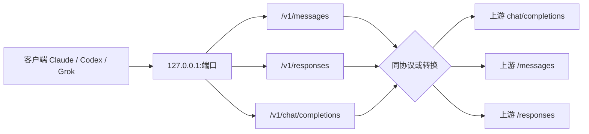
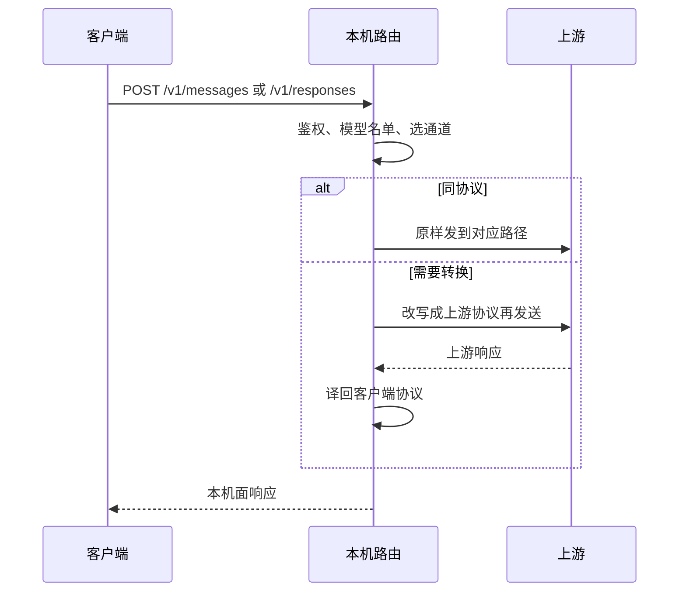

# 本机路由：三条入口与协议转换

本机路由在 `127.0.0.1:{端口}` 上同时可以挂不同客户端入口。客户端只跟本机说话；本机再按上游协议转发或转换。本地密钥是生成的 `ahb_...`，不是用户官方密钥。

相关： [architecture.md](architecture.md) · [logging.md](logging.md) · [product-decisions.md](product-decisions.md)

## 总览

## 常见组合

- **OpenRouter / 自定义 OpenAI 兼容**：Claude 的 Messages、Codex / Grok 的 Responses 都会转成上游 `chat/completions`。Claude 客户端不会直接打上游的 openai-chat。
- **官方 Codex / Grok Responses**：本机 `/v1/responses` 对上游 `/responses` 同协议转发。
- **官方 Anthropic 或厂商 Anthropic 口**（例如智谱 `.../api/anthropic`、DeepSeek `.../anthropic`）：本机 `/v1/messages` 对上游 `/messages` 同协议转发。
- **模型名单**：用户填了列表则只放行这些模型（大小写不敏感）；名单为空时，自定义 OpenAI 兼容 / OpenRouter 跟随客户端请求里的模型。

## 本机面 × 上游

| 本机面 | 上游 | 行为 |
|---|---|---|
| Messages | Anthropic Messages | 同协议到 `/messages` |
| Messages | OpenAI Chat Completions | 转换成 `chat/completions` |
| Messages | Codex / Grok Responses | 转换成 `/responses` |
| Responses | OpenAI Chat Completions | 转换成 `chat/completions` |
| Responses | Codex / Grok Responses | 同协议到 `/responses` |
| Responses | Anthropic Messages | 转换成 `/messages` |
| Chat Completions | （当前本机路由不作为主入口） | 未使用 |

创建路由时勾选的每个客户端都会各自绑定；旧路由仍需「一键配置」或再应用一次才会刷新。
