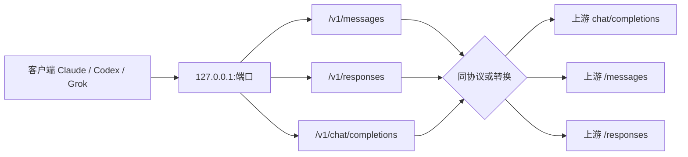
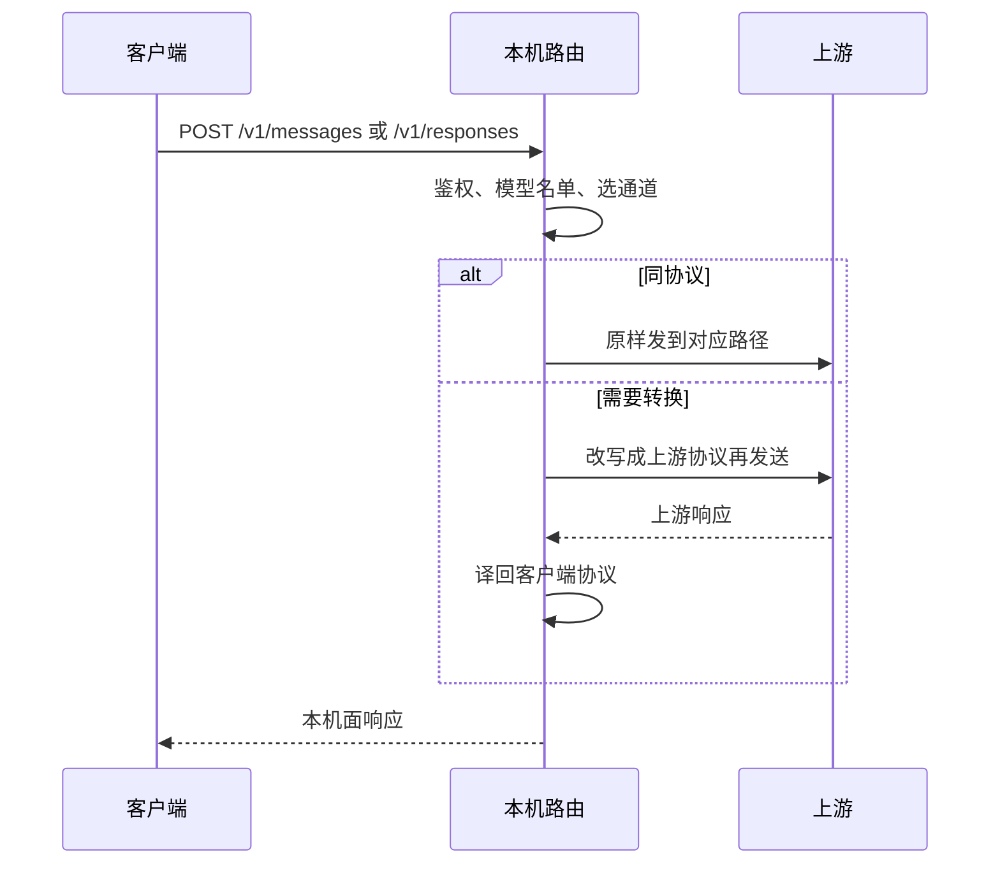

# 本机路由：三条入口与协议转换

本机路由在 `127.0.0.1:{端口}` 上同时可以挂不同客户端入口。客户端只跟本机说话；本机再按上游协议转发或转换。本地密钥是生成的 `ahb_...`，不是用户官方密钥。

相关： [architecture.md](architecture.md) · [logging.md](logging.md) · [product-decisions.md](product-decisions.md)

## 总览

## 常见组合

- **OpenRouter / 自定义 OpenAI 兼容**：Claude 的 Messages、Codex / Grok 的 Responses 都会转成上游 `chat/completions`。Claude 客户端不会直接打上游的 openai-chat。
- **官方 Codex / Grok Responses**：本机 `/v1/responses` 对上游 `/responses` 同协议转发。
- **官方 Anthropic 或厂商 Anthropic 口**（例如智谱 `.../api/anthropic`、DeepSeek `.../anthropic`）：本机 `/v1/messages` 对上游 `/messages` 同协议直通（请求体原样转发，仅按需覆写 `model`）。即使来源登记为自定义 OpenAI 兼容，只要端点 URL 含 `/anthropic` 或指向 `api.anthropic.com`，也会自动识别为 Anthropic Messages 上游。
- **模型名单**：用户填了列表则只放行这些模型（去重、大小写不敏感），未命中返回 400 `listed_models_reject`；名单为空时，自定义 OpenAI 兼容 / OpenRouter 跟随客户端请求里的模型；OpenRouter backup 模型始终可被服务。

## 来源端点与上游选择

自定义 OpenAI 兼容来源在创建路由时按下述顺序解析出实际使用的上游：

1. **按目标选端点**：provider 的 `endpoints[]` 里找 `target` 匹配（claude / codex / grok）、且未禁用（`enabled !== false`）的行，取其 `url`（必须是 http/https）；
2. **回退 base URL**：没有匹配端点时，退回 provider 的通用 base URL（`baseURL` / `baseUrl` / `base_url` 等）；
3. **协议识别**：最终 URL 含 `/anthropic` 或 `api.anthropic.com` 时，上游协议切为 Anthropic Messages，否则保持 OpenAI Chat Completions；
4. **固定模型**：若 provider 配置里钉了一个模型（listedModels 第一项或 pinned 字段），它覆盖默认模型。

以上解析只对「OpenAI API 来源 + Provider 登录」生效；Kimi 等固定登录走各自的常量 URL。

## 本机面 × 上游

| 本机面 | 上游 | 行为 |
|---|---|---|
| Messages | Anthropic Messages | 同协议到 `/messages` |
| Messages | OpenAI Chat Completions | 转换成 `chat/completions` |
| Messages | Codex / Grok Responses | 转换成 `/responses` |
| Responses | OpenAI Chat Completions | 转换成 `chat/completions` |
| Responses | Codex / Grok Responses | 同协议到 `/responses` |
| Responses | Anthropic Messages | 转换成 `/messages` |
| Chat Completions | （当前本机路由不作为主入口） | 未使用 |

创建路由时勾选的每个客户端都会各自绑定；旧路由仍需「一键配置」或再应用一次才会刷新。
