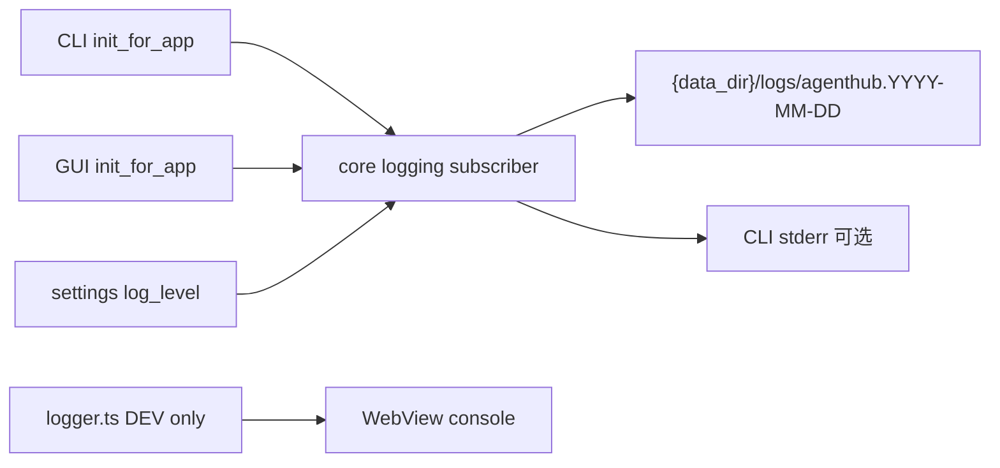

# AgentHub 日志规范

> 正式契约：CLI / GUI 共用 `agenthub-core` 统一日志。  
> 实现真源：`crates/agenthub-core/src/logging/`、`utils/redact.rs`。  
> 配置契约交叉引用：[cli-and-config.md](cli-and-config.md) · [architecture.md](architecture.md)  
> Adapter 字段扩展：[adapter-design.md](adapter-design.md) §8（级别与必打事件以本文为准）

当前版本：**v1.1**（2026-08-21）。相对 v1.0：补上检索口径、必打事件、脱敏缺口、前端边界，以及默认可排障的分期补点。底座（按日文件、settings、helper）仍按 v1.0 已落地部分执行。

---

## 1. 目标与原则

| # | 原则 |
|---|---|
| 1 | **双端一致**：CLI 与 GUI 只初始化一次 subscriber，业务埋点在 core |
| 2 | **默认可排障**：默认 `info` 必须能定位**失败**（含 OAuth 失败、起桥失败、上游拒、流式中途挂）；成功路径允许简略 |
| 3 | **文件为主、控制台为辅**：持久化到 `{data_dir}/logs/`；stderr 按壳层策略 |
| 4 | **字段可检索**：同一条日志的 tracing `target` 与字段 `module` 使用**同一个** `logging::targets` 常量 |
| 5 | **禁止泄密**：出 core 前脱敏；日志消息走 `redact_text`，JSON DTO 走 `redact_json`；不记录请求/响应正文、prompt、工具参数 |
| 6 | **可配置、可保留**：`log_level`、`log_retention_days` 落 L1 settings，改后下次启动生效 |
| 7 | **前端不是生产观测**：`src/lib/logger.ts` 只服务 DEV 控制台；生产排障看文件日志 + UI 文案 |

默认可排障的验收：拿当日 `{logs_dir}/agenthub.YYYY-MM-DD`，不改级别，能回答：

- 桥有没有起来（`op=serve` / apply / start）
- 这次请求的 `profile_id` + `request_id` 失败在哪一层（本机鉴权 / 协议 / 上游 HTTP / 流式中途 / 本机过载）
- OAuth 卡在 start、callback、timeout 还是 complete
- 上游 4xx 的短原因（`upstream_detail`，已脱敏）

成功的健康检查、成功的逐请求 start 不要求出现在默认 `info` 里。

### 1.1 关键决策

| 决策 | 选择 | 理由 |
|---|---|---|
| 生产观测通道 | 只有 Rust 按日文件 | GUI 无控制台；前端 logger 生产静默；设置页级别只驱动 core |
| `target` 与 `module` | 必须同值，都来自 `logging::targets` | 现在 helper 只有 `module=`、bridge 只有 `target=`，按文档检索会漏 |
| 成功请求 | 结束一条 info；开始走 debug | 长会话不双份刷屏；失败不依赖 start 行 |
| 本机 401 vs 上游 401 | warn vs error（reload 耗尽后） | 本机 bearer 是客户端配错；上游 401 要用户重新登录 |
| `upstream_detail` | 只进 Hub 文件，不回传下游 | 避免把官方错误原文泄漏给 Codex/Claude/Grok |
| 脱敏 | helper + 显式 `redact_text`，不做 subscriber 层 | 全局层难测、易误伤；先堵住 JWT/cookie/裸 `token=` |
| 前端转发进文件 / GUI 日志页 | 本轮不做 | 不在「默认可排障」路径上；详情页继续「打开日志目录」 |
| 环境变量覆盖级别 | 不实现 | 已有 settings 与 CLI `-v` |

---

## 2. 架构

```text
CLI / GUI 薄壳
    │  init_for_app(data_dir?, shell, verbose, version)
    ▼
agenthub-core::logging
    ├── 解析 data_dir、读 settings（log_level / log_retention_days）
    ├── 按日文件 sink：tracing-appender RollingFileAppender
    ├── 可选 stderr sink（CLI 默认 warn；-v → debug；GUI 默认无控制台）
    ├── 启动时 purge 超期日志
    └── targets + log_* 辅助（error/info/warn/debug + 脱敏）

前端 src/lib/logger.ts
    └── 仅 DEV → WebView console；生产 emit() 直接 return；不读 log_level
```



| 层 | 职责 |
|---|---|
| **core** | 唯一 subscriber 初始化、文件路径、保留策略、模块常量、埋点 helper |
| **文件** | `{data_dir}/logs/agenthub.YYYY-MM-DD`（daily rotation） |
| **stderr** | CLI：默认 `warn` 及以上；`-v` → `debug`。GUI：默认不挂控制台层 |
| **CLI/GUI 壳** | 启动时调 `logging::init_for_app`；**不得**用壳层日志代替业务 ERROR。GUI `map_err_string` 只打 debug 面包屑，避免与 `log_app_error` 双份 ERROR |
| **前端 logger** | DEV 辅助；生产静默。设置页「日志级别」**只**影响 core 文件日志 |

初始化幂等：同进程重复调用为 no-op。级别与保留策略不热更新。

生产观测通道只有 **Rust 文件日志**。UI toast / 内联错误给用户看，不替代文件里的 `code` + `op`。

---

## 3. 级别语义

| 级别 | 何时用 | 示例 |
|---|---|---|
| **error** | 操作失败、需用户或支持介入 | 写 live 失败；OAuth complete 失败 / 等待超时；上游 401 在 token reload 耗尽之后；协议把上游有效载荷译失败；补偿失败 |
| **warn** | 可继续但异常/降级，或对端输入问题 | 本机 bearer 401、桥过载 429、客户端协议拒绝、上游 429/5xx/超时、流式中途挂、能力降级、锁等待 |
| **info** | 里程碑与审计 | logging initialized、settings 变更、账号切换成功、OAuth start/complete 成功、listener start/stop、**请求成功结束一条**、apply/start 成功 |
| **debug** | 路径、锁、操作步骤（`-v` 常用） | 请求开始（含 rewrite 后的 store/stream/model）、health 成功、GUI 命令面包屑、token reload noop |
| **trace** | 极细内部（默认不写） | SSE 事件类型与序号（禁止正文） |

合法字符串：`error` \| `warn` \| `info` \| `debug` \| `trace`（大小写不敏感；`warning` 视为 `warn`）。

### 3.1 HTTP / Bridge 对照

不要把「对端乱请求」和「用户必须重新登录」打成同一级。

| 事件 | 级别 | `code` 例 |
|---|---|---|
| 本机 bearer / x-api-key 不对 | warn | `unauthorized` |
| 桥过载 | warn | `overloaded` |
| 客户端协议拒绝（缺字段、非法 JSON） | warn | `ProtocolError.code` |
| 上游 429 | warn | `upstream_status` |
| 上游 4xx 策略拒（如 store/stream） | warn | `upstream_status` + `upstream_detail` |
| 上游 5xx / 连接失败 / header 超时 / 非流式超时 | warn | `upstream_status` / `header_timeout` / `unavailable` / `upstream_timeout` |
| 流式 idle / 截断 / 非法 SSE / 超限 | warn | `stream_idle_timeout` 等 |
| 上游 401 且 reload 已换新 token 后仍 401，或无法 reload | **error** | `upstream_auth` |
| 上游 JSON 译成本地协议失败 | **error** | `ProtocolError.code` |
| apply / 写目标配置 / 补偿失败 | **error** | `adapter.*` |

本机 401 不是账号过期；文档与排障口径：[provider-api-oauth-adaptation.md](provider-api-oauth-adaptation.md) —— 下游看到 `401 invalid_api_key` = 本机 token；`502 upstream_error` = 上游。上游短原因只在 Hub 文件日志的 `upstream_detail`，**不**回传给 Codex / Claude / Grok。

---

## 4. 日志文件

| 项 | 约定 |
|---|---|
| 目录 | `{data_dir}/logs/`（`config path` 可打印 `logs_dir`） |
| 命名 | `agenthub.YYYY-MM-DD`（`tracing-appender` daily，prefix=`agenthub`） |
| 兼容识别 | 保留清理也认 `agenthub.YYYY-MM-DD.log`、`agenthub-2026-08-02.log` |
| 轮转 | 按本地日历日 |
| 保留 | `log_retention_days`（默认 **14**，允许 **1..=365**）；启动时 purge 过期文件 |
| 编码 | 文本、无 ANSI；含 level、target、字段与消息 |

示例路径（Windows）：`%USERPROFILE%\.agenthub\logs\agenthub.2026-08-21`

`log_level=debug` 时 `EnvFilter` 是**全局** debug，会带上 `hyper` / `reqwest` 等依赖。排障优先靠默认 `info` 的必打事件；需要 debug 时尽量用 CLI `-v` 做一次复现，不要长期把 GUI 设成 debug。分 target 过滤（`core.adapter=debug`）是 P2，不是现在的能力。

---

## 5. 配置与优先级

### 5.1 键

| key | 类型 | 默认 | 说明 |
|---|---|---|---|
| `log_level` | 级别字符串 | `info` | 文件侧过滤级别 |
| `log_retention_days` | u32 | `14` | 日志保留天数；范围 1–365 |

存储：L1 SQLite `settings` 表。`config set` 后**下次进程启动**生效（当前进程已 init 的 subscriber 不热更新）。

### 5.2 解析优先级（高 → 低）

1. **`-v` / `--verbose`**：将生效级别至少抬到 `debug`；CLI 控制台同为 `debug`
2. **settings**（`log_level` / `log_retention_days`）
3. **内置默认**：`info` + 保留 14 天

CLI 无 `-v` 时：文件用 settings 级别；控制台默认只出 `warn+`，减少表格输出噪声。

**未实现、不要当成现网能力：**

- 环境变量覆盖级别（`RUST_LOG` / `AGENTHUB_LOG`）
- L0 `agenthub.toml` 的 `log_level`（全仓无读取；L0 现行只有 `--data-dir` 与 `AGENTHUB_HOME`）

业务真源以 L1 settings 为准（见 [cli-and-config.md](cli-and-config.md) §7）。

---

## 6. 模块（`logging::targets`）

### 6.1 检索口径（目标）

每条结构化日志**同时**写：

- tracing `target:` = 下表字符串
- 字段 `module=` = **同一**字符串

检索时 `module=core.adapter` 与 `core.adapter` 等价。禁止只写其中一个。

Helper（`log_app_error*` / `log_*`）必须设 `target:`，不得再把 target 留成 `agenthub_core::logging`。直接 `tracing::*` 必须用 `targets::*` 常量，禁止再散落 `"core.adapter"` 字面量。

### 6.2 过渡期（v1.1 写文档时的代码）

| 写法 | 实际 target | 实际 `module=` | 怎么搜 |
|---|---|---|---|
| `log_app_error` 等 helper | `agenthub_core::logging` | `core.provider` 等 | 搜 `module=` |
| OAuth 等 `tracing::*!(module = targets::OAUTH)` | `agenthub_core::oauth::…` | `core.oauth` | 搜 `module=core.oauth` |
| Bridge `target: "core.adapter"` | `core.adapter` | 常缺 | 搜 `core.adapter` |
| GUI restore `target: "gui"` | `gui` | 常缺 | 搜 `gui` |

在 helper 补上 `target:`、bridge 补上 `module=` 之前，排障要**两边都搜**。这是 v1.1 P0 要收口的契约债，不是新功能。

### 6.3 常量

| 常量 | 字符串 | 用途 |
|---|---|---|
| `BOOT` | `core.boot` | 启动、logging 初始化 |
| `STORAGE` | `core.storage` | DB / 迁移 |
| `LOCK` | `core.lock` | per-agent 写锁 |
| `PROVIDER` | `core.provider` | 供应商池与切换 |
| `ACCOUNT` | `core.account` | 账号池与切换 |
| `BACKUP` | `core.backup` | 快照与恢复 |
| `INSTALL` | `core.install` | Agent/渠道安装、升级、卸载与 exec 诊断 |
| `DETECT` | `core.detect` | Agent/Runtime 探测（doctor、Agents 页、安装后 redetect） |
| `SKILL` | `core.skill` | 技能投影 |
| `CHAT` | `core.chat` | 会话 send/cancel；`agent_started`（命令脱敏）、`agent_process`(trace) |
| `PROJECT` | `core.project` | Agent project / session 扫描与删除 |
| `RUN` | `core.run` | headless multi-run；structured stream session open/close、`stream_step`(trace) |
| `CAPABILITY` | `core.capability` | 能力矩阵闸门（`require` blocked/partial；doctor 下发矩阵） |
| `SETTINGS` | `core.settings` | 应用设置；亦覆盖 ConfigurationService apply/materialize |
| `USAGE` | `core.usage` | 会话用量采集与成本重算 |
| `OAUTH` | `core.oauth` | OAuth PKCE / device：启动、回调、超时、换票、浏览器 |
| `ADAPTER` | `core.adapter` | 本机路由控制面 + 数据面 HTTP：analyze/apply/start/stop/补偿、listener、upstream |
| `ADAPTER_PROTOCOL` | `core.adapter.protocol` | 协议转换、SSE 结束、映射失败 |
| `CLI` | `cli` | CLI 壳 |
| `GUI` | `gui` | GUI 壳（restore / 命令解析）；业务失败仍归对应 `core.*` |

`ADAPTER` / `ADAPTER_PROTOCOL` 已在 [adapter-design.md](adapter-design.md) §8 使用，**尚未**写入 `logging::targets`（P0）。

---

## 7. 字段约定

### 7.1 通用

| 字段 | 含义 |
|---|---|
| `module` | 逻辑模块 id（与 `target` 同值） |
| `code` | 稳定错误码，与 `AppError::code()` 或 bridge 稳定码对齐 |
| `op` | 操作名短标识（如 `switch`、`open`、`set`、`start`、`responses`） |
| `agent` | 相关 Agent id（可选） |
| `elapsed_ms` | 耗时毫秒（可选） |
| 正文 | 人类可读消息；写入前 `redact_text` |

错误推荐形态：

```text
ERROR core.provider module=core.provider code=io op=switch agent=codex <redacted message>
```

Helper（core）：

- `log_app_error(module, op, &err)`
- `log_app_error_agent(module, op, agent, &err)`
- `log_info` / `log_warn` / `log_debug`

P0 起这些 helper 必须同时设 `target:` 与 `module=`。

### 7.2 Adapter / Bridge 扩展

| 字段 | 含义 |
|---|---|
| `profile_id` | Adapter profile id |
| `request_id` | 本地生成的关联 id；一条请求从入站到失败/结束都带它 |
| `route` | `config_sync` / `native_endpoint` / `local_bridge`（控制面） |
| `protocol` | 上游协议标识（数据面，短名即可） |
| `stream` | 是否按流式处理（bool） |
| `store` | 发往官方 Codex 上游的 `store`（rewrite **之后**） |
| `model` | rewrite 之后的模型；省略模型时用 `model_omitted=true`，不要编造 `gpt-*` |
| `status` | 本地或上游 HTTP 状态 |
| `upstream_detail` | 上游错误短句，脱敏 + 空白折叠 + 最多 512 字；抽不出则**省略字段**，不要打空串 |
| `outcome` | 控制面：`success` / `error` / `cancelled` / `rolled_back` |

只保留 `upstream_detail`，不要再并列一个同值的 `detail`。

`upstream_detail` 只从 JSON 的 `detail`（字符串）或 `error.message` 抽取。非 JSON、HTML、FastAPI `detail: [{msg}]` 抽不出时，改记 `upstream_status` + `error_body_len`（数字）+ 可选 `upstream_content_type`，**不要**把 raw body 打进日志。

---

## 8. 必打事件

「必打」= 默认 `info` 过滤下，失败必须能在文件里看到对应行；成功只要求里程碑。缺一行就算本规范未兑现。

### 8.1 Boot / 设置

| 事件 | 级别 | op | 状态 |
|---|---|---|---|
| logging initialized | info | `init` | 已落地 |
| AgentHub opened / GUI ready | info | `open` / `ready` | 已落地 |
| settings 变更 | info | `set` | 已落地 |

### 8.2 OAuth / 账号

| 事件 | 级别 | op | 状态 |
|---|---|---|---|
| PKCE 启动 | info | `start` | 已落地 |
| device 启动 | info | `device_start` | 已落地（complete 为 `device_complete`） |
| 打开浏览器失败 | warn | `open_browser` | 已落地（已 redact） |
| 回调 listener 失败 | warn | `callback` | 已落地 |
| 回调到达（code 已收，尚未换票） | info | `callback_received` | **缺** |
| 等待超时 | **error** | `wait` / `timeout` | **缺**（只返回 AppError） |
| complete 成功 | info | `complete` | 已落地 |
| complete 失败（无 code、换票拒、写池失败） | **error** | `complete` | **缺**（GUI 只有 debug 面包屑） |
| token 端点非 2xx | warn 或 error（4xx 业务拒用 error） | `token` | 现为 warn，消息应 `redact_text` |
| 上游 bearer reload 成功 | info | `upstream_auth_reload` | **部分**：现有 `"retrying upstream request after oauth access reload"`，有 `profile_id`/`request_id`，**无 `op`** |
| reload 失败 / noop（token 没换） | warn | `upstream_auth_reload` | **缺** |
| CLI-owned follow 判定 NeedsLogin | warn | `follow` | 现多为 debug / 无 |

### 8.3 Adapter 控制面

| 事件 | 级别 | op | 状态 |
|---|---|---|---|
| apply / bind 成功 | info | `apply` | **缺**（`adapter_apply_service` 无 tracing） |
| apply / bind 失败 | error | `apply` | **缺** |
| listener start | info | `serve` / `start` | listener 已有；apply 路径未贯穿 |
| listener stop | info/warn | `stop` | 已落地 |
| restore 失败 | warn | `adapter_bridge_restore` | GUI 已有；target 应用常量 |
| health 成功 | debug | `health` | 已落地 |
| health / models 本地 401 | warn | `health` / `models` | 已落地 |
| `verify_bound_health` 失败 | warn | `probe` | **缺**（restore 才有 GUI warn） |

### 8.4 Adapter 数据面（含 Codex 官方登录 ping）

一条请求**没有**「request started」info。成功只在结束打一条 info。失败必须有 warn/error，且带 `profile_id` + `request_id`。

| 事件 | 级别 | op | 状态 |
|---|---|---|---|
| 本机 401 / 429 | warn | `responses` / `messages` / `chat` | 已落地 |
| 客户端协议拒绝 | warn | `protocol` | 已落地；**应带泛化 `message`，不要 body** |
| 上游载荷译成本地协议失败 | **error** | `protocol` | **部分**：非流式走 `log_protocol_error`（现为 warn）；流式 translator `Err` 仍静默 |
| 上游非 2xx（含策略拒） | warn | `upstream` | 已落地：`upstream_detail` 抽取 + redact + 512 字（`7b76e3d`）。P0 去掉并列的空 `detail=` |
| 上游 401 且 reload 耗尽 / 无法 reload | **error** | `upstream` | **缺**：现一律 warn + `code=upstream_status`，不是 `upstream_auth` |
| header 超时 / 连不上 | warn | `upstream` | 已落地，**缺 `request_id`** |
| 读入站 body 失败 / 非法 JSON | warn | `protocol` | **缺** |
| 非流式整体超时 / 上游 body 过大 | warn | `upstream` | **缺** |
| 流式 idle / 截断 / 非法 SSE / 超限 / translator | warn | `…_stream` | **缺（登录 ping 主缺口）** |
| 非流式 / 流式成功结束 | info | `responses` 等 | 已落地 |
| 请求开始（store/stream/model rewrite 后） | debug | 与 handler 相同 | **缺** |
| `prepare_official_codex_request` 命中 | debug | `codex_prepare` | **缺**（`store=false` 已落地，无 debug 行） |

Codex 官方登录 ping 走 `CodexResponsesOauth` 上游，本机表面可能是 Messages / Responses 透传 / Chat Completions。几乎都是 SSE。若 CLI 报错、文件里既没有 `upstream_status` 也没有 `bridge stream completed`，按当前代码就是流式中途失败且**没打日志**。P0 必须补上。

### 8.5 GUI 壳

| 事件 | 级别 | 说明 |
|---|---|---|
| `map_err_string` | debug | 只记 `command error code=`，不替代业务 ERROR |
| 解析 agent 等输入错误 | warn | 已落地 |

业务模块自己没打 error 时，默认 `info` 文件里会像「什么都没发生」。P0 补的是业务模块，不是把 GUI 面包屑抬到 error（会双份）。

---

## 9. 脱敏

| API | 用途 |
|---|---|
| `redact_json` | 序列化给 CLI/GUI 的 JSON；按密钥 key 名递归替换为 `***`；opaque TOML `content` 整段掩码 |
| `redact_text` | 日志、安装输出、错误串、`upstream_detail` |

**禁止写入日志（及普通用户输出）的内容：**

- 完整 API Key、OAuth access/refresh/id token、session token、client_secret、password、private_key
- Authorization / Cookie 头的值
- 未脱敏的 provider/account credentials JSON
- 请求/响应正文、system prompt、用户消息、工具参数/结果、图片内容
- 主密码类材料（当前产品范围外，也不应引入明文落盘日志）

可以记：模型名、token **计数**、HTTP 状态、耗时、`profile_id`、`request_id`、store/stream 布尔、脱敏后的短错误句。

原则：宁可过度掩码，不可漏打密钥。DTO 出 core 前集中脱敏。

### 9.1 `redact_text` 必遮

现有：Bearer、`api_key=` / `access_token=` 等赋值、前缀 `sk-` / `xai-` / `ghp_` 等、URL userinfo。

P0 补上：

- JWT 形态 `eyJ…`
- `cookie=` / `Cookie:`
- 裸 `token=`（现在 KEYS 没有单独的 `token`，`token=secrettokenvalue` 不会被打码）

### 9.2 不是 tracing 层

`redact_text` **没有**接到 subscriber。裸 `error = %e` 不会自动脱敏。

本轮不做全局 redact layer（误伤普通字段、难测）。约定：

- 优先 `log_*` helper
- 直连 tracing 时，字符串错误字段先 `redact_text`
- `upstream_detail` 必须走抽取函数（8KiB 上限 + redact + 512 字）
- 禁止把 header map、token、raw body 当字段打

凭据**落盘加密**不在本规范范围（产品决策：无必要）。本文件不把它列为待办。

---

## 10. 前端 logger

`src/lib/logger.ts`：DEV 打 `console.*`，带时间戳与 scope；`import.meta.env.DEV === false` 时全部 no-op。

| 事实 | 含义 |
|---|---|
| 不读 `log_level` | 设置页改级别**不会**让生产 GUI 开始打 JS 日志 |
| 无落盘 / 无上报 / 无 ErrorBoundary | 生产 JS 失败只出现在 toast、内联文案，或已到达 Rust 的 tracing |
| `adapter.ts` / `ticket.ts` / OAuth 一组 / chat port | 多数不经 logger；页面失败靠 UI |
| `open-external.ts`、`MarkdownView.tsx` | 两处裸 `console.error`，生产也会打；应改为 `logger` 或去掉 |

P2 之前不把前端 warn/error 转发进 `{data_dir}/logs`。需要排障前端交互时用 `pnpm tauri dev` 看 WebView 控制台。

Adapter 详情「最近 5 条结构化事件」是 [adapter-design.md](adapter-design.md) §8.3 的**目标 UX**，当前页面是内联错误 +「打开日志目录」。不在本轮 P0。全局 Logs 页仍是后续。

---

## 11. 排查流程

1. 复现失败，记下 CLI/GUI 展示的 **`code`**（json 的 `code`，或文案里的 `[code]`）
2. `agenthub config path` 确认 `data_dir` / `logs_dir`（GUI：设置 → 本机 → 打开日志目录）
3. 打开**当日**文件：`{logs_dir}/agenthub.YYYY-MM-DD`
4. 按域过滤（过渡期两边都搜）：
   - 账号 / 登录：`module=core.oauth`、`module=core.account`
   - 本机路由：`core.adapter`、`core.adapter.protocol`、`profile_id=`
   - 设置 / 启动：`module=core.boot`、`module=core.settings`
5. 信息不足时：`agenthub config set log_level debug` → **重启**；或本次 CLI 加 `-v`
6. 对照顺序：OAuth start → callback → complete → apply/start → listener `serve` → 数据面 `request_id`
7. 仍不足：保留该日日志 + `doctor` 输出（脱敏后）再升级支持

### 11.1 Codex 官方登录 ping

最短路径：搜 `core.adapter` + 该 `profile_id`。

| 看到 | 含义 |
|---|---|
| `code=unauthorized` | 本机 bearer，不是 ChatGPT 登录 |
| `code=overloaded` | 桥忙 |
| `code=upstream_status` + `upstream_detail` | 官方拒；例如历史的 `Store must be set to false` |
| `retrying upstream request after oauth access reload` | 已换内存 bearer；P0 之后看后续是否出现 `code=upstream_auth` |
| `code=upstream_auth`（P0 后） | 上游 401 且 reload 耗尽 / 无法 reload，需要重新登录 |
| `bridge stream completed` / `bridge response completed` | ping 在 Hub 侧成功结束 |
| **以上都没有、CLI 却失败** | 流式中途失败或读 body 超时；P0 补点之前文件里是黑盒 |

不要在 issue 里贴完整日志文件；先按 [privacy.md](privacy.md) 去掉路径与任何疑似 token。

---

## 12. 设置与 CLI

```text
agenthub config get
agenthub config get log_level
agenthub config get log_retention_days
agenthub config set log_level debug
agenthub config set log_retention_days 30
agenthub config path          # 含 logs_dir
agenthub -v doctor            # 本次进程 debug（文件 + stderr）
```

| 命令 | 行为 |
|---|---|
| `config get [key]` | 白名单内可读；无 key 列出含 `log_level`、`log_retention_days` |
| GUI 设置 → 本机 | 日志级别 / 保留天数 / 日志目录「打开」；级别下次启动生效 |
| `config set <key> <value>` | 校验级别/天数范围后写入 settings |
| `-v` | 本次抬高到至少 debug，不修改 settings |

白名单真源见 [cli-and-config.md §7.3](cli-and-config.md)；日志细节以本文为准。

---

## 13. 实现状态与分期

### 13.1 已落地（保持）

| 项 | 状态 |
|---|---|
| core 统一 init（文件 + 可选 stderr） | 已落地 |
| 按日文件 + `log_retention_days` 启动清理 | 已落地 |
| settings / `config get\|set`：`log_level`、`log_retention_days` | 已落地（下次启动生效） |
| `targets` + `log_app_error*` / `log_*`（消息脱敏；**尚未**设 `target:`） | 已落地 |
| detect / install 消防日志 | 已落地 |
| GUI 设置本机页 + `openLogsDir` | 已落地 |
| Bridge：listener start/stop、本机 401/429、上游状态码、成功结束 info | 已落地 |
| 上游错误短句抽取 + redact + 512 字 | 已落地（`7b76e3d`）。P0 去掉并列空 `detail=`，抽不出时省略字段 |
| Codex 官方请求强制 `store=false` | 已落地（`7b76e3d`，协议行为）。`codex_prepare` debug 仍缺 |

### 13.2 明确不做（本规范范围外）

| 项 | 原因 |
|---|---|
| 凭据落盘加密 | 产品决策：无必要；不列为日志待办 |
| 国产 OAuth 适配 / OAuth 转 API | 产品不做；不派生日志任务 |
| JSON 日志、Sentry、把 WebView console 灌进文件 | 本机工具；文本文件足够 |
| 环境变量 / `agenthub.toml` 覆盖级别 | 契约预留；有 CLI `-v` 与 settings |
| 热更新 subscriber | 进程级 init 一次；改级别重启 |
| 全局 tracing redact layer | 本轮用 helper + 显式 redact |
| 把 `upstream_detail` 回传给下游 CLI | 避免把上游原文泄漏给第三方 Agent |
| sidecar 专用日志格式 | sidecar 未迁；仍用本文。见 [adapter-sidecar-design.md](adapter-sidecar-design.md) |

### 13.3 P0 — 默认可排障（先做）

目标：不改 `log_level`，OAuth 失败、起桥失败、上游拒、流式 ping 失败都能在当日文件里用 `code` + `op` + `request_id`/`profile_id` 对上。

1. **契约收口**  
   `logging::targets` 增加 `ADAPTER`、`ADAPTER_PROTOCOL`。  
   `log_app_error*` / `log_*` 同时写 `target:` 与 `module=`。  
   Bridge / GUI restore 改用常量，补 `module=`。  
   `redact_text` 补 JWT / cookie / 裸 `token=`。  
   `upstream_detail` 只保留一个字段；空则省略。

2. **数据面失败出口**（`bridge/host/dispatch.rs`、`http.rs`）  
   流式 idle / 截断 / 非法 SSE / 超限 / translator：warn，带 `request_id`、`elapsed_ms`、稳定 `code`。  
   读入站 body 失败、非流式超时、上游 body 过大：同样。  
   `header_timeout` / `unavailable` 补 `request_id`。  
   `log_protocol_error` 加上已有泛化 `message`。  
   上游载荷翻译失败：非流式从 warn 升为 error；流式 translator `Err` 补 error，不要与客户端协议拒绝混成一条。  
   上游 401 且 reload 已换新 token 后仍 401，或无法 reload：`error` + `code=upstream_auth` + `request_id`/`profile_id`（不要复用本机 `unauthorized`）。

3. **OAuth 失败链**  
   `callback_received` info；`wait` 超时 error；`complete` 失败 `log_app_error`。  
   token 端点响应文本先 redact。

4. **控制面**  
   `adapter_apply_service` / `adapter_bridge_service`（含 `verify_bound_health`）在 apply/start/stop/probe 失败打 error/warn，成功 apply/start 打 info。  
   不要依赖 GUI debug 面包屑。

验收：用 Codex 官方登录 ping 走 Messages 流式边，mock 上游截断 SSE → 文件出现 `code=stream_*` + `request_id`。OAuth wait 超时 → 文件出现 `module=core.oauth` 的 ERROR。apply 失败 → `core.adapter` ERROR，即使 GUI 只有 toast。

### 13.4 P1 — 关联与 reload

- 请求开始：debug，字段 `protocol` / `stream` / `store`（rewrite 后）/ `model` 或 `model_omitted`
- `prepare_official_codex_request`：debug 一句，证明 login ping 策略命中
- `try_reload_upstream_auth`：成功 info 补上 `op=upstream_auth_reload`；失败/noop warn，`reload_kind`，不打 token
- CLI-owned NeedsLogin：warn
- 抽不出 JSON detail 时记 `error_body_len`，不打空 `upstream_detail`

### 13.5 P2 — 按需

- 分 target 的 EnvFilter（例如文件 `info,core.adapter=debug`）
- panic hook 写入同一文件 sink
- `logging/mod.rs` 内嵌测试迁到 `logging/tests.rs`（与 [testing.md](testing.md) 对齐；属历史遗留，不阻塞 P0）
- 两处生产 `console.error` 收口到 `logger`
- Adapter 详情最近事件、全局 Logs 页：仍按 adapter-design，不在默认可排障路径上

P0 可拆两个 PR：先 helper/targets/redact（无行为争议），再 bridge 失败出口 + OAuth/控制面埋点。`store=false` 与 `upstream_detail` 抽取已在 `7b76e3d` 合入，不要重开协议修复。

---

## 14. 修订记录

| 版本 | 日期 | 说明 |
|---|---|---|
| v1.0 | 2026-08-02 | 初版：架构、级别、文件、配置优先级、模块/字段、脱敏、排查与 CLI |
| v1.1 | 2026-08-21 | 补检索口径（target = module）、Adapter/OAuth/数据面必打事件、error/warn 对照、前端边界、脱敏缺口、P0–P2 分期；环境变量从「优先级」改为未实现 |
