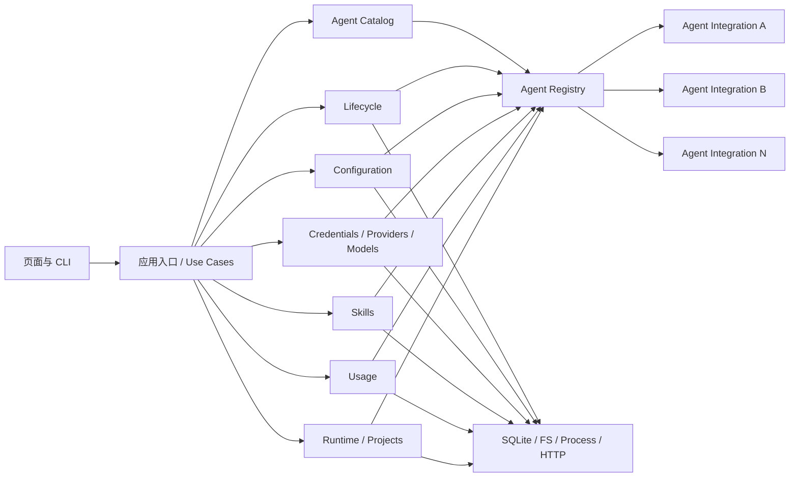

# AgentHub 平台能力架构改造方案

> **现行状态（2026-08-19）**：sidecar（`agenthub-adapterd`）仍是目标、未迁。官方船经 `release` 三文件 bump。
> 状态：稳定架构方案；P01-P13 主线与 R00-R08 修正已执行完成。当前实现、兼容边界和验证结果见 [platform-capability-remediation.md](platform-capability-remediation.md)。
> 更新日期：2026-08-07
> 适用范围：当前单体桌面应用、`agenthub-core`、Tauri/CLI 入口和前端

> 兼容边界与后续可选迁移项见 [platform-capability-remediation.md §5](platform-capability-remediation.md)。

## 1. 结论先行

本文后续章节保留平台能力解耦的目标设计与原始推导；执行后的实现状态、兼容边界和验收证据统一见 [platform-capability-remediation.md](platform-capability-remediation.md)。

AgentHub 不需要改成微服务，也不需要引入 DDD、CQRS、事件总线或运行时动态插件。当前最合适的目标仍然是**模块化单体**，但模块边界应从“每个 Agent 一套分支逻辑”调整为“平台能力拥有流程，Agent 集成只贡献差异实现”。

本次改造的核心决策如下：

1. **平台能力是一级模块**：安装、生命周期、配置、凭据、模型、Skills、用量、运行时、项目和备份分别拥有自己的服务、模型与仓储边界。
2. **Agent 集成是稀疏扩展集合**：一个 Agent 只实现自己支持的扩展端口，不再被迫实现一个不断膨胀的 `AgentAdapter`。
3. **Agent 集合开放，平台能力集合相对稳定**：Agent 标识从封闭枚举逐步迁移到稳定字符串 `AgentKey`；平台能力仍使用类型安全的有限集合。
4. **统一注册中心是唯一发现入口**：服务和页面查询注册中心，不在多处维护 `match AgentId`、Agent 名称、安装方式、路径或能力列表。
5. **行为放代码，状态放数据库**：Agent 定义与扩展实现保留在代码中；安装观测、配置档案、绑定关系、Skill 分配、用量和操作记录存数据库。暂不建设 Agent Marketplace，也不把 Agent 定义做成数据库驱动。
6. **先兼容迁移，再删除旧路径**：保留 `AgentId`、`AgentAdapter` 和现有 API 作为过渡层，每个阶段都必须可构建、可测试、可回退，禁止一次性大搬家。
7. **前端由后端目录驱动**：Agent 名称、能力、安装通道、配置字段和运行能力由后端目录接口提供；前端只保留展示策略，不再手工同步 Rust 枚举和 Agent 业务规则。

改造完成后，新增普通 Agent 的理想改动面应收敛为：

```text
新增一个 integrations/agents/<agent_key>/ 目录
  + manifest/descriptor
  + 该 Agent 实际支持的扩展端口
  + fixtures 与契约测试
  + 可选图标资源

不修改平台服务
不修改页面业务分支
不新增数据库表
不修改统一生命周期流程
```

## 2. 范围与非目标

### 2.1 本方案覆盖

- Agent 安装、检测、升级、卸载和运行状态管理
- Agent 配置档案与原生配置文件投影
- API Key、账号凭据、Provider、Model 与当前连接选择
- Skills 来源、安装、启停、升级和分配
- Token/用量采集、归一化、归属和查询
- Agent 运行时、项目发现、流式输出解析
- 前后端契约、模块目录和新增 Agent 开发流程
- 最小必要的日志、健康检查、操作记录和并发控制扩展点

### 2.2 明确不做

- 本文中的“Agent 安装/卸载”指平台管理外部 Agent CLI/runtime，不是运行时安装或热加载 AgentHub 集成插件。
- 不拆微服务，不引入独立部署单元。
- 不引入 DDD 战术模式、CQRS、事件溯源或通用事件总线。
- 不实现运行时 DLL/动态库插件 ABI；Agent 集成仍随应用编译发布。
- 不建设 Agent Marketplace、Prompt 管理或通用 MCP/Tool 管理。
- 不把所有 Agent 差异都配置化；复杂解析、OAuth、原生配置写入等行为仍由代码实现。
- **不进行凭据落盘加密改造**。继续沿用项目已确定的存储方案，不引入 keyring、AES、主密码或密文迁移。
- 不为了目标目录一次性移动全部文件；目录调整必须跟随职责迁移逐步完成。

## 3. 当前架构判断

### 3.1 应保留的基础

当前项目并非需要推倒重来，以下基础是正确的：

- `crates/agenthub-core` 已承担核心能力，Tauri 与 CLI 大体保持为入口层。
- 前端已经建立 backend contract/adapter 边界，生产 `invoke` 集中在 `src/lib/backend/tauri/`。
- Skills 已形成“共享来源 + Agent 目标目录投影”的雏形，并有锁文件和临时目录安装机制。
- Runtime、Backup、日志脱敏、并发锁和用量统一记录已经具备可复用基础。
- 能力矩阵已经表达 Full、Partial、Planned 等差异，可演进为注册中心的一部分。

因此，改造重点是**收口职责和替换分发方式**，不是重写所有功能。

### 3.2 主要技术债

| 技术债 | 当前表现 | 长期后果 | 优先级 |
|---|---|---|---|
| Agent 集合是封闭枚举 | Rust `AgentId`、前端联合类型、静态列表需要同步修改 | 每新增 Agent 都触发大量无关文件变化 | P0 |
| `AgentAdapter` 过胖 | 安装、配置、凭据、项目、会话等职责聚合在同一 trait | 新平台能力会迫使所有 Agent 修改 | P0 |
| Agent 差异散落 | catalog、path、install、usage、project、stream parse 和前端均有具体 Agent 分支 | 行为难以发现，容易漏改和产生不一致 | P0 |
| 当前连接状态分裂 | Provider 与 Account 服务互相 best-effort 降级 current 状态 | 可能出现双 current、无 current 或跨服务耦合 | P1 |
| 原生配置知识泄露到前端 | 前端知道 Claude/Codex 字段、配置路径和 TOML/JSON 细节 | UI 随每个 Agent 增长，难复用、难测试 | P1 |
| Skills 服务过大 | catalog、source、安装、投影、更新和锁文件集中在一个服务 | 修改风险高，升级原子性不一致 | P1 |
| 生命周期只是若干动作 | 安装结果以 `ok/action/logs` 为主，缺少统一操作、重检与恢复语义 | UI/CLI 难以一致展示进度和失败状态 | P1 |
| 前后端类型手工同步 | 前端注释要求与 Rust 枚举保持一致 | 契约漂移只能在运行期暴露 | P1 |
| 大文件承担多个变化原因 | Rust 多个 service 超过约千行，若干前端页面/组件接近或超过千行 | review、测试和并行修改成本持续增加 | P2 |

### 3.3 当前最典型的耦合点

以下位置应作为迁移优先观察点，而不是继续追加分支：

- `crates/agenthub-core/src/models/agent.rs`
- `crates/agenthub-core/src/adapters/mod.rs`
- `crates/agenthub-core/src/catalog/install.rs`
- `crates/agenthub-core/src/utils/paths.rs`
- `crates/agenthub-core/src/services/install_service.rs`
- `crates/agenthub-core/src/services/usage_service.rs`
- `crates/agenthub-core/src/usage/`
- `crates/agenthub-core/src/services/project_service.rs`
- `crates/agenthub-core/src/utils/stream_parse/`
- `src/config/agents.ts`
- `src/lib/types.ts`
- `src/lib/provider-detect/`

迁移期间的新规则是：**除兼容层和集成目录外，不再新增具体 Agent 名称分支。**如果业务代码需要判断具体 Agent，应先确认该差异是否应该成为扩展端口或描述元数据。

## 4. 目标架构



依赖方向必须保持单向：

```text
入口层 -> 平台能力 -> 扩展端口 <- Agent 集成
                  -> 基础设施接口 <- SQLite/文件系统/进程/HTTP 实现
```

平台能力可以调用扩展端口；Agent 集成不得反向调用页面、Tauri command 或其他 Agent 集成。两个平台能力需要协作时，由应用服务显式编排，不建立隐式跨模块写入。

## 5. 按平台能力划分模块

| 平台模块 | 拥有的数据/流程 | Agent 可贡献的差异 | 不应拥有 |
|---|---|---|---|
| Agent Catalog | Agent 描述、能力查询、注册发现 | descriptor、能力等级、安装通道 | 安装执行、业务状态写入 |
| Lifecycle | install/update/uninstall/start/stop 的统一流程、锁、进度、操作记录 | detector、install spec 或特殊 installer、health check | Agent 专属 UI |
| Configuration | 配置档案、校验、版本迁移、应用与回读 | config schema、projector、native reader | API Key 生命周期、前端文件解析 |
| Credentials | API Key/OAuth/账号凭据档案与选择 | credential driver、认证测试、原生字段映射 | 模型目录和用量解析 |
| Models | Provider、ModelProfile、默认参数和可用性验证 | 可选模型发现/校验贡献 | 官方模型 Marketplace |
| Connections | 某 Agent 当前使用的 credential/provider/model 绑定 | config projector 消费绑定 | 各服务各自维护 `is_current` |
| Skills | 来源、包、版本、分配、启停、升级与 reconcile | skill target、兼容性校验 | 每个 Agent 自建 Skill 数据库 |
| Usage | 统一记录、查询、归属、价格计算 | usage source、token normalizer | Agent 专属统计页面 |
| Runtime | 启停、命令构造、进程状态、流式输出 | runner、stream parser | 安装状态真相 |
| Projects | 项目发现、会话索引和统一 DTO | project source | UI 页面状态 |
| Backup | 备份计划、恢复编排和版本兼容 | 可选备份贡献项 | Agent 生命周期控制 |
| Observability | 结构化日志、operation id、健康汇总 | health contributor | 独立监控平台 |

这些是代码职责边界，不要求每个模块都成为独立 crate。当前阶段保留一个 `agenthub-core` crate，可以避免依赖图和构建复杂度过早上升。

## 6. 核心抽象

### 6.1 `AgentKey`：开放的 Agent 标识

目标模型使用可验证的稳定字符串，而不是要求全局穷举的 enum：

```rust
pub struct AgentKey(String);

impl AgentKey {
    pub fn parse(value: impl Into<String>) -> Result<Self, AgentKeyError>;
    pub fn as_str(&self) -> &str;
}
```

约束：

- 格式建议为小写 kebab-case，例如 `claude-code`、`codex`。
- key 一经发布不得因为展示名变化而修改。
- 数据库和前后端契约使用字符串 key。
- 迁移期保留 `AgentId`，提供 `AgentId -> AgentKey` 转换；旧 API 不应立即删除。
- 读取到当前版本未知的 key 时保留原值并显示 unavailable，不删除记录、不静默映射到其他 Agent。

### 6.2 `AgentDescriptor`：纯描述，不执行行为

```rust
pub struct AgentDescriptor {
    pub key: AgentKey,
    pub display_name: String,
    pub integration_version: u32,
    pub capabilities: CapabilitySet,
    pub install_channels: Vec<InstallChannelDescriptor>,
    pub config_schema_version: Option<u32>,
}
```

Descriptor 是前端目录、能力判断和兼容检查的来源。它不持有数据库连接，也不直接执行文件或进程操作。

平台能力集合保持类型安全，例如 `Install`、`Configure`、`Skills`、`Usage`、`Runtime`、`Projects`。能力等级继续支持 `Full`、`Partial`、`Planned`、`Unsupported`，但必须满足：

- `Full` 或 `Partial`：注册中心中必须存在对应处理端口。
- `Planned`：只用于展示路线，不得伪装成可调用功能。
- `Unsupported`：调用统一返回 typed unsupported error。

### 6.3 `AgentModule`：稀疏扩展集合

目标结构不是新的“万能 Adapter”，而是一个 descriptor 加可选贡献：

```rust
pub struct AgentModule {
    pub descriptor: AgentDescriptor,
    pub detector: Arc<dyn AgentDetector>,
    pub installer: Option<Arc<dyn AgentInstaller>>,
    pub config: Option<Arc<dyn AgentConfigProjector>>,
    pub credentials: Option<Arc<dyn AgentCredentialDriver>>,
    pub skills: Option<Arc<dyn AgentSkillTarget>>,
    pub runner: Option<Arc<dyn AgentRunner>>,
    pub usage: Option<Arc<dyn UsageSource>>,
    pub projects: Option<Arc<dyn ProjectSource>>,
    pub stream_parser: Option<Arc<dyn StreamParser>>,
    pub health: Option<Arc<dyn HealthContributor>>,
}
```

上面的字段用于明确边界，不要求第一次提交就创建所有 trait。按迁移路线一次抽取一个端口；尚未迁移的行为继续由 legacy adapter 兼容层代理。

端口设计规则：

- 输入输出使用平台 DTO，不暴露 Tauri、React 或数据库实体。
- 一个端口只对应一个变化原因。
- 平台流程负责锁、持久化、日志、重试策略和进度；扩展只处理 Agent 特有差异。
- 能用声明式元数据表达的安装命令、路径模板和配置字段，不写自定义 trait 实现。
- 只有确实存在复杂行为时才实现代码端口，例如 OAuth、特殊配置迁移或非标准日志解析。

### 6.4 注册方式

当前阶段采用**编译期、进程内注册**：

```rust
pub fn builtin_agent_modules() -> Vec<AgentModule> {
    vec![
        claude::module(),
        codex::module(),
        // 新 Agent 初期只允许在此增加一行
    ]
}
```

一处显式注册是可接受的，因为它简单、可审计且不引入动态 ABI。完成前几阶段后，如果这一行确实成为高频摩擦，再考虑编译期自动收集；在此之前不引入宏注册框架。

## 7. 统一 Agent 生命周期

### 7.1 不使用一个巨大的状态枚举

安装状态、配置状态、运行状态和当前操作是四个正交维度，不应组合成几十个枚举值：

```text
InstallationObserved: not_found | installed(version) | broken(reason)
ConfigurationObserved: unknown | missing | valid(revision) | invalid(reason)
RuntimeObserved: stopped | starting | running(pid) | stopping | crashed(reason)
Operation: queued | running(step) | succeeded | failed | cancelled
```

数据库保存最近观测与操作记录，但外部 CLI/文件系统仍是安装事实来源。每次关键操作后必须重新检测，不能只相信数据库中的目标状态。

### 7.2 统一操作流程

安装、升级、卸载和修复共用以下模板：

1. 解析 `AgentKey`，从 registry 获取 module。
2. 检查 capability 与所需 extension。
3. 获取 `(agent_key, operation_kind)` 互斥锁。
4. 创建 operation 记录并附加 `operation_id`。
5. 执行 preflight：平台、权限、运行中进程、依赖和可写路径。
6. 生成可展示的 plan；危险命令必须来自受控 spec 或经过校验的扩展。
7. 执行步骤并通过 `ProgressSink` 输出 typed progress。
8. 重新运行 detector，得到 observed state。
9. 按需应用配置、reconcile Skills、执行 health check。
10. 记录成功或失败、错误码、摘要和最终观测状态，释放锁。

失败语义：

- 不把 `ok: false + message` 作为唯一错误结构；使用 typed error code 加用户可读摘要。
- 失败后仍尽可能重新检测，避免 UI 停留在错误的乐观状态。
- 操作日志不得包含明文凭据。
- CLI 与 Tauri 共用同一 lifecycle service，只分别渲染 progress，不复制流程。

这里的 `ProgressSink` 是一次操作内的回调/通道，不是通用事件总线。

### 7.3 安装策略

平台提供可复用执行器，例如：

- `NpmPackageInstaller`
- `OfficialScriptInstaller`
- `BinaryArchiveInstaller`
- `ExternalPackageManagerInstaller`

Agent 优先声明 package、版本探测命令、支持平台、channel 和卸载策略。只有标准执行器无法覆盖时才提供自定义 `AgentInstaller`。路径发现也应由 descriptor/path spec 或 detector 收口，不继续写入全局 `utils/paths.rs` 分支。

## 8. 统一 Skills 管理

### 8.1 模型分层

```text
SkillSource      来源：git/local/builtin，含 locator 与同步状态
SkillPackage     某来源中的一个可安装 Skill，含稳定 key、manifest、revision
SkillAssignment  某 package 对某 agent_key 的期望状态
SkillProjection  reconcile 后在 Agent 目标目录中的实际状态
```

`SkillAssignment` 至少包含：

- `skill_package_id`
- `agent_key`
- `desired_enabled`
- `projection_mode`（copy/symlink/agent-native，按当前平台支持取值）
- `applied_revision`
- `observed_status`
- `last_error`

启用/禁用只修改期望状态并触发 reconcile；不要让 UI 直接复制或删除 Agent 目录。

### 8.2 模块拆分

将当前大 Skill 服务按职责逐步拆分为：

```text
skills/catalog       列表、manifest、兼容性查询
skills/sources       clone/fetch/local/builtin 来源同步
skills/packages      安装、版本与内容校验
skills/assignments   期望启停状态
skills/reconciler    desired -> observed
skills/targets       AgentSkillTarget 扩展端口
```

仍可由一个 `SkillService` façade 暂时保持旧 API，内部转调新组件。

### 8.3 升级一致性

所有来源类型统一采用：

```text
下载/拉取到 staging
-> 校验 manifest 与目录边界
-> 计算 revision
-> 原子替换共享来源
-> reconcile 已启用目标
-> 更新 lock/数据库
```

禁止在当前 live git source 上直接 `git pull` 后再尝试补救。升级失败时旧 revision 必须仍可用，已有 Agent 投影不得被半更新。

## 9. 凭据、Provider、Model 与当前连接

### 9.1 统一关系

```text
CredentialProfile
    -> ProviderProfile
        -> ModelProfile
            -> AgentActiveBinding
                -> AgentConfigProjector
                    -> Agent 原生配置文件/环境
```

- `CredentialProfile`：API Key、OAuth 或账号凭据，保留类型和 Agent/Provider 适用范围。
- `ProviderProfile`：base URL、协议类型、请求选项及 credential 引用。
- `ModelProfile`：model id、显示名、上下文/默认参数及 provider 引用。
- `AgentActiveBinding`：某 Agent 当前选择的 credential/provider/model/config profile，作为唯一 current 指针。

不再由 `providers.is_current` 和 `accounts.is_current` 分别维护两个事实。迁移期旧字段可双写，但读取必须逐步切到 binding；稳定后再单独提交清理旧字段。

### 9.2 配置投影

平台保存规范化配置档案，Agent 的 `ConfigProjector` 负责：

- 校验该 Agent 的字段约束。
- 将 active binding 与配置值转换为原生 JSON/TOML/env/命令参数。
- 采用临时文件 + 原子替换写入。
- 回读并返回规范化值及不可识别字段。
- 保留未知原生字段，除非用户明确要求覆盖。

前端根据后端提供的 field schema 渲染通用表单；复杂 OAuth 或 Agent 特殊交互可以注册专用 UI，但普通 Agent 不应新增整页分支。

### 9.3 凭据存储范围

本方案只统一抽象与归属，不改变当前凭据落盘方案。凭据日志必须脱敏；除此之外，keyring、AES、主密码和历史密文迁移均为范围外事项。

## 10. Token 与用量基础设施

职责划分：

```text
UsageSource（Agent 集成）
  发现原始日志/会话/API 用量，输出 RawUsageEvent

UsageNormalizer（平台或协议级）
  统一 input/output/cache/reasoning token 与时间、model id

UsageService（平台）
  去重、持久化、查询、聚合、价格计算与归属
```

设计要求：

- Agent 特殊 JSONL 路径、字段和 token 规则留在 `UsageSource`，平台服务中不出现具体 Agent `match`。
- 用量记录保留 `agent_key`、时间、原始 model id、规范化 model profile、credential/provider 引用和 source fingerprint。
- 无法可靠判断账号/凭据归属时允许 `NULL`，禁止猜测。
- 价格计算使用独立的 pricing/model metadata，不把价格写死在 parser。
- parser/normalizer 带版本，便于未来重扫历史数据而不覆盖原始事实。

## 11. 数据模型

### 11.1 数据表建议

| 表 | 关键字段 | 说明 |
|---|---|---|
| `agent_installations` | `agent_key`, `observed_version`, `channel`, `executable_path`, `status`, `last_checked_at` | 最近观测缓存，不是唯一事实源 |
| `agent_config_profiles` | `id`, `agent_key`, `name`, `schema_version`, `values_json`, `revision` | 通用字段关系化，Agent 可变值 JSON 化 |
| `credential_profiles` | `id`, `kind`, `provider_kind`, `agent_scope`, `payload`, `metadata_json` | 可由现有 accounts 渐进迁移；不改变加密决策 |
| `provider_profiles` | `id`, `protocol`, `base_url`, `credential_id`, `settings_json` | Provider 连接定义 |
| `model_profiles` | `id`, `provider_id`, `model_id`, `name`, `settings_json` | 用户配置的模型，不是 Marketplace |
| `agent_active_bindings` | `agent_key`, `credential_id`, `provider_id`, `model_id`, `config_profile_id`, `revision` | 每个 Agent 至多一条 active binding |
| `skill_sources` | `id`, `kind`, `locator`, `current_revision`, `sync_status` | 由现有 source 记录演进 |
| `skill_packages` | `id`, `source_id`, `skill_key`, `manifest_json`, `revision` | 共享 Skill 包 |
| `skill_assignments` | `skill_package_id`, `agent_key`, `desired_enabled`, `applied_revision`, `status`, `last_error` | 每 Agent 的期望与观测 |
| `usage_records` | 现有字段 + 可选 `credential_id`, `provider_id`, `raw_model`, `parser_version` | 保持不可归属字段可空 |
| `operations` | `id`, `agent_key`, `kind`, `status`, `step`, `error_code`, `summary`, timestamps | 生命周期和长操作审计/恢复依据 |

这些表按功能阶段新增，不应在一次 migration 中全部创建。

### 11.2 建模规则

- 可查询、稳定、需要约束的字段使用关系列；Agent 特有的稀疏配置使用 `*_json`，并带 `schema_version`。
- 所有新表使用字符串 `agent_key`，不使用数据库 enum。
- 不为每个 Agent 新建表或新增专属列。
- 外键、唯一约束和常用查询索引随 migration 一起提交。
- active binding 对 `agent_key` 唯一；assignment 对 `(skill_package_id, agent_key)` 唯一。
- JSON 解析失败、未知 Agent 或扩展暂不可用时保留原始记录并显式标记，不静默删除。
- schema migration 只负责数据库结构和确定性数据迁移；文件系统扫描与 Agent 探测放在 service/reconcile 中。

## 12. 前端架构

### 12.1 后端驱动 Agent 目录

新增统一 catalog contract，前端启动时获取：

- `agentKey`
- `displayName`
- capability levels
- install channels
- configuration field schema/version
- availability/unavailable reason

`src/config/agents.ts` 可在迁移期保留 façade，但最终不再是业务真相来源。颜色、布局和纯展示 fallback 可以留在前端；安装方式、原生路径、配置字段和能力判断必须来自后端。

### 12.2 契约生成

Rust 是跨端 DTO 的单一来源。应采用项目可维护的生成步骤输出 TypeScript 类型，并在 CI/测试中检查生成文件是否漂移。不要继续依赖“注释提醒手工同步”。在生成链路稳定前保留兼容类型，禁止一次性改写所有页面。

### 12.3 页面按能力组织

页面只是组合层，不持有 Agent 原生业务规则。大页面按用户能力拆分，而不是按 Agent 拆分：

```text
modules/
  agent-catalog/
  lifecycle/
  connections/
    credentials/
    providers/
    models/
  skills/
  usage/
  projects/
  chat/
  settings/
```

`shared/` 只放真正无业务含义的 UI 与工具。Provider 编辑、Skill 分配、项目会话等业务组件应回到对应 capability module。

## 13. 目标目录结构

这是职责迁移完成后的目标，不是要求一次性重命名：

```text
crates/agenthub-core/src/
├─ lib.rs                         # 组合根，仅装配
├─ app/
│  └─ services.rs                # 跨能力 use case 编排
├─ platform/
│  ├─ agent_catalog/
│  ├─ lifecycle/
│  ├─ configuration/
│  ├─ credentials/
│  ├─ models/
│  ├─ connections/
│  ├─ skills/
│  ├─ usage/
│  ├─ runtime/
│  ├─ projects/
│  ├─ backup/
│  └─ observability/
├─ integrations/
│  └─ agents/
│     ├─ claude/
│     ├─ codex/
│     └─ <agent_key>/
└─ infrastructure/
   ├─ sqlite/
   │  ├─ migrations/
   │  └─ repos/
   ├─ filesystem/
   ├─ process/
   └─ http/

src/
├─ app/
│  ├─ runtime/
│  └─ routes/
├─ modules/
│  ├─ agent-catalog/
│  ├─ lifecycle/
│  ├─ connections/
│  ├─ skills/
│  ├─ usage/
│  ├─ projects/
│  ├─ chat/
│  └─ settings/
├─ lib/backend/
│  ├─ contracts/
│  ├─ tauri/
│  └─ current.ts
├─ dev/mocks/
├─ test/
└─ shared/
   ├─ ui/
   └─ utils/
```

目录调整规则：只有当旧文件中的职责已经被新模块接管、兼容 façade 已建立且测试覆盖后，才移动或删除旧路径。不要创建空目录或只有转发代码的“架构占位”。

## 14. 分阶段演进路线

每个阶段拆成一个或多个独立 PR；详细执行提示词见配套文档。

### 阶段 A：建立 Catalog 与兼容接缝

目标：后续功能不再直接依赖封闭 Agent 列表。

- 引入 `AgentKey`、`AgentDescriptor`、`AgentCatalogService`。
- 从现有 registry/capability/install catalog 聚合 descriptor，暂不搬走旧实现。
- 暴露统一后端 catalog contract。
- 前端改为运行时读取目录，保留兼容 façade。
- 为未知/不可用 Agent 建立显式展示语义。

验收：新增测试用 descriptor 不需要修改页面静态 Agent 列表；现有 Agent 页面和命令行为不变。

### 阶段 B：从胖 Adapter 抽取高变化扩展端口

按一次一个职责的顺序抽取：

1. `UsageSource`
2. `StreamParser`
3. `ProjectSource`
4. 安装声明/`AgentInstaller`
5. `AgentConfigProjector`
6. `AgentSkillTarget`

平台服务只做统一流程，具体 Agent 分支移动到对应集成模块。legacy `AgentAdapter` 暂时保留并委托新端口。

验收：被迁移的平台 service 中不再出现具体 Agent 名称分支；契约测试覆盖 supported/unsupported；现有 API 不变。

### 阶段 C：统一生命周期与连接模型

- 引入 lifecycle coordinator、typed operation/progress/error。
- 增加 `operations`，操作后统一 redetect。
- 引入 credential/provider/model/profile 与 `agent_active_bindings`。
- 迁移 current 读取，再短期双写，最后单独清理旧 current 字段。
- 将原生配置解析和写入迁回 Core 的 config projector。

验收：Tauri/CLI 共用同一流程；每个 Agent 至多一个 active binding；失败操作能返回最终观测状态；前端不解析 Agent 原生配置文件。

### 阶段 D：Skills desired-state 与原子升级

- 拆分当前 Skill 服务内部职责，保留 façade。
- 增加 package/assignment 语义和 reconciler。
- 所有来源升级统一 staging、validate、atomic swap。
- Agent 目标差异由 `AgentSkillTarget` 承担。

验收：启停是幂等 reconcile；升级失败不破坏当前可用 revision；新增 Agent 只实现 target 或声明不支持。

### 阶段 E：清理兼容层与大文件

- 使用生成契约替代手工 Rust/TS 同步。
- 删除已经无调用者的 Agent 分支、旧 current 读取和 legacy adapter 方法。
- 按 capability 拆解前端大页面和 Core 大 service。
- 在稳定后再移动到最终目录。

验收：新增样例 Agent 的变更面符合目标；CodeGraph impact 不再扩散到大量无关页面/服务；全量测试、构建和迁移回滚检查通过。

## 15. 新增 Agent 的标准开发面

最终提供 `cargo xtask new-agent <agent-key>` 或等价脚手架，生成：

```text
integrations/agents/<agent-key>/
├─ mod.rs
├─ descriptor.rs
├─ detector.rs
├─ fixtures/
└─ tests.rs
```

开发者只需：

1. 填写 descriptor 与能力等级。
2. 声明标准安装/path/config spec，或实现确有需要的扩展端口。
3. 提供 detector 与至少一个正/负 fixture。
4. 运行所有扩展端口的共享契约测试。
5. 在唯一 builtin registry 增加一行并提供可选图标。

共享契约测试至少覆盖：

- descriptor key 唯一且格式合法。
- `Full/Partial` 能力存在 handler，`Unsupported/Planned` 不可被执行。
- detector 对不存在、正常和损坏安装返回稳定结果。
- config projector 往返不丢未知字段，写入失败不破坏旧文件。
- usage parser 去重键稳定，未知字段不 panic。
- Skill reconcile 重复执行幂等且不越出允许目录。
- 命令参数以结构化 argv 传递，不拼接 shell 字符串。

## 16. 值得提前预留但暂不建设的扩展点

| 扩展点 | 现在做什么 | 现在不做什么 |
|---|---|---|
| 日志 | 统一 `operation_id`、`agent_key`、`capability`、`error_code`，继续脱敏 | 不部署集中式日志平台 |
| 健康检查 | `HealthContributor` + Doctor 聚合结果 | 不建设复杂探针编排或告警系统 |
| 权限/安全 | `OperationPolicy`、允许路径/命令校验、危险操作显式确认接口 | 不做 RBAC/多租户权限系统 |
| 并发 | 统一 operation coordinator 和资源锁 key | 不做分布式锁 |
| 调度 | 为 usage scan/update check 保留轻量 job 接口 | 不引入工作流引擎 |
| 兼容性 | descriptor、config schema、parser 和 projection revision | 不做通用插件协议协商 |

这些扩展点只有接口或字段级预留，必须由真实需求驱动实现。

## 17. 架构验收标准

改造是否成功，不以目录是否“好看”为判断，而以以下结果为准：

- 新增一个普通 Agent 时，平台 service、数据库 schema 和现有页面无需修改。
- 具体 Agent 名称只出现在集成目录、兼容迁移代码、fixture 和纯展示资源中。
- 每项平台能力有唯一写入入口；跨模块状态不靠 best-effort 相互修正。
- 所有 capability 调用都先做支持性检查，并返回统一 unsupported error。
- 安装、配置、Skills 和恢复操作具备锁、临时目录/文件、原子替换或明确补偿语义。
- 前端无法绕过 backend adapter 直接 `invoke`，也不解析 Agent 原生配置。
- 未知 Agent、未知字段和不可归属用量均被保留并显式展示。
- 各阶段提交不改变无关行为，测试代码与生产实现分文件，旧路径仅在有替代和验证后删除。

## 18. 实施纪律

- 一次只迁移一个能力或一个明确的数据不变量。
- 每个 PR 先增加兼容接缝和 characterization tests，再切换调用，最后删除死代码。
- 不在同一 PR 同时做大规模重命名、数据迁移、行为修改和 UI 重构。
- 使用 CodeGraph 判断调用链和影响范围；只有查文字、配置值或已知文件内容时使用文本搜索。
- 保留用户已有修改，禁止 `git reset --hard`、未经授权删除和无关格式化。
- 每个阶段必须运行本域测试，并在交付说明中列出：变更文件、旧/新调用路径、兼容层、测试结果、剩余风险与下一阶段入口。

本方案是后续架构迁移的稳定决策源；实现现状仍以代码、数据库 migration 和测试为准。若执行过程中发现本方案与真实约束冲突，应停止扩大修改，记录证据并先更新本方案，而不是让单个实现 Agent 临时发明另一套架构。
