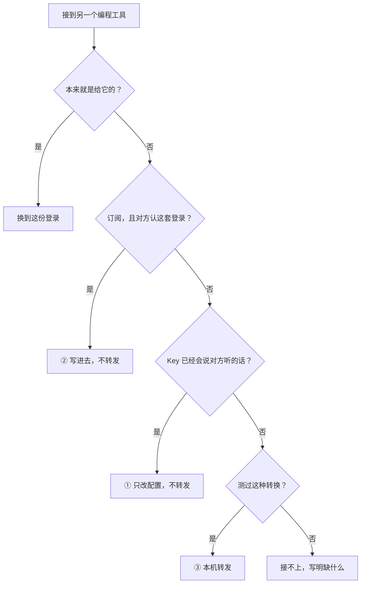
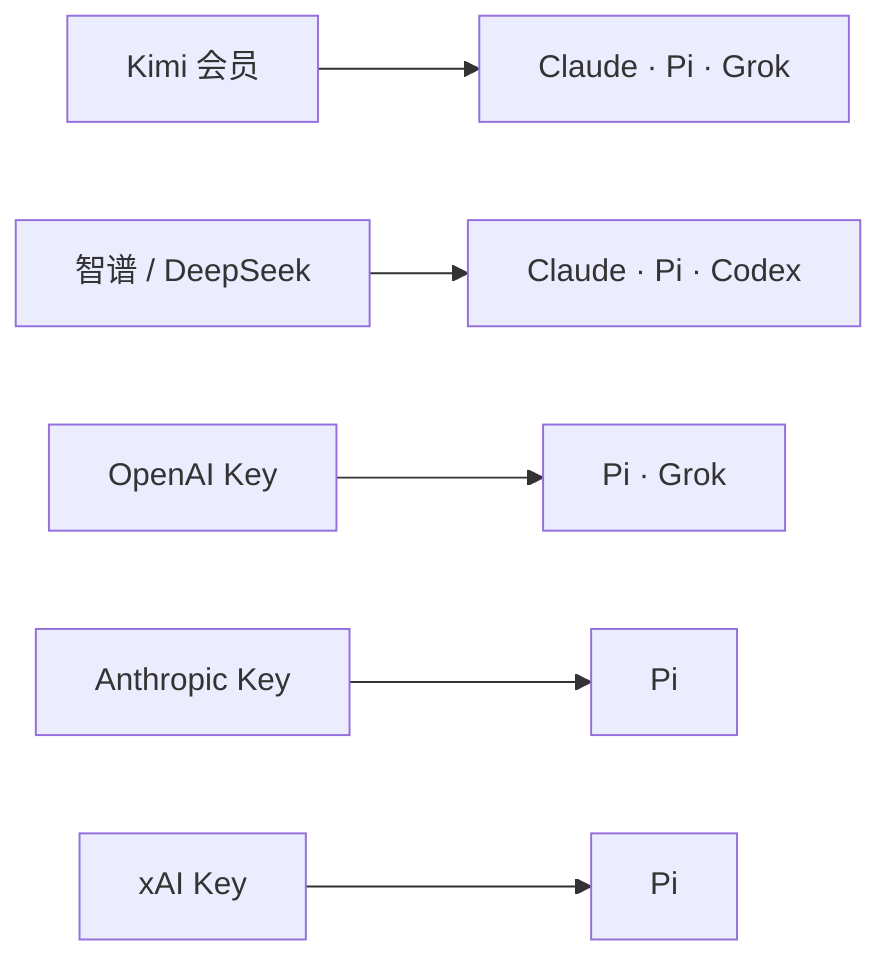
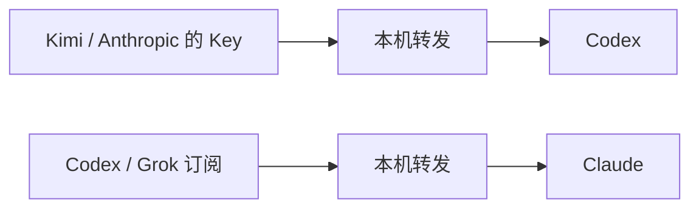

# 把已有登录接到另一个编程工具

> 状态：**2026-08-19**。本文是跨工具复用的**产品**真源，前半用日常说法，后半给实现对照。三种做法仍用 ①②③ 作模型名；**现行界面芯片**是「直连 / 用这份登录 / 本机路由 / 当前不支持」，不再标圈号。界面说「登录」，不说「票」。  
> 领域对象与规划器仍以 [connection-binding-model.md](connection-binding-model.md) 为准。  
> 各家接口与**现在能不能写上去**以 [provider-api-oauth-adaptation.md](provider-api-oauth-adaptation.md) 为准。  
> 实现清单以 [agenthub-plan.md §8](agenthub-plan.md#8-当前实现状态以代码与测试为准) 为准。

## 0. 一句话

你在 AgentHub 里存的，是**一份登录**：一把 API Key，或一次订阅登录。  
Claude、Codex、Grok、Pi 是四个**编程工具**。  
同一份登录接到不同工具，做法可以不一样。只可能是下面三种之一。

能直接改配置、或写进对方认的登录，就不做转发。转发是兜底，不是默认。  
**现在还写不上去**只表示这条还没接到写入，不表示产品不做。

做法挂在 **(这份登录, 那个工具)** 上，不挂在登录本身上。同一把 Key 接到 Claude 可能只改配置，接到 Codex 却要转发，这是常态。

### 三种做法长什么样

**① 直接改配置** — Key 已经会说那个工具听得懂的话，只填地址和模型，不另开程序。


**② 写进对方认的登录** — 对方自己就会用这套订阅，只把登录写过去，不另开程序。


**③ 本机转发** — 两边说的话对不上，才在这台电脑上做一层转换。目标只连你家电脑，真正登录留在 AgentHub。


怎么选（顺序不能换）：



## 1. 三种做法

### 1.1 直接改配置

这份 API Key 本身就会说目标工具听得懂的话。AgentHub 只帮你填官方地址和模型，**不另开程序**。

常见情况：同一产品同时提供两种接口（给 Claude 的一种，给普通 Chat 的一种）。一把 Key 可以接到两个以上工具。

| 例子 | 接到 | 你看到的 |
|---|---|---|
| Kimi 会员 Key | Claude Code | 填 Claude 能用的官方地址 |
| 同一把 Key | Pi | 写进 Pi 里 Kimi 那一家的位置 |
| GLM / DeepSeek 的 Key | Claude Code | 填官方给 Claude 用的地址 |
| GLM / DeepSeek 的 Key | Codex | 填官方给 Codex 用的地址 |

Anthropic Key → Pi、OpenAI Key → Pi 也是同一类：不是「两种接口」，但同样只改配置、不转发。

必须写全名：名字里带「OpenAI 兼容」的，多半是 Chat 这种接口，**不是** Codex 要的那种（Responses）。  
所以同一把「兼容」Key 接到 Codex，常常只能走 ③，不是「兼容就万能」。

### 1.2 写进对方认的登录

目标工具**自己就会**用这套订阅登录（同一套登录方式、同一套刷新方式、有对应的登录位置）。AgentHub 只把授权写进对方认的位置，**不另开程序**，也不把订阅登录翻译成另一家的 Key。

| 例子 | 接到 | 你看到的 |
|---|---|---|
| Claude 订阅 | Pi 里 Claude 那一家 | 和在 Pi 里登录 Claude 同一回事 |
| Codex / ChatGPT 订阅 | Pi 里 Codex 那一家 | 写进 Pi 自己的 Codex 登录 |
| Grok / xAI 订阅 | Pi 里 Grok 那一家 | 写进 Pi 自己的 Grok 登录 |
| 任一订阅 | 签发它的那个工具 | 普通切换到这份登录 |

目前只有 Pi 登记了「把别人的订阅写进来」。别的工具必须一家一家核对，不能因为「都是订阅登录」就类推。

不是第 2 种（常见误判）：

| 组合 | 实际 | 原因 |
|---|---|---|
| Claude 订阅 → Codex | **产品不做** | Codex 不会用 Claude 这套登录，本产品不走这条 |
| 任一国产 OAuth（Kimi `/login`、GLM / DeepSeek 登录等）→ 任意工具 | **产品不做** | 不为中国产 OAuth 开边，也不把它转成 API |
| Grok 订阅 → Claude | **③** | Claude 听的话和 Grok 说的话不同，要本机转发 |
| Codex 订阅 → Claude | **③** | Claude 只听自己那套接口；这是本机转发，不是写 Claude 官方登录 |

如果刷新令牌只能用一次，原来的工具和目标工具各自刷新会互相打翻。逐条选「目标自己再登录」或「由 AgentHub 统一刷新，目标只拿引用」。

### 1.3 本机转发

这份登录说的话，和目标工具听的话对不上，而我们又测过这种转换。这时才在这台电脑上开一层转发：目标工具只连你家电脑上的地址，真正的登录留在 AgentHub 里。

| 例子 | 你看到的 |
|---|---|
| Codex 订阅 → Claude Code | Claude 连到本机转发，额度来自 ChatGPT 订阅 |
| Kimi / Anthropic 的 Key → Codex | Codex 要的接口和上游不同，要转换 |
| Grok 订阅 → Claude Code | Claude 听一种接口，上游是 Grok 的另一种 |

③ 只在对不上时才转发。  
**不**默认先开一个一直挂着的兼容服务。

## 2. 图：三种做法分别接到谁

下面只画「谁接到谁」。每种做法本身见文首三张小图。完整对照表在下一节。

**① 只改配置**（不另开程序）



智谱 / DeepSeek 还可以直接接到 DeepSeek 自己的工具。

**② 写进对方认的登录**（目前只写进 Pi）


**③ 本机转发**（中间多一截，目标只连你家电脑）



Claude 订阅接到 Codex：**产品不做**（不是「以后再转发」）。  
中国产 AI 的 OAuth（含 Kimi CLI managed OAuth）接到任何工具：**产品不做**（不开边，也不转成 API）。现有国产路由只认官方 API Key。

## 3. 同一份登录，接到谁，做法可以不同

三种做法不是登录上的固定标签。钱包只标明这份登录**对上游能说什么**；走哪一种只出现在「接到…」的预览里。

| 这份登录 | → Claude | → Pi | → Codex | → Grok |
|---|---|---|---|---|
| Kimi 会员 Key | ① 填 Claude 能用的地址 | ① 写进 Pi | ③ 要转发 | ① 实验可写 |
| OpenAI Key | — | ① 写进 Pi | ③ 要转发（还没做） | ① 实验可写 |
| xAI Key | — | ① 写进 Pi | — | 换到这份登录 |
| GLM / DeepSeek Key | ① 填 Claude 能用的地址 | ① 写进 Pi | ① 官方有 Codex 要的接口 | — |
| Anthropic Key | 换到这份登录 | ① 写进 Pi | ③ 要转发 | — |
| Codex 订阅 | ③ 本机转发 | ② 写进 Pi 认的登录 | 换到这份登录 | — |
| Claude 订阅 | 换到这份登录 | ② 写进 Pi 认的登录 | **产品不做** | — |
| Grok 订阅 | ③ 本机转发 | ② 写进 Pi 认的登录 | — | 换到这份登录 |

DeepSeek 还可以直接接到 DeepSeek 自己的工具（①）。

固定句式：

> 「兼容两种接口」指这把 Key 对**上游**能说给 Claude 的那种，和普通 Chat 那种。能不能直接改配置，由**目标工具听什么**决定。普通 Chat 不是 Codex 要的那种接口。

怎么判定（顺序不能换）：

```text
这个工具能不能被写入？
  → 这份登录本来就是给它的？     换到这份登录
  → 订阅，且对方认这套登录？     ② 写进去，不转发
  → Key 已经会说对方听的话？     ① 只改配置，不转发
  → 测过这种转换？               ③ 本机转发
  → 否则接不上（写明缺的是什么）
```

Claude 订阅 → Codex 是**产品不做**，不是「以后再转发」。

## 4. 和本产品的边界

同类桌面工具里常见「改配置、本机转发、管理面」。AgentHub 的取舍是：

| | AgentHub |
|---|---|
| ① 官方已经给了对方听得懂的地址 | **优先直接改配置**，能配官方地址就不另开程序 |
| ② 订阅写进对方认的登录 | **能写就写**（Pi 里三家是范例） |
| ③ 协议转换 | 只在 ①② 都走不通时才本机转发 |
| 管理面 | 用现有页面做登录、额度、探测、转发启停，不另做多栏工作台 |

本产品不做：公网入口、多人共用一份登录、转售、把转发生成的配置再当成一份新登录、默认一直挂着的兼容服务、**中国产 AI 的 OAuth 开边或转成 API**。  
公开致谢见根 [README.md](../README.md)。把登录存盘后再加密，仍是项目范围外。国产 OAuth 关闭项见根 [AGENTS.md](../AGENTS.md)。

## 5. 产品要做，实现可以暂时写不上去

| 层 | 说什么 | 不说什么 |
|---|---|---|
| 产品 | 三种都要做；先直接改配置和写进对方认的登录，对不上再转发 | 「订阅 = 必须转发」「订阅不是产品」 |
| 实现 | 这条现在还写不上去 | 「用户不准问起」「入口藏掉」 |
| 安全 | 只在这台电脑、当前用户；③ 的登录不进目标工具 | 「没官方书面批准就不能做 ③」 |

打开写入的条件是工程就绪，不是再讨论「要不要做」。③ 的非官方通道风险写在预览里，由你确认。

## 6. 工程顺序（不再讨论方向）

1. **① 补齐**：一把 Key 接到更多已登记的工具；GLM / DeepSeek → Pi、→ Codex 已可试写。单接口 Key 按图继续补。
2. **② 先用已有的**：Claude / Codex / Grok 订阅 → Pi。**当前**：这三条已可试写（写进 Pi 自己的登录，之后由 Pi 刷新）。再看别的工具有没有同类位置。
3. **③ 旗舰转发**：Codex 订阅 → Claude Code；Grok 订阅 → Claude。Claude 订阅 → Codex 明确产品不做。国产 OAuth 不开边、不转 API，不是待评估候选。
4. 管理面：登录状态、额度、最小探测、转发启停放在现有页面，不另做工作台。

## 7. 给实现的对照

前半不用领域词。实现和测试仍用下面这套名字，**不要当成第五种路线**。

| 日常说法 | 领域 / 代码 |
|---|---|
| 一份登录 | 票 `Ticket` |
| 编程工具 | Agent |
| 对方认的那一处配置或登录 | 槽 |
| 某一份登录接到某一个工具的做法 | 边 |
| 换到这份登录 | `route=native` |
| ① 直接改配置 | 通常 `reshape`；实现名 `native_endpoint` / `config_sync` |
| ② 写进对方认的登录 | 跨工具通常 `reshape`；实现名 `config_sync` |
| ③ 本机转发 | `route=bridge`；实现名 `local_bridge` |
| 现在能写上去 | `plan.canApply=true`（有写入实现，且能按这份登录解析密钥） |
| 规划器 | `plan()`，只返回 `native \| reshape \| bridge \| 不可行` |

三种做法是给用户看的说明，由 `plan()` 派生。前端不得自己猜。  
目标工具要同时登记「听哪种接口」和「认哪套订阅登录」。订阅登录除了接口，还要带这套登录的身份，否则规划器判不出 ②。

## 8. 其他文档怎么读

| 文档 | 怎么读 |
|---|---|
| 本文 | 三种做法的**产品**真源；前半给读者，§7 给实现 |
| [connection-binding-model.md](connection-binding-model.md) | 登录 / 绑定 / 规划器的领域名字（票、槽、边） |
| [provider-api-oauth-adaptation.md](provider-api-oauth-adaptation.md) | 各家接口与现在能不能写上去；订阅 ≠ 要转发 |
| [adapter-design.md](adapter-design.md) | 页面与转发运行时；转发只服务 ③ |
| [ui-design.md](ui-design.md) | 「接到…」预览按三种做法说明；界面芯片是「直连 / 用这份登录 / 本机路由 / 当前不支持」；② 不显示本机服务 |
| [adding-an-agent.md](adding-an-agent.md) | 新工具必须登记听哪种接口 **和** 认哪套订阅登录 |
| [architecture.md](architecture.md) | 模块拆分；原则 12 按三种做法解释 `plan()` |
| [agenthub-plan.md](agenthub-plan.md) | 总方案；§8 是实现清单 |
| [adapter-sidecar-design.md](adapter-sidecar-design.md) | 只有 ③ 依赖独立转发进程 |
| [hub-redesign-plan.md](hub-redesign-plan.md) | Phase 1 **历史记录** |
| [adapter-kimi-codex-dogfood.md](adapter-kimi-codex-dogfood.md) | ① 与 ③ 的真机清单 |
| [deepseek-harness-integration.md](deepseek-harness-integration.md) | DeepSeek API 属 ①；DeepSeek 自己的工具不是转发 |
| [account-authorization-pool.md](account-authorization-pool.md) | 登录去重；不决定走哪一种 |
| [capability-matrix.md](capability-matrix.md) | 工具**自己**能不能；不是复用三种做法 |
| [testing.md](testing.md) | 契约仍是 `route` / `canApply`；三种做法由 plan 派生 |
| [cli-and-config.md](cli-and-config.md) | CLI「代理模式」≠ ③ |
| [privacy.md](privacy.md) / [logging.md](logging.md) | 脱敏与截图 |
| [platform-capability-refactor.md](platform-capability-refactor.md) | 平台端口拆分历史；不定义复用产品 |
| [platform-capability-remediation.md](platform-capability-remediation.md) | 平台端口收口与兼容边界；不定义复用产品 |

旧句「订阅本机路由是唯一产品」「只借鉴方法不借鉴产品」「消费订阅不是产品」作废。

## 9. 评审结论

2026-08-15 评审后写入本文，不再另开讨论：

- 三种做法是产品一等语言，**不**进领域模型当第五个 `route`。
- 分类在「这份登录 × 那个工具」上，不在登录上。同一把 Kimi Key → Claude 是 ①、→ Codex 是 ③，这是常态。
- 反对「全部走本机转发」：①② 本来不必另开程序；强行转发增加进程、语义损失和条款暴露。对听普通 Chat 的工具，应直接改配置。
- 反对「订阅一律 ③」：Pi 里三家订阅登录已经是 ② 的反例。不能当「不是 API Key」就等于目标不能原生用同一套登录。
- 上一版把「订阅」几乎都写成 ③，风险是：先造转发、漏掉写进 Pi、界面误显示「需要本机服务」。
