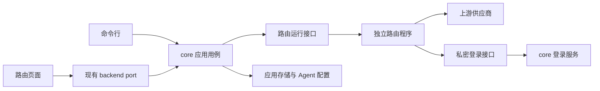

# 路由官方扩展与独立运行方案

本页设计随 AgentHub 交付的路由扩展，明确进程职责、候选接口、Go 评估、迁移和验收；不代表这些能力已经实现，也不授权全量重写。

## 1. 当前基线

当前本机转发在 Tauri 进程内，调查基线为 annotated tag `baseline/routes-before-extension-20261003`，指向完整 SHA `7c2b6fe2be67bbaa0b509deee6d6002981c60fd9`（短 SHA `7c2b6fe2`）。该 tag 建立时仅在本地、未推送且不是发布 tag；它是固定比较点，后续不得移动或覆盖。基线不包含本方案提交。日志与验收记录必须写实际构建提交 SHA，不能把基线 tag 当作新版测试结果；历史修复主题不能代替当前故障复现。

| 已有部分 | 当前位置及职责 |
|---|---|
| 应用写入入口 | `AdapterControl` 在 `crates/agenthub-core/src/adapter_control/contract.rs`，包含连接写入和路由启停，不能整个交给独立转发程序 |
| 桌面编排 | `DesktopAdapterControl` 和 `src-tauri/src/adapter_bridge_controller.rs` 协调监听、Agent 配置、失败补偿和恢复 |
| 本机转发 | `BridgeRuntimeHost` 在 `crates/agenthub-core/src/bridge/host/lifecycle.rs`，负责进程内监听和运行状态，已有部分调度及用量提示热更新 |
| 登录刷新 | `oauth_reload_for_material` 组合 core 登录服务与 `secret resolver` 的进程内回调，不能直接跨进程传递 |
| 外部 API | [本机路由 API](../reference/local-route-api.md)定义入口 Key、模型目录、Messages、Responses、Chat Completions 和错误行为 |
| 打包与验证 | 尚无独立路由程序打包；已有 Messages 两轮预检和[七类真机验收](../guides/adapter-dogfood.md)，不能据此宣称全部协议和独立进程已验收 |
| 隔离 Go Messages 切片 | `go/agenthub-adapterd` 在 scratch `AGENTHUB_HOME` 下提供 `Handshake`、`Status`、`AcquireOrRenewOwner`（acquire/renew）、probe-only `ActivateProbeListen`（不是产品 `CommitDesired` / `PrepareDesired` / `BootstrapDesired`），以及合成 Key 的 `POST /v1/messages` JSON/SSE。探测脚本：`scripts/route-runtime-probe/messages-isolated.sh`。这不是 live sidecar，进程内 Rust 转发仍是默认网关 |

现有 `AdapterBridgeStatus` 含供界面复制的 `local_token`，不可直接作为不含登录信息的扩展状态接口。现有能力和成熟度以[路由兼容性](../reference/route-compatibility.md)为准。整份 A 尚未通过；不授权 B–F、默认网关切换、真实配置写入、插件商店或动态 ABI。

## 2. 候选目标与非目标

先实现一个随应用提供、固定注册的官方路由扩展。路由页面仍随前端构建交付，独立程序负责本机监听和转发；使用者无需自行安装 Go 或配置另一套服务。

功能模块、可选启用、独立安装和独立进程是不同选择。其他业务功能先收紧模块接口，演进顺序见[模块化提案](modularity.md#8-功能模块与官方扩展)。本页不建立通用插件市场、运行时下载页面、动态插件 ABI、事件总线或第二套领域数据库。

以下产品边界不因扩展化改变：

- 只服务当前用户、本机 loopback；不提供公网、局域网或多用户网关。
- API Key 能否使用、官方登录可走哪些路线，继续由 core 的 `plan()` 决定；扩展声明能力不能新增产品支持边。
- 不新增登录信息落盘加密，不扩展国产官方登录或 OAuth 转 API。
- 不全量重写功能，不强制所有模块独立进程或单独更新。

## 3. 职责和依赖

页面继续经 `src/lib/backend/tauri/` 访问桌面后端，不直接连接扩展控制通道。公开产品写入继续走 `plan` / `bind` / `unbind`。现有 `AdapterControl` 留在应用层，新增较窄的运行接口（候选代码名 `RouteRuntimeControl`）由进程内实现或独立进程客户端实现。

| 负责人 | 拥有的职责 | 不得承担 |
|---|---|---|
| core 应用用例 | 路线规划、希望运行的配置、登录管理、Agent 配置写入、数据库迁移、写入补偿、应用数据目录的唯一写入所有者锁 | 根据保存的配置猜测转发正在运行 |
| 独立路由程序 | loopback 监听、执行 core 授权的池策略、协议转换、请求取消、健康、排空、实际状态 | 读写领域表、修改 Agent 或登录文件、复制登录刷新规则 |
| 路由页面 | 展示、输入、错误和恢复入口 | 自行选路线、启动第二套写流程 |
| 官方扩展管理 | 固定注册、进程监督、版本校验、启停协调 | 任意加载第三方代码或默认常驻转发 |

首期注册描述只需标识、包版本、运行接口版本、配置格式版本、执行文件位置和能力列表。候选标识为 `agenthub.routes`，候选二进制名沿用 `agenthub-adapterd`，均非当前产品可用接口。隔离 scratch 下的 v0 控制面已经可运行，不能当成默认网关或现行 `RouteRuntimeControl`。能力列表报告实现能力，最终可用范围取 core 支持边与实现能力的交集。

## 4. 控制接口与登录接口

下面是候选消息语义，不是现成命令或已定库。普通控制消息只带引用及非敏感元数据。

| 候选操作 | 语义 |
|---|---|
| `Handshake` | 检查运行协议、配置格式、扩展包版本及应用数据目录范围，返回本次进程实例标识 |
| `AcquireOrRenewOwner` | 当前 core 所有者取得或续期运行许可；首次取得或接管发放本 `instance_epoch` 内单调递增的 `owner_term`，正常续期不改变 term；取得许可本身不激活监听 |
| `BootstrapDesired` | 仅限新 `instance_epoch` 的已认证唯一 owner，接受一次完整的已持久 desired 版本并建立 `prepared`；`active` 保持 `null`，不得伪造旧 actual 或绕过后续版本规则 |
| `PrepareDesired` | 按当前 `active` 的基准版本准备完整网关配置快照；允许旧 `active` 与新 `prepared` 并存，不接受旧 `owner_term` |
| `CommitDesired` | 以准备令牌和操作幂等键原子地把 `prepared` 晋升为 `active`；不得把 bootstrap 或核对成功当作提交成功 |
| `AbortDesired` | 只撤销指定操作的 `prepared`，不撤销仍有效的 `active` |
| `GetOperation` | 查询 `in_progress`、`prepared`、`committed`、`aborted`、`expired` 或 `unknown`，并同时返回当前 `active`/`prepared` 状态，供超时后的核实与恢复使用；`in_progress` 表示已接受但尚未完成，`unknown` 只表示没有可核实记录；历史提交不表示新实例仍在服务 |
| `Status` | 返回实例标识、`active_revision`/`active_hash`、可选 `prepared`、生命周期、端口、活动请求数和脱敏错误；不含入口 Key 或上游登录信息 |
| `Drain` / `Stop` | 停止接新请求、限时排空，确认释放监听；不能代替 core 解除连接和恢复 Agent 配置 |

登录通道分开定义：core 提供 `ResolveAuth` 和入口 Key 解析能力，独立程序仅可解析当前获准快照中的引用，按成员、协议、用途和最低有效期取得内存登录材料。官方登录刷新在 core 中执行，Go 不复制 `refresh token` 处理逻辑。

首选当前用户权限的本地 IPC：Windows 命名管道、Unix domain socket。具体 Rust/Go 库及各平台权限行为在只读原型阶段验证，不假设已经兼容。控制与登录可共用受保护的传输，但消息权限、日志规则和数据类型必须分开。

通道身份与启动实例经受保护的启动通道建立，不使用模型请求的入口 Key 作为控制权限。登录材料和启动认证秘密不进入 `argv`、普通控制消息、错误、操作记录或日志；独立程序不持久保存它们。仅有随机名称或 loopback 地址不算访问控制。

入口 Key 授权不采用缓存的 Key 到池判定：每个新的 HTTP 请求（包括 `/health`、`/models` 和模型请求）都经私密 core 通道调用候选 `ValidateIngressKey`，由 core 校验入口 Key 是否有效并解析目标池；扩展不得缓存这项判定。普通 IPC 控制消息不带入口 Key；core 不可达时拒绝新 HTTP 请求。core 也取得当前应用数据目录的唯一写入所有者锁；CLI 只能读，或经该 owner 发起写入，不能各自写数据库。

上游登录材料可以按成员、协议、用途和最短有效期做有界内存缓存，但这和入口 Key 的无缓存判定是两件事。`auth_generation` 与入口 Key 授权 `generation` 均由唯一 core 分配，并绑定不透明的 `source`/`key_id`、用途、`instance_epoch` 与 `owner_term`；`ResolveAuth` 和 `ValidateIngressKey` 的每个回复都带对应 generation。runner 只保留撤销 watermark，不缓存入口 Key 判定；旧 generation 的迟到回复不得恢复授权或登录材料。正常刷新或替换登录材料只更新后续请求，不自动取消已授权请求；明确撤销的策略与正常刷新分开。

撤销必须先提高对应 watermark、清理旧 auth 缓存并丢弃迟到回复，再按在途策略处理已授权请求。线性化点是 core 持久化撤销并收到当前实例屏障 ack；未知或失联只记录 `pending`，不能误报删除完成。owner 失效立即阻止新请求，重连必须先 reconcile 撤销屏障。首期候选策略是让未受撤销影响的已授权在途请求继续到客户端取消或自然结束；若上游登录材料或入口 Key 已明确撤销，则 core 发出取消指令，扩展终止对应请求，禁止换池或重放。

删除或轮转必须拒绝实际已失效的入口 Key；如果删除主 Key 的同时晋升另一个仍有效的 Key，被晋升 Key 保持有效。仅改变 Key 角色不等于轮转，不新增独立晋升 API，也不要求因角色变化拒绝所有旧 Key。登录材料和入口 Key 均不得出现在错误、操作记录或日志中。core 不可达时受第 5 节运行许可限制，不允许无限使用缓存登录。

| 迟到事件 | 处理 |
|---|---|
| 旧 `auth_generation` 的 `ResolveAuth` 回复 | 比较 `instance_epoch`、`owner_term`、generation 与撤销 watermark；任一不匹配即丢弃，不写入缓存、不恢复请求 |
| 旧 `generation` 的 `ValidateIngressKey` 回复 | 丢弃并让该 HTTP 请求重新经当前 core 校验；不能沿用旧目标池或报告 Key 仍有效 |
| 旧 owner 的撤销/取消通知 | 比较 epoch 和 term；旧 term 永久拒绝，当前 owner 先 reconcile 撤销屏障，再处理在途请求 |
| core 失联或状态未知 | 仅记 `pending`，阻止新请求，不能把删除、轮转或取消报告为完成 |

## 5. 状态、版本和生命周期

### 希望运行与实际运行

- 希望运行的设置（desired）由 core 保存；共享端口、池、模型索引和登录引用组成完整网关快照，避免分开更新造成半份配置。
- 实际运行状态（actual）来自独立程序；保存过配置不等于正在运行。无法联系程序时报告 `host_unavailable`，可以展示标明时间的历史状态，但不能显示为当前 `running`。
- 扩展状态不复用含 `local_token` 的 DTO。界面复制入口 Key 继续经 core 的专用接口取得，不从状态或监控日志取得。

配置采用持久单调 `config_revision` 与规范化快照 `hash`；它们是拟新增的契约，不等同于当前局部 `policy_revision` 或索引 `generation`。core 的版本分配和待完成操作保存在既有应用存储，所需字段及迁移另列实现任务，不在本轮修改数据库。

低版本拒绝；同版本同 `hash` 幂等；同版本异 `hash` 冲突；高版本需匹配 `base_revision` 后原子替换。恢复旧内容也必须分配新的前向 `config_revision`，其 `base_revision` 必须匹配当前 `active_revision` 和 `expected_epoch`；它只能产生“新版本含旧内容”，不能把实际版本号倒退。CAS 一旦观察到后续成功版本，就不能撤销或覆盖该版本。新请求取得新快照，在途请求保留已有快照。快照只覆盖配置，健康、冷却、轮询位置和续聊状态的保留或失效规则必须分别定义，不能盲目清空或复制不兼容状态。

状态至少分开保存 `active_revision`/`active_hash` 与可选的 `prepared { revision, hash, operation_id, token_expiry, base_active_revision }`；若实现保留 `applied_revision`，它只能是当前 `active_revision` 的兼容别名，不能另成第三种事实。`BootstrapDesired` 只建立 `prepared`，新 epoch 的 `active` 保持 `null`；`CommitDesired` 才把 prepared 原子晋升为 active。旧 active 与新 prepared 可以并存；`AbortDesired` 或准备过期只撤准备，不撤仍有效的 active。

| 状态转换 | 规则 |
|---|---|
| `empty -> prepared` | 新 epoch 的 `BootstrapDesired` 只建立准备，不能接收模型请求 |
| `prepared -> active` | `CommitDesired` 原子晋升，active 才开始接收新请求 |
| `active(v) + prepared(w) -> commit active(w)` | 旧版本继续可见，提交成功后新请求使用 `w` |
| `abort` 或过期 | 撤掉 prepared，保持 `active(v)`；若原本为空则保持 `active=null` |
| owner 失效或明确停止 | 撤 prepared、拒绝新请求并排空，清理登录缓存及监听；同一 runner 保留已提交的 `active(v)` 作为版本基准，生命周期为不可服务，不能据此显示 running |
| 同一 epoch 的新 owner 接管 | 递增 term，完成旧请求排空及撤销屏障核对；core 分配新的前向版本 `w`，以 `base_active_revision=v` 执行 prepare/commit，核实实际可服务后恢复；不得再次 bootstrap |
| runner 重新启动 | 新 epoch 的 `active=null`，通过 bootstrap 建立准备再 commit，不继承旧实例 actual |

每次启动生成新的 `instance_epoch`；新 epoch 明确从 actual 空、未应用状态开始，`active_revision=null`，不能把旧进程的 actual 伪装成当前运行。变更带 `expected_epoch`，迟到的旧实例响应不能更新当前界面。runner 在同一 epoch 内发放单调递增的 `owner_term`；只有原 owner 已撤销或过期后才能接管并递增 term。旧 epoch 或旧 term 的控制命令、准备令牌、异步登录回复和取消通知永久拒绝；所有请求必须同时匹配 `instance_epoch` 与 `owner_term`。所有请求还有应用数据目录范围及 owner 标识，防止不同安装或旧 core 接管错误进程。

`active_revision` 表示本实例已提交的配置版本，不单独表示正在服务。接新请求还必须同时满足有效 owner 许可、生命周期可服务、监听就绪以及当前授权校验。同 epoch 停止或 owner 丢失时保留的版本基准不得重新使用旧登录缓存；新 owner 清理旧 term 缓存并按 core 持久状态重建撤销 watermark 后，使用新的前向 revision 重新提交。该恢复路径也覆盖同 runner 的停止后再启动；bootstrap 仍只用于新 epoch 的空实例。

### 首个可写版本的退出行为

首期仍由 Tauri/core 持有登录和写入能力，不承诺整个桌面进程退出后路由永久存活。

| 情况 | 候选行为 |
|---|---|
| 隐藏窗口、关闭 WebView，core 仍在 | 路由继续运行；保留现有退出选择，不能把关窗当停止服务 |
| 明确停止服务并退出 | core 禁止新写入，撤销运行许可，等待限时排空和端口释放后退出 |
| core 崩溃或控制连接断开 | 独立程序立即撤销运行许可，拒绝新请求并排空；心跳超时处理半开连接 |
| 独立程序崩溃 | core 显示不可用；按有界重试和退避恢复，重新握手、授权、核对设置，不重放模型请求 |
| 新实例或 core 重启 | 重新核对 desired/actual，取得新的许可和登录材料；旧操作记录不作为新实例正在运行的证据 |

只设两类有界许可：`owner_lease` 允许接收新请求，逐成员 `auth_lease` 表示登录材料有效期。控制连接断开先使 owner 失效，不能等 API Key 失效才停止接新请求。登录有效期不延长 owner 许可。

原型起始参数建议为心跳 2 秒、owner 最长失联 10 秒、排空上限 30 秒；使用单调时钟并允许配置。这些是待验证参数，不是当前默认值。连接 EOF 立即失效；超时兜底不得阻塞在上游请求之后。超出排空期限终止请求并释放资源，记录错误与请求数量，不能记为正常完成。

完整后台运行属于后续阶段：唯一的 core 所有者必须能无界面存活，提供登录刷新和写入协调。不得仅让 Go 常驻而无人负责登录更新；GUI/CLI 也不能各自创建写入 core。本提案不新增独立账号服务或第二领域库。

## 6. 写入、补偿与不确定结果

所有领域写入由 core 编排；扩展只执行运行操作。通用的 `prepare`-`save`-`commit` 只适用于同一 runner 的配置更新，或隔离端口、隔离数据目录下的首次接入；它不能用于让旧 runner 和新 runner 先后都绑定同一个共享端口。一次适用范围内的连接写入候选步骤如下：

1. core 重新调用 `plan()`，获取相关写入门，保存旧配置快照和待完成操作；记录本次所属实例与基准版本。
2. 扩展准备监听和完整配置，取得受限登录材料；新建入口在 core 确认前不接受模型请求。已有入口的旧版本继续按已授权状态服务。
3. core 保存连接及 Agent 配置，随后以准备令牌调用 `CommitDesired` 原子晋升运行版本；只有两侧已核对一致，应用用例才报告成功。
4. 任一步失败先查询实际结果，再逆序恢复。core 负责恢复文件和领域状态；扩展补偿必须比较实例及实际版本，不能撤销后来成功的新配置。
5. 程序不可达或实例已换时，记录待恢复及原因，显示 `retryable`/`needs_attention`，并在重连后核对；不得猜成功或停止可能属于后续操作的监听。

### 首次整网关同口切换

首次把完整网关从进程内 host 切到 Go 时，使用单列的切换 saga，不能把每个池或协议拆成独立 bind：

1. core 冻结相关 `bind`、`unbind`、启停和 Key 变更写入，记录旧 host、完整 desired revision、`instance_epoch` 和待完成操作。`plan()` 仍提供标明当前切换状态的只读预览。
2. 执行预检：完整网关的能力矩阵、扩展包版本、配置快照、授权引用和目标平台门槛都已满足，差异只能是最后的 bind；预检不写 Agent 或真实用户配置。
3. 请求旧 host `Drain`，等待在途请求按策略结束，并通过独立状态和端口探测确认监听已经释放；锁文件或 PID 不能单独作为释放证明。
4. 旧端口确认释放后启动 Go，完成受保护 `Handshake`、唯一 owner 认证和一次 `BootstrapDesired`；Go 保持 `prepared`，即使 bootstrap 和核对已成功，也拒绝模型请求，直到 core 显式确认运行提交。
5. 核对每个池、模型索引、协议能力及授权状态；此时必须是 `active=null`，`prepared.revision/hash` 等于目标快照，epoch、term 及共享端口匹配，不能提前把目标版本记为 active。
6. 只有全部核对成功，core 才保存使用者状态和相关 Agent 配置，随后显式提交运行（候选消息 `CommitDesired`）并核对 active 等于目标、prepared 已清空、生命周期可服务及端口就绪；两侧一致后才解除写入冻结并报告成功。提交或确认超时先查询 `GetOperation` 和实际状态，不假定成功，也不盲目重复激活。
7. 任一步失败先停止 Go，并确认本次 Go 已释放共享端口，再恢复旧 host。恢复旧内容必须生成新的前向 `config_revision`：旧 host 原实例仍在时，仅对旧 host 自己的 `expected_epoch` 和实际 `base_revision` 做 CAS；旧 host 已重启为新 epoch、空状态时，使用受限 `BootstrapDesired` 恢复新版本。不得将 Go 的 epoch 或 actual 继承给 Rust host。恢复两侧配置并确认旧 host 实际 active 后才解除冻结、报告回退完成；无法确认端口释放或恢复结果时标为 `needs_attention`，禁止并行 bind，等待人工或受控恢复，且不得重放模型请求。

实现时将准备、提交、条件撤销定义为 `PrepareDesired`、`CommitDesired`、`AbortDesired`，并定义准备过期清理。准备令牌必须引用 owner、`owner_term`、实例、操作和版本，不能只凭 `profile id` 撤销。完整快照提交需要短时网关串行门；既有 `profile`/`target` 写入门继续由 core 管理，统一锁顺序必须在实现前完成调用链审查，排空不持有全局门。

跨进程超时表示结果未知。相同 `request_id` 与相同 `payload hash` 可在明确保留期内查询或重试；相同 id 不同 payload 拒绝。查询未知或记录已过期时先核对状态，不换新 id 盲目重做。运行记录仅保存非敏感操作元数据、结果和版本，设容量与保留期；它不是第二份领域状态，也不保证跨崩溃 `exactly-once`。模型 POST 请求不使用这套控制重试机制。

## 7. 同口切换、停用和回退

- 单实例范围为当前用户与规范化应用数据目录；先取得操作系统在进程结束时释放的锁，再监听。锁文件、PID 只供诊断，不能单独证明旧进程已退出。
- 整个共享网关在一个时刻只有一个监听负责人。Go 试点可在隔离数据目录、隔离端口对照；正式同口切换必须遵守第 6 节的完整 saga，排空旧程序并确认端口释放，再启动新程序。
- 同一共享端口下，不以逐池开关让进程内 host 和 Go 同时监听。协议可分阶段实现，但生产切换单位是已验收能力集合的完整网关；尚未覆盖的使用范围不能自动切到 Go。
- 已登记的固定端口冲突返回现有 `adapter.port_in_use`，不杀其他进程或悄悄换口。旧 `profile` 可重绑定的兼容路径仍由 core 按现行规则更新 Agent 配置；这一规则不被扩大到固定网关。
- 首期只做启用和停用官方扩展，不提供独立卸载。停用先禁止新 `start`/`bind`，由 core 逐项解除相关连接并恢复 Agent 配置，再停止运行程序；任一项失败保留未完成状态和恢复入口，不宣称停用完成。
- 意外缺失、崩溃或版本不兼容时保留路由设置与诊断页面，不静默切到进程内 host 或 mock。主动回退需再次确认旧监听已释放并经 core 核对配置。
- 输出已经开始的请求、工具调用及其他执行结果不确定的模型请求不得自动换成员或重放。回退只改变后续请求；失败的在途请求交由客户端处理。

## 8. Go 的评估范围

Go 是候选实现，不是已选定的全量重写语言。默认保留旧 Rust 路由作为对照和可恢复实现；不要求先完整搬迁 Rust，再完整重写 Go。

第一条实际转发路线已经落在隔离数据目录：合成入口 Key 的同协议 `Messages` JSON/SSE，外加 `Handshake` / `Status` / `AcquireOrRenewOwner` 与 probe-only `ActivateProbeListen`。它只证明这个切片，不能证明 `Responses`、`Chat Completions`、官方登录、真实配置写入或默认网关已经支持。

随后分别验证其他同协议、转换协议、池调度与续聊行为；官方登录在私密登录接口及 owner 失联行为通过后再接入。支持矩阵不因迁移扩大，实验开关仍沿用现有默认值。

对照先使用合成数据与受控上游，以事件结构、状态码、必要响应头、分片顺序、调用次数和资源释放判断；旧实现也是被测对象，差异应按现行契约裁决，不能复制已知错误。真实上游验收使用受控测试登录和合成请求，分别运行，禁止镜像用户请求到两个上游。性能指标包括首字节、长流内存、取消释放时间和空闲资源；未测量前不以 Go 性能作为迁移理由。

## 9. 分阶段实施与门槛

以下任务顺序表示依赖，进入下一阶段必须有实际运行证据。隔离 Messages 切片已落地，不等于 A 通过，也不授权 B–F。B 阶段可以先在当前 Windows 平台做只读试验，结果只进入该平台隔离的 C/D 证据；macOS/Linux 同时补权限、打包和恢复证据，不能把 Windows 通过等同整体通过。E 的完整交付必须覆盖所有目标平台和架构，未覆盖的平台不得宣称可用。

| 阶段 | 范围与负责人 | 完成证据 |
|---|---|---|
| A 基线与接口 | core 负责人梳理当前故障、写入门、协议边界和运行契约；验证负责人补外部进程黑盒工具 | 能按旧实现复现并分类故障；明确租约、版本、补偿和锁顺序；不改领域行为 |
| B 只读原型 | 运行负责人创建固定注册、握手、状态及进程监督；先由当前 Windows 平台验证，再由其他平台补证据 | 当前平台确认权限、实例身份、版本不兼容、单实例、程序丢失、owner 断开；不写 Agent 配置；不能把单平台通过当整体通过 |
| C Go 转发试点 | Go 负责人仅负责独立程序；core 负责人提供受限登录材料与运行客户端 | 隔离池 `Messages` JSON/SSE、两轮、取消、owner 失联、幂等、未知结果与端口竞争通过；尚不接真实 Agent 配置写入 |
| D 应用写入整合 | core 负责人接准备/提交/条件补偿及运行恢复；前端负责人仅改展示和契约；始终使用隔离数据目录、非默认端口和测试 Agent | 只验证测试 Agent 的写入、失败、两侧崩溃、Key 轮转及停用恢复；不写真实用户配置、不接管默认网关；正式同口切换必须等 E 的完整能力矩阵和三平台门槛通过 |
| E 覆盖与交付 | 协议负责人逐条扩展；平台负责人处理同包构建、签名与升级 | 拟切换网关使用的全部协议通过矩阵；三平台升级/降级/失败恢复通过；GUI/CLI 读到一致状态 |
| F 完整后台（另行评估） | 应用负责人设计唯一无界面 core 所有者及 GUI/CLI 写入客户端 | 桌面界面退出后登录刷新、写入、重启与版本恢复仍有唯一负责人；才可宣传完整后台运行 |

每阶段独立审查实际差异，材料包括版本、范围、运行日志、失败注入和回退结果。首次 CLI 只读状态可在 B 阶段接入；CLI 写入必须经过唯一 core 所有者，不能独自运行第二份领域写流程。

### E 阶段升级与恢复

官方扩展必须随整包升级：先暂存并校验新包，保留可回退的旧包；core 持久化 `pending upgrade` 阶段、旧/新包身份和 desired 版本，但不保存 secret。升级时先排空并释放监听，再以新 `instance_epoch` 启动新包、执行 bootstrap/prepare，待 core 保存并核实后才 `CommitDesired`。失败时必须确认新 runner 已释放端口，再以旧包、新 epoch 和新的前向 revision 恢复；Windows 上被占用的运行文件不得原地覆盖，重启后按 pending 记录核对实际状态，不能猜升级成功。

普通回退只在 core 配置与数据格式向后兼容时成立；涉及不可逆数据库迁移时另行设计迁移与回退路径，本方案不声称可回退。

## 10. 验收矩阵与停止条件

| 风险面 | 必须观察到的结果 |
|---|---|
| 控制与版本 | 重复命令、乱序配置、旧 epoch/term、同版本异 hash、应答丢失和崩溃均不误报成功或回滚新配置；`active`/`prepared` 分离可核对 |
| 进程与权限 | 非授权通道被拒绝；双实例、残留锁、端口被占、core EOF、半开连接与崩溃循环有界处理 |
| API 与模型目录 | 保持现行路径、别名、方法错误和脱敏错误语义；模型列表与请求使用同一代解析配置 |
| 三类协议 | Messages、Responses、Chat Completions 各自验证 JSON/SSE；转换边单独验证，不用一种协议替代另一种 |
| 流与工具 | Unicode/分片、背压、空闲超时、工具调用回填、多轮续聊完整；工具不重复执行，未支持字段按现行契约明确处理 |
| 池运行状态 | 同协议优先/轮询、健康冷却、会话保持、登录更新、成员删除与续聊状态可解释；默认关闭的混合供应商边不被打开 |
| 入口 Key 授权 | 每个新 HTTP 请求（含 `/health`、`/models`）都由私密 core 校验有效性并解析池；不缓存 Key 到池的判定，core 不可达即拒绝新请求 |
| Key 删除与晋升 | 删除或轮转只有在撤销持久化、当前实例屏障 ack 且探测确认实际失效的 Key 被拒绝后才报告完成；删除主 Key 后晋升的有效 Key 保持可用，仅角色改变不触发撤销；并发结果可核对 |
| 撤销失联与在途请求 | core 失联不延长入口 Key 授权；旧 generation/owner 通知被丢弃；已授权在途请求按明确撤销策略完成或被取消，不换池、不重放，且状态可解释 |
| 取消与排空 | 下游取消终止上游；在途数量回到零或明确超时；停止后释放端口，失联不无限使用缓存 Key |
| 写入与恢复 | 运行准备失败、配置保存失败、确认丢失和补偿失败均可恢复，不留下指向失效入口的配置而报告成功 |
| 交付与回退 | Windows/macOS/Linux 对应包含可执行程序；冷启动、签名、版本匹配、失败更新和回退可复现 |
| 信息泄露 | argv、普通 IPC、状态、监控、日志和运行记录均不含登录材料、入口 Key 或真实请求正文 |

### C/D 隔离运行与证据

C/D 进程必须使用绝对临时 `AGENTHUB_HOME`、临时端口和受控 loopback 上游。`AGENTHUB_HOME` 只隔离应用数据，不隔离 Agent 家目录；测试实例关闭自动导入本机登录，启动前必须列出实际所有数据、Agent 配置及日志读写路径，规范化后逐一验证处于 scratch 范围内。执行文件和系统库另设只读允许清单，不因此放开宿主登录文件。若发现路径越界或没有路径隔离能力，则不得运行 D，改用独立测试用户或其他隔离环境；不得修改宿主用户级配置。

自动 probe 禁止未列出的外网访问、真实登录和真实 Agent 用户目录。已有 `preflight` 只能以合成参数和受控上游纳入本阶段证据；真实参数入口保留给手动真机验收，不能替代隔离证据。

旧 Rust 与 Go 必须使用同一 fixture、schema 和请求序列。规范化只允许预先声明的动态 id、时间等字段；不能删除事件顺序、工具次数或错误语义。差异按当前契约裁决，源码中的错误不能直接抄成 golden。C 正确性用例至少运行 3 遍，并预先声明并发档位（建议 `1/4/16`）；结构安全错误零容忍。性能阈值由 A 阶段先测旧版，再冻结并发档位、平台硬件和预算；C 的结果不能反过来调高阈值。

E 的合成受控上游观察门槛候选为连续 24 小时、至少 1000 请求、至少 20 条 5 分钟长流，以及每个关键崩溃恢复注入至少 3 遍；这些数值须由 A 阶段确认，当前均不是已测结果。真实付费上游不得镜像请求，也不用于千次压测。

| 注入点 | 预期状态与清理 | 必须留存的证据 |
|---|---|---|
| `prepare` 失败 | `active` 不变，清理过期 prepared/临时监听 | 操作状态、端口探测、清理结果 |
| `save` 失败 | `prepared` 可撤销，领域写入回到原状态 | core 持久化记录、回滚核对 |
| `commit` 丢 ack | 查询后只接受已核实的 active，未知则 pending | operation/status 对照、重连核对 |
| core EOF | owner 失效、拒绝新请求、排空并释放资源 | epoch/term、请求计数、端口释放 |
| core 重启而 runner 仍存活 | 旧 term 不可用；核对排空与屏障，基于保留版本准备新前向 revision，commit 后才服务 | 新旧 term、active/prepared、迟到指令拒绝与重新激活结果 |
| Go 崩溃 | 无自动重放，确认失败进程资源释放后再恢复 | 崩溃日志、恢复 epoch/revision、清理结果 |
| Key 迟到回复 | 丢弃旧 generation，保持撤销 watermark | generation、watermark、请求拒绝结果 |
| 升级失败 | 新 runner 释放后旧包新 epoch 恢复 | pending upgrade、包身份、回退核对 |

每次运行记录实际构建 SHA、dirty 补丁指纹、平台/架构、`run_id`、fixture 版本、配置 `active`/`prepared`、epoch/term、注入点、结果和清理情况。临时产物候选路径为 `.tmp/route-runtime-probe/<run_id>/`；写入 stdout/stderr 前先脱敏。日志、status 和控制记录扫描 Key 与正文，扫描失败即阻断；不得记录真实 prompt 或工具参数。

现有 `scripts/route-messages-preflight.sh` 只覆盖模型列表与 `Messages` 两轮；browser E2E 使用 mock，不能证明真实后端。隔离 Messages probe 已有 `scripts/route-runtime-probe/messages-isolated.sh`（进程上下线、合成 Key 的 JSON/SSE，不接真实用户请求）。尚缺非 Rust 的三协议、进程故障、取消、撤销、日志脱敏及打包黑盒证据，不把这些尚未存在的命令写成可用入口。

遵守根 [AGENTS.md](../../AGENTS.md)：不编写或执行 Rust 测试，旧文档中的相关要求不适用。Go 实现可使用 Go 单元/契约检查；Rust 变更以真实应用或 CLI 运行日志验证；前端变化使用相关非 Rust contract/Vitest 与 typecheck。纯方案修改只运行 pnpm check:docs 和 diff 检查。

以下情况暂停扩大范围，保留证据并恢复已验收实现：需要复制登录/领域规则或另建数据存储；未知操作结果无法核实；两个程序竞争共享端口；工具重复执行；登录信息泄露；回退无法恢复配置；新协议差异持续增长。任一目标平台未完成打包与恢复验收，不作为整体交付通过。

## 11. 实现前仍需确定

本页拟新增的运行消息、字段、阈值、目录和工具都是 `proposed` 候选，除第 1 节已登记的隔离 Messages 切片外均未实现，也不构成现行产品接口；第 1 节及链接页面描述的既有接口仍按其现行契约使用。首期已给出推荐职责与生命周期，但下列工程选择在对应阶段完成前不能视为已批准实现：

1. A 阶段：完整快照字段、规范化 `hash`、`revision` 存储及迁移、锁顺序、owner/auth generation 规则、准备/提交/撤销消息、操作留存与 reconcile 决策表。
2. B 阶段：Rust/Go IPC 库、Windows/Unix 权限、实例认证、有界重启和心跳/排空参数的实测值；单平台结果不能代表整体通过。
3. C/D 阶段：第一测试池的合成 fixture、登录引用撤销和在途请求策略、Go 能力矩阵、隔离路径和证据格式，以及真实 Agent 验收范围。
4. E 阶段：每个平台/架构的构建、签名、包内版本/`hash` 核对、升级 pending 记录与原子升级回退；首期扩展随桌面包更新，不独立下载更新。
5. F 阶段：是否需要完整后台以及无界面 core 所有者如何交付；未解决前保持首期退出语义。

### A 阶段退出门槛

A 阶段必须交付窄消息、状态和错误 schema，冻结 owner/auth generation 的作用域、owner_term 接管时的缓存清理与撤销 watermark 规则、锁顺序、操作留存与 reconcile 决策表，提供可复现 fixture 对照和故障计划，并写明隔离路径与证据格式。缺项可以继续设计和补证据，但不能进入 B 的原型实现；不得借此扩大为通用插件 SDK。纸面契约见 [路由官方扩展 A 阶段纸面契约](route-extension-phase-a-contract.md)；该页冻结候选消息与锁顺序，整份 A 尚未通过，现仅授权隔离目录下的 Go Messages 切片（`Handshake`、`Status`、`AcquireOrRenewOwner` acquire/renew、probe-only `ActivateProbeListen` 与合成 Key 的 Messages JSON/SSE），不授权默认网关切换、真实配置写入、插件商店或 E/F。

## 12. 下一阶段任务

| 任务 | 负责人和范围 | 交付与边界 |
|---|---|---|
| A：core 契约梳理 | core 负责人基于已定位的 `adapter_control/{contract,status}.rs` 和 `adapter_bridge_controller` 函数 | 只产窄运行接口、状态/错误模型和锁顺序设计，不拆整个 core；交付 A 阶段退出门槛要求的 generation、操作留存、reconcile、fixture/故障与隔离证据契约 |
| 独立验证设计 | 独立验证负责人补现有 preflight 与隔离 Messages probe 之外的合成进程证据 | `scripts/route-runtime-probe/messages-isolated.sh` 已覆盖隔离进程与合成 Key Messages；尚缺三协议、端口/IPC 故障、撤销和日志脱敏，不接真实用户请求 |
| B：平台只读 IPC 实验 | 平台负责人按 A 的窄接口先做当前 Windows 本地 IPC 只读实验，其他平台并行补证据 | 当前平台只验证权限、实例身份、EOF、版本和状态读取，不写 Agent 配置，不绑定默认网关；单平台结果不代表整体通过 |
| 共用字段归属 | 指定一名 core 负责人维护 revision、epoch、owner/auth generation、状态和错误字段 | 其他实现只能消费契约，不在各自模块复制字段或定义第二份领域状态；以上除隔离 Messages 切片外均为 proposed，当前未实现 |

A 交付并完成独立审查后才能进入 B 的原型实现；在此之前不发布、不打新的发版 tag、不触碰真实用户数据。已授权的本地基线 tag 仅作为固定比较标记，不受此发版限制影响。

## 相关页面

- [模块化与边界收紧](modularity.md)
- [架构总览](../architecture/overview.md)与[Core 与 Runtime](../architecture/core-runtime.md)：当前实现。
- [产品边界](../decisions/product-boundaries.md)：本提案不改变的产品规则。
- [插件、MCP 与技能](../concepts/plugins-and-mcp.md)：现有插件页面管理各 Agent 插件，与本提案不是同一接口。
- [测试与验证](../guides/testing-and-validation.md)与[本机路由真机验收](../guides/adapter-dogfood.md)：结合根 AGENTS 的非 Rust 验证限制使用。
