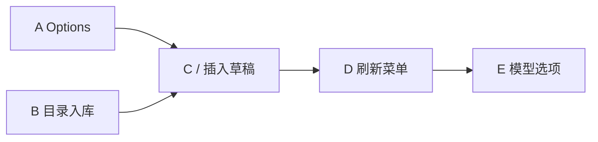

# Chat 宿主加深与多 Agent 兼容

在现有对话页和各家机器通道上加深思考、命令和跨 Agent 兼容；**不以伪终端当对话底座**。对照 [AionUi](https://github.com/iOfficeAI/AionUi) 的 GUI 宿主，吸收握手定能力、统一事件、协议斜杠目录；不搬内置引擎、独立后台进程或多人协作。

本页不替换 [Chat 统一体验](chat-unified-experience.md)，只补「底座已定之后如何加深」。未合入、未验收前不得把能力标成 Full，也不得改 [STATUS](../STATUS.md) 的现行事实。切片进度见下文。

## 问题

对话页要对标 Claude Code 桌面、Cursor Chat、Codex app：同一套气泡、过程、确认和输入区，接多家 Agent。加深时要的是：

1. 思考过程有正文，而不只是「正在想」。
2. 能触发与对话相关的命令：对方跑的工具，以及对方声明的 `/compact` 一类动作。

用伪终端嵌各家交互界面，表面覆盖会变多，语义兼容会变差。AionUi 用统一对话页 + ACP 接很多家命令行，伪终端只给「对方要跑的那条命令」。那是对照宿主，不是第二套产品。

## 当前基线

细节以 [STATUS](../STATUS.md) 为准。**合入 `dev` 之前，下表「本分支」不算现行。**

| 点 | `dev` / 现行 | 分支 `feat/chat-host-depth-options`（A–C，未合入） |
| --- | --- | --- |
| 产品形态 | 共用 GUI 对话页。默认内嵌终端、全量原生命令菜单范围外 | 同左 |
| 持续通道 | 新空 Codex app-server；Grok / Kiro ACP；Claude stream-json；其余一次性 | 同左 |
| 快照 | 回合态；无 transport、无命令列表 | 同左（命令列表仍不进快照） |
| Options | 模型、技能、写死的 `imageInput` / `steer` | 另有 `transport`、`nativeCommands`、`sessionReady`；握手可改图片 |
| enable 白名单 | Codex / Grok / Kiro / Claude。发送看 `enabled` | **未拆**白名单。确认卡片、排队提示改读 `enabled` / `steer` |
| Grok / Kiro ACP | 思考/工具/确认已有。`available_commands` 丢掉。不声明 `terminal` | 命令目录写入 Options；思考可标完成；工具 kind 映射。`config_option_update` / `context_usage` / `plan` 仍丢掉。仍不声明 `terminal` |
| `/` 菜单 | Hub 动作 + 换模型/思考/技能 | 会话就绪且目录非空时列出对方斜杠命令，选中插入 `/名字 `，不代发。**目录晚到时菜单不一定马上刷新** |
| 进程 | sidecar 不从本页派生 | 同左 |

`StructuredStream` 仍不等于全部对话能力。Grok 技能库可用，对话里「用于本次」仍不支持。

## 候选结论

1. 对话底座保持机器通道 + 统一事件，不换成伪终端宿主。
2. 能力写在 `RuntimeOptions`，**不塞进 80ms 快照**。页面 chrome 读 Options；enable 白名单可暂时保留。
3. 外接命令行默认加深 ACP（Grok / Kiro 已在用）。Codex 继续 app-server，Claude 继续 stream-json，直到该家有经验证的对等控制口。
4. 思考以实时事件为主，会话记录为辅；不从屏幕猜正文。
5. `/` 分来源：Hub 动作立刻执行；对方声明的斜杠命令插入 `/名字 ` 再当普通一轮发出（不是 Hub RPC，也不是往终端打字）。
6. 宿主终端卡片（ACP `terminal/*`）后置；第一批切片继续不声明 `terminal`。
7. 先深已接线的四家，再按梯子扩家。
8. **本页只加深宿主与 ACP 目录。** Claude 确认通道、Pi/Kimi 持续通道归 [统一体验](chat-unified-experience.md)，不在本页另起一套。

A–C 在功能分支上已实现，**未合入、未当现行。** 后续切片未授权不得开工。

## 非目标

与统一体验范围外一致，并补充：

- 默认内嵌终端，或把各家 TUI 当对话页
- 未出现在协议目录里的斜杠项（含 Kiro 终端 `/model`、`/agent`）
- 跨 Agent 搬运原生会话
- 自带一份可聊的大模型引擎
- 为对话单独拆常驻 sidecar
- 把 Codex 改成 `codex --acp` 只为「大家都走 ACP」
- 凭据落盘加密、国产官方登录转 API
- 把本页或 AionUi 对照写成现行契约

## 对照 AionUi（只吸收同向部分）

AionUi 桌面只画界面；`aioncore` 用 ACP JSON-RPC（stdio）拉起本机 CLI。对话是 JSON 行，不是屏幕。GUI 吃 HTTP 快照 + 统一流，不直接当 JSON-RPC 对端。

| 吸收 | 不搬 |
| --- | --- |
| 页面只认统一事件 | 自带大模型引擎 |
| 握手缺省 false；缺项隐藏 | 常驻 `aioncore` 式进程 |
| 斜杠目录不进气泡；对方命令插入 `/名字 ` | 多人协作 / 领袖分派 |
| 确认和提问两条回执 | 嵌 TUI |
| 伪终端只给对方要跑的命令 | 为接 20 家而换掉已验收的 Codex app-server |

## 兼容原则

同一套用户操作（发送、看思考、看对方跑了什么、允许/拒绝、停止、换模型）。每一项：完整 / 降级 / 不支持 / 还没接。不支持就隐藏。

不要求每家表现一模一样，也不为接更多家画假控件。失败后不得在持续通道和一次性发送之间自动切换。

新 Agent 梯子：ACP → 对方 JSON 控制口（app-server）→ 持续 stream-json → 一次性 JSON 行 → 会话记录回填 → 只能发一轮或「打开对方命令行」。连通性检查是 spawn + 协议握手，不是打开交互界面。

## 数据放哪

```text
页面 chrome ──读──► RuntimeOptions（目录：模型、能力、对方斜杠命令）
页面回合 ──读──► RuntimeSnapshot（约 80ms：正文、过程、待确认、phase）
对方 ACP ──► 对接层 ──► 过程事件 | Options 目录 | pendingRequests
```

| 仓 | 现在 | 加深后 |
| --- | --- | --- |
| `RuntimeSnapshot` | 回合态 | 仍只放回合态。可选加 `transport`（`acp` / `app-server` / `stream-json` / `legacy`），**不加**命令列表 |
| `RuntimeOptions` | 模型、技能、写死的 image/steer | 能力位 + `nativeCommands`。握手和 `available_commands` 写这里 |
| 过程事件 | 思考 / 工具 / 用量 | 斜杠目录、config 更新 **不要**当过程行 |
| `pendingRequests` | 命令 / 文件 / 提问 | 保持；提问回执不走确认口 |

白名单暂时只当「准不准 enable 持续聊天」。图片、补充、`/` 里对方命令、确认卡片改看 Options。

### Options 字段草案（实施时可改名，语义不要混）

在现有 `RuntimeOptions` 上增量，camelCase 与现行契约一致：

| 字段 | 类型（草案） | 含义 |
| --- | --- | --- |
| `transport` | `acp` / `app-server` / `stream-json` / `legacy` | 这份会话实际在走的通道 |
| `imageInput` | boolean | 改为握手 `promptCapabilities.image`；省略 = false。切片 A 可先保持写死值，B 再接握手 |
| `steer` | boolean | 仅对方真有生成中补充口时为 true（现状：只有 Codex） |
| `nativeCommands` | `{ name, description, hint? }[]` | 对方声明的斜杠命令，无前导 `/`。未就绪或未声明 = `[]` |
| `sessionReady` | boolean | 可以查对方目录 / 发斜杠插入。连接中为 false |

不在 Options 里放 MCP 传输、fork、loadSession：那些是 Agent 级握手，不是对话回合目录。需要时另开切片，挂检测/Agents，不挂 80ms 快照。

## ACP 事件对照（合入后仍缺的）

| 对方给的 | A–C 之后 | 归哪一刀 |
| --- | --- | --- |
| 思考 / 正文 / 工具 / 确认 | 已对齐（分支） | A–C |
| `available_commands_update` | 写入 Options；`/` 能列，**晚到不自动刷** | D |
| `config_option_update` | 仍丢掉 | E |
| 结构化提问（非确认） | 未接线 | F（先有协议证据） |
| `context_usage` / `plan` | 用量小字已有一部分；计划仍是 Status | G |
| `terminal/*` | 仍不声明 | H（可再拆独立提案） |

enable 白名单、绑快照仍看 Agent 名字，A–C 故意不拆。拆白名单放到本页宿主稳定、且统一体验不需要它之后，不单开一刀。

## 伪终端

| 含义 | 态度 |
| --- | --- |
| 对话就是各家 TUI | 不采用 |
| JSON 通道挂在伪终端上骗过 isatty | 仅当没有 TTY 就不开机器通道 |
| 对方跑的命令需要终端 | 后置宿主卡片，不是对话模型 |

A–C 不引入伪终端，不声明 `clientCapabilities.terminal`。

## 建议切片

未合入前不得把本页标成 current。A–E 在 `feat/chat-host-depth-options`；F 起未授权不得开工。

| 刀 | 状态 | 一句话 |
| --- | --- | --- |
| A Options 能力位 | 分支已实现 | 字段进 Options，不进 80ms 快照 |
| B ACP 事件与命令目录 | 分支已实现 | 目录进 Options，不进过程时间线 |
| C `/` 接协议目录 | 分支已实现 | 选中插入 `/名字 `，不代发 |
| D 目录变更刷新 `/` | 分支已实现 | 补 C：晚到的命令要进菜单 |
| E `config_options` | 分支已实现 | 刷模型/模式，不装终端选择器 |
| F ACP 提问口 | 未开工 | 先有协议证据；回执不走确认 |
| G 用量窗 / 计划条 | 未开工 | 不进气泡 |
| H 宿主终端 | 未开工 | 可再拆独立提案；先改握手再画卡片 |
| I 打开对方命令行 | 未开工 | 无机器通道的逃生口，不标成对话能力 |



H 不依赖 E。F / G 互不依赖。Claude 确认、Pi/Kimi 持续通道 **不在上图**，见 [本页不负责](#本页不负责)。

依赖：`C ← B`。不要先扩 80ms 快照。不要顺手拆 enable 白名单。

### 切片 A — Options 带能力

**做：** 契约加上 `transport`、`nativeCommands: []`、`sessionReady`。`imageInput` / `steer` 语义写进注释：A 可保持现行写死值。页面：确认卡片、图片按钮、是否查询对方命令改读 Options；发送仍看快照 `enabled`。

**不做：** 改 ACP 解析；拆 `is_runtime_chat_agent`；把命令列表放进 Snapshot；改 mock 以外的产品文案。

**文件：** `src/lib/backend/contracts/chat-runtime.ts`、`crates/agenthub-core/src/services/chat_runtime/types.rs`、`mod.rs` 的 `options_with`、`src/dev/mocks/chat.ts`、`src/pages/chat/chat-runtime-model.ts`、`use-chat-runtime-ops.ts`、`use-chat-page.ts`（读字段，不画对方命令）。

**测：** `chat_runtime_contract.rs`、`chat_runtime/tests.rs`、`chat-runtime-ops-model.test.ts`、`chat-runtime-model.test.ts`。

**验收：** 非持续聊天 Options 仍是 inactive（命令空、image/steer false）。白名单会话 Options 带 `transport` 与空 `nativeCommands`。页面不因名字把 Pi 画成持续聊天。mock 与契约字段一致。

### 切片 B — Grok / Kiro 事件对齐

**做：** `available_commands` 产出可写入 Options 的目录，不再 `vec![]`。**将改掉**「必须为空」的现有断言。思考在正文开始或 turn 结束时 `done: true`。工具 kind 映射为读取 / 修改 / 执行。确认路径回归，不改协议。`imageInput` 若握手已有 `promptCapabilities.image` 则改读握手。

**不做：** `/` 菜单接线（那是 C）；声明 `terminal`；接 ACP 提问口；把目录当 ProcessStep 推进右侧栏。

**文件：** `crates/agenthub-core/src/utils/stream_parse/acp.rs`、`grok.rs`、`chat_runtime/mod.rs`（`grok_session_update` / `options_with`）、必要的 store 缓存（会话级，不进 snapshot events）。

**测：** `stream_parse/grok/tests.rs`、`stream_parse/tests.rs`、`actor_tests.rs`。固定 JSON 帧，不跑真 TUI。

**验收：** 一条带 `available_commands_update` 的夹具帧之后，Options.`nativeCommands` 非空，过程时间线仍无命令列表行。思考在回复开始后可标完成。允许/拒绝卡片与现在一致。

### 切片 C — `/` 接上协议目录

**做：** 对方命令作为独立来源进入现有 `extraActions`。选中插入 `/名字 `（可带 hint 空格），**不**立刻 `runtimeStart`。`sessionReady === false` 或列表空则不画对方项。Hub 的新建 / 复制 / 换模型 / 技能保持立刻执行。

**不做：** 把插入当成「已交给 Agent」；在连接中查询对方；把 Kiro 终端选择器写进菜单；改空会话芯片。

**文件：** `src/pages/chat/chat-actions.ts`、`use-chat-page.ts` 的 `runtimeCommandActions`、`ChatActionMenu.tsx` / `ChatComposer.tsx`（插入草稿）。

**测：** `chat-actions.test.ts`；mock Options 带一条命令时 `/` 能搜到；选中后草稿为 `/name `。

**验收：** 无声明则 `/` 与现在相同。有声明则出现该项，发送仍是用户按发送。中文输入法组字规则不变。

**已知缺口（交给 D）：** Options 只在进会话、换模型、回合状态变化时重拉。对方在握手之后才推命令目录时，菜单可能仍是空的。

### 切片 D — 目录变更后刷新 `/`（补 C）

**做：** 命令目录、`sessionReady`、握手图片变了，页面要重拉 Options。快照只加廉价世代号（例如 `catalogEpoch`），**不**把命令列表放进 80ms 快照。世代号增加时刷新 Options，从而刷新 `/`。

**不做：** 每 80ms 拉完整 Options；把 `available_commands` 当过程行；代发斜杠命令。

**文件：** `RuntimeSnapshot` 契约、`chat_runtime` 在 `patch_catalog` 时自增世代、前端 snapshot 轮询比对后 `runtimeOptions()`。

**测：** 夹具先拉空目录，再推 `available_commands_update`，Options 与 `/` extraActions 出现该项。世代号不变则不重拉。

**验收：** 晚到的 `/compact` 不必重进会话就能在 `/` 里搜到。无声明仍不画。

### 切片 E — `config_options` 刷模型/模式

**做：** 把 `config_option_update`（及握手/会话里的模型、模式列表）写入 Options 的模型/思考目录，页面沿用现有换模型控件。无列表不画。

**不做：** 模拟 Kiro 终端 `/model`、`/agent` 选择器；改 Codex app-server 已验收的 `model/list`。

**依赖：** 建议先 D，否则晚到的选项同样刷不出来。

**测：** 固定 JSON 帧更新模型列表；过程时间线无 config 行。

### 切片 F — ACP 结构化提问

**做：** 仅当 Grok/Kiro 确有「提问」请求（不是 `session/request_permission`）时，走现有 `pendingRequests.kind = question`，回执不走确认口。

**不做：** 没有协议证据就画问答卡片；把提问和允许/拒绝混成一个按钮。

**开工门槛：** 附一条真实或夹具 JSON，标明方法名与字段。没有证据本刀取消，不改代码。

### 切片 G — 窗口用量与计划条

**做：** `context_usage` 进用量小字（有数字才画）。`plan` 进当前轮计划条，不进气泡，换轮丢掉。

**不做：** 把计划当正式回复；没有用量字段就画 0。

可与 E 并行，不改同一解析分支时再并行。

### 切片 H — 宿主终端卡片（可再拆页）

**做：** 对方通过 ACP `terminal/*` 把命令交给宿主时：按终端 id 一张卡片（命令、输出、退出码），可单独停这一条。实现上可以给**这条命令**分配伪终端。

**不做：** 把对话页换成 TUI；A–G 期间声明 `clientCapabilities.terminal`。

**开工门槛：** 单独授权。先改握手声明，再用夹具验 Grok 会不会对未实现方法回 -32601。若范围超过「一张卡片 + kill」，拆成独立提案，不在本页膨胀。

### 切片 I — 打开对方命令行

**做：** 没有机器通道、或用户明确要官方界面时，提供「在外部终端打开」类入口。文案标明这不是对话页能力对齐。Kiro 提案已提过同类逃生口。

**不做：** 宣称对话页已有终端补全或灰色提示；嵌进窗口的默认终端。

## 本页不负责

下列不在本页派工，避免和统一体验抢同一批文件：

| 主题 | 真源 |
| --- | --- |
| Claude 允许/拒绝、SDK 宿主 | [统一体验](chat-unified-experience.md) S4 / [Claude B3](../archive/chat-claude-b3.md)。无真实确认通道不得画假卡片 |
| Pi / Kimi / ZCode 等持续通道 | 统一体验 S5：验证一家开放一家 |
| 本机路由进程拆出 | [adapter sidecar](adapter-sidecar.md) |
| 拆 enable 白名单 | 本页宿主合入并稳定之后，再随统一体验收口 |

WorkBuddy / ZCode / DeepSeek 等无可靠过程流的保持受限。

## 合入 A–C（过程，不是新功能）

1. PR 目标 `dev`。说明行为、范围、测试、文档。
2. 跨层：契约 + ACP 解析，按 [AGENTS.md](../../AGENTS.md) 做独立审查（自查不算）。
3. 合入后才改 [STATUS](../STATUS.md) 与现行概念页短摘要。
4. 真窗：Grok/Kiro 声明斜杠命令后，`/` 能插入草稿再手发。没有真窗不得写「已验收对方命令」。

## 门槛

- 每项有对方协议或会话记录证据；无证据不画。
- 契约测试 + 对应 Vitest / Cargo filter；mock 不能当真实 Agent 验收。
- 跨层按 [AGENTS.md](../../AGENTS.md) 走实现与独立审查。
- 改 `available_commands` 语义时，必须同时改断言为空的测试，并在切片说明里写明。
- 不顺手拆白名单、不上 PTY、不把提案标成 current。

## 相关页面

- 现行：[Chat 与 Agent](../concepts/chat-and-agents.md)、[当前实现状态](../STATUS.md)、[Chat 体验标杆](../ui/chat-experience-bar.md)、[能力参考](../reference/capabilities.md)
- 共用界面与各家对接：[Chat 统一体验](chat-unified-experience.md)
- 进程边界（不从本页派生）：[adapter sidecar](adapter-sidecar.md)
- 终端能力不得宣称：[接入 Kiro](agent-kiro.md)
- 对照宿主：[AionUi](https://github.com/iOfficeAI/AionUi)
- 历史批次：[Codex B1](../archive/chat-codex-b1.md)、[Codex B2](../archive/chat-codex-b2.md)、[Claude B3](../archive/chat-claude-b3.md)
