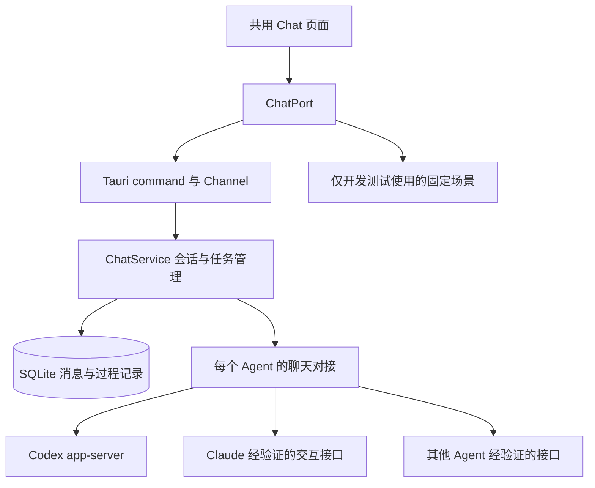

# Chat 统一体验与跨环境开发方案

本方案让用户在 AgentHub 用同一套聊天、确认和文件查看操作使用不同 Agent，并让换电脑或换开发 Agent 后的实现能够复现、验收和继续推进。

Status: proposed。用户已认可“统一界面、各家分别对接、先 Codex 再 Claude”的方向；本文是待实施的详细设计，不表示功能已经完成。本次只交付方案，不修改运行代码。实现任务、证据和交接状态统一记录在本文，避免依赖某次聊天记录。

## 目标与范围

用户选择工作目录、Agent 和连接后，直接输入任务；读取文件、执行命令、修改内容、等待确认、完成和失败都有明确展示。日常操作不要求用户输入命令行参数，不把原始日志作为主要内容。

统一操作含义和视觉布局，但不承诺不同模型生成相同答案，也不承诺每家都支持所有功能。相同验收场景检查交互与状态，不对模型文字做逐字比较。

首个可用版本以 Codex 为主，包含发送、过程展示、真实确认、用户问答、停止、执行中补充、同机恢复和历史回放。Claude 第二个接入，用于验证共用界面和接口确实适用于另一家。文件附件、模式菜单、完整差异查看按阶段交付。

范围外：复制 VS Code 插件完整界面或编辑器、保证 IDE 所选代码自动同步、全量原生斜杠菜单、通用文件回滚、默认内嵌终端、自动云同步、跨 Agent 原生会话转换。凭据落盘加密无必要、国产 OAuth 对接或转 API 均是项目范围外。所有 API Key 的可分享性沿用现行规则，不按 Agent 名称排除。

## 已核实的起点

源码基线：`dev`，commit `104d2e6de8272dc58ee94d1f442c97f8bafaceae`，2026-09-05 静态检查。后续开发先看实际 diff；此基线不是依赖锁定版本。

| 领域 | 当前证据 | 对方案的影响 |
| --- | --- | --- |
| 页面 | `src/pages/chat/ChatComposer.tsx`、`use-chat-page-send.ts` | 已有会话、发送、停止；执行中输入禁用，过程状态随页面切换清理 |
| 前后端接口 | `src/lib/backend/contracts/chat-port.ts`、`src-tauri/src/commands/chat.rs` | 当前 send/cancel 需要扩展为持续订阅、问答和确认 |
| 后台 | `crates/agenthub-core/src/services/chat_service.rs` | 消息入库；Claude/Codex 已捕获会话 ID 并尝试续接 |
| 各家运行 | `crates/agenthub-core/src/adapters/claude.rs`、`codex.rs`、`session_resume.rs` | Claude print、Codex exec；Chat 原生续接仅支持这两家 |
| 进程 | `crates/agenthub-core/src/utils/process.rs` | 普通输出管道、stdin 关闭，不能承载完整双向交互 |
| ZCode | `crates/agenthub-core/src/adapters/zcode.rs` | 未验证结构化流、非交互确认与 Chat 原生续接；桌面安装不等于可聊天 |
| 存储 | `crates/agenthub-core/src/models/chat.rs`、`storage/chat_repo.rs` | 已有文字记录；需增量保存执行状态和过程 |

现行 [Chat 说明](../concepts/chat-and-agents.md) 中“没有独立模型选择器”等描述已有局部滞后，源码已有部分模型选择入口。实施阶段须按源码更新对应说明，不把本文目标提前写成当前能力。

## 用户操作约定

| 操作 | 共用体验 | 能力不足时 |
| --- | --- | --- |
| 开始任务 | 选目录、Agent、连接，输入需求 | 明确显示未安装、未登录或当前版本不支持；不自动换 Agent |
| 执行过程 | “正在读取文件 / 执行命令 / 修改文件”，详情可展开 | 无结构化过程则显示简洁运行状态，日志放详情 |
| 确认操作 | 原因、目标文件或命令、允许/拒绝按钮 | 无真实确认通道不能展示可点击的假确认 |
| 回答问题 | 单选、多选或文字回答；选中不等于已提交 | 不支持则不显示入口 |
| 补充要求 | 支持时即时补充并显示已接收 | 不支持时仍可编辑草稿，完成后发送；不得标成已交给 Agent |
| 停止 | 先“正在停止”，确认结束再显示“已停止” | 超时显示停止结果未知，可查看详情；不伪造成功 |
| 模型与模式 | 固定位置，显示实际可用选项 | 不支持的选项隐藏；未知模式不强行翻译成“计划” |
| 文件查看 | 列出文件与修改差异，打开路径前验证 | 只读预览；“已修改”与“等待确认”必须区分 |
| 重开会话 | 先显示历史，再恢复真实状态 | 无法恢复时保留原记录，提供明确的新会话操作 |
| 切换 Agent | 新建所选 Agent 的会话，可主动携带文字摘要 | 不把原生会话 ID 交给另一家，不悄悄搬运全部上下文 |

一个会话固定一个 Agent 和工作目录。已有历史时换 Agent/目录创建新会话；空白会话可调整。首版同一 Agent 的活动执行采用保守串行，避免与当前共享配置切换互相影响；取消全局限制前必须证明会话和配置隔离。

权限默认使用 Agent 支持的确认方式，不以开启跳过确认让演示通过。原有自动批准设置不得被迁移成更宽的权限。模型/模式优先作为会话或单次执行参数；若只能修改本机共用配置，应说明影响并在活动执行期间阻止修改。连接切换继续走现有产品写入流程。

## 架构与责任

以下接口名称为设计草案，尚未实现；可按已有命名调整，职责和验收不变。



- 页面只理解统一事件和能力，不解析各家的 JSON，不根据 Agent 名称散布分支。
- `src/lib/backend/tauri/` 仍是唯一 invoke 边界；生产非 Tauri 环境明确 unavailable。
- `ChatService` 管会话、执行、待回答操作、事件保存和恢复。普通 `RunService` 继续服务现有一次性运行，不强行把所有调用迁移到长连接。
- 新增 core 内的 `ChatDriver`（暂名），负责启动/续接、发送、订阅、回答、确认、停止、退出与能力检测。Codex、Claude 各自实现；不为聊天另建账号/供应商管理系统。
- 首版由现有 Tauri 应用托管子进程，不引入独立常驻服务或路由后台重构。窗口切换不影响执行；显式退出需停止并回收子进程。关闭窗口与托盘行为沿用项目规则。
- 老的一次性运行方式保留服务已有会话。新会话选定接入方式后保存，不在执行失败后自动切换方式重发。

建议改动范围：`src/pages/chat/`、`src/lib/chat-process.ts`、backend contracts/tauri、`src/dev/mocks/chat.ts`、`src-tauri/src/commands/chat.rs`、core `services/chat_service*`、`models/chat*`、`storage/chat_repo*` 和增量 migrations。新增 driver 的准确目录在 S0 按 [架构总览](../architecture/overview.md) 确定；不先做大规模搬目录。

## 接口、事件与状态

能力不是一个“支持 Chat”的开关。建议包含 `send`、`resume`、`toolApproval`、`userInput`、`steer`、`interrupt`、`modelSelection`、`modeSelection`、`fileInput`、`imageInput`、`fileChanges`、`usage`，分别附 `supported / unsupported / unknown`、限制、检测版本和证据。界面与后台均检查能力，未知值不默认启用。

建议共用操作：

| 操作草案 | 必须表达的语义 |
| --- | --- |
| `getCapabilities` / `getOptions` | 返回该安装、版本、连接下可用能力和选项 |
| `startTurn` | conversation、唯一 clientRequestId、文本/附件、设置；返回 turnId |
| `subscribe` / `getSnapshot` | 按会话与事件序号恢复；无需等待整轮结束才能取状态 |
| `respondApproval` / `respondInput` | 精确的会话、轮次、requestId、执行实例、决定/答案 |
| `steerTurn` | 返回已接收或明确拒绝，不等同于排队发送 |
| `interruptTurn` | 发出停止请求；最终状态以后台确认或明确超时为准 |

事件信封至少携带 `schemaVersion`、`conversationId`、`turnId`、`eventId`、会话内 `sequence`、`runInstanceId` 和时间。内容包括正文增量、工具开始/结束、文件变化、待确认、待回答、请求解决、设置生效、用量（若有）和终态。上游 requestId/itemId 保存在后台关联字段中；历史事件不能变成新的授权请求。

执行状态：`queued → starting → running ↔ waitingApproval / waitingInput → completed / failed / cancelled / interrupted`；`cancelling` 为等待停止的中间状态。多个待处理请求独立跟踪，界面状态由未解决请求推导，不能一个回答清掉所有等待。

必须处理：

1. 重复发送和重复点击按 clientRequestId/requestId 去重。只承诺 AgentHub 内去重，不声称远端副作用恰好一次。
2. Agent 已结束、停止、断开或实例变化后，旧按钮失效。迟到的回复不得交给新的进程。
3. 每个 run 使用单一状态 owner（actor 或等价串行队列），回答、确认、停止、上游结束都在同一顺序边界处理。停止先被接受时，原子作废 pending 请求并进入 cancelling，再发 interrupt；后来回答拒绝发送。回答先从 pending 转 sending 并交给上游时，随后停止仍须发出，但不能承诺撤销已执行操作。发送/确认状态需保存；断线后结果不明时先核对，不能自动重放“允许”。仅分别给两个 handler 加锁或查询 active 不足以满足要求。
4. 切会话、页面重挂载和 Channel 断开不终止后台任务；用快照与 sequence 补齐过程，具体遵守下一节的保存与重放顺序。监听断开到新订阅之间不能静默漏事件。
5. 子进程退出或应用崩溃后将残留运行标为中断/待核对。恢复会话需查询上游；不能重新提交之前的修改任务。
6. 协议读取与 UI 速度解耦；正文增量可合并，确认和终态不得丢弃。设置消息大小、队列与历史上限，对超大输出展示截断标记。
7. 启动握手、活动等待、停止和资源回收各有超时；等待用户回答不直接套用一次性命令的总超时。无回答不得自动允许。
8. 进程参数按 argv 传递；清理整个子进程树，复用现有平台逻辑。日志脱敏，Markdown/路径/工具内容按不可信内容处理。

## 会话保存、兼容与迁移

增量扩展存储，保留旧消息和 native_session_id。新记录需要区分接入方式、安装来源/版本、工作目录、原生会话 ID、会话设置、当前执行实例、待处理请求与事件序号。具体表和 migration 编号在实施时分配，不能覆盖已有迁移文件。

所有向页面发布的统一事件必须先持久化。由单一 owner 在事务内分配 sequence、追加事件并更新相应快照；以 `(conversation_id, sequence)` 和 eventId 唯一约束去重，提交后才发布。正文增量可先合并再保存/发布，S1 固定合并间隔与大小上限；未提交的上游片段不属于已发布记录，崩溃时允许丢失这一小段但必须标记中断。终态、最终消息和待处理请求清理在同一事务提交。

订阅先注册并缓冲新事件，再读取带 watermark 的一致性快照，补发 afterSequence 到 watermark 的事件，最后接上更高序号；前端按 eventId/sequence 去重。活动 run 的已发布事件不可提前清理。完成后的保留上限在 S1 固定；请求的序号已过期或出现缺口时返回明确 gap/truncated 和新快照，不宣称完整补齐。默认不保存完整原始协议和环境变量；排障记录使用脱敏摘要、错误码和版本。

旧会话默认继续原方式。S2 验证 Codex 原生 ID 能在新方式恢复后，才提供显式升级；失败不清空原 ID。不能恢复时可“新建会话并带上摘要”，必须说明新会话不包含完整原生工具状态。旧记录没有过程事件时显示“此记录没有执行详情”，不补造过程。

数据库只做兼容性增量迁移；新方式开关不能删除旧数据。回退到仍支持新 schema 的修复版，不承诺任意旧二进制可直接打开新数据库。现有 Agent 配置备份不能当作聊天数据库备份。S1 必须明确事务迁移与 SQLite/WAL 安全快照方案：使用 SQLite 支持的一致性备份方式或关闭所有数据库连接后按已验证流程快照，禁止直接复制仍在写入的 db 文件。备份失败不继续迁移；迁移失败保持原 schema 可用，恢复只在隔离副本演练，不能自动覆盖用户数据库。

文件差异优先使用上游结构化事件。用文件系统或 Git 补充时不能把用户在外部编辑器的修改算到 Agent 头上；无法确定归属就标记为工作区当前差异。首版不提供一键全量回滚。

## 各家接入决策

| Agent | 方案 | 开启门槛 |
| --- | --- | --- |
| Codex | 直接启动检测到的 `codex app-server`，后台处理双向协议 | 握手、版本/schema、会话、确认、问答、停止在目标版本和平台实测 |
| Claude | 官方 Agent SDK 为首选候选；必要的辅助进程随应用管理，不让用户操作终端 | 先确定登录/计费可行性，再验证双向交互及配置加载；不能假定 SDK 等同现有订阅登录 |
| ZCode | 单独验证官方可用接口；尚无可靠证据时保留现有受限能力 | 公开接口依据、可重复运行样例、版本范围、停止与恢复测试齐全 |
| 其他 Agent | 逐个填写同一能力矩阵，复用同一接口和场景 | 对应功能有真实协议证据与契约测试；仅有 stdout 不算完整交互 |

依据核对日期：2026-09-05。Codex 官方说明 app-server 用于包括 VS Code 扩展在内的深度客户端，提供历史、确认和事件；本方案据此选择它，不承诺所有官方界面功能。[Codex 官方接口](https://learn.chatgpt.com/docs/app-server)

Claude SDK 提供 Claude Code 的执行能力与会话管理。官方说明未经批准第三方不能提供 claude.ai 登录或额度，因此 SDK 路线先验证 API Key/已获许可的使用方式。不得通过改调用方式绕过该边界。[Claude 官方说明](https://code.claude.com/docs/en/agent-sdk/overview)

ZCode 官方资料展示桌面工作流；目前检索结果不足以证明稳定的第三方聊天接口。第三方提取桌面内部程序的方案不作为默认生产依赖。[ZCode 官方文档](https://zcode.z.ai/cn/docs/welcome)

这些是来源支持的可行性判断，不是本项目已通过的兼容测试。S0/S4/S5 要重新核对当时文档、实际安装版本和最小运行样例，并记录变化。

## 分阶段实施与交付

| ID | 范围与依赖 | 必须交付 | 完成条件 |
| --- | --- | --- | --- |
| S0 | 接入验证、环境基线；无前置 | Codex 最小真实实验、能力/版本记录、接口草案、Claude 登录结论、固定示例工程 | 不改用户工程即可验证会话、确认、问答与停止；失败能力有明确结论 |
| S1 | 共用交互与存储；依赖 S0 | DTO/事件契约、状态机、增量存储、mock 场景、共用过程与确认组件 | A01–A10 的可模拟部分通过；页面不包含 Codex 协议逻辑 |
| S2 | Codex 正式接入；依赖 S1 | app-server driver、进程管理、订阅恢复、真实会话与设置处理 | 真实完成任务—确认—补充—停止—重开流程；旧会话不受损 |
| S3 | 新手体验与跨平台；依赖 S2 | 支持的模型/模式菜单、文件输入、差异查看、短错误提示、三平台验证 | A01–A12 中 Codex 适用项通过；首次任务不要求输入终端命令 |
| S4 | Claude 第二家；依赖 S0/S3 | 确定可用接入方式、driver、兼容记录、复用全部共用组件 | 同一套适用场景通过；不新增第二套 Chat 页面；受限项明确 |
| S5 | ZCode 与其他 Agent；依赖 S4 | 每家独立能力记录、最小实验与接入任务 | 验证一家再开放一家；无可靠接口的保留受限状态 |

S0 建议拆为 T01 环境/版本、T02 Codex 协议样例、T03 Claude 登录边界、T04 契约定稿。S1 拆为 T05 DTO/状态机、T06 存储/恢复、T07 mock/页面。S2 拆为 T08 driver、T09 Tauri/订阅、T10 真实验收。后续按同样方式拆任务，每个任务记录负责者、文件范围、前置任务和证据。

同一迁移、共享 DTO、ChatService 的变更顺序执行；只有范围不重叠且接口已固定时才并行。跨层实施使用实现与独立审查；迁移、锁与确认流程按项目高风险流程执行。文案/样式等局部修改不增加多 Agent 流程。

排期仅供粗估：S0 2–4 个工作日；S1–S2 合计约 2–4 周；S3 约 1–2 周；S4 在接入方式明确后约 2–4 周。S5 不设整包承诺。基于一名熟悉项目的开发者并有审查支持，按 S0 实验结果调整。

## 换电脑与换开发 Agent

这里首先保证开发可复现，不自动增加用户数据云同步。不同电脑的登录、模型权限和操作系统可能不同，真实模型回答也会变化；可复现的是界面、协议处理、错误行为和验收步骤。

### 环境基线与版本记录

当前 CI 使用 Node 22、pnpm 9、Rust stable，并包含 Linux 测试、Windows/macOS 编译检查；尚不能称为三平台真实聊天验收。依据 `.github/workflows/pr-ci.yml`。

S0 在仓库内固定经过验证的工具版本（Node/pnpm/Rust），保留 `pnpm-lock.yaml`、`Cargo.lock`；新增版本文件与 CI 同步，不修改工作区外用户配置。记录 Agent 可执行文件来源、版本、操作系统/架构、协议 schema、验证日期和适用功能。当前不填写未经运行验证的最低版本号。

界面启动时复用现有检测，检查安装、版本、登录、目录和能力；问题用简短提示及已有管理入口解决。不得依赖某台电脑的绝对路径、私人脚本、未记录环境变量或隐藏的插件副本。Windows 路径/后缀、带空格与中文目录、macOS/Linux 进程清理均纳入测试。

每家维护“已验证版本 / 最新探测结果 / 不支持能力”。更新版本先运行固定契约场景，再真实冒烟。握手失败不自动改 flags、切模型、切连接或重发任务；提供升级或使用已验证版本的说明。

### 无登录开发与真实验证

固定场景放 `src/dev/mocks/`，包括正常执行、确认、提问、取消、失败、断开和重开。脱敏协议 fixture 放各 driver 的测试目录，示例工程也随仓库交付，不引用私人项目。fake 子进程覆盖真正的 stdin/stdout 读写、半行 JSON、乱序、重复和退出，不只测试 mapper。

新电脑开发入口（已有命令）：

```text
pnpm install --frozen-lockfile
pnpm dev:mock
```

按 [开发环境](../getting-started/development.md) 安装桌面构建依赖后，真实验证入口为 `pnpm tauri:dev`。在隔离示例目录操作，登录留在本机，不上传 API Key、原生私有会话或真实用户 home。

S0–S3 应补齐的测试命令与结果写入交接记录。已有定向入口包括：

```text
pnpm exec vitest run src/pages/chat src/lib/chat-process.test.ts src/lib/api/chat.test.ts
pnpm typecheck
pnpm typecheck:test
cargo test -p agenthub-core --locked chat
pnpm exec playwright test e2e/browser/chat.spec.ts
pnpm check:docs
```

这些过滤命令不会自动覆盖所有未来测试，新增 driver/contract 测试必须追加准确路径或过滤名。浏览器测试不证明真实 Agent 可用，Rust 测试不证明 GUI 可用。提交前/CI 按 [测试与验证](../guides/testing-and-validation.md) 执行对应完整门禁；依赖和生产边界改动包含 `pnpm build`。

### 交接办法

方案、fixtures、版本记录与代码必须进入同一可获取的 Git 提交或 PR；仅留在本机未提交文件不能跨电脑交接。本次不自动提交或推送。后续实现每个小阶段更新下面记录，填写实际命令、结果和未完成事项；换开发 Agent 时不需要粘贴本轮聊天。

可直接交给下一位开发 Agent 的任务说明：

```text
请继续实现 docs/proposals/chat-unified-experience.md。
先读取项目 AGENTS.md 和本文交接状态，检查分支、commit 与工作区 diff。
目标是共用 GUI 体验，先 Codex，再 Claude，不把终端作为主要界面。
只执行交接记录中的下一个任务，保留已有修改。
结构问题优先 CodeGraph；工具不可用时说明并定向读取。
按任务风险使用规划、实现与独立审查，不并行改同一文件。
未验证的 Agent 能力不能宣称支持；mock 不能作为真实后端验收。
完成后更新本文交接记录：文件、测试结果、兼容版本、剩余问题和下一任务。
```

### 用户换电脑后的会话

同机重启恢复属于首版。跨电脑迁移原生会话单独评估：既需要本地记录，也可能需要 Agent 的原生会话文件、项目内容和目录重新选择；仅有 native_session_id 不足以保证恢复。

如后续实现导入，应明确区分“查看历史”“带摘要新建会话”“恢复原生会话”。默认不携带登录信息，目标机器重新登录；导入的待确认请求全部失效，不能自动执行历史操作。该功能不作为 S0–S4 的默认实施任务。

## 验收场景

固定示例工程只包含无敏感信息的小项目和可运行测试。真实验证记录 Agent/版本、OS/架构、commit、登录类别（不记录密钥）、场景 ID 和脱敏结果。

| ID | 场景 | 必须看到的结果 |
| --- | --- | --- |
| A01 | 新安装/未登录/无目录/不支持版本 | 准确阻止发送并给下一步；无 mock 回退 |
| A02 | 读取示例文件并解释 | 正文与过程分开，文件目标正确，完成后可重开 |
| A03 | 要求修改并执行测试 | 确认与实际请求对应；拒绝后该操作不执行，允许后继续 |
| A04 | Agent 提出单选/多选/文字问题 | 提交准确返回，重复点击不重复处理 |
| A05 | 执行中补充要求 | 支持时确认接收；不支持时只保留草稿 |
| A06 | 确认同时停止、晚到回复 | 分别强制两种先后顺序；停止先接受则允许绝不发出，回答先发送则仍可停止但不伪称撤销 |
| A07 | 切 A→B→A、断开并重新订阅、历史过期 | watermark 边界无静默缺口、不串会话、不重复；过期明确 gap/truncated |
| A08 | 程序重启、子进程崩溃、恢复失败 | 不遗留无限运行；不自动重发；原记录保留 |
| A09 | 旧版数据库、旧会话、迁移中途失败 | 增量迁移不丢消息；失败事务回滚、隔离副本备份恢复通过；缺过程明确显示 |
| A10 | 重复/未知/超大事件、慢 UI | 有界处理，不漏确认/终态，未知内容不让整轮崩溃 |
| A11 | 模型/模式/连接/目录切换 | 后台实际生效与 UI 一致；执行中不被共用配置悄悄改变 |
| A12 | 三平台、中文/空格路径、中文输入、键盘操作 | 路径和停止正确；输入法候选确认不误发送；弹层焦点可恢复 |

已修改文件不等于已得到修改前审批；每家必须记录确认发生的准确时点。A03 的真实审批实验使用可控制的权限设置，不以默认“自动允许”假装测试了拒绝路径。

Codex 首版发布门槛：S0–S3 完成；全部适用场景有自动化或真实证据；不适用项有能力说明；目标三平台各有真实冒烟，未验证的平台不能宣称相同支持。确认、恢复、迁移的重大审查问题为零。Claude/ZCode 独立按各自能力验收，不以 Codex 成功替代。

## 交接状态与未决事项

| 条目 | 当前状态 | 下一步 |
| --- | --- | --- |
| 方案 | 已形成文档；实现尚未开始 | 维护者评审详细方案，开始 S0 |
| S0–S5 | 全部未实施、未进行真实验收 | 从 T01/T02 开始，不先改所有 Agent |
| 兼容版本 | 尚无本方案实测记录 | S0 记录准确版本与协议能力 |
| Claude 使用方式 | 官方边界已记录，项目接入未定 | S0 核实可用登录方式；不阻塞 Codex 实验 |
| ZCode 接入 | 尚无可承诺的公开接口证据 | S5 单独验证，不预设日期 |
| 同机恢复/跨电脑开发 | 已列为设计与验收要求 | S1/S2 和固定 fixtures 实现 |
| 跨电脑原生聊天迁移 | 不属于当前首版 | 有独立需求时再定范围 |

每次接手追加以下记录，不将“计划跑”填成“已通过”：

```text
任务 ID / 日期 / 负责者：
开始 commit / 交付 commit 或 PR：
当前阶段与状态（未开始/进行中/已验证/受阻）：
修改文件和对应验收场景：
环境与 Agent 版本：
执行的测试命令、退出结果、证据位置：
实际验证的能力 / 未验证的能力：
剩余问题与决策理由：
下一个任务及其文件范围：
```
