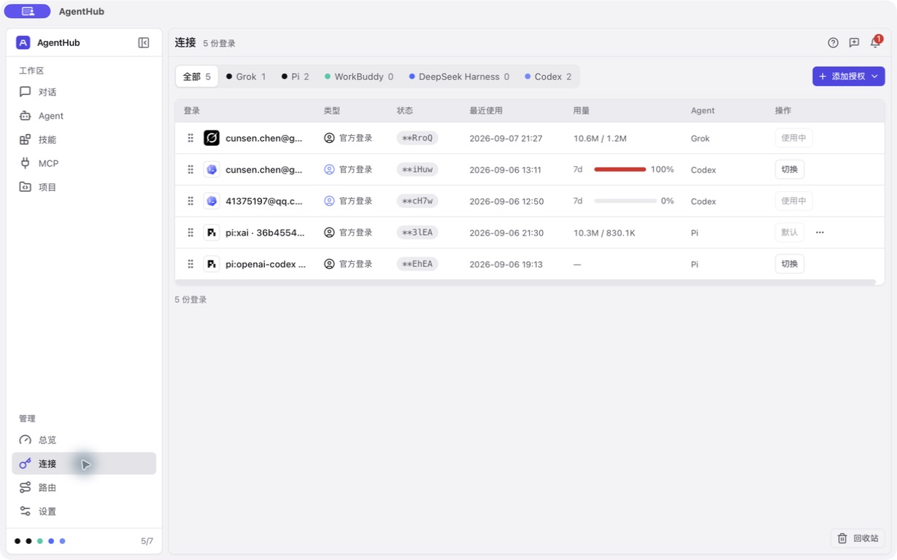
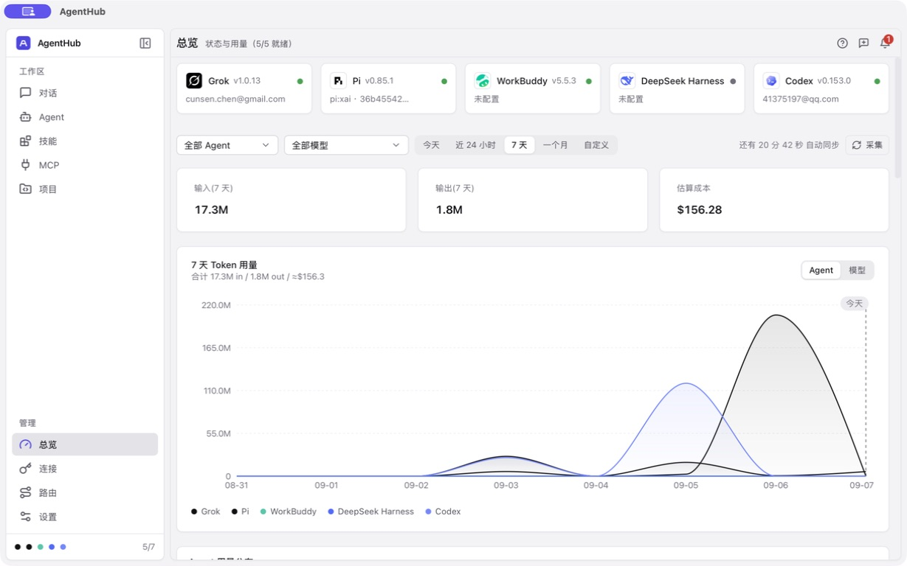
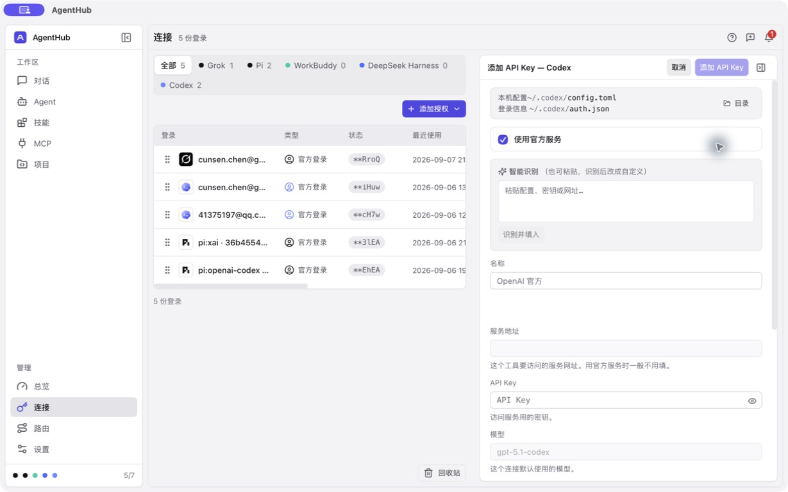
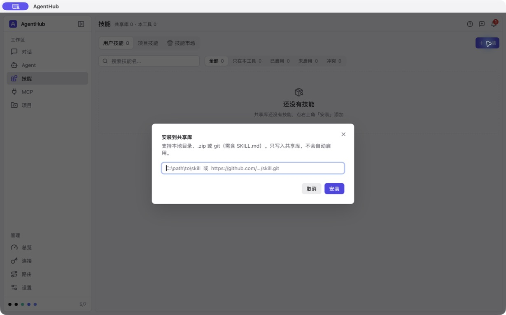
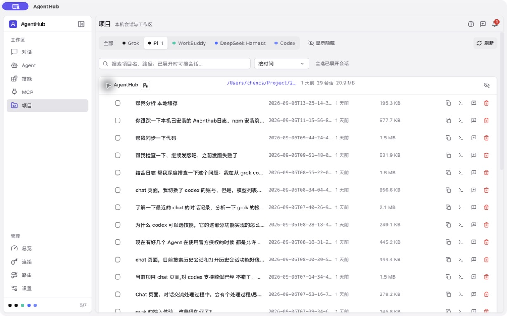
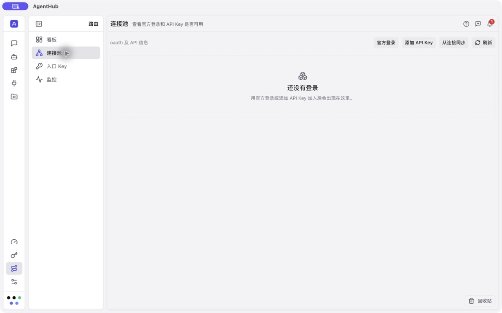
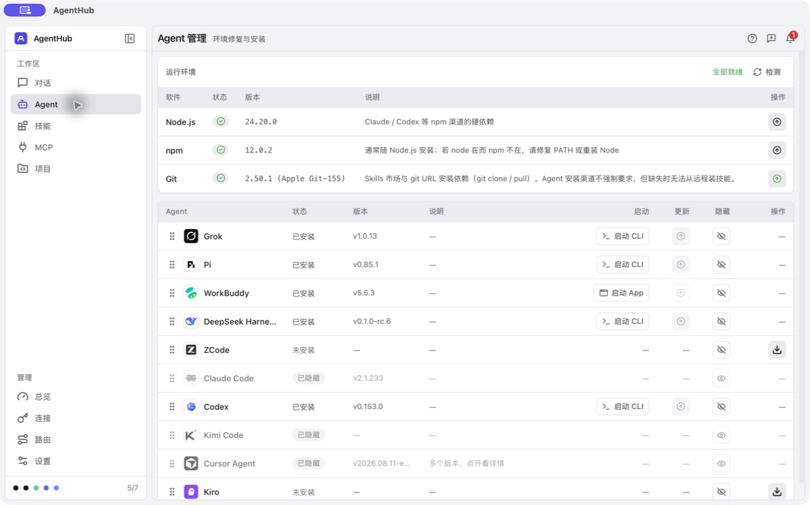
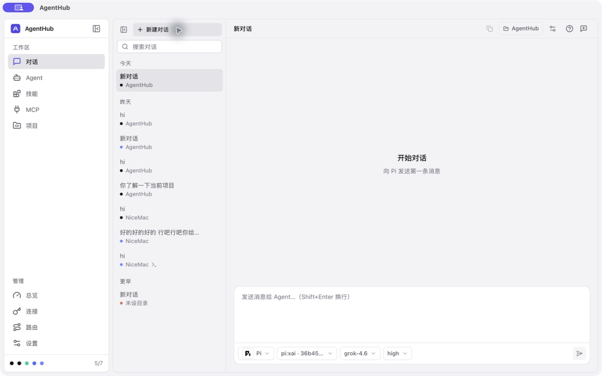
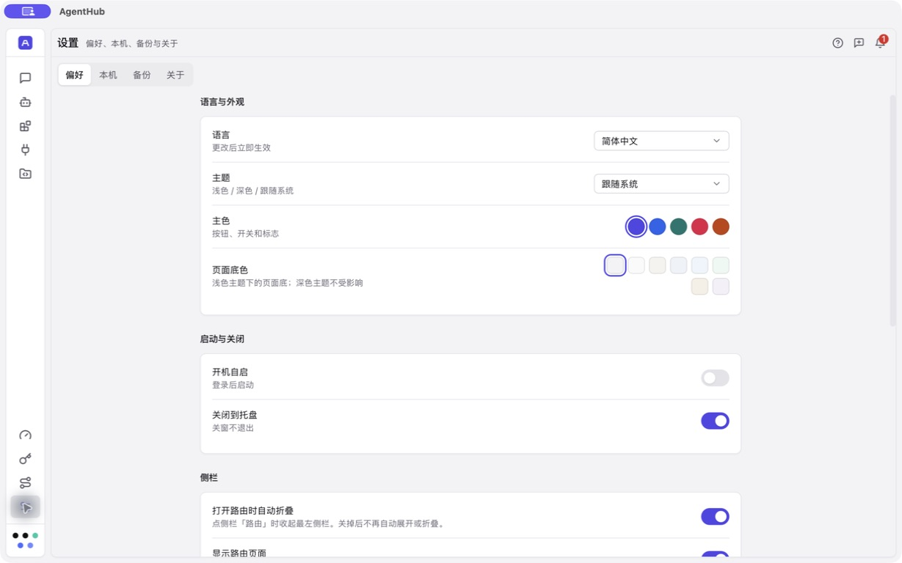

# AgentHub UI 与交互审查

审查日期：2026-09-07。对象：真实 macOS Tauri 桌面程序，界面版本 v0.4.10；代码核对时分支为 dev，HEAD 为 df4d993c。截图尺寸 1229 × 768，浅色主题、紫色主色。主 Agent 负责启动、操作、截图和结论，一个只读子 Agent 补充通用组件及用量口径证据。

## 总体结论

界面已经有统一的基础：灰白背景、紫色主操作、相近的表格和表单样式，页面边界也比较清楚。主要短板是**重要信息不够直白、常用动作不够突出，以及大面积留白与局部拥挤同时存在**。建议先修正状态、用量和表单反馈，再调整密度与排版；当前没有充分理由整体重做视觉风格。

本次交付是审查与改进意见，没有修改产品代码。实际走查覆盖总览、连接及添加 API Key、已有与新建对话、会话设置、Agent、技能及安装表单、MCP、项目及搜索、路由看板与连接池、设置与关于。

## 详细改法

[UI 详细改进方案](UI-IMPLEMENTATION.md)已补充：五种可选主色在浅色/深色下的完整状态色、八种页面底色的组合规则、文字与背景对比度、内容与操作层级、字号/间距/控件尺寸、逐页布局、实现顺序与验收清单。现有颜色自定义与跟随系统能力必须保留，默认紫色仅用于示例。方案尚未应用到产品代码。

## 改进建议速览

以下为本次审查建议，尚未实施；详细证据与验收条件见后文。先改善“看得懂、用得顺”，再做视觉打磨。

| 页面 / 方面 | 问题 | 建议 |
|---|---|---|
| 连接状态 | “状态”列显示登录信息末尾片段，不能直接判断是否需要处理 | 显示已配置、需重新登录、状态未知等有依据的状态；末尾片段放详情 |
| 连接用量 | 百分比未标明已用还是剩余，Token 数字也缺少标签 | 显示“7 天已用 100%”，明确输入/输出，详情补充重置时间 |
| 总览统计 | 顶部输入与图表口径不同，数量级差异容易被误认为计算错误 | 明确“输入不含缓存”“总 Token 含缓存”，统一数字和图表说明 |
| 添加 API Key | 必填内容靠后，技术说明与禁用字段占据首屏 | 前置服务选择、API Key 和名称，其余放入高级设置 |
| 侧栏编辑布局 | 打开编辑面板后，原列表被压缩到需要横向滚动 | 将左侧简化为登录名称和状态，保证当前对象可辨认 |
| 技能安装 | 缺少目录/文件选择，macOS 仍显示 Windows 路径示例 | 增加选择目录、选择 zip，按系统给示例，错误显示在输入框下 |
| 项目与会话 | 继续对话混在多个小图标里，长标题被截断 | 继续对话使用文字按钮；复制、命令、删除放更多菜单，给标题更多空间 |
| 项目搜索 | 命中会话可能藏在折叠项目里 | 展开匹配会话，显示命中数量并突出关键词；明确搜索范围 |
| 路由空状态 | 已有连接的用户不容易发现复用入口，看板主要显示零数据 | 突出从连接同步，按现有支持规则展示；给出添加连接、创建入口 Key、开启转发的顺序 |
| 对话开始页 | 当前 Agent、连接、模型和项目目录分散 | 空状态集中显示 Agent 与项目；缺少连接或目录时就地给操作入口 |
| 字号与操作区域 | 关键说明偏小，关闭与清空按钮点击区小 | 关键文字试用 13–14px，点击区域扩大至 28–32px，常用动作保留文字 |
| 设置与辅助阅读 | 部分开关缺少名称，侧栏自动折叠后的行为不够直观 | 关联控件名称和说明，明确进入、退出路由时的侧栏行为并尊重手动调整 |

### 美观性调整方向

- **加强层级：**突出页面标题、关键数字和状态；弱化辅助路径与版本信息。
- **重新分配空间：**减少空页面上的无效筛选和零数据图表，把空间留给账号、会话标题和表单。
- **统一操作表达：**主操作使用文字按钮，次要操作使用图标，低频操作收进更多菜单。
- **保留现有风格与颜色设置：**沿用可选主色、页面底色及主题切换；紫色与灰白仅为默认示例。优先调整字号、列宽和主次关系，不整体重做视觉。

### 建议优先顺序

1. 先处理连接状态、用量含义、总览统计说明、设置控件标签。
2. 再完善 API Key 表单、技能安装、项目搜索与路由空状态。
3. 最后统一字号、列宽、点击区、颜色和动效，并补充深浅主题、缩放及键盘验收。

## 环境、操作范围与证据限制

- 最初启动过 mock；用户要求真实程序后立即停止。**本报告的截图和主要结论全部来自随后运行的真实桌面端，mock 截图已移除。**首次引导没有在真实用户数据上重新触发，不列为已确认问题。
- 运行 `pnpm tauri:dev` 成功编译。为让 computer use 识别开发进程，在被 Git 忽略的 `target/ui-audit/` 下添加本地应用外壳，执行的仍是刚编译的 `target/debug/agenthub-gui`；前端用 `pnpm dev`，后端为真实 Tauri，实现及本机数据均未替换。
- 没有执行登录、切换连接、启用路由、安装软件/技能、删除已有数据或发送模型请求。点击“新建对话”产生了一条未发送的空白对话，未删除；项目搜索词已清空。进入路由触发了程序已有的自动折叠侧栏行为。
- 检查了会话设置的初始焦点、一次 Tab 移动、Escape 退出，以及连接编辑侧栏的 Escape 退出。没有完成全键盘或 VoiceOver 验收。
- 没有改变用户主题偏好，未验证深色、系统减少动效、缩放、窄窗口、Windows/Linux、长时间运行、网络失败和真实授权完成流程。截图不能证明这些状态通过。
- 当前本机技能与连接池为空，不能据此推断扫描失败，也不能评价有大量数据时的表现。Sub2API、插件入口原本隐藏，没有开启它们。
- 本地截图保留真实页面中的账号标识、路径和会话标题，未上传外部服务；可见登录信息保持程序原有遮挡。若以后公开报告，应另做脱敏副本。
- 工作区存在其他并行改动，本次不处理它们；本报告代码行号以核对时版本为准。

## 实际走查步骤

| 步骤 | 操作 | 健康情况 | 主要证据 |
|---|---|---|---|
| 1 | 打开总览，等真实用量加载 | 可用，统计口径需要解释 | 03 |
| 2 | 连接列表 → 添加授权 → Codex → 添加 API Key → Escape | 入口可用，状态/用量语义和表单层级需要改进 | 04、05 |
| 3 | 查看已有对话 → 新建对话 → 会话设置 → Tab → Escape | 基本流程可用，开始条件与历史辨识度可改善 | 06–08 |
| 4 | Agent 管理页查看安装、更新和隐藏入口 | 状态清楚，常用动作过度依赖图标 | 09 |
| 5 | 技能空状态 → 安装表单 → 空输入点击安装 → Escape；查看 MCP | 页面可用，安装表单缺少本机选择入口和字段内校验 | 10–13 |
| 6 | 项目 → 展开 → 搜索“本地缓存” → 折叠后同词搜索 | 已加载会话可搜索，命中内容不自动展开 | 14–17 |
| 7 | 路由看板 → 连接池 | 页面可用，空状态缺少明确起步路径 | 18、19 |
| 8 | 设置偏好 → 关于 | 分组良好，部分控件缺少辅助阅读名称 | 20、21 |

## 优先级与改进意见

P1：优先处理，容易误解关键状态或阻碍部分用户完成操作。P2：下一轮完善，减少操作负担、改善可读性。P3：打磨项。优先级不等于已经发生数据损失；本次未发现需要立刻停用软件的 UI 问题。

### 1. P1：连接“状态”列没有告诉用户当前是否可用

**观察：**真实列表的“状态”列主要显示 `**…` 末尾片段，用户无法从该列直接判断需要重新登录、已经配置还是可继续使用。账号名同时被截断，使得这一列对辨识账号的帮助也有限。证据 04。

**建议：**状态列保留“已配置”“需重新登录”等已有、能够确认的状态；末尾片段放到登录详情或辅助说明。不要把“已配置”升级成没有验证依据的“可用”。高频识别信息优先分配列宽。

**验收：**无需悬停即可回答“我现在用的是哪份登录，它是否需要处理”；API Key、官方登录、失效、未知状态均有可区分的文字。

**代码落点：**`src/pages/connections/TicketWalletList.tsx:672`、`src/pages/connections/ticket-card-detail.ts:237`。后者在满足条件时会用末尾片段替代原有状态。

### 2. P1：用量百分比缺少“已用”标识

**观察：**同列同时出现 `7d 100%`、`7d 0%` 和 `10.6M / 1.2M`。裸百分比无法单独说明是已用还是剩余；Token 对也没有就地注明输入/输出。真实截图中满条为红色，但颜色不能承担全部解释。证据 04。

**核实：**百分比来源确实是已用比例，计算方向没有发现错误；紧凑模式还会省略重置提示。不能把红色 100% 解读为“剩余 100%”。

**建议：**显示“7 天已用 100%”，详情补“剩余 0% · 重置时间”；Token 类型显示“输入 / 输出”简短标签或明确的二行布局。进度条添加包含 Agent、时间窗、已用比例的可访问名称。

**验收：**0%、100%、未知、额度与 Token 两种来源都能明确解释，不依赖颜色和猜测。

**代码落点：**`src/components/shared/QuotaBar.tsx:17`、`crates/agenthub-core/src/services/account_quota.rs:465`。

### 3. P1：总览标题与图表不是同一个 Token 口径

**观察：**顶部输入 17.3M、输出 1.8M，图表峰值却约 200M。图表副标题仍重复顶部输入/输出，容易让用户误以为数据算错。证据 03。

**核实：**顶部输入取 input_tokens；曲线和分布包含输入、输出、缓存读、缓存写。差异可由口径解释，不是本次确认的数据计算错误。

**建议：**用“输入（不含缓存）”“输出”，图表用“总 Token（含缓存）”。如增加缓存指标，应分别说明缓存读/写，保持顶部、趋势与分布标题一致。估算成本继续明确为估算，缺少价格的情况应靠近成本呈现，避免只在明细末尾才看到。

**验收：**用有缓存与无缓存的固定数据分别检查；界面可直接解释总数之间的关系。

**代码落点：**`src/pages/dashboard/index.tsx:720`、`src/pages/dashboard/UsageTrendTooltip.tsx:259`、`crates/agenthub-core/src/storage/usage_repo.rs:405`、`:480`、`:514`。已有 Rust 测试明确包含缓存，不建议为让数字看起来一致而删掉缓存。

### 4. P1：部分设置开关有视觉文字，但没有辅助阅读名称

**观察：**真实设置页中，“开机自启”“关闭到托盘”的辅助阅读树只有 switch off/on；相邻的“打开路由时自动折叠”却能读出完整名称。证据 20 的视觉文字与本次 AX 检查共同支持这一结论。

**代码核实：**`PreferencesPanel.tsx:265–290` 的两个 Switch 没有标签属性；`settings-shared.tsx:29` 使用普通段落显示标签，没有自动关联控件。路由的两个偏好开关、用量间隔输入也应一起检查。

**建议：**让设置行明确关联标签、说明和控件；避免仅靠位置关系。技能安装输入也需常驻“来源”标签，不能只靠 placeholder。

**验收：**键盘聚焦和辅助阅读时，名称、当前值、用途都可辨认；同页多个开关不会都只读成“开关”。这需要真实 VoiceOver 复验，本次不声称已完成。

### 5. P2：添加 API Key 时，技术说明压过了必填内容

**观察：**右侧面板先展示本机配置位置、官方服务、较大的智能识别区域，然后才是名称、地址、API Key；默认状态下还显示多个不可编辑的模型/服务字段。打开面板后左侧列表明显变窄并横向滚动。证据 05。

**建议：**前置“官方服务 / 自定义服务”和 API Key；名称作为可选识别信息。“粘贴配置自动填入”保留为便捷入口。无需填写的字段及只读配置放到折叠的“高级设置”。顶部说明“添加后会发生什么”，依据现有行为表达，不改变写入规则。空间不足时左侧切为简化登录列表，保留名称和状态，不保留七列表格硬挤。

**验收：**默认窗口下第一屏可看到必填项和提交入口；打开编辑区后无需横向滚动才能识别当前登录；取消与 Escape 能退出。后两种退出在本次连接侧栏检查中可用。

### 6. P2：技能安装表单对本机路径不够友好

**观察：**在 macOS 真实程序中，提示仍是 Windows 风格 `C:\path\to\skill`；说明支持目录与 zip，却只有一个文本输入，没有选择目录或文件按钮。空输入点击安装时，本次截图没有看到字段内说明。证据 11、12。

**核实：**代码已有空值校验并发 toast，不是“完全没有校验”；安装按钮在空值时仍可点击。不要把一次未观察到 toast 的截图扩大成所有错误均不提示。

**建议：**提供“选择目录”“选择 zip”以及 Git 地址输入；按平台给路径示例。空值或格式错误在字段下显示短提示并关联输入框，toast 只补充结果反馈。空库时将“安装技能”和“浏览技能市场”放入空状态内部。

**验收：**不用手写路径即可选择本机来源；空值提交有持续可见的字段错误，焦点回到来源输入。实际安装、失败重试和冲突处理仍需后续在可丢弃数据上验证。

**代码落点：**`src/pages/skills/index.tsx:458`、`:1265`。

### 7. P2：项目页的主任务不够突出，搜索结果藏在折叠行内

**观察：**展开后每条会话有多个相似大小图标，“在对话继续”与复制、命令、删除并列，用户需逐一探查。长会话标题被压缩，文件名和体积仍占较多宽度。搜索“本地缓存”能找到已加载会话；折叠后同词仍保留项目行，但不显示命中会话或命中数量。证据 15–17。

**建议：**把“继续对话”做成文字动作，复制标识、复制命令和删除收进更多菜单；优先给标题空间。搜索时自动展开匹配会话，或显示“1 条匹配”，明确当前筛选的 Agent。未加载会话的搜索范围需说明并测试，不能用这次已加载场景宣称全局搜索有效。

**验收：**找到某个会话后一次明确操作即可继续；输入关键词后无需猜测命中藏在哪个项目中；查询退出时合理恢复原展开状态。

### 8. P2：路由空状态没有把已有连接用户带到下一步

**观察：**真实连接页已有 5 份登录，连接池为空。空状态只说官方登录或添加 API Key，顶部虽然有“从连接同步”，却与其他按钮同权重。看板在本机转发关闭且无入口 Key 时，占据大部分屏幕的是全零曲线。证据 18、19。

**建议：**空池主动作突出“从连接同步”，次要入口为添加 API Key / 官方登录；不能承诺所有登录都能同步，应按现有支持规则展示。看板增加短的起步顺序：“添加可用连接 → 创建入口 Key → 开启本机转发”，将空图表降级为简单暂无数据说明。把“oauth 及 API 信息”等混合文案改成页面已使用的“官方登录和 API Key”。

**验收：**现有连接用户可找到复用入口；无连接用户可找到新增入口；不可共享的官方登录仍明确受限，API Key 不按所属 Agent 限制。

### 9. P2：默认字号偏紧，操作区域与信息密度分配不均

**观察：**列表、说明多为小字号灰字；连接、MCP、技能页面有大面积留白，而账号、会话标题、表单局部却容易截断。Agent 页的安装、更新、隐藏大量使用图标。证据 04、09、13、15、20。

**建议：**保留现有紧凑桌面风格，先把关键说明与状态从 12px 提升到 13–14px；普通正文可试 14px，辅助版本/时间保留 12px。不要全局等比放大所有间距。增加账号和标题的弹性列宽，技术路径退居详情。安装、继续对话这类主动作保留文字；“已是最新”和可点击“强制升级”不应只靠相似的浅色图标区别。

**验收：**长中文、相近账号、长 Agent 名称均能辨认；在 1280×800、1024×768 和 125%/150% 缩放下检查，而不是只验证 CSS class。以上尺寸与缩放为待执行验收，不是本次已测结果。

**代码落点：**`src/styles/tokens.ts:164`（正文 13px、辅助 12px）、通用表格与页面列宽。

### 10. P2：小图标点击区域和语义颜色需要统一验收

**观察与代码证据：**会话设置的关闭按钮视觉很小；通用 Dialog 的 16px 图标加两侧各 2px padding，约 20×20px。搜索清空按钮也为 20×20px。证据 08、16；`src/components/ui/dialog.tsx:36`、`src/components/shared/SearchField.tsx:50`。

**建议：**保持图标外观，统一扩大实际点击区至 28–32px，并保证相邻目标间距。20px 本身不能直接断言违反标准，需考虑间距等例外；这里首先是易点中程度的改善。[W3C 目标尺寸说明](https://www.w3.org/WAI/WCAG22/Understanding/target-size-minimum.html)。

**颜色风险：**代码的浅色 warning `#c2740c` 对画布 `#f3f3f5` 计算约 3.27:1；如果用作普通小字号正文，就低于常见的 4.5:1 验收门槛。该组合来自源码计算，不代表此次截图所有灰字都不达标。建议使用单独的深色警告文字，逐个验证实际背景。禁用控件与有效正文应分开判断。[W3C 对比度说明](https://www.w3.org/WAI/WCAG22/Understanding/contrast-minimum.html)。

**验收：**深浅主题、不同主色、hover/focus/disabled 各态进行实际测量；辅助文字不单凭肉眼作“全部达标/不达标”的结论。

### 11. P2：对话页缺少聚在一起的开始条件，历史标题重复

**观察：**空状态仅写“向 Pi 发送第一条消息”；项目目录在右上，Agent、连接、模型、思考强度在底部。历史多条“hi”和“新对话”需要再靠目录、颜色去分辨。已有对话能正常显示，本次没有测试模型发送。证据 06–08。

**建议：**空状态把“当前 Agent · 项目目录”放在一起，缺少目录或连接时就地给修复入口。保留熟练用户底部切换方式。历史列表增加时间与 Agent 文字；未发送的空白草稿避免长期挤占历史，或者清楚标为草稿。可在成功首轮后按内容生成短标题，但不应覆盖用户自定义标题。

**验收：**新用户无需打开会话设置就能确认消息发给谁、在哪个项目；多个类似会话能辨识。目录与自动批准的关系继续使用明确说明，不扩展权限。

### 12. P3：跨页面导航变化与动效偏好还可以更一致

**观察：**进入路由时，一级侧栏自动变为图标栏并出现第二栏；退出至设置后，一级栏仍保持折叠。设置里已有“打开路由时自动折叠”的明确开关，所以这不是无配置入口的 bug。证据 18、20。

**建议：**保留现有偏好，明确是只进入时折叠还是离开时恢复；如采用恢复方案，应尊重用户手动调整。图标栏保留可访问名称和清楚的当前页标识。不要为这个问题新增更多导航层级。

**代码侧补充：**已有减少动效处理，但通用 Switch 的滑块仍使用 `transition-transform`，应纳入系统减少动效偏好的真实验证。普通颜色淡入淡出优先级较低，不等同于已经确认的可访问性违规。

## 建议实施顺序

| 批次 | 范围 | 验收重点 |
|---|---|---|
| 第一批：消除误解 | 连接状态、额度已用标识、总览含缓存说明、设置控件标签 | 文案和数字口径一致；辅助阅读能分辨控件；保留现有后端行为 |
| 第二批：降低操作成本 | 技能来源选择与字段校验、项目搜索命中展开、主动作文字化、连接池起步引导 | 定向真实操作能完成；失败/空值能恢复；无额外登录或重复安装要求 |
| 第三批：视觉打磨 | 关键字号、列宽、侧栏编辑布局、点击区、颜色与动效 | 深浅主题、长文本、窄窗口、缩放与键盘验收 |

这三批不需要先改 Rust 共享接口。若实施来源选择或搜索加载范围涉及后端能力，再单独明确范围。纯文案和样式用小改动验证；不要把整个审查一次性升级成架构重构。若后续修改代码，可按用户偏好使用 GPT terra 承担实现，由主 Agent 验收。

## 保留的优点

- 主色、表格、表单与空状态已有一致基础，可渐进改善。
- MCP 明确说明只列出发现项；关于页显示真实版本；路由说明限定本机范围，边界表达较诚实。
- 会话设置初始焦点落在目录输入，Tab 能到选择目录，Escape 可退出；连接编辑侧栏也能 Escape 关闭。
- API Key 输入默认遮挡；已有登录列表没有直接展示完整登录信息。
- 已有搜索、筛选、侧栏伸缩、通知和本页用法入口，不需要为了易用性新增一整套导航。

## 后续验证清单与本次未覆盖部分

1. 修复后验证 0/100/未知额度、有/无缓存、空/长列表、表单空值/格式错误/请求失败。
2. 在真实 Tauri 上检查中文与英文、深浅主题、125%/150% 缩放、窄窗口和减少动效。
3. 完整跑一次键盘和 VoiceOver 路径；验证字段错误与标签关联，参考 [W3C 标签与说明](https://www.w3.org/WAI/WCAG22/Understanding/labels-or-instructions.html)。
4. 在专用可丢弃数据下再跑真实登录、连接切换、技能安装与冲突恢复、路由启动、消息生成/停止/重试。当前报告不声称这些通过。
5. 本次没有改生产代码，因此没有运行前端/Rust 全量测试或生产构建；已完成开发版编译启动、上述定向 UI 走查及报告文件检查。

## 完整截图索引

所有截图均来自当前审查的真实桌面窗口，直接保存工具返回的 JPEG 字节，未重绘或替换页面内容。序号从 03 开始是因为早期 mock 的 01、02 已从交付中移除。

- [03-real-overview](screenshots/03-real-overview.jpg)
- [04-real-connections](screenshots/04-real-connections.jpg)
- [05-real-add-api-key](screenshots/05-real-add-api-key.jpg)
- [06-real-chat](screenshots/06-real-chat.jpg)
- [07-real-new-chat](screenshots/07-real-new-chat.jpg)
- [08-real-chat-settings](screenshots/08-real-chat-settings.jpg)
- [09-real-agents](screenshots/09-real-agents.jpg)
- [10-real-skills](screenshots/10-real-skills.jpg)
- [11-real-skill-install](screenshots/11-real-skill-install.jpg)
- [12-real-skill-empty-submit](screenshots/12-real-skill-empty-submit.jpg)
- [13-real-mcp](screenshots/13-real-mcp.jpg)
- [14-real-projects](screenshots/14-real-projects.jpg)
- [15-real-project-sessions](screenshots/15-real-project-sessions.jpg)
- [16-real-project-search](screenshots/16-real-project-search.jpg)
- [17-real-collapsed-search](screenshots/17-real-collapsed-search.jpg)
- [18-real-routes](screenshots/18-real-routes.jpg)
- [19-real-route-pool](screenshots/19-real-route-pool.jpg)
- [20-real-settings](screenshots/20-real-settings.jpg)
- [21-real-about](screenshots/21-real-about.jpg)
